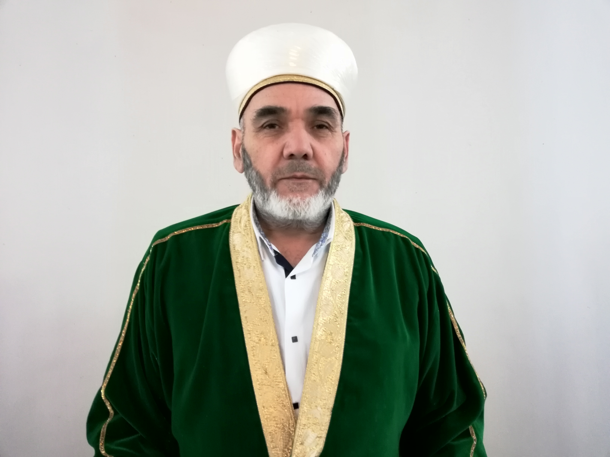

# 
Председатель (Раис) - Зиедали Мизробов

Председатель (Раис) Курганской городской религиозной организации мусульман
Зиедали Курбанович Мизробов работает 24 часа в сутки. Днем он, как
религиозный деятель, проводит обряды (никах, жаназа, курбандык, хатымы,
поминальные дуа, имянаречение…) по всей области, иногда выезжая по
приглашению в соседние приграничные районы Тюменской области и Казахстана.

Тел: [+7 (912)979-05-63](tel:+79129790563)

Адрес : [Россия, Курганская область, г. Курган, ул. Сибирская, 2/2](https://yandex.ru/maps/-/CKA4aD1q)

<iframe
  src="https://yandex.ru/map-widget/v1/-/CKA4aD1q"
  width="100%"
  height="400"
  frameborder="0"
  allowfullscreen="true"
></iframe>
