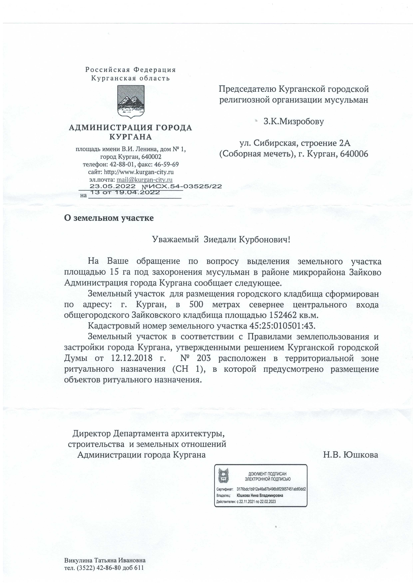

### Ассаламу алейкум дорогие братья и сестры!

Хотим сообщить вам радостную новость! Письмом от администрации города Кургана от 23.05.2022, по воле Аллаха, для мусульманской общины утверждено **место для ритуальных захоронений**. Расположение мусульманского кладбища: ориентир - Зайковское кладбище. Ниже прилагаем официальный ответ от администрации города.

### Время намаза на июнь 2022 года для Кургана

---

**РЕКВИЗИТЫ ДЛЯ ДОБРОВОЛЬНЫХ ПОЖЕРТВОВАНИЙ:**

Курганская городская религиозная организация мусульман

ООО Банк «КУРГАН»

ИНН 4501055960

КПП 450101001

р/сч 40703810800000000428

БИК 043735830

к/сч 30101810700000000830

НАЗНАЧЕНИЕ: ДОБРОВОЛЬНОЕ ПОЖЕРТВОВАНИЕ

---

---

