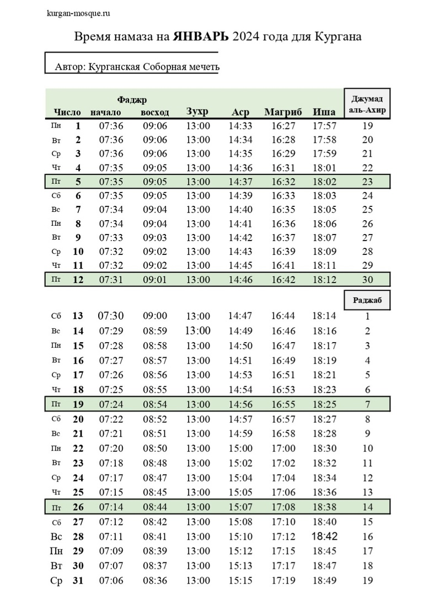

### Время намаза на ЯНВАРЬ 2024 года для Кургана

---

---

### Новости со строительства мечети в Куртамыше

بسم الله الرحمن الرحيم
السلام عليكم ورحمة الله وبركاته

Ассаляму алейкум ва рахматуллахи ва баракятух уважаемые братья и сестры.

На данном этапе строительства выглядит мечеть в селе Куртамыш.
Хвала Аллаху, Господу миров, братья собрали деньги, мусульмане делали пожертвования, возвели стены, купили доски, брус.
ИншаАллах в этом году закроем крышу.

Молим Аллаха Субханаху Ва Тааля, чтобы помог нам, чтобы все неравнодушные люди принимали участие в строительстве мечети, и чтобы в следующем году завершили работу.

عثمان بن عفان رضي الله عنه سمعت رسول الله صلى الله عليه وسلم يقول:من بنى مسجدا يبتغي به وجه الله بنى الله له بيتا في الجنة.

Усман бин Аффан (да будет доволен им Аллах) сказал: Я слышал, как Посланник Аллахаﷺсказал: «Кто воздвигнет мечеть, желая увидеть Лик Аллаха, тому Аллах возведёт дворец в Раю».

---

### Новости с места строительства мечети в Каргаполье

Ассаляму алейкум ва рахматуллахи ва баракятух дорогие братья и сестры.

Альхамдулиллях шаг за шагом продолжаем работать над строительством мечети в Каргаполье.

Да вознаградит Всевышний всех кто помогает в строительстве, финансово, своими силами, кто делает дуаа, пусть Аллах дарует Свою Милость вам и вашим семьям.

فَمَن يَعْمَلْ مِثْقَالَ ذَرَّةٍ خَيْرًا يَرَهُ ۥ

**"Тот, кто сделал добро весом в мельчайшую частицу, увидит его."** сура Аз-Зальзаля, 7 аят.
Пусть Аллах Субханаху Ва Тааля поможет нам, даст сил, терпения, чтобы в скорейшем времени завершить это благое дело.

---

**_Готовую еду и выпечку ХАЛЯЛЬ можно приобрести в пекарне «Ширин» по адресу: Курган, Дзержинского 54Б/1_**

---

---

**РЕКВИЗИТЫ ДЛЯ ДОБРОВОЛЬНЫХ ПОЖЕРТВОВАНИЙ:**

Курганская городская религиозная организация мусульман

ООО Банк «КУРГАН»

ИНН 4501055960

КПП 450101001

р/сч 40703810800000000428

БИК 043735830

к/сч 30101810700000000830

НАЗНАЧЕНИЕ: ДОБРОВОЛЬНОЕ ПОЖЕРТВОВАНИЕ

---

---
