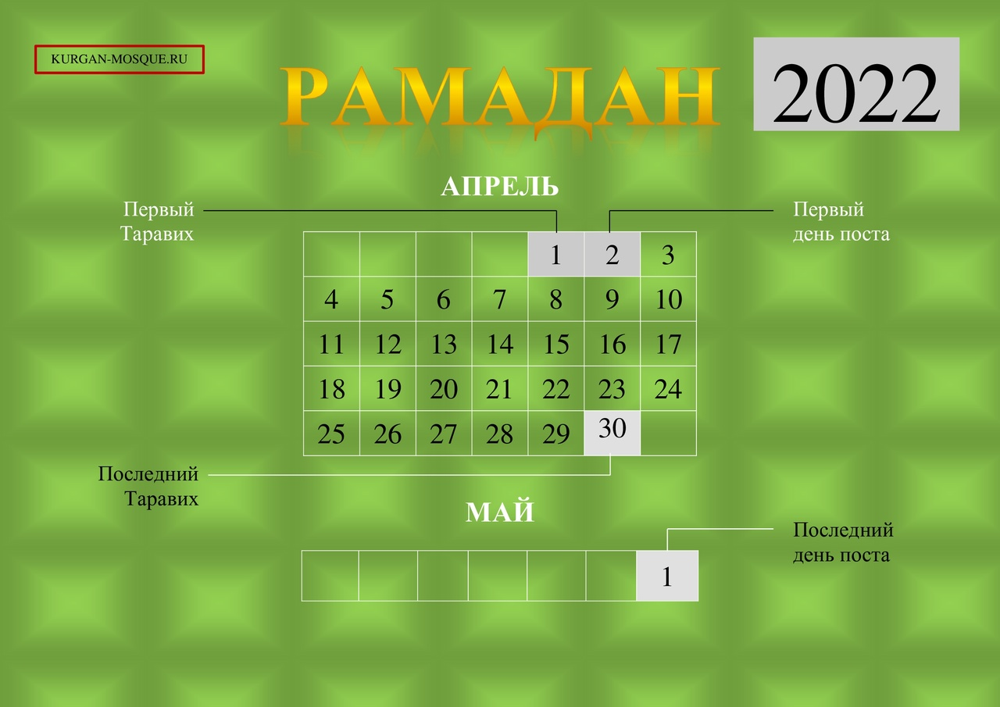
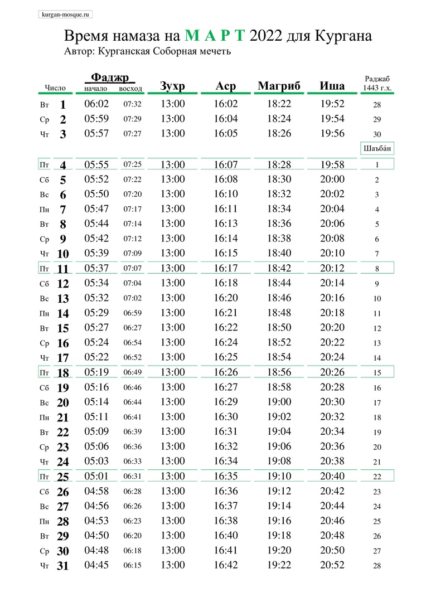

### СОБЛЮДЕНИЕ ПОСТА В МЕСЯЦ РАМАДАН (2022)

Совет улемов Централизованной религиозной организации «Духовное управление мусульман Российской Федерации» (далее — ДУМ РФ) в ходе дистанционного заседания, состоявшегося 13-го числа месяца Шабан 1443 года по лунному календарю, что соответствует 16-му марта 2022 г. по григорианскому календарю,

постановил:

1. Согласно лунному календарю, месяц Рамадан 2022 наступит с заходом солнца **1 апреля**. После пятой молитвы в этот же день совершается Таравих. **Первым днем поста следует считать 2 апреля, последним же днем — 1 мая.** Первый день месяца Шавваль и Ураза-байрам — 2 мая. Последний Таравих — 30 апреля.

2. Размер закятуль-фитр на 2022 год составляет:

• 150 рублей для малоимущих;
• 500 рублей для людей со средним достатком;
• от 800 рублей для состоятельных.

Данные суммы закятуль-фитр выведены из расчета средней стоимости таких продуктов питания, как финики, ячмень, пшеница и изюм, о которых есть упоминание в достоверных хадисах. Сумма в 150 рублей является минимальной и обязательной к выплате. Суммы в 500 и 800 рублей являются рекомендуемыми. Если верующий не успел выплатить закятуль-фитр до праздничной молитвы, то обязательность налога все равно сохраняется: верующий должен передать его сразу, как представится возможность.

3. Минимальная сумма искупительной милостыни (фидья-садака), выплачиваемой человеком, который не в состоянии соблюдать пост по веским причинам, составляет 300 рублей, однако сумма может быть увеличена в зависимости от собственных среднесуточных затрат на питание.

С подробным богословским исследованием по данному вопросу можно ознакомиться в Приложении к богословскому заключению № 1/22. https://dumrf.ru/sulem/sufatwa/20461

---
### Время намаза на март 2022 года для Кургана

---

### Дорогие братья и сестры!

Рады Вам сообщить, что 31 декабря 2021 года, в Курганской Соборной мечети, состоялся I Конкурс чтецов священного Корана, приуроченный к грядущему празднованию 1100-летия
принятия ислама народами Волжской Булгарии.

В конкурсной программе приняли участие дети в возрасте от 7 до 14 лет.

В номинации знание последних 10 сур Корана, среди мальчиков первое место занял – Рамазан Норматов, второе – Исмоил Парпиев, третье – Руслан Норматов.
Среди девочек первое место заняла – Ойша Боймуллоева, второе место – Алия Курбонова.
Победители получили велосипеды, так же все участники конкурса получили набор подарков.

В состав жюри вошли хафизы Корана, знающие всю священную Книгу наизусть Обиджон Жаббаров, Нурмухаммад Иброгимов и Абдулхамид Абдулаев, а также председатель мусульманской организации Курганской области Зиёдали хаджи Мизробов.

Своим чтением украсила праздник Омина Боймуллоева прочитавшая суры Фатиха, Мульк и Кахф, за что, ей был присужден Приз зрительских симпатий.

Администрация Курганской Соборной мечети благодарит всех, кто принимал участие в организации и проведении I Конкурса чтецов Корана в Кургане.

Видео I Конкурса по чтению Корана в Кургане будет опубликовано на странице мечети в ВКонтакте vk.com/kurgan_mosque

Пресс-служба Курганской Соборной мечети

---

**РЕКВИЗИТЫ ДЛЯ ДОБРОВОЛЬНЫХ ПОЖЕРТВОВАНИЙ:**

Курганская городская религиозная организация мусульман
ООО Банк «КУРГАН»
ИНН 4501055960

КПП 450101001

р/сч 40703810800000000428

БИК 043735830

к/сч 30101810700000000830

НАЗНАЧЕНИЕ: ДОБРОВОЛЬНОЕ ПОЖЕРТВОВАНИЕ

---

---

