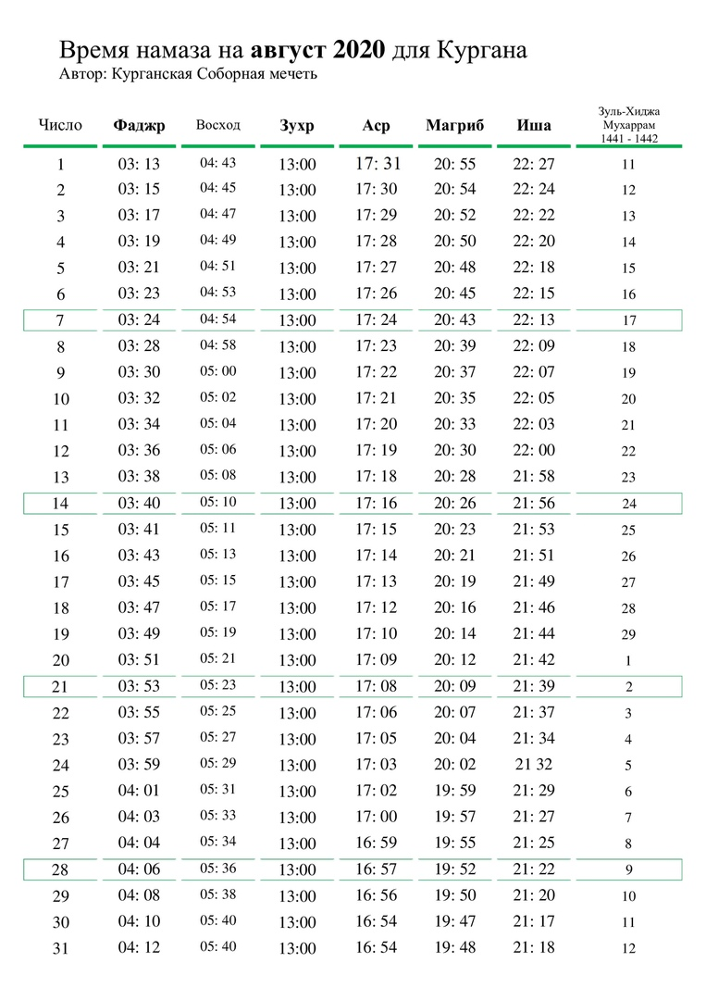

### Время намаза на август 2020 года для Кургана

---

### 20 лет Курганской Соборной мечети

**15 июля 2020 года** - знаменательное событие для мусульман Курганской области. В этот день, ровно 20 лет назад, была совершена закладка первого камня в основание
Соборной мечети г. Кургана.

Местная религиозная организация Курганской области, во главе с её уважаемым председателем Зиёдали Мизробовым, продолжает лучшие традиции мусульман, и помнит о своих
славных предшественниках, своими трудами укреплявших Ислам. За эти 20 лет мусульмане вместе, одной семьёй, преодолели немало трудностей административного, финансового,
организационного плана, и теперь уже уверенно можно сказать, что работа по сооружению главного по значимости областного религиозного центра мусульман – Курганской
Соборной мечети – почти полностью завершен.

За эти годы, из одного камня вырос целый комплекс сооружений. Общими силами мусульман Кургана и Курганской области, представителей различных национальностей, объединенных
единой верой во Всевышнего, практически закончено строительство Соборной мечети и религиозного комплекса при ней. На завершающей стадии строительства находится просторный
зал для проведения маджлисов. Уже сейчас прихожанам доступны: библиотека, помещения для приёма граждан, учебный класс, открытая площадка для проведения мероприятий. Вскоре
по милости Всевышнего Курганская Соборная мечеть станет духовным центром для всех мусульман области и для гостей региона.

Просим Аллаха преумножить добрые дела и увеличить награду всем, кто принимал и принимает участие в становлении мечети и жертвует на благо религиозного центра.

**_Пресс-служба Курганской Соборной мечети_**

---
