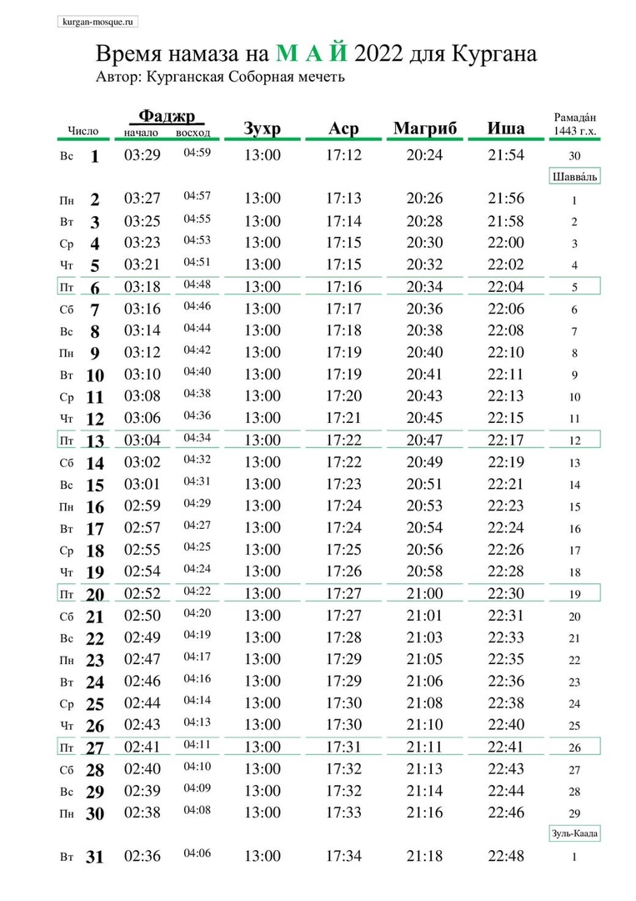

## Поздравление с праздником Ураза Байрам (Ид-аль-Фитр) 2022.

****Хвала Аллаху, Господу Миров, который одарил благим месяцем Рамадан. Милость и благословение Аллаха нашему Пророку Мухаммаду, его семье и сподвижникам, и всем тем, кто следует Его призыву до Судного Дня!****

### Дорогие братья и сестры!

Поздравляю всех, кто с радостью встретил благословенный месяц Рамадан, проведя его в благочестивом служении Аллаху и в ожидании наступления светлого праздника мусульман Ид аль Фитр – Ураза Байрам!

Наш Пророк (мир ему) говорил: ***«Постящийся испытает две радости: он порадуется своему разговению, когда станет разговляться, когда же встретится он со своим Господом, порадуется он (тому, что постился)»*** (Бухари, Муслим).

Так пусть этот праздник Ид-аль-Фитр станет днем милости Аллаха для всех нас, днем очищения нашего духа, укрепления веры и днем исламского единства, ради достижения благородных целей нашей великой веры!
В эти священные праздничные дни обращаю свои молитвы к Аллаху с тем, чтобы Он принял наши благие дела на Его пути и укрепил нас в истинной вере!

Мы прожили этот месяц в молитвах и чтении Корана, совершали богоугодные дела, проявляли милость и милосердие к своим родным, близким и окружающим нас людей. В течение месяца мы жили и действовали так, чтобы достичь великой милости Аллаха. Аллах Всемогущий сказал: ***«Всё, что делает человек – это ему, кроме поста. Пост же – Мне, и Я воздам за него».*** (Муслим)

Да благословит Всевышний Аллах ваши искренние благодеяния на пути к Нему, простит ваши грехи и примет ваши молитвы. Да пребудет над вами мир, милость Аллаха и Его прощение. В эти благословенные дни желаю всем вам счастья и процветания, пусть этот праздник принесет жителям всей Земли мир, взаимопонимание и согласие.

### Напоминаю также, что совместный намаз состоится 2 мая 2022 года в 06-00 по адресу: г. Курган, ул. Сибирская, д. 2а, Соборная мечеть.

*С уважением и добрыми молитвами во всех ваших благих делах, Председатель Курганской городской религиозной организации мусульман Зиёдали Хаджи Мизробов.*

---
### Время намаза на май 2022 года для Кургана

---

### Дорогие братья и сестры!

Рады Вам сообщить, что 31 декабря 2021 года, в Курганской Соборной мечети, состоялся I Конкурс чтецов священного Корана, приуроченный к грядущему празднованию 1100-летия
принятия ислама народами Волжской Булгарии.

В конкурсной программе приняли участие дети в возрасте от 7 до 14 лет.

В номинации знание последних 10 сур Корана, среди мальчиков первое место занял – Рамазан Норматов, второе – Исмоил Парпиев, третье – Руслан Норматов.
Среди девочек первое место заняла – Ойша Боймуллоева, второе место – Алия Курбонова.
Победители получили велосипеды, так же все участники конкурса получили набор подарков.

В состав жюри вошли хафизы Корана, знающие всю священную Книгу наизусть Обиджон Жаббаров, Нурмухаммад Иброгимов и Абдулхамид Абдулаев, а также председатель мусульманской организации Курганской области Зиёдали хаджи Мизробов.

Своим чтением украсила праздник Омина Боймуллоева прочитавшая суры Фатиха, Мульк и Кахф, за что, ей был присужден Приз зрительских симпатий.

Администрация Курганской Соборной мечети благодарит всех, кто принимал участие в организации и проведении I Конкурса чтецов Корана в Кургане.

Видео I Конкурса по чтению Корана в Кургане будет опубликовано на странице мечети в ВКонтакте vk.com/kurgan_mosque

Пресс-служба Курганской Соборной мечети

---

**РЕКВИЗИТЫ ДЛЯ ДОБРОВОЛЬНЫХ ПОЖЕРТВОВАНИЙ:**

Курганская городская религиозная организация мусульман
ООО Банк «КУРГАН»
ИНН 4501055960

КПП 450101001

р/сч 40703810800000000428

БИК 043735830

к/сч 30101810700000000830

НАЗНАЧЕНИЕ: ДОБРОВОЛЬНОЕ ПОЖЕРТВОВАНИЕ

---

---

