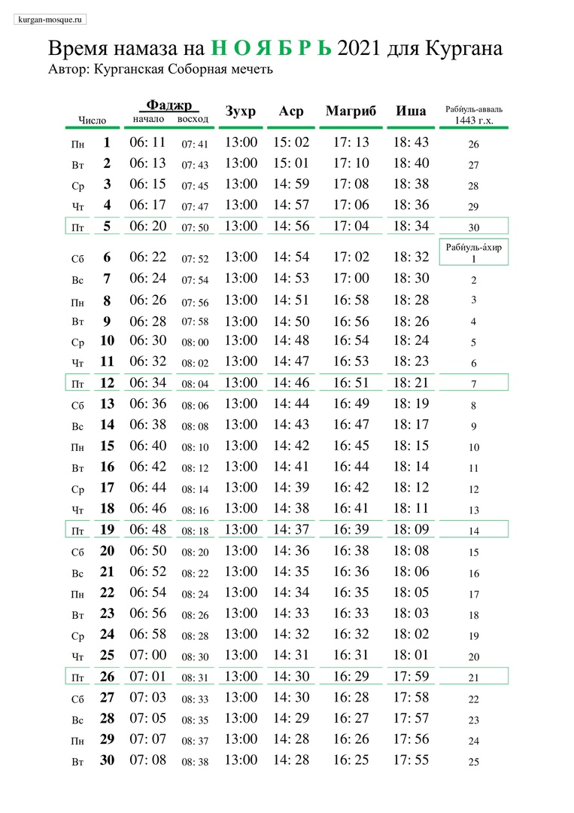

### Объявление

Уважаемые братья и сестры!

Курганская городская религиозная организация мусульман уведомляет, что 27 ноября 2021 года в 11 часов состоится ежегодное отчетное собрание по адресу: г. Курган, ул. Сибирская, 2А, Соборная мечеть.

На повестке дня будут рассмотрены:

1) Отчет председателя КГРОМ за 2021 г.
2) Отчет председателя ревизионной комиссии за 2021 г.
3) Прочие вопросы.

***С уважением, председатель Курганской городской религиозной организации мусульман, Мизробов Зиедали Курбонович***

---
### Время намаза на ноябрь 2021 года для Кургана

---

**РЕКВИЗИТЫ ДЛЯ ДОБРОВОЛЬНЫХ ПОЖЕРТВОВАНИЙ:**

Курганская городская религиозная организация мусульман
ООО Банк «КУРГАН»
ИНН 4501055960

КПП 450101001

р/сч 40703810800000000428

БИК 043735830

к/сч 30101810700000000830

НАЗНАЧЕНИЕ: ДОБРОВОЛЬНОЕ ПОЖЕРТВОВАНИЕ

---

---

