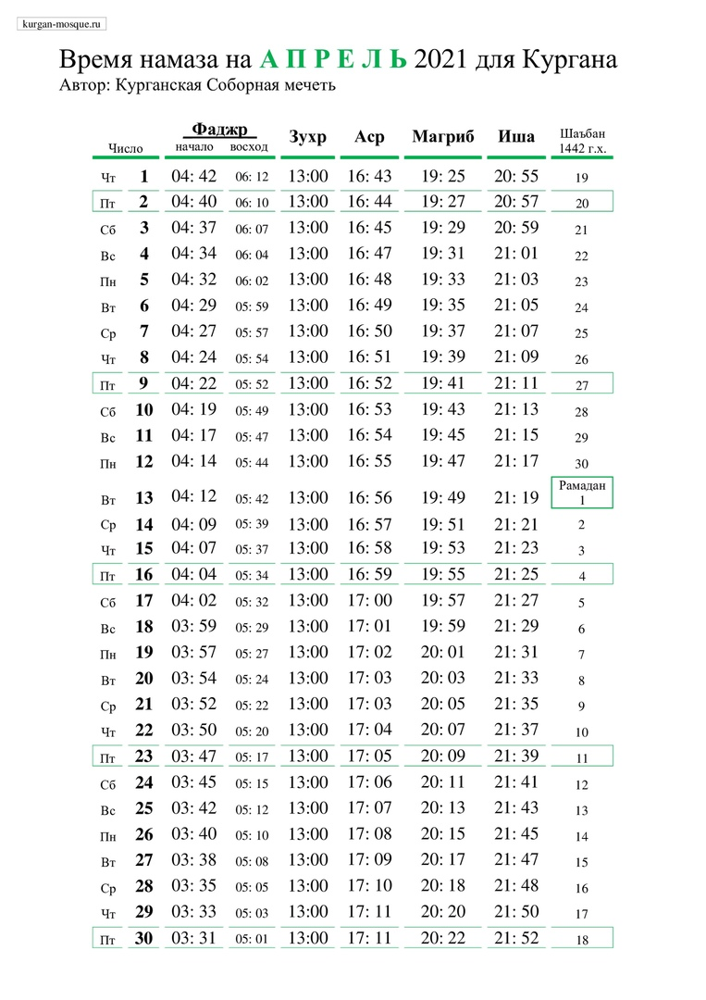

## РАМАДАН 2021

## СОБЛЮДЕНИЕ ПОСТА В МЕСЯЦ РАМАДАН (2021)

Совет улемов Централизованной религиозной организации «Духовное управление мусульман Российской Федерации» (далее — ДУМ РФ) в ходе дистанционного заседания, состоявшегося 12-го числа месяца Шабан 1442 года по лунному календарю, что соответствует 25-му марта 2021 г. по григорианскому календарю,

### постановил:

1. Согласно лунному календарю, месяц Рамадан 2021 наступит с заходом солнца **12 апреля**. После пятой молитвы в этот же день совершается Таравих. Первым днем поста следует считать 13 апреля, последним же днем — 12 мая. Первый день месяца Шавваль и Ураза-байрам — 13 мая. Последний Таравих — 11 мая.

2. Размер закятуль-фитр на 2021 год составляет:
⎯ 100 рублей для малоимущих;
⎯ 300 рублей для людей со средним достатком;
⎯ от 500 рублей для состоятельных.
Данные суммы закятуль-фитр выведены из расчета средней стоимости таких продуктов питания, как финики, ячмень, пшеница и изюм, о которых есть упоминание в достоверных хадисах. Сумма в 100 рублей является минимальной и обязательной к выплате. Суммы в 300 и 500 рублей являются рекомендуемыми. Если верующий не успел выплатить закятуль-фитр до праздничной молитвы, то обязательность налога все равно сохраняется: верующий должен передать его сразу, как представится возможность.

3. Минимальная сумма искупительной милостыни (фидья-садака), выплачиваемой человеком, который не в состоянии соблюдать пост по веским причинам, составляет 250 рублей, однако сумма может быть увеличена в зависимости от собственных среднесуточных затрат на питание.

Выдержка из БОГОСЛОВСКОГО ЗАКЛЮЧЕНИЯ № 2/21 Совета улемов ЦРО ДУМ РФ.

---

### Время намаза на апрель 2021 года для Кургана

---

