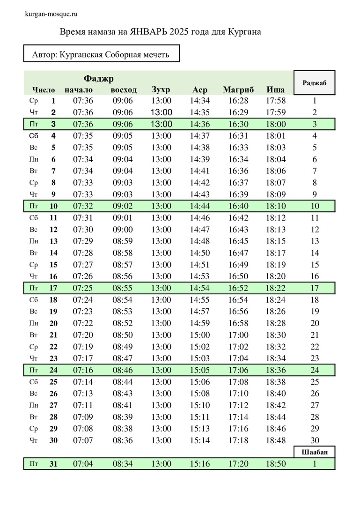
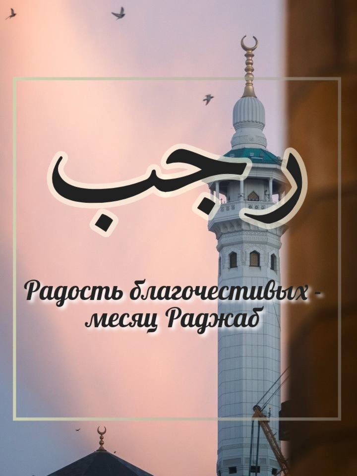
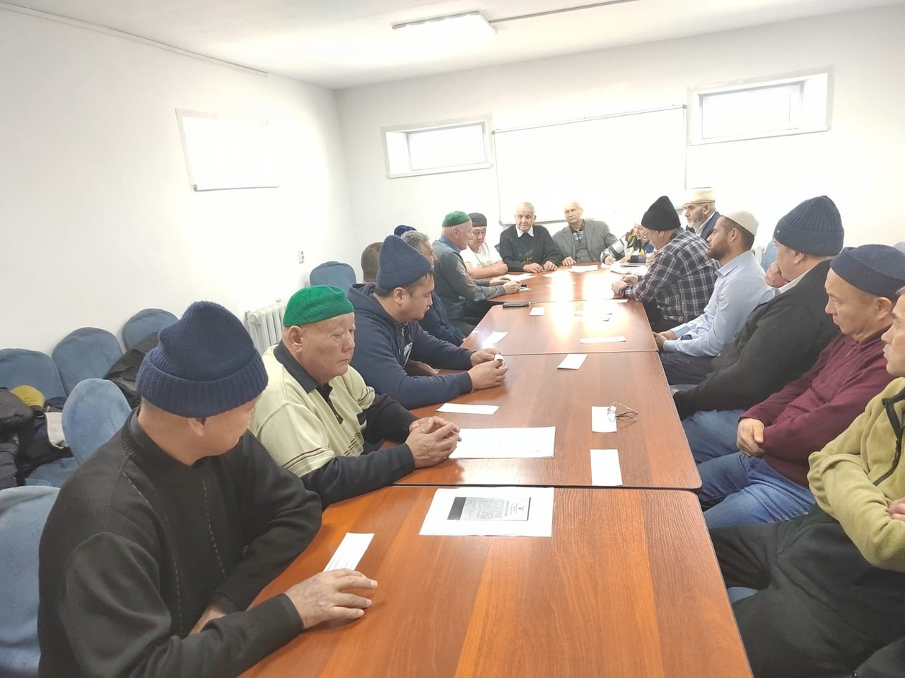
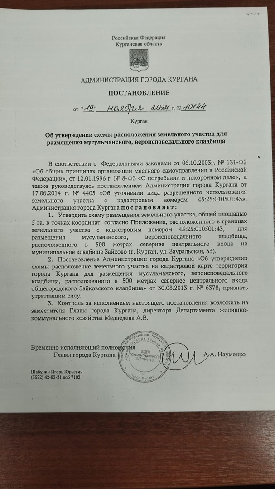
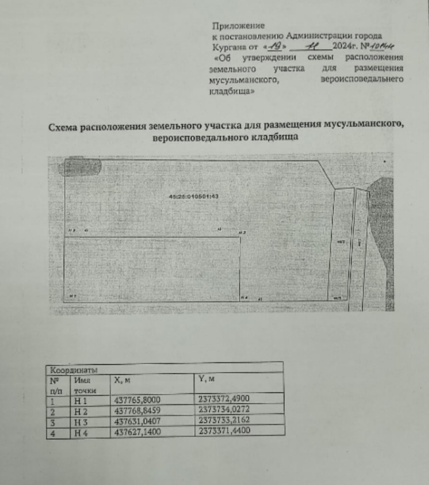
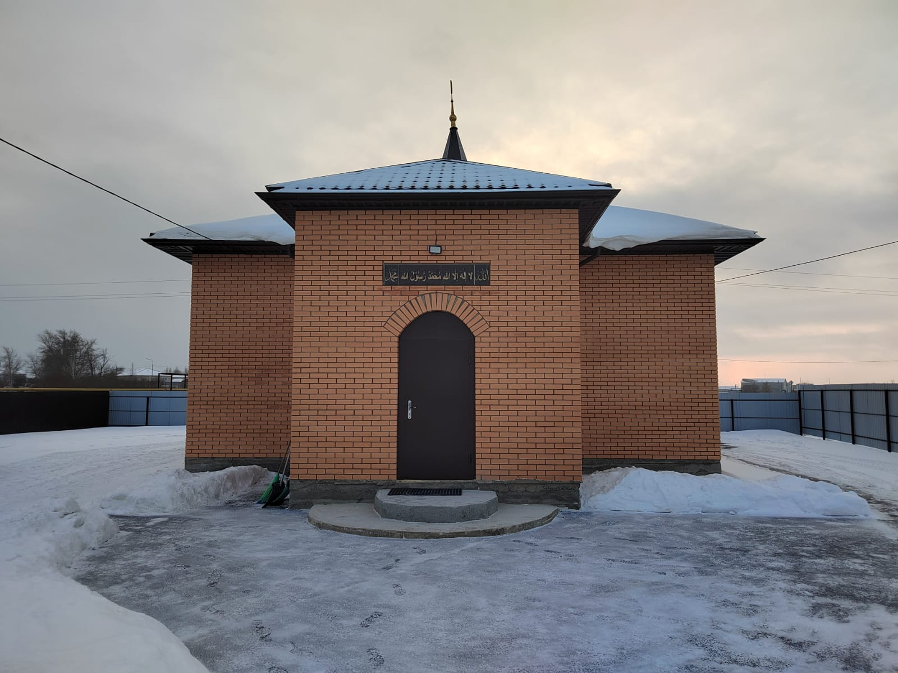
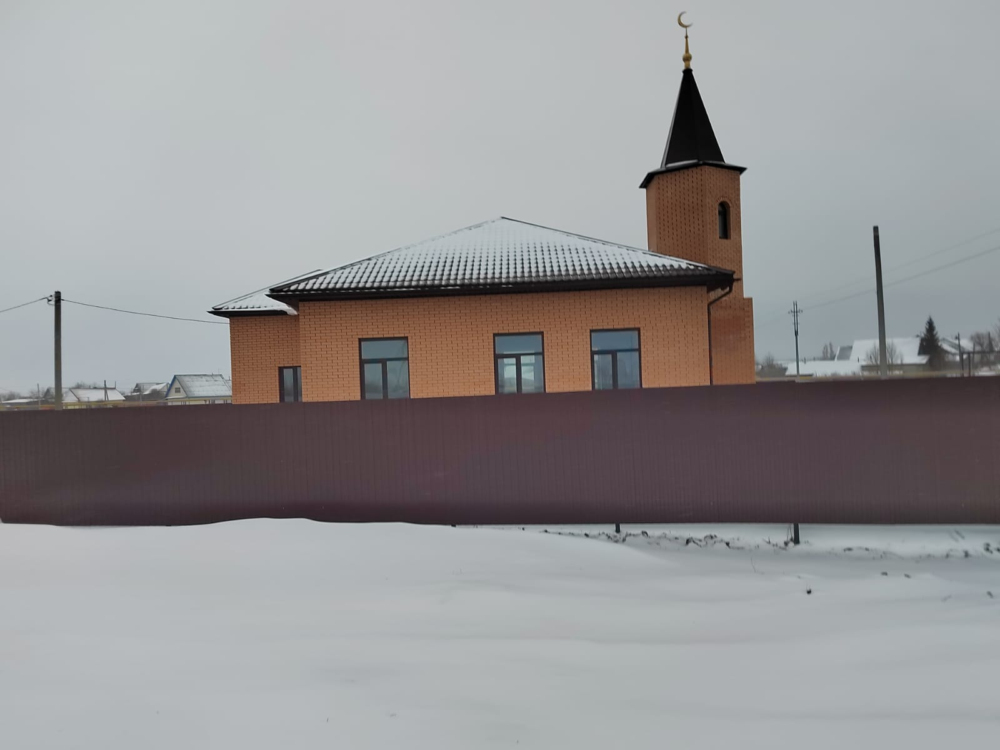
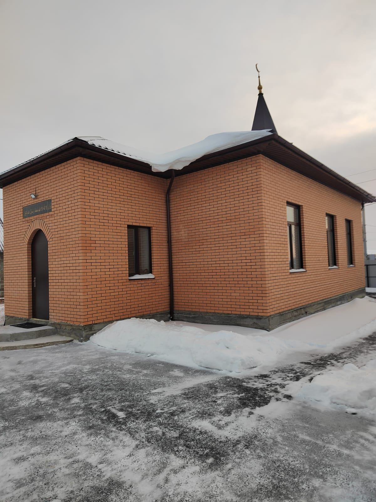
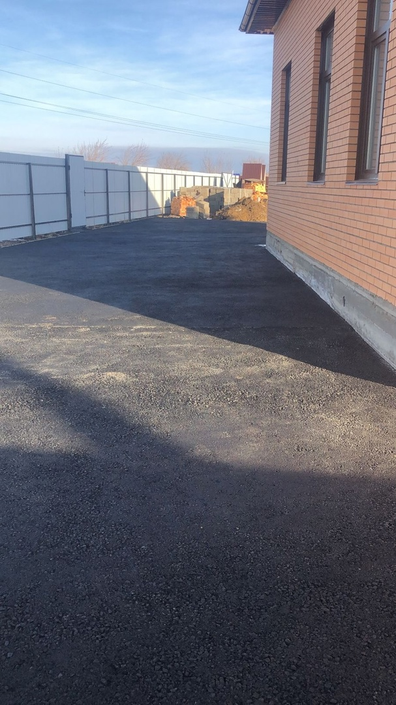
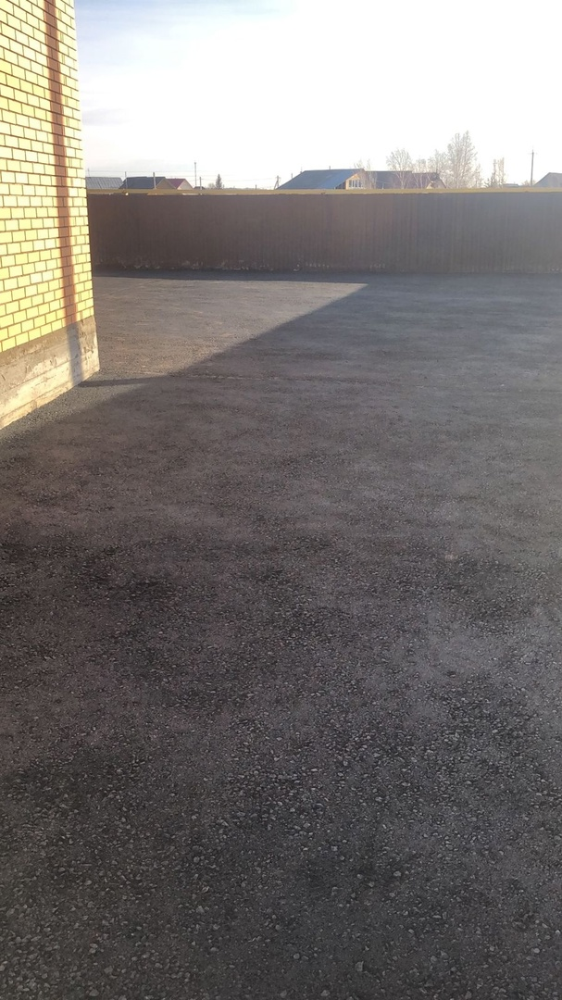

## Время намаза на январь 2025 года для Кургана

---

**Наступил седьмой месяц мусульманского лунного календаря, месяц смирения и покорности, месяц поста и благих молитв, один из четырех священных месяцев - Раджаб.**

Благословенные месяцы – это пора духовной подготовки к Священному посту в месяце Рамадан, что требует внутренних сил, благих помыслов и намерения приблизиться к Всевышнему через очищение сердец, терпения и усердия.

Раджаб является величайшей милостью Всевышнего Аллаха к своим рабам.

Посланник Аллахаﷺ сказал: «Помните, Раджаб – месяц Всевышнего, кто будет соблюдать пост хоть один день в этом месяце, тем Аллах будет доволен».

Всевышний Аллаха дает огромное вознаграждение и щедроты, ниспосылаемые в этом месяце.
В благословенный месяц Раджаб произошли важные события в истории Ислама: родители Пророка Мухаммадаﷺ сочетались браком; состоялось ночное путешествие и вознесение Посланника Аллахаﷺ(Аль-Исра валь Ми'радж). В месяцы Раджаб ценны все дни и ночи. Но одна из них – особенная. Это – первая пятничная ночь месяца, Ночь Рагаиб (Ляйлят уль - Рагаиб).

Анас ибн Малик передает, что Пророк ﷺ читал следующее дуа, когда наступал месяц Раджаб:

اَللّٰهُمَّ بَارِكْ لَناَ فِيْ رَجَبٍَ وَشَعْبانَ وَبَلّغْنَا رَمَضَانْ

(Аллахумма барик ляна фи Раджабин ва Ша'бана ва балигна Рамадана)
Перевод: О, Аллах, благослови нас во время (месяцев) Раджаба и Шаабана и помоги нам достичь Рамадана!

---

بسم الله الرحمن الرحيم

Ассаляму алейкум ва рахматуллахи ва баракятух уважаемые братья и сестры.
28 ноября 2024 года в 10 часов 30 минут в Курганской Соборной мечети состоялось ежегодное отчетное собрание.
Председатель КГРОМ Мизробов З. К. отчитался о работе проделанной за 2024 год, также отчитался председатель ревизионной комиссии Хажалиев В. А.
В ходе встречи обсудили план на 2025 год, ввод в эксплуатацию мечети Каргаполье.
По указу губернатора Шумкова В. М. администрация города выделила землю для захоронения мусульман. Постановлением правительства указано, что будет ограждено 5 гектар земли в 2025 году.
От имени мусульман Курганской области и от имени имама мечети Мизробова Зиёдали Курбоновича выражаем огромную благодарность Шумкову Вадиму Михайловичу за выделенный участок земли, огромное спасибо губернатору и администрации города Кургана за помощь и поддержу мусульманам нашей области.

---

بسم الله الرحمن الرحيم

السلام عليكم ورحمة الله وبركاته

Ассаляму алейкум ва рахматуллахи ва баракятух уважаемые братья и сестры.

الحمدلله رب العالمين

Хвала Аллаху, Господу миров, сегодня по Милости Аллаха наши братья устанавливают шпиль в мечети Каргаполье.
Основные работы по строительству мечети завершены, ИншаАллах с 2025 года здание введем в эксплуатацию.

Аллах Свят Он и Велик говорит в Священном Кур'ане:

يَٰٓأَيُّهَا ٱلَّذِينَ ءَامَنُوٓا۟ أَنفِقُوا مِمَّا رَزَقْنَٰكُم مِّن قَبْلِ أَن يَأْتِىَ يَوْمٌ لَّا بَيْعٌ فِيهِ وَلَا خُلَّةٌ وَلَا شَفَٰعَةٌ ۗ وَٱلْكَٰفِرُونَ هُمُ ٱلظَّٰلِمُونَ

"О те, которые уверовали! Делайте пожертвования из того, чем Мы наделили вас, до наступления дня, когда не будет ни торговли, ни дружбы, ни заступничества. А неверующие являются беззаконниками. " сура Аль-Бакара, 254 аят.

ٱلَّذِينَ يُنفِقُونَ أَمْوَٰلَهُم بِٱلَّيْلِ وَٱلنَّهَارِ سِرًّا وَعَلَانِيَةً فَلَهُمْ أَجْرُهُمْ عِندَ رَبِّهِمْ وَلَا خَوْفٌ عَلَيْهِمْ وَلَا هُمْ يَحْزَنُونَ

"Тем, кто расходует свое имущество ночью и днем, тайно и явно, уготована награда у их Господа. Они не познают страха и не будут опечалены." сура Аль-Бакара, 274 аят.
Искренне благодарим каждого, кто вносит свой вклад в строительство мечети, пусть Всевышний Аллах дарует баракят вам, вашим семьям в этом мире, и наградит наивысшими ступенями Рая в мире вечном.

Проделана большая работа, и ИншаАллах уже в скором времени мечеть будет приносить много пользы мусульманам нашей области.
Пусть Аллах Субханаху Ва Та'аля ведёт нас прямым путем, поможет во всех благих делах, дарует свою Милость и Милосердие.

---

Ассаляму алейкум ва рахматуллахи ва баракятух уважаемые братья и сестры
Альхамдулиллях, продолжаются работы в мечети Каргаполье. Братья положили асфальт 500 кв м.
Пусть Аллах Субханаху Ва Та'аля поможет нам поскорее завершить работы по строительству, чтобы мечеть приносила пользу мусульманам нашего края.

Всевышний Аллах говорит в Кур'ане:

ٱلَّذِينَ يُنفِقُونَ أَمْوَٰلَهُم بِٱلَّيْلِ وَٱلنَّهَارِ سِرًّا وَعَلَانِيَةً فَلَهُمْ أَجْرُهُمْ عِندَ رَبِّهِمْ وَلَا خَوْفٌ عَلَيْهِمْ وَلَا هُمْ يَحْزَنُونَ

"Тем, кто расходует свое имущество ночью и днем, тайно и явно, уготована награда у их Господа. Они не познают страха и не будут опечалены." сура Аль Бакара, 274 аят.

Пусть Аллах наградит каждого, кто вносит свой вклад в строительство мечети.

---

---
Ассаляму алейкум ва рахматуллахи ва баракятух уважаемые братья и сестры.
21 октября в Курганском Государственном университете состоялась встреча студентов с религиозными деятелями, просмотр и обсуждение фильма "Общими молитвами". В фильме была затронута тема братства, сплоченности и единства. О том, как мусульмане и христиане вместе защищают нашу родину, сражаются в зонах СВО.
Зиёдали Курбонович выступил на мероприятии со словами:
"Сейчас на фронте, бойцы СВО защищают справедливость, суверенитет и независимость страны, в том числе и право каждого ее жителя, гражданина исповедовать свою веру.
Мы все едины - и мусульмане, и православные потому что у нас Родина одна - наша великая Россия.

Сегодня мы видим, что, к сожалению, есть силы, которые заинтересованы в разжигании межрелигиозной розни, которые хотят поссорить мусульман с христианами. Именно сейчас, как никогда ранее, важен активный межрелигиозный диалог, целью которого является свидетельство каждой из общин о своей вере и традиции, а также укрепление мира.
Наши религии призывают к миру и добрососедству.

Всевышний Аллах говорит в Кур'ане:

وَلِكُلٍّ وِجْهَةٌ هُوَ مُوَلِّيهَا ۖ فَٱسْتَبِقُوا ٱلْخَيْرَٰتِ ۚ أَيْنَ مَا تَكُونُوا يَأْتِ بِكُمُ ٱللَّهُ جَمِيعًا ۚ إِنَّ ٱللَّهَ عَلَىٰ كُلِّ شَىْءٍ قَدِيرٌ

"У каждого есть сторона, куда он обращается лицом. Стремитесь же опередить друг друга в добрых делах. Где бы вы ни были, Аллах приведет всех вас вместе. Воистину, Аллах способен на всякую вещь." сура Аль Бакара, 148 аят.

"Если бы Аллах пожелал, то сделал бы вас одной общиной, однако Он разделил вас, чтобы испытать вас тем, что Он даровал вам. Состязайтесь же в добрых делах. Всем вам предстоит вернуться к Аллаху, и Он поведает вам о том, в чем вы расходились во мнениях." сура Аль-Маида, 48 аят.

Поэтому мы, мусульмане и христиане, должны выступить единым фронтом против общественных пороков, сообща отстаивать право жить по своим убеждениям, воспитывать детей, обучать их нашей вере, учить их добру, быть свободными от насмешек и издевательств со стороны людей, которые забыли свое прошлое и пренебрегли духовным наследием предков.
Мы все должны жить в мире, построенном на взаимному уважении, и противостоянию безнравственному нечестии."

---
Ассаляму алейкум ва рахматуллахи ва баракятух уважаемые братья и сестры. В воскресенье 20 октября Курганскую Соборную мечеть посетил 
наш брат путник Хайрулла, который пешком направляется к священным землям Саудовской Аравии, чтобы совершить хадж.
После намаза Хайрулла пообщался с местными мусульманами за обеденным столом.

От лица Курганской Соборной мечети и мусульман нашего города мы пожелали брату хорошей дороги, лёгкого пути, и чтобы Всевышний 
принял его хадж.

---

بسم الله الرحمن الرحيم

Ассаляму алейкум ва рахматуллахи ва баракятух уважаемые братья и сестры.
Альхамдулилях, Хвала Аллаху, Господу миров, завершили кладку кирпича в мечети Каргаполье.

قال رسول الله صلى الله عليه وسلم :(من بنى لله مسجدا بنى الله له بيتا في الجنة

Пророкﷺсказал: «Тому, кто построит мечеть, даже с размером гнезда куропатки, Всевышний построит дом в Раю».

Любая помощь, оказанная в строительстве мечети и других благих делах, должна подкрепляться чистым, искренним намерением только для получения довольства Всевышнего Аллаха.

Всевышний Аллах в священном Коране говорит:

إِنَّمَا يَعْمُرُ مَسَاجِدَ اللَّهِ مَنْ آمَنَ بِاللَّهِ وَالْيَوْمِ الْآخِرِ وَأَقَامَ الصَّلَاةَ وَآتَى الزَّكَاةَ وَلَمْ يَخْشَ إِلَّا اللَّهَ، فَعَسَىٰ أُولَٰئِكَ أَنْ يَكُونُوا مِنَ الْمُهْتَدِينَ.

"Оживляет мечети Аллаха (только) тот, кто уверовал в Аллаха и в Последний день, совершал молитву, давал обязательную милостыню и не боялся (никого), кроме Аллаха. И такие обязательно будут из (числа) идущих (истинным) путем!", Сура Ат -Тауба, 18 аят.

Пусть Аллах, Субханаху Ва Та'аля, дарует баракят всем, кто принимает участие, вносит свой вклад, делает пожертвования, помогает финансово, делает дуаа.
И пусть Аллах дарует нам терпения и сил, чтобы поскорее завершить работы по строительству мечети.

---

### Ассаляму алейкум ва рахматуллахи ва баракятух уважаемые братья и сестры.

Хвала Аллаху, Господу миров, начали устанавливать забор в мечети Каргаполье.

Также остаётся сделать кладку кирпича минарета. Просим Всевышнего чтобы помог нам, дал сил и терпения, чтобы в скорейшем времени завершить работы по строительству.

Пусть Аллах ниспошлет Свою Милость всем кто принимает участие в строительстве мечети!

Аллах Субханаху Ва Та'аля говорит в Кур'ане:

فِى بُيُوتٍ أَذِنَ ٱللَّهُ أَن تُرْفَعَ وَيُذْكَرَ فِيهَا ٱسْمُهُ ۥ يُسَبِّحُ لَهُ ۥ فِيهَا بِٱلْغُدُوِّ وَٱلْآصَالِ

"В домах, которые Аллах дозволил воздвигнуть, поминается Его имя. Его славят в них по утрам и перед закатом." сура Ан-Нур, 36 аят.

---

بسم الله الرحمن الرحيم

Ассаляму алейкум ва рахматуллахи ва баракятух уважаемые братья и сестры. Хвала Аллаху, Господу миров, мы продолжаем работы по строительству мечети в Каргаполье. На пожертвования мусульман братья приступили к установке забора (190 кв.м). Также доделывают кирпичную кладку, облицовочным кирпичом.

В хадисе говорится:

«عثمان بن عفان رضي الله عنه سمعت رسول الله صلى الله عليه وسلم يقول:«من بنى مسجدا يبتغي به وجه الله بنى الله له بيتا في الجنة» وفي رواية «بنى الله له مثله في الجنة

Усман бин Аффан (да будет доволен им Аллах) сказал: «Я слышал, как Посланник Аллахаﷺ сказал: «Кто воздвигнет мечеть, желая увидеть Лик Аллаха, тому Аллах возведёт дворец в Раю». В другом риваяте приводится: «Кто воздвигнет мечеть, желая увидеть Лик Аллаха, тому Аллах возведёт подобное этой мечети в Раю». «Сахих» Аль-Бухари и «Сахих» Муслим.

Пусть Аллах Субханаху Ва Та'аля дарует нам сил и поможет в скором времени завершить строительство, и пусть данная мечеть принесёт пользу мусульманам нашего края.

---

---
بسم الله الرحمن الرحيم

Ассаляму алейкум ва рахматуллахи ва баракятух уважаемые братья и сестры. Приветствие нашему Пророкуﷺ, его семье, сподвижникам и всем тем кто следует его призыву до Судного дня.

13 апреля мы посетили Куртамышский район, Куртамышскую мечеть. Встретились с имамом мечети Исмурзиновым Зерделы Кадеровичем. Альхамдулиллях братья уже установили доски, балки для крыши. ИншаАллах до конца года достроим, будем проводить джума намазы в этой мечети, 5 раз в день намаз читать будем, ИнШаАллах.

Просим Аллаха Субханаху Ва Тааля чтобы помог нам поскорее завершить работы. Пусть Аллах укрепит наши сердца на Его религии, поможет нам в благом деле, даст терпения и сил🤲🏽🤲🏽

---

## Поздравление губернатора Курганской области с праздником Ураза-Байрам.

10 апреля - Ураза-Байрам

Уважаемые жители Курганской области, исповедующие ислам!

Поздравляю вас с Ураза-байрамом!

Этот светлый день завершает пост священного месяца Рамадан – символа обновления и духовного очищения. Следуя многовековым традициям и ценностям праздника, мусульмане встречают его с особой радостью в сердце и надеждой на лучшее. Сегодня, когда наша страна и наш регион переживают непростые времена, эта надежда нужна каждому вне зависимости от веры.

Праздник напоминает о главных человеческих ценностях – милосердии, стремлении к добрым делам, помощи ближнему.

Пусть Ураза-Байрам принесёт в каждый дом спокойствие, взаимопонимание и благополучие, придаст новых сил и надежду.

Губернатор Курганской области В.М. Шумков

---

---
بسم الله الرحمن الرحيم

---

**РЕКВИЗИТЫ ДЛЯ ДОБРОВОЛЬНЫХ ПОЖЕРТВОВАНИЙ:**

Курганская городская религиозная организация мусульман

ООО Банк «КУРГАН»

ИНН 4501055960

КПП 450101001

р/сч 40703810800000000428

БИК 043735830

к/сч 30101810700000000830

НАЗНАЧЕНИЕ: ДОБРОВОЛЬНОЕ ПОЖЕРТВОВАНИЕ

---

---
