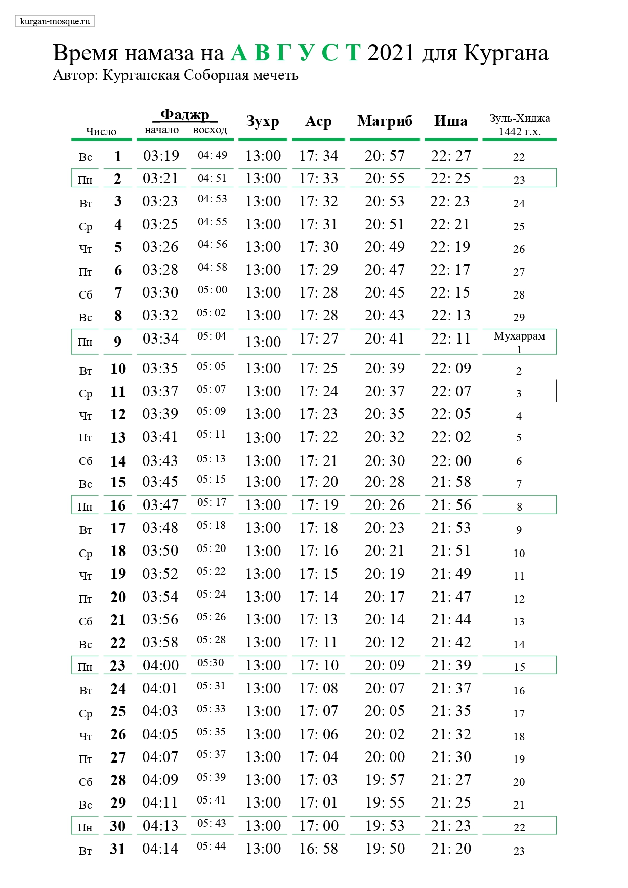

### Время намаза на сентябрь 2021 года для Кургана

### Поздравление с праздником Курбан-Байрам «Ид-Аль-Адха» 2021г.

***Приветствие и благословение Аллаха пророку Мухаммаду, его семье и сподвижникам и всем тем, кто следует его призыву до Судного дня.***

Уважаемые братья и сестры, имею высокую честь поздравить всех мусульман Курганской области с наступлением великого праздника Ислама Ид-Аль-Адха, который знаменует собой окончание хаджа.

В этом году праздник начинается 20 июля и продлится 3 дня. Этот величайший праздник Ислама открывает врата милости Всевышнего Создателя. Милость Аллаха объемлет небеса и землю, и когда мусульманин принесет жертву ради Аллаха, с первой каплей крови жертвенного животного прощаются его грехи и ниспосылается милость Всевышнего! Исполняя данный обряд, мы следуем примеру пророка Ибрахима (мир ему), проявившего высочайшую степень самопожертвования в знак любви и покорности Творцу.
В Священном Коране сказано: ***«Для каждой общины Мы установили места (жертвоприношений), чтобы они поминали имя Аллаха над теми животными, которыми Он наделил их (для еды). Ваш Бог – Бог Единый, Единственный. Смиритесь же (с Его волей). И сообщи благую весть смиренным, - тем, чьи сердца при упоминании Аллаха переполняются страхом, которые терпеливы к тому, что их постигает, совершают молитву и расходуют (на благотворительность) из того, чем Мы их наделили»*** (22:34-35)

В этом году большинство мусульман мира лишено возможности отправиться в Мекку для совершения ритуалов хаджа. Многие мусульмане России также лишены возможности совершить праздничный намаз в мечети. Мы должны принять эти лишения со смирением и мудростью. По причине пандемии, верующие нашей страны, как и многие в мире, не имеют возможности совершить хадж. Но верующие могут совершать и другие благие дела, которые пойдут на пользу нашей общине и мечети. А те, кто не имеют финансовой возможности и здоровья, пусть посещают мечети, пятничные молитвы, слушают проповеди и помогают общине тем, что им даровано Всевышним. 

Пусть Всевышний Создатель укрепит в нас братскую любовь друг к другу, наделит чувством исламской солидарности и единства! Ибо Аллах, призвал всех мусульман к единству, говоря: ***«Держитесь за вервь Аллаха и не разъединяйтесь…»***. *Я, вместе с вами, обращаю свои молитвы к Милостивому Милосердному Аллаху, с тем, чтобы Он простил наши ошибки и прегрешения! Наставил всех заблудших на спасительный путь благочестия, мира и истинного братства между людьми и народами!*

### Уведомляем, что праздничный совместный намаз состоится 20 июля в 05:30 по адресу: г. Курган, ул. Сибирская, д. 2А, Соборная мечеть. 19 июля – день Арафа, Курбан Байрам – 20 июля.

*С уважением и добрыми молитвами, Председатель Курганского городского религиозного общества мусульман Зиёдали Хаджи Мизробов.*

### Итоги Рамадана 2021

***«Кто постился в Рамадан с верой и надеждой на вознаграждение, тому будут прощены совершенные ранее грехи» (Аль-Бухари, Муслим)***
Вот и закончился Священный Рамадан. Он принес благо в наши дома, покой и радость в наши семьи. В этом году мы вместе с Вами прочитали все 30 джузов Корана, изучив его от начала до конца за 16 дней Рамадана. В этом нам с вами помогли два хафиза, которые присутствовали в эти ночи в мечети. Аллах сказал: ***«Если мои рабы спросят тебя обо Мне, то ведь Я близок и отвечаю на зов молящегося, когда он взывает ко Мне»*** (Коран, 2:186)

В этом году ифтары в мечети проводились по новому - перед постящимися распахнул свои двери просторный зал для торжеств. Этот зал способен вместить в себя до 150 человек, и построен полностью на пожертвования наших братьев мусульман. Мир и благословение их семьям. Аллах в Священном Коране сказал: ***«Воистину, Аллах любит творящих добро»***(Коран, 3:134)

Все работы, необходимые для функционирования зала, с благословения Аллаха, были окончены в месяц Рамадан: благодаря Вам, дорогие прихожане, мы подвели газ, оборудовали кухню и септик. АльхамдулиЛлях, зал торжеств готов принять гостей по любому поводу.

Иногда в этом зале не хватало мест всем присутствующим: поучаствовать в ифтаре иногда приходило до 200 человек. Ифтары организовывали узбеки, таджики, чеченцы, дагестанцы, киргизы, азербайджанцы, казахи. Они словно соревновались в своей щедрости – прихожане восхищались количеством еды и ее разнообразием. ***«Если вы одолжите Аллаху прекрасный заем, то Он приумножит его для вас и простит вас.»*** (Коран, 64:17) 
Пусть Аллах примет все ваши дела и простит вас! ***«Воистину, Аллах - с теми, кто богобоязнен и кто творит добро*** (Коран, 16:128)

Ночь Лейлят-аль-Кадр в мечети посетили и провели в молитвах около 200 человек. Окончание Рамадана омрачило печальное известие из Казани, и мы с вами делали дуа за их души.
Аллах в Коране говорит: ***«Мир вам! Войдите в Рай благодаря тому, что вы совершали.»*** (Коран, 16:32) Мы желаем Рая всем, кто совершает благо. ***«Тот, кто надеется на встречу со своим Господом, пусть совершает праведные деяния и никому не поклоняется наряду со своим Господом.»*** (Коран, 18:110) Поклоняйтесь Аллаху, делайте добрые дела, и надейтесь на прощение!

***С уважением и добрыми молитвами во всех ваших благих делах, Председатель Курганской городской религиозной организации мусульман, Зиедали хаджи Мизробов***

---

---

