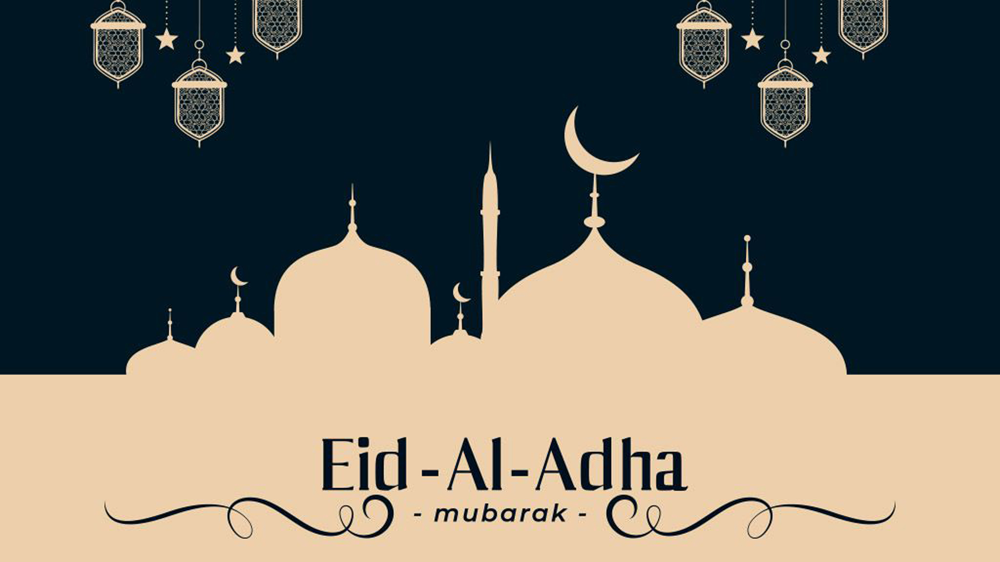
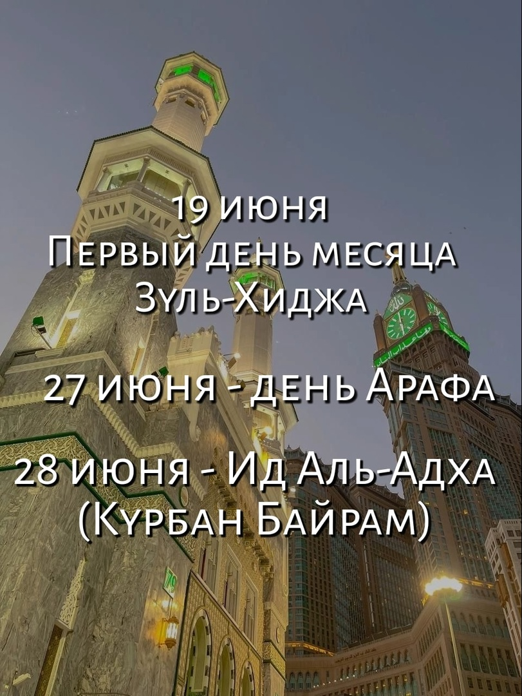
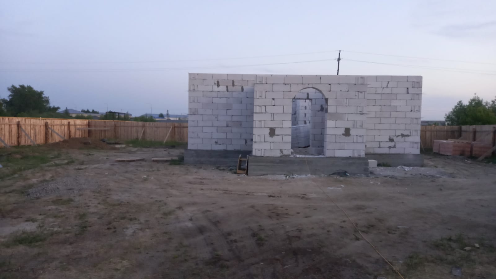
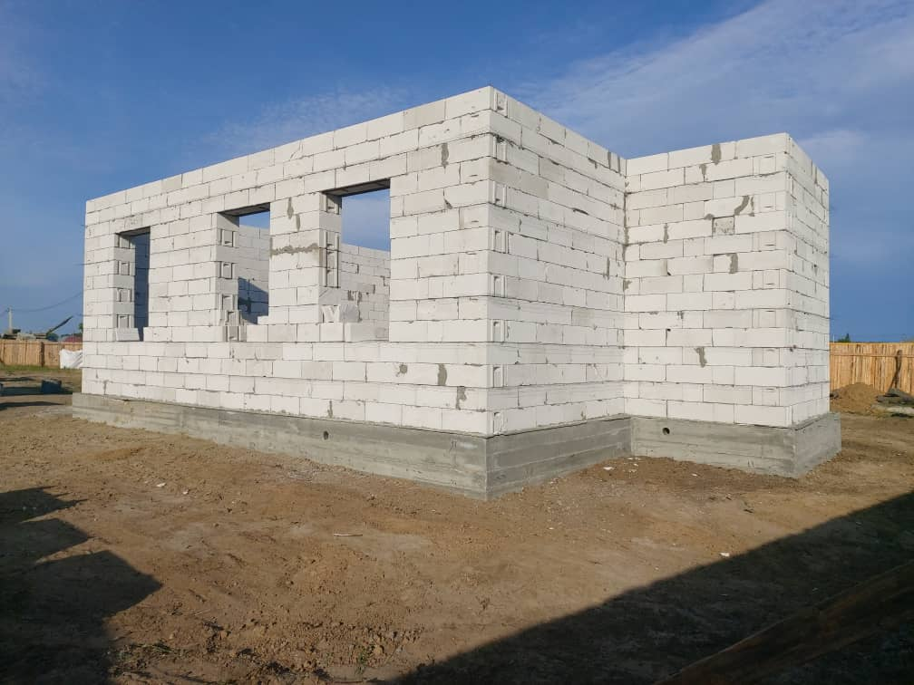
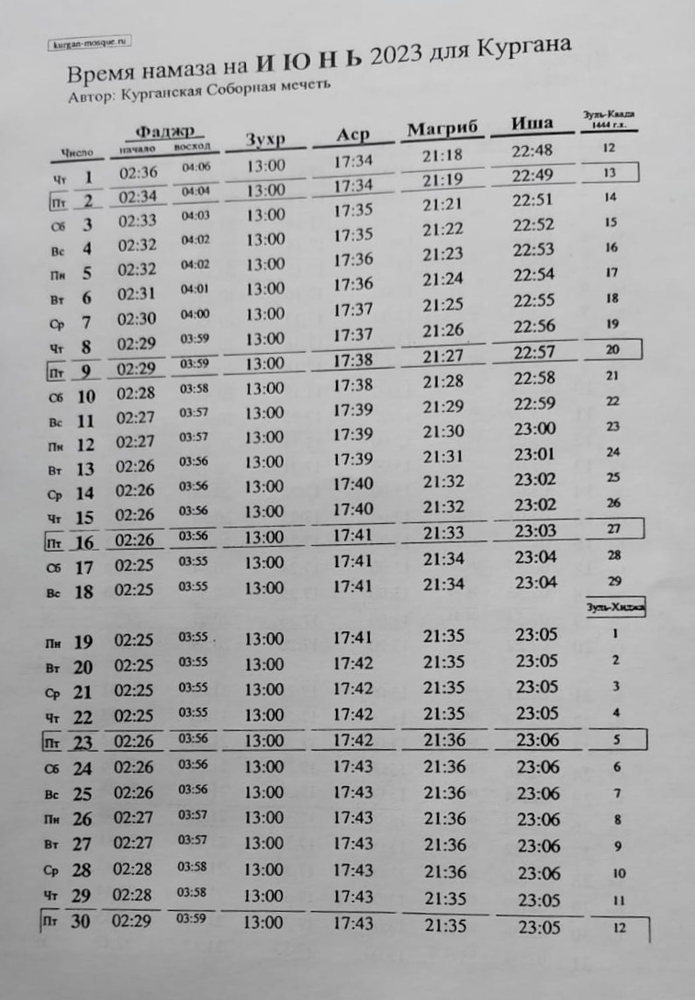
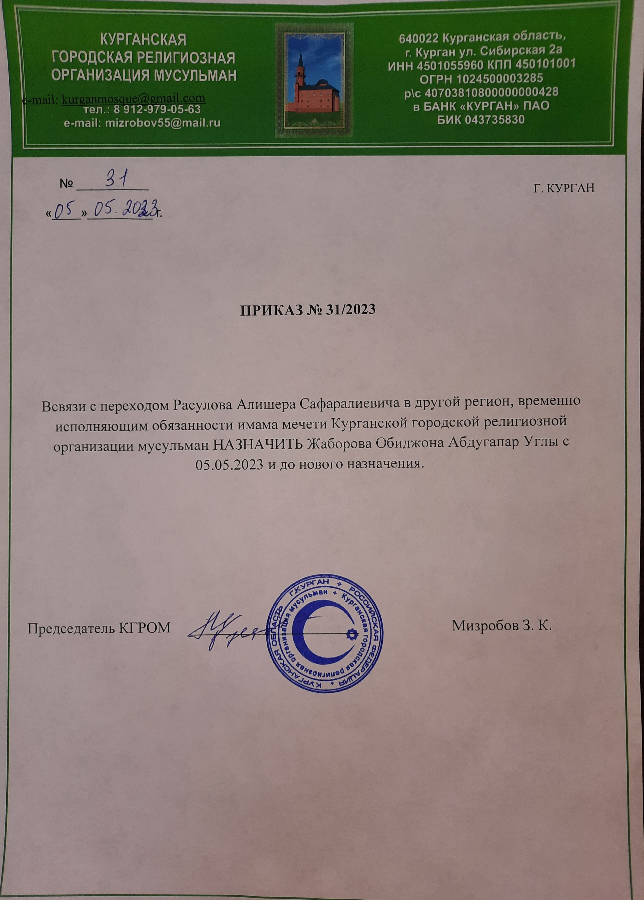
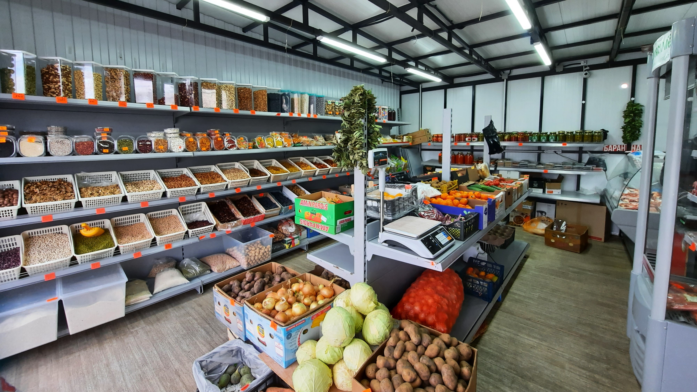
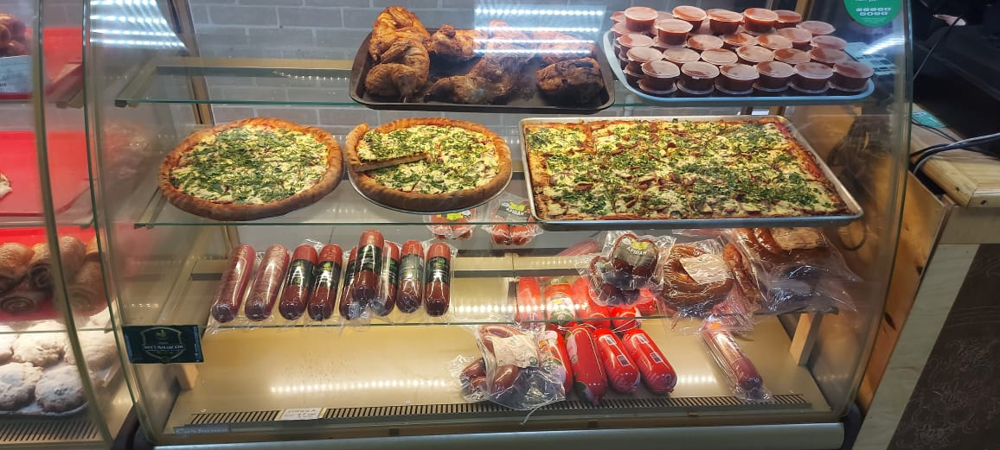

### Поздравление председателя КГРОМ Зиёдали Хаджи Мизробова с праздником Ид Аль-Адха (Курбан Байрам) 2023 года.

بسم الله الرحمن الرحيم
السلام عليكم ورحمة الله وبركاته

Приветствие и благословение Аллаха Пророку Мухаммадуﷺ его семье, сподвижникам и всем тем, кто следует его призыву до Судного дня.

***Уважаемые братья и сестры!***

Примите мои искренние поздравления с одним из самых светлых мусульманских праздников Ид Аль-Адха (Курбан байрам).
Ид аль Адха, один из главных праздников мусульман, напоминающий о преданности человека Всевышнему и о милосердии Аллаха (Субханаху Ва Тааля).

История пророка Ибрахима и Исмаила напоминает нам всем, что Аллах знает обо всех наших истинных намерениях, и когда мы послушны и искренни в своих верованиях, Он вознаграждает нас.

وَنَٰدَيْنَٰهُ أَن يَٰٓإِبْرَٰهِيمُ
قَدْ صَدَّقْتَ ٱلرُّءْيَآ ۚ إِنَّا كَذَٰلِكَ نَجْزِى ٱلْمُحْسِنِينَ

**"Мы воззвали к нему: «О Ибрахим! Ты оправдал сновидение». Воистину, так Мы воздаем творящим добро."** Сура Ас-Саффат, 104-105.

Праздник также венчает собой окончание хаджа, ежегодного паломничества в Мекку.
Он ниспослан нам Всевышним как напоминание о том, что мусульмане должны проявлять милосердие и заботиться друг о друге.
Этот благословенный праздник сплачивает людей в желании творить добро, побуждает нас не оставаться равнодушными, укрепляет веру.

قال الله وتعالى
جَعَلَ ٱللَّهُ ٱلْكَعْبَةَ ٱلْبَيْتَ ٱلْحَرَامَ قِيَٰمًا لِّلنَّاسِ وَٱلشَّهْرَ ٱلْحَرَامَ وَٱلْهَدْىَ وَٱلْقَلَٰٓئِدَ ۚ ذَٰلِكَ لِتَعْلَمُوٓا۟ أَنَّ ٱللَّهَ يَعْلَمُ مَا فِى ٱلسَّمَٰوَٰتِ وَمَا فِى ٱلْأَرْضِ وَأَنَّ ٱللَّهَ بِكُلِّ شَىْءٍ عَلِيمٌ

**"Аллах сделал Каабу, Заповедный дом, а также запретный месяц, жертвенных животных и животных (или людей) с ожерельями опорой для людей. Это - для того, чтобы вы знали, что Аллаху известно о том, что на небесах, и том, что на земле, и что Аллах ведает о всякой вещи."** Сура Маида, 97.

قُلْ إِنَّ صَلَاتِى وَنُسُكِى وَمَحْيَاىَ وَمَمَاتِى لِلَّهِ رَبِّ ٱلْعَٰلَمِينَ
لَا شَرِيكَ لَهُ ۥ ۖ وَبِذَٰلِكَ أُمِرْتُ وَأَنَا۠ أَوَّلُ ٱلْمُسْلِمِينَ

**"Скажи: «Воистину, мой намаз и мое жертвоприношение (или поклонение), моя жизнь и моя смерть посвящены Аллаху, Господу миров. Нет у Него сотоварищей. Это мне велено, и я - первый из мусульман.»"** Сура Ан'ам, 162-163.

С великой радостью в сердце я поздравляю вас с этим благославенным праздником, праздником благодати, очищения, покорности Господу и восхваления Его!
Пусть Всевышний Аллах, по милости Своей, примет все ваши благие деяния, очистит от грехов и многократно вознаградит за ваши дела, добрые слова, чистые намерения и помыслы. Призываю всех мусульман быть отзывчивее друг к другу, простить обиды, если они есть, отказаться от запретных дел и поступков.

Пусть Всевышний Аллах примет все наши молитвы и жертвоприношения и одарит всех нас Своей великой щедростью и довольством, принесет радость, согласие, мир и благополучие в каждый дом!
Прошу Создателя небес и земли услышать наши искренние молитвы, очистить наши намерения и щедро одарить всех нас здоровьем, счастьем, благополучием и мирным небом над головой.

Да благословит нас Всевышний на совершение добрых дел!

Да пребудет с нами милость Всемогущего Аллаха!

السلام عليكم ورحمة الله وبركاته

***С уважением и добрыми молитвами, Председатель Курганской городской религиозной организации мусульман Зиёдали Хаджи Мизробов.***

---

### Объявление

السلام عليكم ورحمة الله وبركاته

***Ассаляму алейкум ва рахматуллахи ва баракятух дорогие братья и сестры!***

Праздник жертвоприношения в этом году отмечается **28 июня**.

Сердечно поздравляем вас с наступающим праздником Ид Аль-Адха (Курбан - Байрам)!

Сообщаем вам, что ***праздничный намаз состоится 28 июня в 6 часов утра в Курганской Соборной мечети*** по адресу: г. Курган, ул. Сибирская, 2А

---

### Наступает месяц Зуль-Хиджа

Приближаются благославенные дни одного из священных для мусульман месяцев, Зуль-Хиджа.
Это один из четырёх запретных месяцев (Раджаб, Зуль-Хиджа, Зуль-Ка'да, Мухаррам).

Это один из самых значительных месяцев, поскольку именно в первые десять дней этого месяца верующие совершают хадж –пятый стол ислама.

На десятый день этого месяца приходится один из двух великих праздников в исламе – праздник жертвоприношения, Ид Аль-Адха (Курбан-байрам).
В нём также присутствует один из священных дней – день Арафа. В этот день паломники, совершающие хадж, пребывают в местности Арафа.

В хадисах говорится, что Посланник Аллахаﷺ сказал: «Нет для Аллаха дней, более великих и деяний более любимых, чем деяния совершенные в десять дней месяца Зуль-Хиджа. Так увеличьте же в эти дни произнесение слов: “Субхана-Ллах”, “Альхамдули-Ллях”, “Ля иляха илля-Ллах” и “Аллаху акбар”». Ахмад

### Пост в месяц Зуль-хиджа

Название месяца означает по-арабски «месяц хаджа». В исламском лунном календаре есть особое время, когда мусульмане во всем мире объединяются в поклонении, совершают хадж.
Поэтому благие деяния, совершенные в первые десять дней этого месяца, имеют особую ценность, и за эти деяния человек получает большое вознаграждение.

От Джабира (да будет доволен им Аллах) передаётся, что Пророкﷺсказал:

أفضل أيام الدنيا العشر -يعني عشر ذي الحجة

**«Наидостойнейшими днями этого мира являются первые десять дней месяца Зуль-Хиджа»**. (Аль-Баззар)

Хафиз Ибн Хаджар Аль-Аскаляни в книге «Фатх Аль-Бари» в комментарии к этому хадису сказал:
«Очевидно, что причина предпочтения первых десяти дней месяца Зуль-Хиджа заключается в объединении самых значимых обрядов поклонения в эти дни. Этими поклонениями являются: намаз (праздничный намаз), пост, садакъа (жертвоприношение), хадж.

Учёные считают желательным соблюдать пост первые десять дней месяца Зуль-Хиджа, ибо от Хафсы (да будет доволен ею Аллах) передаётся:
أربع لم يكن يدعهن رسول الله صلى الله عليه وسلم، عاشوراء، والعشر، وثلاثة أيام من كل شهر، والركعتين قبل الغداة

«Четыре деяния не оставлял Посланник Аллахаﷺ – пост в день Ашура, пост в первые десять дней месяца Зуль-Хиджа, пост три дня в каждый месяц и двухракаатный суннат-намаз перед утренним намазом». (Имам Ахмад, Ан-Насаи).

---
## Новости с места строительства мечети в Каргаполье

АльхамдулилЛях, спустя всего неделю с закладки первого камня для мечети в Каргаполье, 11.06.2023 кладка завершена. Выложены дверной и оконные проемы, остаётся смонтировать армопояс.

В хадисах говорится:

"Передают со слов Аиши, да будет доволен ею Аллах, что Посланник Аллаха ﷺ велел возводить мечети в каждом квартале, хранить их в чистоте и умащать благовониями."

عن ابن عباس رضي الله عنهما قال: الْمَسَاجِدُ بُيُوْتُ ﷲِ فِى الاَرْضيِ ءلِاَهْلِ السَّمَا ءِ كَمَا تُضِىْءُ نُجُوْمُ السَّمَا ءلِاَهْلِ الاَرْضيِ.

Ибн Аббас, да будет доволен им Аллах сказал: "Мечети - это дома Аллаха на земле. Они светятся для обитателей небес, как светятся звезды на небе для обитателей земли."

Хотим поблагодарить всех, кто принимает участие в создании дома Всевышнего.

Да воздаст Всевышний Аллах благом всем неравнодушным в обоих мирах.
Пусть Всевышний даст нам сил и терпения в возведении мечети.

---

بسم الله الرحمن الرحيم

Во имя Аллаха Милостивого, Милосердного.

Радостная новость для мусульман.

Альхамдулиллях, Хвала Аллаху, Господу миров.

### 4 июня 2023 года в Каргаполье состоялась торжественная закладка первого камня мечети.

На мероприятии присутствовали представители мусульманских диаспор, и другие неравнодушные люди.

Председатель КГРОМ Зиёдали Мизробов напутствовал мероприятие молитвами и добрыми словами.
В хадисе говорится "Кто построит мечеть ради Аллаха, тому Аллах построит такой же дом в Раю"

وقال تعلى
وَأَنفِقُوا۟ فِى سَبِيلِ ٱللَّهِ وَلَا تُلْقُوا۟ بِأَيْدِيكُمْ إِلَى ٱلتَّهْلُكَةِ ۛ وَأَحْسِنُوٓا۟ ۛ إِنَّ ٱللَّهَ يُحِبُّ ٱلْمُحْسِنِينَ

*"Делайте пожертвования на пути Аллаха и не обрекайте себя на гибель. И творите добро, ведь Аллах любит творящих добро."* Сура Бакара, 195 аят.

Выражаем благодарность всем братьям и сестрам, которые принимают участие в строительстве мечети, пусть Аллах вознаградит всех за благие деяния, в этой жизни и в вечной.
Мы воздаем Дуаа Всевышнему за каждый шаг, за то что есть возможность строить мечети, пусть Аллах поможет нам на Его пути.

---

### Время намаза на ИЮНЬ 2023 года для Кургана

---

---

### Обратите внимание!

Уважаемые братья и сестры, в работе Курганской соборной мечети произоли некоторые изменения:

- **_всвязи с переходом Расулова А. С. в другой регион, назначен исполняющий обязанности имама мечети;_**

- **_график работы мечети: ежедневно с 9-00 до 18-00_**

---

**_Продукцию ХАЛЯЛЬ: мясо, готовые блюда, овощи и фрукты для нашего стола, орехи и сухофрукты можно приобрести у наших братьев, на остановочном пункте "Некрасовский рынок"_**.

**_Готовую еду и выпечку ХАЛЯЛЬ можно приобрести в пекарне «Ширин» по адресу: Курган, Дзержинского 54Б/1_**

---

---

**РЕКВИЗИТЫ ДЛЯ ДОБРОВОЛЬНЫХ ПОЖЕРТВОВАНИЙ:**

Курганская городская религиозная организация мусульман

ООО Банк «КУРГАН»

ИНН 4501055960

КПП 450101001

р/сч 40703810800000000428

БИК 043735830

к/сч 30101810700000000830

НАЗНАЧЕНИЕ: ДОБРОВОЛЬНОЕ ПОЖЕРТВОВАНИЕ

---

---
