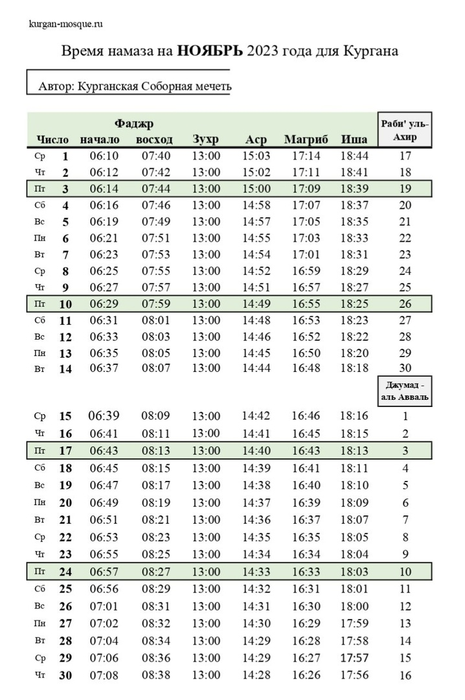
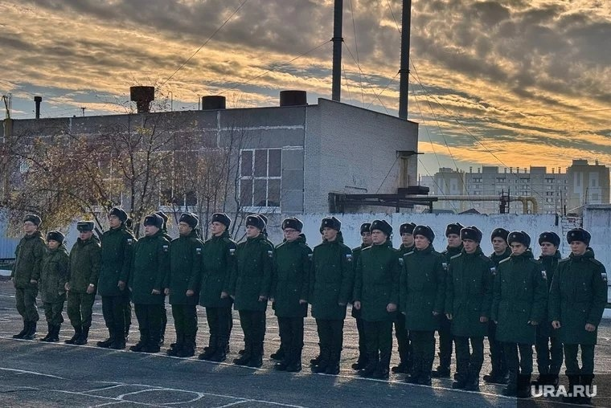
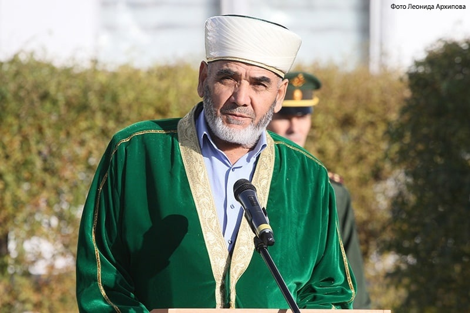

### Время намаза на НОЯБРЬ 2023 года для Кургана

---

### Объявление

Уважаемые братья и сестры!

Курганская городская религиозная организация мусульман уведомляет, что ***26 ноября, 2023 года в 10 часов 30 минут*** состоится отчётное собрание по адресу: Курган, улица Сибирская 2а, Соборная мечеть.

На повестке дня будут рассмотрены:

1. Отчёт председателя КГРОМ за 2023 год.

2. Отчёт председателя ревизионной комиссии за 2023 год.

3. Кладбище мусульман 15 Га: организация работ и приведение в порядок.

4. Прочие вопросы.

С уважением, председатель Курганской городской религиозной организации мусульман Мизробов Зиёдали Курбонович.

---
### В Кургане состоялся осенний призыв

Ассаляму алейкум ва рахматуллахи ва баракятух дорогие братья и сестры.

Сегодня, 18 октября, на территории курганского военкомата торжественно проводили зауральских призывников в армию.
Молодые ребята поедут служить в воздушно-космические силы, расположенные в Московской области.

Проводить первых новобранцев по осеннему призыву пришел председатель Курганской городской религиозной организации мусульман, имам Зиёдали Мизробов.

Перед ребятами выступили военный комиссар Курганской области Айрат Зарипов, также представители религиозных организаций.
Зиёдали Курбонович обратился к молодым новобранцем: "Служба в армии и защита Родины – священный долг и обязанность граждан России: «К бескрайним просторам нашей прекрасной Отчизны следует относиться как к великому залогу и завету наших предков, переданному нам, потомкам, на хранение»."

قال الله سبحانه وتعالى
النَّاسَ جَمِيعًا وَمَنْ أَحْيَاهَا فَكَأَنَّمَا أَحْيَا النَّاسَ جَمِيعًا ۚ وَلَقَدْ جَاءَتْهُمْ رُسُلُنَا بِالْبَيِّنَاتِ ثُمَّ إِنَّ كَثِيرًا مِنْهُمْ بَعْدَ ذَٰلِكَ فِي الْأَرْضِ لَمُسْرِفُونَ

**"Убийство одного невинного человека равносильно убийству всего человечества."** сура Маида, 32 аят

Аллах, Свят Он и Велик в Своей книге порицает убийство, поэтому мусульмане всегда должны быть на стороне мирной жизни, дружного существования.

---

### Новости со строительства мечети в Куртамыше

بسم الله الرحمن الرحيم
السلام عليكم ورحمة الله وبركاته

Ассаляму алейкум ва рахматуллахи ва баракятух уважаемые братья и сестры.

На данном этапе строительства выглядит мечеть в селе Куртамыш.
Хвала Аллаху, Господу миров, братья собрали деньги, мусульмане делали пожертвования, возвели стены, купили доски, брус.
ИншаАллах в этом году закроем крышу.

Молим Аллаха Субханаху Ва Тааля, чтобы помог нам, чтобы все неравнодушные люди принимали участие в строительстве мечети, и чтобы в следующем году завершили работу.

عثمان بن عفان رضي الله عنه سمعت رسول الله صلى الله عليه وسلم يقول:من بنى مسجدا يبتغي به وجه الله بنى الله له بيتا في الجنة.

Усман бин Аффан (да будет доволен им Аллах) сказал: Я слышал, как Посланник Аллахаﷺсказал: «Кто воздвигнет мечеть, желая увидеть Лик Аллаха, тому Аллах возведёт дворец в Раю».

---

### Новости с места строительства мечети в Каргаполье

Ассаляму алейкум ва рахматуллахи ва баракятух дорогие братья и сестры.

Альхамдулиллях шаг за шагом продолжаем работать над строительством мечети в Каргаполье.

Да вознаградит Всевышний всех кто помогает в строительстве, финансово, своими силами, кто делает дуаа, пусть Аллах дарует Свою Милость вам и вашим семьям.

فَمَن يَعْمَلْ مِثْقَالَ ذَرَّةٍ خَيْرًا يَرَهُ ۥ

**"Тот, кто сделал добро весом в мельчайшую частицу, увидит его."** сура Аз-Зальзаля, 7 аят.
Пусть Аллах Субханаху Ва Тааля поможет нам, даст сил, терпения, чтобы в скорейшем времени завершить это благое дело.

---

**_Продукцию ХАЛЯЛЬ: мясо, готовые блюда, овощи и фрукты для нашего стола, орехи и сухофрукты можно приобрести у наших братьев, на остановочном пункте "Некрасовский рынок"_**.

**_Готовую еду и выпечку ХАЛЯЛЬ можно приобрести в пекарне «Ширин» по адресу: Курган, Дзержинского 54Б/1_**

---

---

**РЕКВИЗИТЫ ДЛЯ ДОБРОВОЛЬНЫХ ПОЖЕРТВОВАНИЙ:**

Курганская городская религиозная организация мусульман

ООО Банк «КУРГАН»

ИНН 4501055960

КПП 450101001

р/сч 40703810800000000428

БИК 043735830

к/сч 30101810700000000830

НАЗНАЧЕНИЕ: ДОБРОВОЛЬНОЕ ПОЖЕРТВОВАНИЕ

---

---
