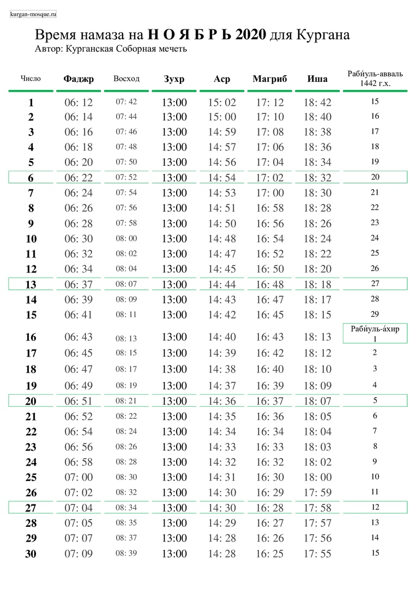
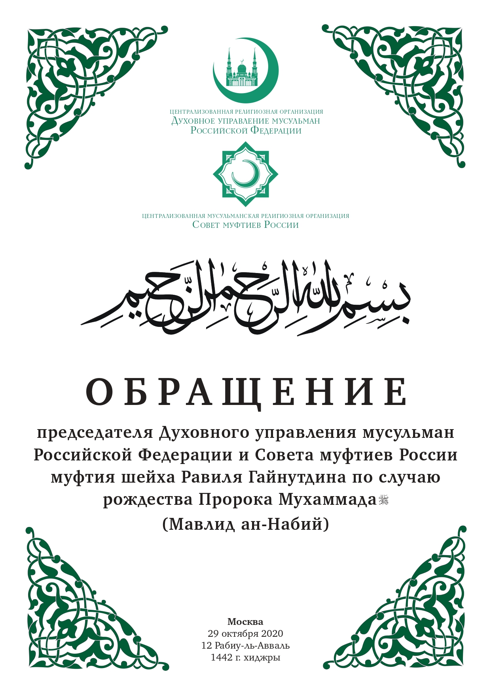
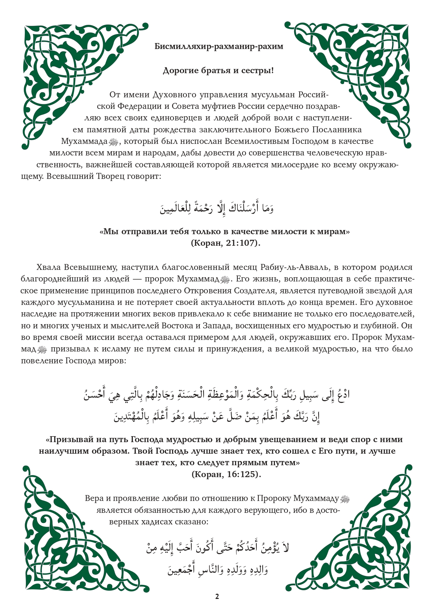
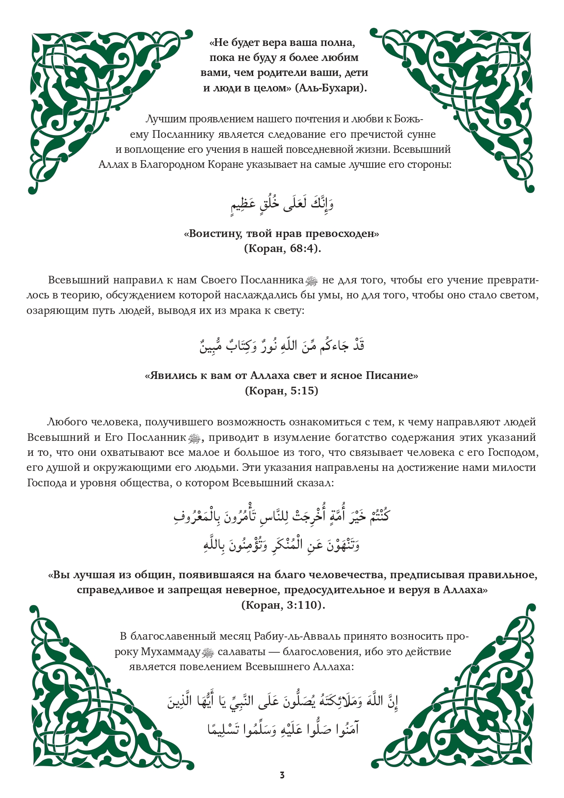
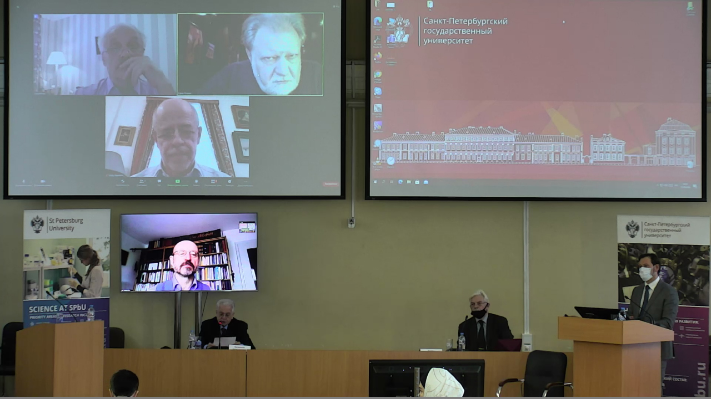
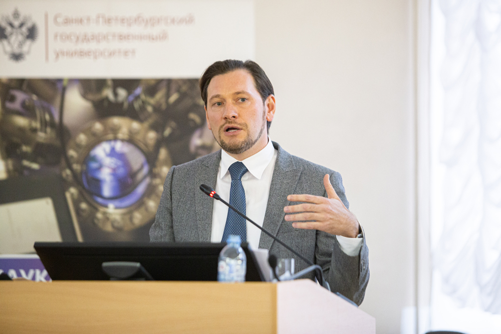

### Время намаза на ноябрь 2020 года для Кургана

---

### Заявление Президиума ДУМ РФ в связи с трагическими событиями во Франции

***Во имя Аллаха, Милостивого, Милосердного!***

Духовное управление мусульман Российской Федерации обращается ко всем своим последователям, к представителям мусульманского населения России и сопредельных стран с призывом сохранять спокойствие, самообладание и трезвость рассудка в условиях вызовов, с которыми мир столкнулся при совершении террористических актов в различных городах мира. К сожалению, эти преступные деяния самозваные «защитники ислама» проводят под лозунгами защиты религии. От их зверских поступков страдает не только имидж нашей религии, но под угрозой оказываются и жизни представителей разных сообществ.

Ключевой посыл, который Всевышний Аллах довел до человечества посредством благородного Корана: «Кто убьет человека не за убийство или распространение нечестия на земле, тот словно убил всех людей, а кто сохранит жизнь человеку, тот словно сохранит жизнь всем людям. Наши посланники уже явились к ним с ясными знамениями, но многие из них после этого преступили границы дозволенного на земле» (5:32). Кто преступает границы дозволенного? – преступники, хотя бы они и причисляли себя к мусульманам. Против кого были созданы карающие законы Божественного шариата, определявшие наказание за убийства и другие преступления против жизни и свободы? – против преступников, хотя они и выросли в мусульманской среде и считали себя мусульманами. Для чего нужна была шурта (полиция) и кадии (судьи) в мусульманских обществах? − чтобы контролировать и наказывать преступность в мусульманской среде! Следовательно, мусульмане, как и другие граждане – это не ангелы, а обычные люди, которые нуждались и нуждаются в законах, правоохранителях, наказаниях, чтобы общество было ограждено от преступлений и преступников, кем бы они себя ни называли.

Так как террористы своими атаками нарушают закон, преступают границы дозволенного, убивают мирных граждан и угрожают спокойствию в обществе – их необходимо судить по законам государства, гражданами которого они являются. Никакая апелляция к их вероисповеданию и их религиозности, оговорки о том, что они «мстили» за религию – неприемлемы и ничтожны перед лицом закона, который они преступили. За убийства мирных граждан их следует судить и, в случае признания их психической дееспособности, приговорить к той мере наказания, которая оговорена в законах соответствующих государств.

К сожалению, провокационная деятельность по размещению карикатур на пророков и посланников Божьих способствует взрывному росту террористической активности, с одной стороны, и последующим актам исламофобии в европейских странах, с другой стороны. Это замкнутый круг, из которого может быть найден выход – либо французское государство принимает соответствующие законы, запрещающие оскорбление чувств верующих, как это произошло в Российской Федерации; либо мусульмане Франции и ЕС через суды привлекают авторов и распространителей карикатур к уголовной и административной ответственности. Последние шаги можно предпринимать уже сегодня, не дожидаясь усиления конфликта, однако для этого мусульмане Франции должны иметь соответствующие юридические познания. Мы также призываем французских мусульман проявлять свою активную гражданскую позицию во время выборов президента и парламента Республики, чтобы многие миллионы голосов этого сообщества позволили их избранникам менять и принимать законы в интересах верующих. Мы уверены, что подавляющее большинство рядовых мусульман – граждан Французской Республики желает разрядить обстановку путем грамотных, юридически выверенных шагов. Как сказал Всевышний Аллах в Коране, «всякий раз, когда они разжигают огонь войны, Аллах тушит его» (5:64).

Как бы ни развивались события в зарубежных странах, российские мусульмане должны соблюдать принципы мирного сосуществования представителей разных религий, сторониться провокаторов и следовать указанию Всевышнего Аллаха, который сказал в благородном Коране: «Мы сделали вас общиной умеренной, чтобы вы были свидетелями обо всем человечестве» (2:143). Настоятельно призываем имамов в условиях развязанной информационной войны против ислама выверять каждое свое слово, произнесенное на публике – в мечетях и молельных залах, в СМИ и в частных домах. Вы должны быть мудрее провокаторов, выше розни и втягивания в скандалы, ибо в этом и состоит цель провокаций с карикатурами. Ваше предназначение в условиях фитны (смуты, провокации) – призывать к терпению, согласно приказу Всевышнего Аллаха: «Воистину, все человечество – в убытке, кроме тех, которые уверовали, совершали праведные деяния, заповедали друг другу истину и заповедали друг другу терпение!» (103:2-3). Имамы, помните сами и напоминайте верующим прихожанам, что каждое деяние получит свой ответ от Всевышнего Аллаха, ибо сказано в Коране: «И тот, кто сделал добро весом в мельчайшую частицу, увидит его; и тот, кто сделал зло весом в мельчайшую частицу, увидит его» (99:7-8).

***Мир да пребудет с теми, кто следует путем праведников!***

30 октября 2020 г.
http://dumrf.ru/upravlenie/documents/17913

### Поздравление председателя Духовного управления мусульман РФ и Совета муфтиев России муфтия шейха Равиля Гайнутдина по случаю наступления Мавлид ан-Набий

### Первая в истории России докторская диссертация по исламской теологии защищена Д.Мухетдиновым

14 октября в Санкт-Петербургском государственном университете состоялась защита диссертации на соискание ученой степени доктора теологии первого заместителя председателя Духовного управления мусульман Российской Федерации, ректора Московского исламского института Дамира-хазрата Мухетдинова. Это первая в истории России докторская диссертация по исламской теологии по специальности Высшей аттестационной комиссии Министерства образования и науки Российской Федерации 26.00.01 — Теология. Тема диссертации: «Исламское обновленческое движение конца XX — начала XXI века: идеи и перспективы».

Председателем диссертационного совета стал **Михаил Борисович Пиотровский**, доктор исторических наук, академик РАН, декан Восточного факультета Санкт-Петербургского государственного университета, Генеральный директор Государственного Эрмитажа. Также в состав совета вошли: **Николай Николаевич Дьяков**, доктор исторических наук, почетный профессор, профессор, заведующий Кафедрой Истории стран Ближнего Востока Санкт-Петербургского государственного университета; **Ефим Анатольевич Резван**, доктор исторических наук, профессор, Руководитель научного направления, Музей антропологии и этнографии им. Петра Великого Российской академии наук; **Леонид Рудольфович Сюкияйнен**, доктор юридических наук, профессор, профессор – исследователь Департамента теории права и межотраслевых юридических дисциплин Факультета права Национального исследовательского университета «Высшая школа экономики»; **Матиас Роэ**, профессор Университета имени Фридриха-Александра в Эрлангене и Нюрнберге, Германия.

Ряд членов диссовета приняли участие в заседании в режиме видеосвязи.

Научным консультантом диссертанта выступил Виталий Вячеславович Наумкин, академик РАН, профессор, доктор исторических наук, научный руководитель Института востоковедения РАН.

В своем выступлении непосредственно перед началом обсуждения диссертации, Дамир-хазрат выразил благодарность духовному лидеру российских мусульман, председателю Духовного управления мусульман РФ муфтию шейху Равилю Гайнутдину за помощь и поддержку в научных изысканиях, ректору Санкт-Петербургского государственного университета Николаю Михайловичу Кропачеву, инициировавшему защиту диссертации именно в стенах старейшего ВУЗа нашей страны. Глубокая признательность была выражена научному консультанту, академику Виталию Вячеславовичу Наумкину, а также профессору Тауфику Камелю Ибрагиму.

Вот что сказал Дамир Мухетдинов о значении сегодняшней защиты и мотивах, побудивших его обратиться к теме исламского обновленческого движения: **«Все происходящее имеет для меня большое символическое значение. Когда-то в старинных залах Восточного факультета Императорского Санкт-Петербургского университета, – признанном центре мирового востоковедения, – звучал голос моего земляка, просветителя, педагога и реформатора Хусаина Фаизханова. Я всегда считал своим долгом и честью продолжить его дело и стать хоть в чем-то похожим на него. Получив классическое исламское образование в лучших богословских центрах своего времени и став богословом, Фаизханов смог стать и полноценным академическом востоковедом: он преподавал восточные языки и работал над сложнейшими средневековыми рукописями. Именно фаизхановский взыскательный и критический подход навел меня на мысль обратиться к изучению обновленческой тематики. Находясь в постоянном контакте с ведущими интеллектуалами своего времени, Фаизханов продолжал линию Курсави и Марджани. В дальнейшем данную «интеллектуальную эстафету» подхватили выдающиеся российские богословы-реформаторы Муса Бигиев и Ризаэтдин Фахретдин, которые творчески объединили отечественную обновленческую линию с линией ал-Афгани и Абдо. Один из последних крупных представителей отечественной обновленческой линии Зияэтдин Камали (1873–1942) был непосредственным учеником Мухаммада Абдо в университете ал-Азхар в Каире. И здесь отечественная обновленческая линия вновь продемонстрировала свою принципиальную интеллектуальную открытость и акцентировала общемусульманский характер проблемы обновления».**

Свою диссертацию «Исламское обновленческое движение конца XX – начала XXI века: идеи и перспективы» на соискание учёной степени доктора теологии Дамир Мухетдинов посвятил исследованию обновленческих идей Фазлура Рахмана, подходу Мухаммада Аркуна и методологическому плюрализму в изучении ислама, теоретической системе Мухаммада Шахрура, гуманистической герменевтике Насра Хамида Абу Зайда.

В своей работе автор, перечисляя предыдущие этапы развития обновленческого в исламе с первых веков хиджры, подробно рассматривает последний этап развития обновленческого движения, с которым ученые имеют дело с сер. XX в. по сей день. В исследовательской литературе, как сообщает Дамир Мухетдинов, данный этап обновления именуется по-разному: «либеральный ислам», «прогрессивный ислам», «неомодернизм». Но сам автор предпочитает термин «неомодернизм», который был введен основателем данного движения – Фазлуром Рахманом. «Этот термин нам кажется наиболее удачным, поскольку он всего лишь указывает на генетическую связь рассматриваемого течения с классическим модернистским движением, которая, безусловно, имеет место; при этом данное наименование не предполагает связи с каким-то конкретным западным течением мысли, не предполагает идеологической зависимости от Запада и потому не вводит в заблуждение неспециалистов», - пишет он и крупнейшими представителями его первой волны называет Фазлур Рахмана (1919–1988), Мухаммада Аркуна (1928–2010), Насра Хамида Абу Зайда (1943–2010), Мухаммада Шахрура (род. 1938-2019), Хасана Ханафи (род. 1935), Нурхолиса Маджида (1939–2005) и других, а также их последователей и более поздних авторов, испытавших влияние первых: Али Асгара Инжинера (1939–2013), Абдолкарима Соруша (род. 1945), Халеда Абу эл-Фадла (род. 1963), Абдуллахи анНаима (род. 1946), Тарика Рамадана (род. 1962), Амину Вадуд (род. 1952), Адиса Дудериджу (род. 1977) и т.д .

Как отмечает Дамир Мухетдинов, русскоязычное научное сообщество и русскоязычная умма делают лишь начальные шаги в осмыслении работ перечисленных выше авторов. Он выражает уверенность, что именно обновленческая мысль будет формировать повестку дня интеллектуального ислама в ближайшие десятилетия. В своей диссертации он пытается заполнить эту лакуну, представив критический анализ творчества неомодернистов первой волны – Ф. Рахмана, М. Аркуна, М. Шахрура, Н.Х. Абу Зайда, и предлагает собственную обновленческую программу с опорой на достижения неомодернизма и отечественной богословской школы. «Мы остановились именно на четырех вышеуказанных авторах по той причине, что они, на наш взгляд, наиболее полно репрезентируют ядро обновленческой мысли», - сообщает диссертант.

По мнению автора, актуальность изучения неомодернизма заключается: в недостаточной на данный момент изученности учений неомодернистов; перспективности подобных исследований в компаративном аспекте; в прослеживании связей между исламской теологической мыслью, с одной стороны, и академическим востоковедением (исламоведением); в актуализации нового контекста ключевых проблем философии религии; в злободневности самих вопросов, задаваемых неомодернистами; кроме того, изучение исламского неомодернизма прямо способствует возрождению российской богословской школы.  

Диссертант отметил, что идея обновления (тадждид) глубоко укоренена в самой духовной традиции ислама и сама по себе не является чем-то принципиально чуждым ей. Как подчеркнул Дамир Мухетдинов, исламские неомодернисты не выступают против традиционного, но изучают традиционное, актуализируют его, развивают лучшее в нем.

Со стороны членов диссертационного совета поступили и были оглашены в ходе защиты положительные отзывы на работу Д.В.Мухетдинова. «Безусловную научную ценность представляет теологический анализ роли традиционалистских и модернистских концепций в социально-политических процессах, происходящих сегодня в мире ислама», - отмечает в своем отзыве доктор исторических наук, профессор Санкт-Петербургского государственного университета Н.Н. Дьяков.

Указав ряд частных замечаний в адрес диссертанта, профессор выразил уверенность, что они не носят принципиального характера и никоим образом не снижают научно-теоретической значимости подготовленного Д.В. Мухетдиновым «фундаментального и масштабного исследования». По его мнению, представленная работа выполнена на высоком профессиональном уровне. Основной ее результат – комплексное, всестороннее исследование эволюции, современного состояния и перспектив развития исламского обновленческого движения на рубеже XX-XXI столетий.

Новизна и научная ценность полученных результатов, как считает Н.Н. Дьяков, состоят в том, что диссертантом впервые дан комплексный анализ эволюции и перспектив исламского обновленческого движения в новейшей истории мира ислама, в частности, в религиозной и общественной мысли мусульманского сообщества-уммы в новой России.

Руководитель научного направления Музея антропологии и этнографии им. Петра Великого (Кунсткамера), главный редактор журнала «Manuscripta Orientalia», доктор исторических наук, профессор Е.А. Резван, говоря о выборе темы диссертационного исследования и степени ее разработанности, актуальности работы, ее научной новизны и т.д., отмечает, что одна из важнейших предпосылок актуальности изучения неомодернизма «вызвана прежде всего сложностью и междисциплинарностью темы, для постижения которой нужно обладать компетентностью как в теологических доктринах классического ислама, так и в социально-политических идеях исламской современности, а также в макрорегиональной специфике (Ближний Восток, Индостан, Нусантара и пр.)», а также в подходах и методах компаративной философии, философии религии и академического востоковедения. «Здесь нужно подчеркнуть, что автор рассматриваемого диссертационного исследования является одним из очень редких специалистов, соединяющих в своем творчестве указанные компетенции. Конечно же, актуальность темы коренится и в злободневности самих вопросов, задаваемых неомодернистами науке и обществу, и в том, что изучение исламского неомодернизма способствует возрождению российской богословской школы», - считает ученый.

Председатель диссертационного совета, академик РАН, декан Восточного факультета Санкт- Петербургского государственного университета, генеральный директор Государственного Эрмитажа, профессор, доктор исторических наук М.Б. Пиотровский считает, что актуальность темы не просто очевидна, она исключительно остра. «Речь идет о формировании нового мусульманского богословия, являющегося ответом на вызовы современности, реакцией на радикализацию общества, основанном на глубоком освоении достижений современных гуманитарных наук, в том числе - и академического востоковедения. В результате этого возникает набор принципов и методов, создающих основу для диалога культур и становления нового исламского мировоззрения, готового к интеллигентному ответу на вопросы глобализованного мира», - уверен он.

Практическая актуальность темы представленной диссертации проявляется в том, что предлагаемая автором методология понимания ислама в рамках неомодернизма вносит существенный вклад в решение ряда крайне важных проблем, связанных с ролью ислама в современном мире, а также с нынешним состоянием российского мусульманского сообщества и поставленной Президентом РФ задачей социализации российского ислама и возрождения российской исламской богословской школы. Подход к этим проблемам невозможен без глубокой разработки современной методологии понимания ислама, чему и посвящена диссертация Д.В.Мухетдинова, уверен доктор юридических наук, профессор, профессор-исследователь Департамента теории права и межотраслевых юридических дисциплин Факультета права Национального исследовательского университета «Высшая школа экономики» Л.Р. Сюкияйнен.

Представленная работа является «законченным самостоятельным научным произведением на актуальную научную тему. Она серьезно обогащает не только современную исламскую мысль, но и научное исламоведение», - заключает ученый.

После ответов на вопросы членов диссовета и обсуждения диссертации, состоялось голосование. **Члены совета единогласно проголосовали за присуждение степени доктора теологии Д.В.Мухетдинову.**

После процедуры голосования академик Пиотровский на правах председательствующего поздравил всех присутствующих словами: «Поздравляю всех нас с историческим событием», имея в виду первую в истории России защиту докторской диссертации по исламской теологии.

В заключительном слове Д.Мухетдинов вознес хвалы Всевышнему Аллаху и поблагодарил каждого из членов диссовета, отметив, что труды классиков отечественного исламоведения в 1990-ые годы служили бесценными источниками познания своей духовной традиции для многих молодых мусульман в условиях почти полного отсутствия богословской литературы по исламу.

Пресс-служба ДУМ РФ

http://dumrf.ru/common/event/17816

---

