### Поздравление губернатора Курганской области Шумкова В. М. с праздником Ид Аль Фитр (Ураза Байрам)

**Уважаемые жители Курганской области, исповедующие ислам!**

**Поздравляю вас с праздником Ураза-байрам!**

21 апреля мусульмане отмечают один из своих главных праздников, который завершает тридцатидневный пост священного месяца Рамадан - символа обновления, победы духовных, нравственных начал в человеке.

Сложно представить нашу Курганскую область без культурного, исторического, экономического вклада мусульман в развитие региона.

В разнообразии - наше богатство. Мы живем одной семьей, радуемся общим праздникам, вместе организуем добрые дела и события, преодолеваем общие проблемы и вместе идем вперед, чтобы улучшать жизнь в нашем крае для всех ее жителей, вне зависимости от религии и нации.

В вере – большая сила, которая дается, чтобы служить людям, добру, созиданию. Пусть каждый из вас чувствует эту поддержку в делах на благо тех, кто рядом, кто нуждается в вашей защите и помощи, на благо нашей любимой области!

Благословенного праздника, дорогие мои земляки! Всем вам желаю благополучия, мира и добра.

***Губернатор Курганской области В. М. Шумков***

---

### Поздравление председателя КГРОМ Зиёдали Хаджи Мизробова с праздником "Ид Аль-Фитр" Ураза Байрам 2023 года

بسم الله الرحمن الرحيم
السلام عليكم ورحمة الله وبركاته

Приветствие и благословение Аллаха Пророку Мухаммадуﷺ его семье, сподвижникам и всем тем кто следует его призыву до Судного дня.

#### Уважаемые братья и сестры!

От всего сердца хочу поздравить вас с наступлением одного из главных для мусульман праздников Ид Аль Фитр, знаменующего кульминацию Священного месяца Рамадан. 
Праздник разговения, означающий окончание поста, является настоящим символом любви и покорности к нашему Господу.

Рамадан - особый месяц, в который было ниспослано откровение Божьего слова в священном Коране Пророку Мухаммаду ﷺ – слово, которое в этот месяц читается и произносится с особым вниманием и трепетом. 

На протяжении целого месяца от восхода до заката мусульмане всего мира, как богатые, так и бедные, испытывая чувство голода и жажды, совместно проходят испытание души и тела, стремясь к умиротворению и гармонии, страрались заслужить довольство Всевышнего. Испытывая схожие чувства, находясь в одинаковом положении, люди начинают лучше понимать друг друга, становятся более сострадательными и милосердными. 

И теперь, после усердных поклонений, выстаиваний ночных молитв, мы обращаемся к Аллаху, Субханаху Ва Тааля, с мольбой о том, чтобы Он принял наш пост, все хорошие деяния и намерения, совершённые в этот месяц.

Всевышний говорит в Священном Коране:

قال الله تعالى :ٱللَّهُ بِكُمُ ٱلْيُسْرَ وَلَا يُرِيدُ بِكُمُ ٱلْعُسْرَ وَلِتُكْمِلُوا۟ ٱلْعِدَّةَ وَلِتُكَبِّرُوا۟ ٱللَّهَ عَلَىٰ مَا هَدَىٰكُمْ وَلَعَلَّكُمْ تَشْكُرُونَ 

***"Аллах желает вам облегчения и не желает вам затруднения. Он желает, чтобы вы довели до конца определенное число дней и возвеличили Аллаха за то, что Он наставил вас на прямой путь. Быть может, вы будете благодарны"***. Сура Бакара, 185 аят. 

Ид аль-Фитр является логическим концом месяца Рамадан, но с праздником не заканчивается совершение добрых поступков, не заканчивается поклонение, а наоборот, мы должны быть усерднее, стремиться заслужить довольства Всевышнего.

Аллах, Свят Он и Велик, сделал праздник Ид аль-Фитр возможностью возвышения морали, гармонии, братства, терпимости и прощения.

Праздник Ид аль Фитр призывает к чистоте души и единению, проявлению заботы и внимания к родным и близким, милосердия и сострадания ко всем нуждающимся.

قال الله تعالى: كُنتُمْ خَيْرَ أُمَّةٍ أُخْرِجَتْ لِلنَّاسِ تَأْمُرُونَ بِٱلْمَعْرُوفِ وَتَنْهَوْنَ عَنِ ٱلْمُنكَرِ وَتُؤْمِنُونَ بِٱللَّهِ

***"Вы, (о мусульмане), - лучшая община, выведеная для людей. Вы призываете добро и отстраняете от зла, и верите в Аллаха."***
Сура Али Имран, 110 аят. 

Мы прощаемся с благословенным месяцем Рамадан, после того как Всевышний Аллах удостоил нас поститься и молиться в этот священный месяц. Хвала Всевышнему Аллаху, что этот священный месяц, которым мы наслаждались, наступает каждый год, и является поводом для самосовершенствования и совершения добрых дел. 

Посланник Аллахаﷺ сказал: ***«Кто с верой и надеждой постился в месяц Рамадан и выстаивал его ночную молитву, тому будут прощены все прошлые грехи»***.

عن أبي أمامة صُدي بن عجلان الباهلي رضي الله عنه قال: سَمِعت رسول الله ﷺ يَخطُبُ في حَجَّة الوَدَاع، فقال: «اتَّقُوا الله، وصَلُّوا خَمسَكُم، وصُومُوا شَهرَكُم، وأَدُّوا زَكَاة أَموَالِكُم، وأَطِيعُوا أُمَرَاءَكُم تَدخُلُوا جَنَّة رَبِّكُم» 

Сообщается, что Абу Умама Судай ибн ‘Аджлян (да будет доволен им Аллах) сказал: Я слышал, как Посланник Аллахаﷺ, произносивший проповедь во время прощального паломничества, сказал: ***"Бойтесь Аллаха, совершайте пять своих молитв, поститесь в течение своего месяца, выплачивайте закят со своего имущества, повинуйтесь своим правителям, и вы войдете в Рай своего Господа!"***

### Дорогие братья и сестры! Благодарите Аллаха за все блага, которыми он нас наделил. Счастье заключается в богобоязненности и в том, чтобы заслужить вечный Рай, наслаждения которого не закончатся и не исчезнут, и в том, чтобы избежать наказания в Аду, муки которого страшны. 

***Мы просим Всевышнего Аллаха принять наши благие деяния, посты и молитвы, даровать нам Свою милость и уберечь нас от ада.
Да благословит Аллах этот праздник и увенчает успехом все ваши шаги на его пути. 
Да пребудет с вами мир, милость и благословение Аллаха.***

تقبل الله منا ومنكم

السلام عليكم ورحمة الله وبركاته
## Дорогие братья и сестры!

## Праздник разговения в этом году отмечается 21 апреля, а если быть точнее, то начинается он на закате в ночь на 21 апреля — первый день новолуния.

## Праздничный намаз состоится 21 апреля в 7 часов утра в Курганской Соборной мечети (Сибирская 2а)

****С уважением и добрыми молитвами, Председатель Курганской городской религиозной организации мусульман Зиёдали Хаджи Мизробов.****

---

### Время намаза на АПРЕЛЬ 2023 года для Кургана

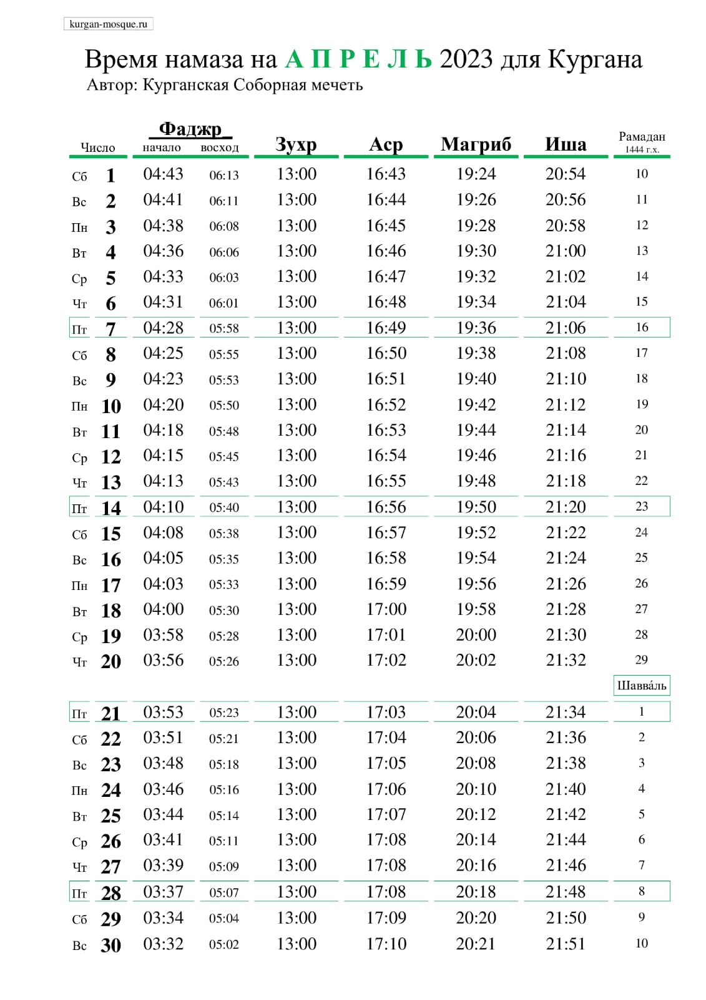

---
## Благодатный Рамадан

***Бисмилляхир-Рахманир-Рахим!***

Рамадан – благодатное время для верующего, так как он может получить щедрую награду за любое благое дело. Ну и конечно, главная составляющая Рамадана – пост. 
**«Тому, кто постился в месяц Рамадан с верой и надеждой, будут прощены совершенные им грехи»** (Бухари, Муслим). В Рамадан верующий ведет борьбу с собственной душой: днем – с помощью поста, а ночью – с помощью молитвы.

Пост позволяет оценить значение благ, дарованных нам Аллахом. Всевышний наполнил мир несметным количеством благ и отдал в пользование своему любимому творению – человеку. В любое время года – лето, зиму, весну, осень, - Аллах беспрерывно дарует нам всевозможное благо. 

Для получения благ напрямую от Аллаха Та’аля необходима вера в то, что успех в обоих мирах лежит в выполнении приказов Аллаха по сунне Пророка Мухаммада (с.а.с.) Аллах Та’аля сказал: **«Кто творил дела праведные и был верующим, тот не будет бояться ни обиды, ни притеснения»** (Коран, 20:112)

Умар рассказывает, что Пророк (с.а.с.) сказал: **«Ислам – это свидетельствовать, что нет бога, кроме Аллаха, а Мухаммад (с.а.с.) – Посланник Аллаха, выстаивать намаз, платить закят, держать уразу в месяц рамазан, и совершить хадж, если есть для этого возможность»**. (Муслим).

Пост усмиряет нафс человека, учит терпению и порядку. 

Также в это время мы можем понять, в каком положении находится бедняк и нуждающийся, не имеющий пресной воды. **Однажды у пророка Юсуфа (мир ему) спросили: «Как ты можешь голодать, ведь у тебя в руках ключи от казны?» На что он ответил: «Боюсь, если я буду сытым, то я забуду о голодных.»**

И в заключении напомним: **«Пост – для Меня, и Я воздаю за него»**. (хадис Кудси, передал Ан-Насаи).

### Дорогие постящиеся! Приглашаем вас разделить с нами ифтар, который проводится в стенах Курганской соборной мечети!

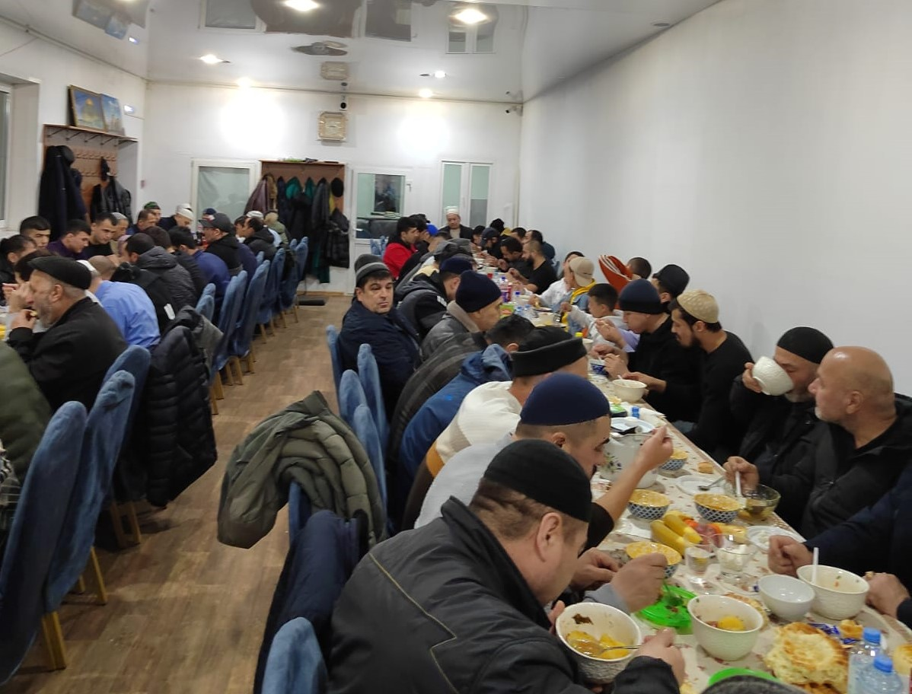

Также хотим напомнить, что ***продукцию ХАЛЯЛЬ: мясо, готовые блюда, овощи и фрукты для нашего стола, орехи и сухофрукты можно приобрести у наших братьев, на остановочном пункте "Некрасовский рынок"***.

***Готовую еду и выпечку ХАЛЯЛЬ можно приобрести в пекарне «Ширин» по адресу: Курган, Дзержинского 54Б/1***

---

## Расписание на Рамадан 2023 для Кургана и области.

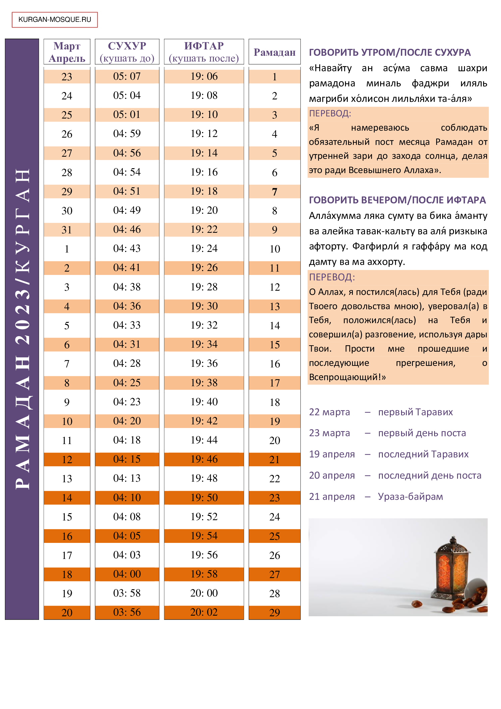

---

## Обращение председателя КГРОМ по случаю наступления Священного месяца Рамадан.

بسم الله الرحمن الرحيم
السلام عليكم ورحمة الله وبركاته

### Приветствие и благословение Аллаха пророку Мухаммадуﷺ его семье, сподвижникам и всем тем кто следует его призыву до Судного дня.

Уважаемые братья и сестры! Поздравляю вас с наступлением Священного месяца Рамадан.
23 марта 2023 года для всех мусульман начинается обязательный пост, который является одним из столпов Ислама.
Рамадан, месяц в который был ниспослан Коран.

Аллах Субханаху Ва Тааля говорит в Коране:

"شَهْرُ رَمَضَانَ ٱلَّذِىٓ أُنزِلَ فِيهِ ٱلْقُرْآنُ هُدًى لِّلنَّاسِ وَبَيِّنَٰتٍ مِّنَ ٱلْهُدَىٰ وَٱلْفُرْقَانِ ۚ فَمَن شَهِدَ مِنكُمُ ٱلشَّهْرَ فَلْيَصُمْهُ 

В месяц рамадан был ниспослан Коран - верное руководство для людей, ясные доказательства из верного руководства и различение. Тот из вас, кого застанет этот месяц, должен поститься. Сура Бакара 185 аят.
Соблюдение поста предписано в Священном Коране и является обязательным для каждого совершеннолетнего здравомыслящего мусульманина. 

يَٰٓأَيُّهَا ٱلَّذِينَ آمَنُوا۟ كُتِبَ عَلَيْكُمُ ٱلصِّيَامُ كَمَا كُتِبَ عَلَى ٱلَّذِينَ مِن قَبْلِكُمْ لَعَلَّكُمْ تَتَّقُونَ

***"О те, которые уверовали! Вам предписан пост, подобно тому, как он был предписан вашим предшественникам, - быть может, вы устрашитесь."*** сура Бакара 183 аят. 

Пост в месяце Рамадан это не просто отказ от физических потребностей в дневное время суток, а в большей степени этот месяц связан с духовными ценностями человека. 
Целый месяц мусульмане всего мира проводят в поклонении Господу, вместе постятся, вместе выстаивают молитвы, уповая на Всевышнего. 

Священный месяц Рамадан является милостью для всех верующих. 
Абу Хурайра сообщил, что Пророкﷺ сказал: ***«Тот, кто соблюдает пост в течение месяца Рамадан из искренней веры и надеясь получить награду Аллаха, тогда все его прошлые грехи будут прощены и стёрты»*** (Аль-Бухари и Муслим). 

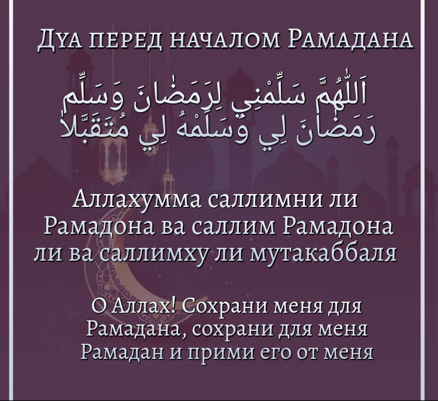

Я сердечно поздравляю всех мусульман Кургана и Курганской области с началом Священного месяца Рамадан. Пусть Всевышний ниспошлет вам свою Милость и Милосердие. 
Прошу Всевышнего Аллаха, чтобы Он позволил нам с верой и смирением поклоняться в этот благославенный месяц. 
Пусть Аллах укрепит сердца мусульман, дарует нам терпение и стойкость, богобоязненность и искреннюю веру.

С уважением и добрыми молитвами, Председатель Курганской городской религиозной организации мусульман Зиёдали Хаджи Мизробов.

---

### Ход строительства мечети в Каргапольском районе.

*Дорогие братья и сестры!*

Альхамдулиллах, 29.08.2022 года, после долгого ожидания, администрацией Каргапольского района было подписано разрешение на строительство мечетив Каргаполье, на участке 
по адресу **Урожайная, д. 1А**. Выражаем огромную благодарность администрации района.

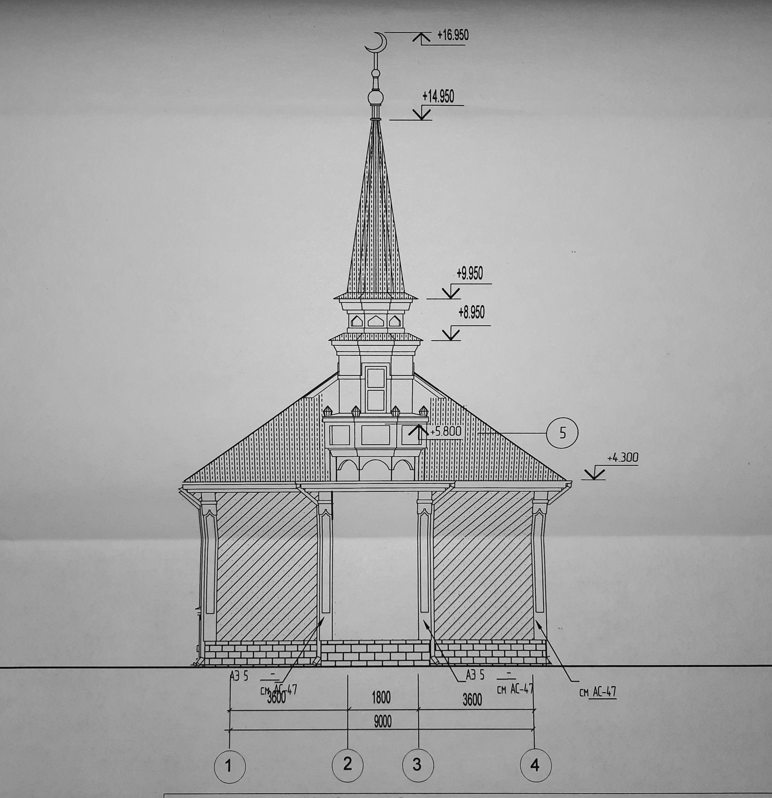

На начало строительства потребовались стройматериалы, которые мы получили в дар от братьев мусульман Курганской области. От наших добрых дарителей мы получили  44 куба бетона, 50 кубов блоков поревита, арматуру, сваи, и прочие расходные материалы. 

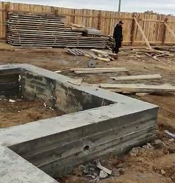
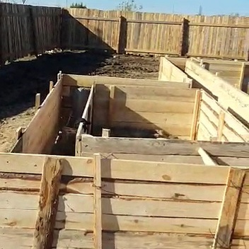

Также, в ближайшее время будут завезены 15 кубов облицовочного кирпича.
Средства, переданные на строительство, использовали экономно и поназначению, благодаря этому были оплачены работы по выравниванию участка трактором, становление 180 м 
забора.

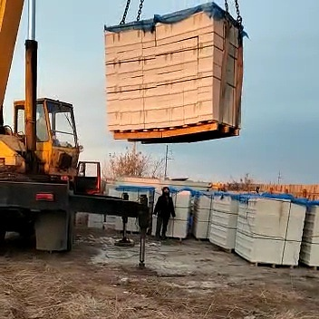

Братья мусульмане ежедневно трудятся для нас и Аллаха ради, ради скорейшего появления Его нового дома. Просим Аллаха увеличить многократно награду за ваш труд!

***Мы воздаем Дуа Аллаху за каждую песчинку, переданную нам в помощь, сделано уже очень много, и еще много впереди, но каждый новый шаг вперед мы делаем только 
благодаря нашей дружной, щедрой и сплоченной общине Курганской области! Пусть Всевышний одарит вас в этой и в следующей жизни, пусть Онуслышит ваши молитвы и 
откликнется на них, пусть оградит вас от бед и препятствий!***

---

### Новости с места строительства мечети в г. Куртамыш.

18 августа 2022 года на месте строительства состоялась торжественная закладка первого камня в фундамент мечети. На мероприятии присутствовали представители 
мусульманских диаспор, меценаты, и другие неравнодушные люди. 

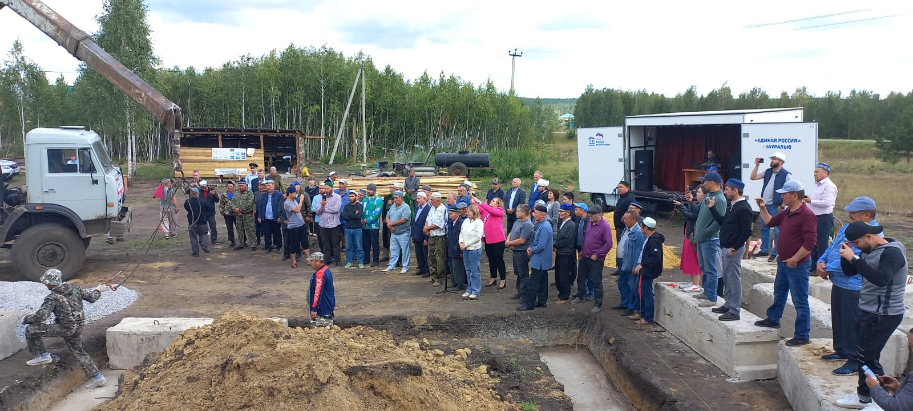

При содействии партии «Единая Россия», в лице Кучина Николая Григорьевича, было организовано звуковое сопровождение. С речью перед участниками выступил представитель 
администрации Куртамышского района Гвоздев Александр Николаевич.

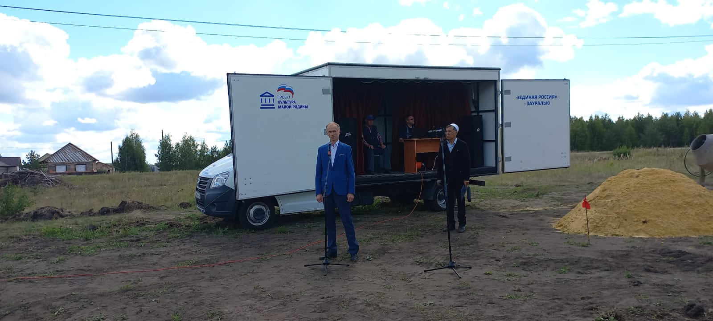

Религиозное мероприятие не могло обойтись без чтения Курана: перед участниками выступил чтец Обид Джаббаров, после этого мусульмане произнесли коллективное дуа. 

Разделил радость с участниками председатель КГРОМ Мизробов З.К., который выступил с речью: ***«Мечеть – это ось, вокруг которой вращаются идеи и чувства, и школа, в 
которой воспитываются лучшие из лучших: они несут факелы света и верного руководства и шествуют по земле, неся с собой особые свойства мечети, ее дух и ее чистоту. 
Всевышний Аллах обещал построить дом в Раю тому, кто построит Ему дом на земле. Усман ибн Аффан передает, что Пророк (с.а.с.) сказал: «Кто построит мечеть ради Аллаха, 
тому Аллах построит такой же дом в Раю» (Ат-Тирмизи)»***

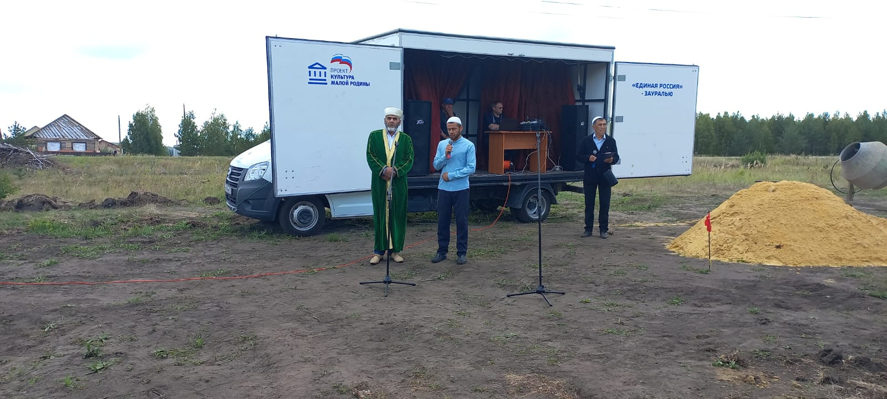

Мероприятие завершилось традиционным обедом за общим столом от наших добрых дарителей.

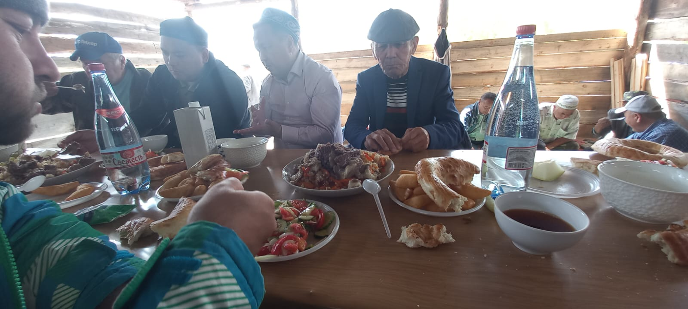

На сегодняшний день уже заканчивается укладка фундамента мечети, установлены бетонные блоки. Строительство идет полным ходом. Просим благословения у Аллаха, чтобы
строительство завершилось вовремя и без препятствий. Благодарим наших братьев и сестер за помощь.

---

### Строительство мечети в Куртамыше

В Куртамышском районе Курганской области положено начало строительству мечети. Располагаться она будет по адресу: **город Куртамыш, улица Вишнёвая, дом 1Б.** 

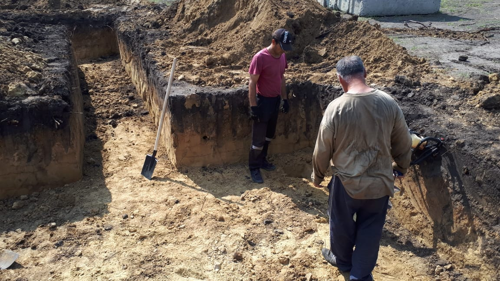

По воле Аллаха, на участке, выделенном для местной религиозной организации мусульман, уже проложена траншея для будущего фундамента мечети и проведены необходимые измерения для его закладки. Руководит строительством имам будущей мечети, и, по совместительству, председатель МРОМ г. Куртамыша Курганской области, **Назарбаев Акылбек Абдижалилович**.

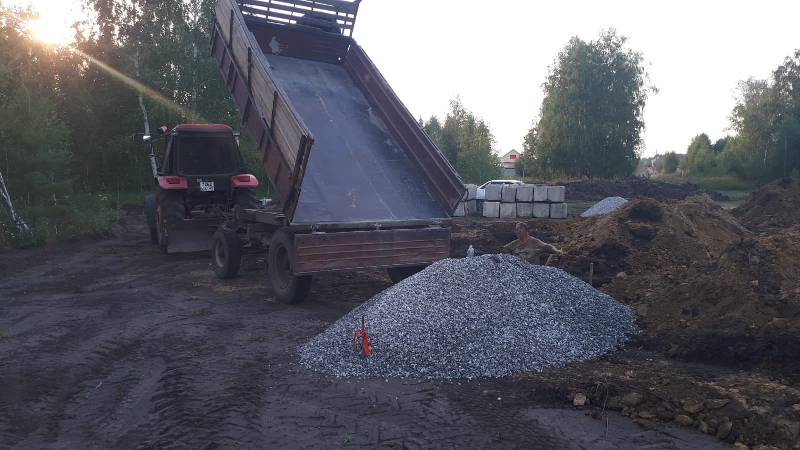

На 9 число мухаррама к месту строительства были доставлены материалы: рубероид, щебень. Ими покрыли выкопанную траншею. Материалы были закуплены на средства, выделенные **ДУМ РФ** (150000 руб.). Также, на добровольные пожертвования прихожан мечети города Кургана, Альхамдулиллах, выкуплена и доставлена арматура (100000 руб.) и три куба доски для опалубки (45000 руб.). Пусть не иссякнет благо от Аллаха для наших жертвователей.

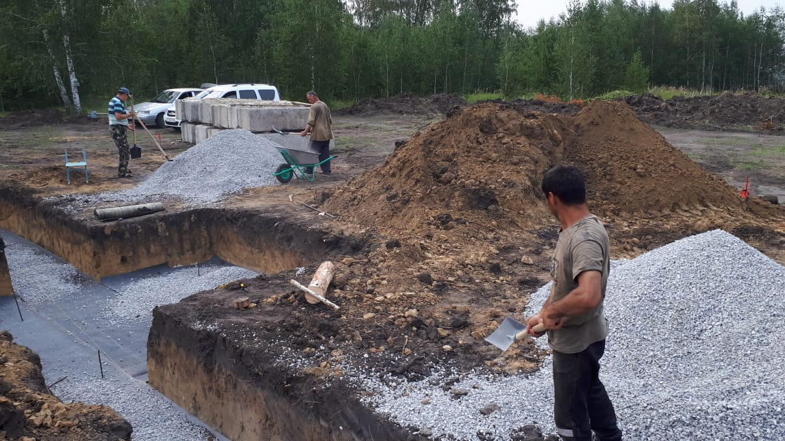

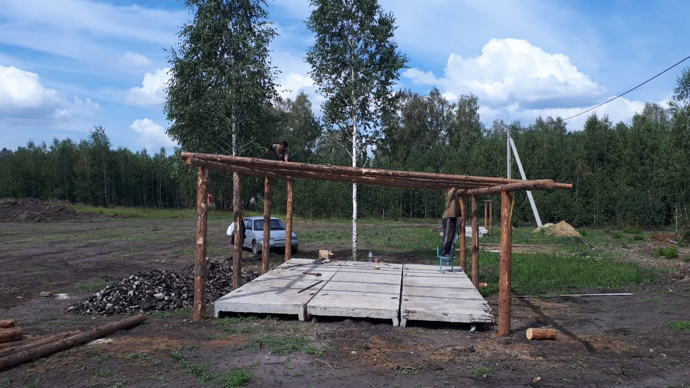

***В процессе становления мечети, мы будем рады принять любую помощь от наших отзывчивых прихожан. Вы можете помочь стройке любым способом: работой, благими делами, 
дуа и пожертвованиями.***

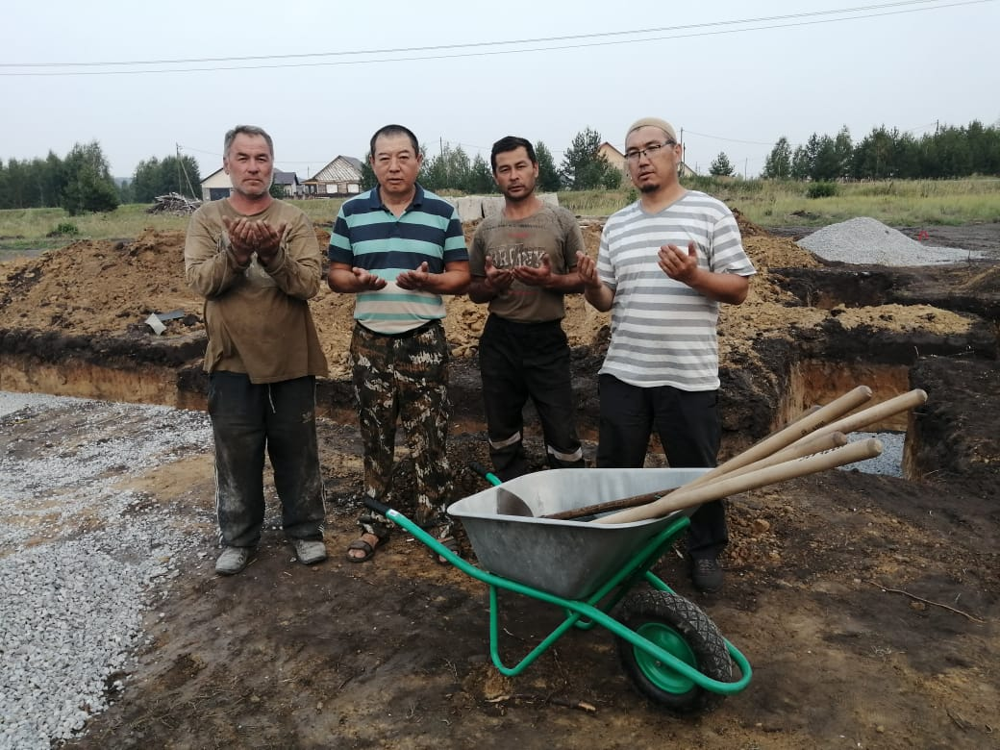

Ниже указаны реквизиты для наших добрых дарителей:

#### МЕСТНАЯ РЕЛИГИОЗНАЯ ОРГАНИЗАЦИЯ МУСУЛЬМАН ГОРОДА КУРТАМЫША КУРГАНСКОЙ ОБЛАСТИ

Банковские реквизиты: 

БИК 043735650

ИНН 4511010430 

КПП 451101001

р/счет 40703810232000000454

корр.счет 30101810100000000650
в Курганском отделении №8599 ПАО Сбербанк  г. Курган

Назначение: ДОБРОВОЛЬНЫЕ ПОЖЕРТВОВАНИЯ.

---

---

**РЕКВИЗИТЫ ДЛЯ ДОБРОВОЛЬНЫХ ПОЖЕРТВОВАНИЙ:**

Курганская городская религиозная организация мусульман

ООО Банк «КУРГАН»

ИНН 4501055960

КПП 450101001

р/сч 40703810800000000428

БИК 043735830

к/сч 30101810700000000830

НАЗНАЧЕНИЕ: ДОБРОВОЛЬНОЕ ПОЖЕРТВОВАНИЕ

---

---

