بسم الله الرحمن الرحيم

Уважаемые братья и сестры, праздник разговения в этом году отмечается 10 апреля, 9 апреля с заходом солнца наступит 1 день месяца Шавваль.

Поздравляем вас с наступающим праздником Ид Аль-Фитр(Ураза Байрам). Пусть Всевышний Аллах примет ваши посты, молитвы и благие деяния!
Праздничный намаз состоится 10 апреля, 7:00 часов утра, Курганская Соборная мечеть(Сибирская 2А)

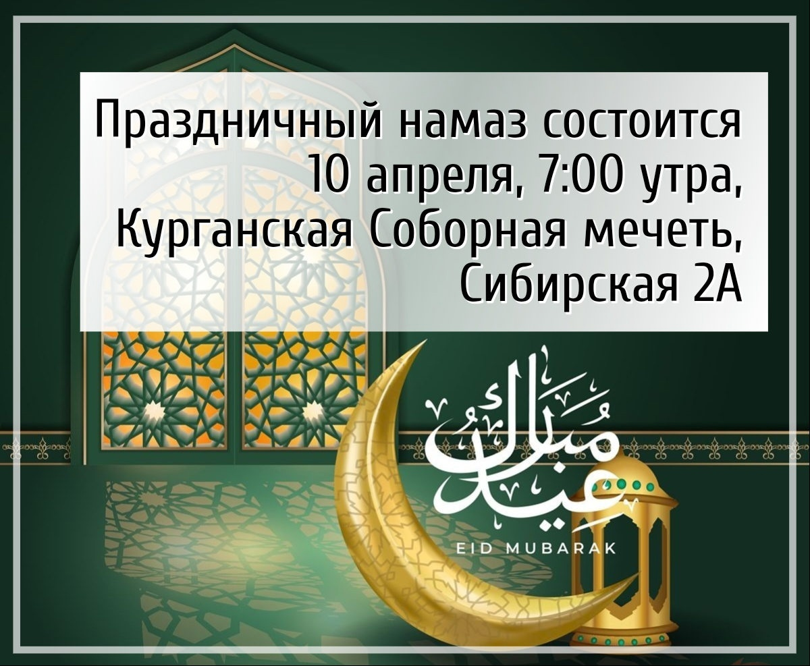

---

## Время намаза на апрель 2024 года для Кургана

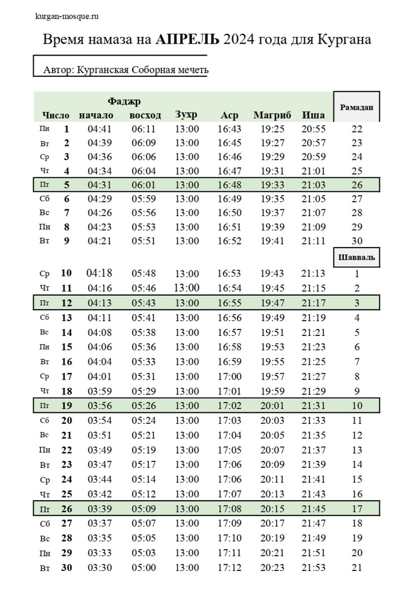

===
## Закятуль-Фитр

Обязательная милостыня для каждого мусульманина в месяц Рамадан

Намерение для выплаты закатуль-фитр делается сердцем, желательно повторять языком.
Намерение: я намерился выплатить обязательный закатуль-фитр за себя (жену, сына, дочь) ради довольствия Всевышнего Аллаха.

Ибн Умар (да будет доволен им Аллах) сказал:

عن ابن عمر أن النبي صلى الله عليه وسلم أمر بإخراج زكاة الفطر قبل خروج الناس إلى الصلاة

«Пророкﷺ повелел нам выплатить закят разговенья до выхода людей на молитву» (Сахих аль-Бухари).

Закятуль-фитр разрешается выплатить в начале Рамадана, не дожидаясь конца месяца. Но нельзя его выплачивать до наступления Рамадана. Также нужно успеть выплатить закят до праздничной молитвы.

قال الله سبحانه وتعالى
وَأَقِيمُوا۟ ٱلصَّلَوٰةَ وَآتُوا۟ ٱلزَّكَوٰةَ ۚ وَمَا تُقَدِّمُوا۟ لِأَنفُسِكُم مِّنْ خَيْرٍ تَجِدُوهُ عِندَ ٱللَّهِ ۗ إِنَّ ٱللَّهَ بِمَا تَعْمَلُونَ بَصِيرٌ

"Совершайте намаз и выплачивайте закят. Все то доброе, что вы предварите для себя, вы найдете у Аллаха. Воистину, Аллах видит то, что вы совершаете." Аль-Бакара, 110 аят.

Размер закятуль-фитр в 2024 году в Кургане и Курганской области составляет:

•  100 рублей - закятуль-фитр
• 3.000 рублей - фидья садака(за месяц)

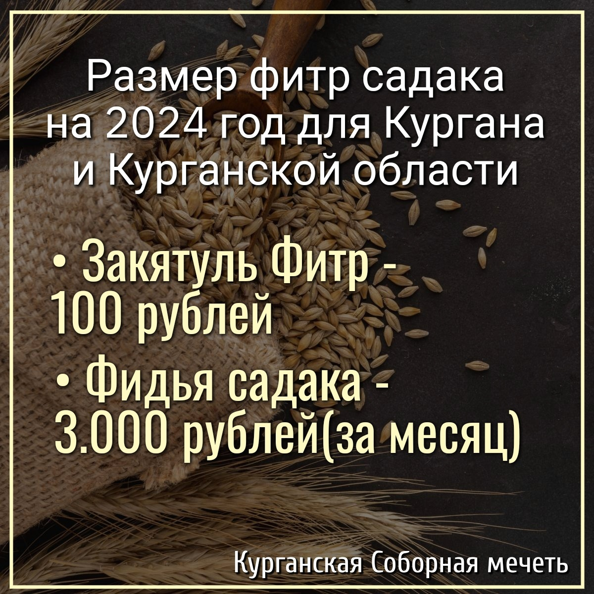

---

## Обращение председателя КГРОМ по поводу теракта в московском "Крокус Сити Холле"

24 марта в России официально объявлен днем общенационального траура. Выражаю глубокие соболезнования всем пострадавшим и тем, кто потерял родных в ужасной трагедии. Все мусульмане России и мира скорбят вместе и делают молитвы за невинно расстреляных граждан.

Попытка обвинить мусульман в теракте - это клевета на мусульман всего мира. Ни заказчики, ни исполнители не могут быть мусульманами.
Аллах Субханаху Ва Тааля, запретил убивать людей, в Исламе это считается великим грехом, наказания за которые будет огненная геена.
У террористов нет ни нации, ни религии. Мы безоговорочно порицаем этих невежд, которых даже нельзя назвать людьми.

Пусть Всевышний Аллах дарует всем пострадавшим, и потерявший близких терпения, ведь это невосполнимые утраты.
Также молим Аллаха об упокоении душ жертв этого жестокого злодеяния.

Уважаемые братья и сестры, сегодня 24 МАРТА 2024 ГОДА в Курганской Соборной мечети ИФТАР ОТМЕНЯЕТСЯ в знак солидарности, и скорби о погибших в теракте в Подмосковном "Крокус Сити Холле".
Председатель КГРОМ Зиёдали Курбонович Мизробов.

---
## Обращение Курганской городской религиозной организации мусульман по поводу теракта в подмосковном «Крокус Сити Холле». 

От имени КГРОМ и себя лично, выражаем глубокие соболезнования пострадавшим и близким погибших в этой чудовищной трагедии.

22 марта в торогово - развлекательном центре «Крокус Сити Холл» неизвестные расстреляли зрителей, пришедших на мероприятие, мирных граждан.
Такие бесчеловечные акты насилия в обществе, никогда не будут оправданы не перед Всевышним, ни перед людьми.
Аллах, Свят Он и Велик говорит в Коране :

وَمَن يَقْتُلْ مُؤْمِنًا مُّتَعَمِّدًا فَجَزَآؤُهُ ۥ جَهَنَّمُ خَٰلِدًا فِيهَا وَغَضِبَ ٱللَّهُ عَلَيْهِ وَلَعَنَهُ ۥ وَأَعَدَّ لَهُ ۥ عَذَابًا عَظِيمًا

"Если же кто-либо убьет верующего преднамеренно, то возмездием ему будет Геенна, в которой он пребудет вечно. Аллах разгневается на него, проклянет его и приготовит ему великие мучения", сура Ниса, 93 аят.

مَن قَتَلَ نَفْسًۢا بِغَيْرِ نَفْسٍ أَوْ فَسَادٍ فِى ٱلْأَرْضِ فَكَأَنَّمَا قَتَلَ ٱلنَّاسَ جَمِيعًا وَمَنْ أَحْيَاهَا فَكَأَنَّمَآ أَحْيَا ٱلنَّاسَ جَمِيعًا ۚ وَلَقَدْ جَآءَتْهُمْ رُسُلُنَا بِٱلْبَيِّنَٰتِ ثُمَّ إِنَّ كَثِيرًا مِّنْهُم بَعْدَ ذَٰلِكَ فِى ٱلْأَرْضِ لَمُسْرِفُونَ

"..кто убьет человека не за убийство или распространение нечестия на земле, тот словно убил всех людей, а кто сохранит жизнь человеку, тот словно сохранит жизнь всем людям. Наши посланники уже явились к ним с ясными знамениями, но многие из них после этого излишествуют на земле." Сура Аль-Маида, 32 аят.

Сейчас на фоне этого события очень важно сохранять спокойствие. Самым сильным нашим аргументом перед лицом экстремистов должна стать наша всеобщая тесная сплоченность и единство. Мы, мусульмане, выражаем гневное осуждение действий преступников, убивших невинных людей. Мусульмане России молятся о погибших, разделяя эту тяжелую боль.

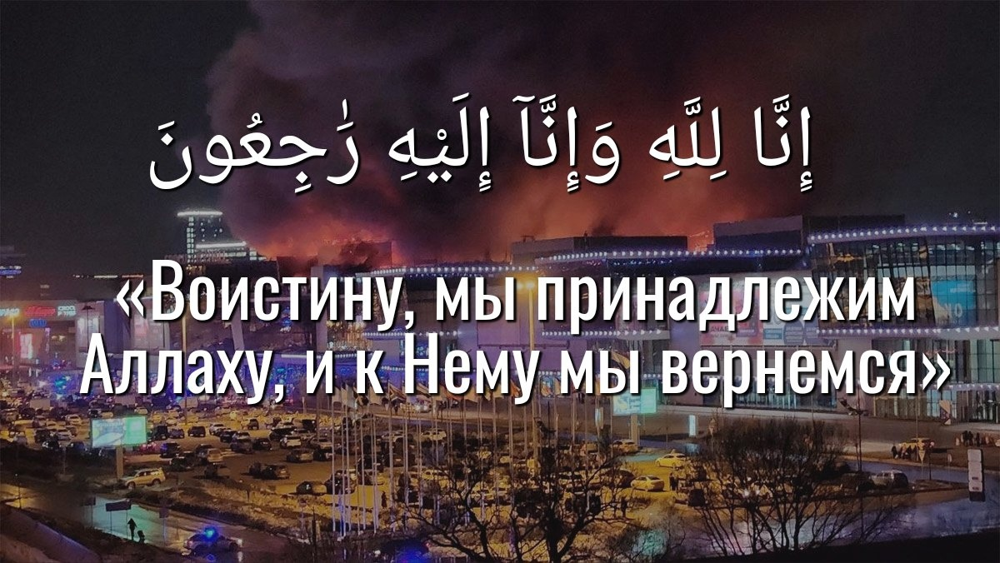

Выражаем свои искренние соболезнования близким и родным погибших, молим Всевышнего Аллаха об упокоении душ жертв этого бесчеловечного злодеяния и скорейшем выздоровлении всем пострадавших горожан.
Председатель КГРОМ Зиёдали Курбонович Мизробов.

---

### Хадисы о посте в Рамадан

عَنْ أَبِي هُرَيْرَةَ رَضِيَ اللهُ عَنْهُ أَنَّ رَسُولَ اللهِ ﷺ قَالَ: ”يَقُولُ اللهُ تَبَارَكَ وَتَعَالَى: «كُلُّ عَمَلِ ابْنِ آدَمَ لَهُ إِلا الصَّوْمَ، فَإِنَّه لِي وَأَنَا ‌أَجْزِي ‌بِهِ»“.

📗Передается от Абу Хурайры (да будет доволен им Аллах) как Посланник Аллаха ﷺ сказал: «Всемогущий и Великий Аллах сказал: “Любое дело сына Адама делается им для себя же, кроме поста, ибо, поистине, он — ради Меня, и Я воздам за него”». «Сахих» Аль-Бухари, «Сахих» Муслим.

📗Передают со слов Сахля, да будет доволен им Аллах, что Пророк ﷺ сказал: «Поистине, есть в раю врата, именуемые “Ар-Раййан”, через которые будут входить (туда) постящиеся в День воскресения, и не войдёт через эти врата никто, кроме них. Будет сказано: “Где постившиеся?” − и они поднимутся, и не войдёт через эти врата никто, кроме них, а после того как они войдут, эти врата будут закрыты, и больше никто не войдёт через них» (Аль-Бухари)

📗Пророк Мухаммадﷺсказал: «Пост и Коран заступаются за раба Аллаха в Судный день. Пост говорит: “Господь мой! Я лишил его пищи и питья в светлую часть, так позволь же мне заступиться за него!” А Коран говорит: “Господь мой! Я лишил его сна ночью, так позволь же мне заступиться за него!” — и их заступничества удовлетворяются» (Ахмад)

 
عن أبي هريرة رضي الله عنه قال: قال رسول اللهﷺ: «قال الله عز وجل : كلُّ عَمَل ابن آدَم له إلا الصيام، فإنه لي وأنا أجْزِي به، والصيام جُنَّة، فإذا كان يوم صوم أحدِكُم فلا يَرْفُثْ ولا يَصْخَبْ فإن سَابَّهُ أحَدٌ أو قَاتَلَهُ فليَقل: إنِّي صائم، والذي نفس محمد بيده لَخُلُوفُ فَمِ الصَّائِم أطيب عند الله من رِيحِ المِسْكِ، للصائم فرحتان يَفْرَحُهُمَا: إذا أفطر فَرِح بفطره، وإذا لَقِي ربَّه فَرِح بِصَوْمه». وهذا لفظ رواية البخاري. وفي رواية له: «يَتْرُك طَعَامه، وشَرَابه، وشَهوته من أجلي، الصيام لي وأنا أَجْزِي به، والحسنة بعشر أمثالها». وفي رواية لمسلم: «كلُّ عَمَل ابن آدم يُضَاعَف، الحَسَنة بِعَشر أمْثَالها إلى سَبْعِمِئَة ضِعْف، قال الله تعالى: إلا الصَّوم فإنه لي وأنا أجْزِي به؛ يَدَع شَهَوته وطَعَامه من أجلي، للصائم فرحتان: فَرْحَة عند فِطْره، وفَرْحَة عند لقِاء ربِّه، ولَخُلُوف فيه أطْيَب عند الله من رِيحِ المِسْكِ»

Абу Хурайра (да будет доволен им Аллах) передаёт, что Посланник Аллахаﷺсказал: «Всемогущий и Великий Аллах сказал: “Всякое дело потомок Адама совершает для себя, кроме поста, ибо поистине, он — для Меня, и Я воздаю за него”. Пост – защита. В тот день, когда кто-нибудь из вас будет поститься, пусть избегает всего непристойного и не шумит. Если же кто-нибудь станет бранить его или попытается завязать с ним ссору, пусть он скажет такому: «Поистине, я — человек, соблюдающий пост!»

Всевышний Аллах сказал: " поистине пост, он — для Меня, и Я воздаю за него. Постящийся отказывается от удовлетворения страсти своей и от еды своей ради Меня”.
У постящегося будет две радости: радость при разговении и радость при встрече с Господом своим. И неприятный запах изо рта постящегося будет лучше пред Аллахом, чем благоуханье мускуса».

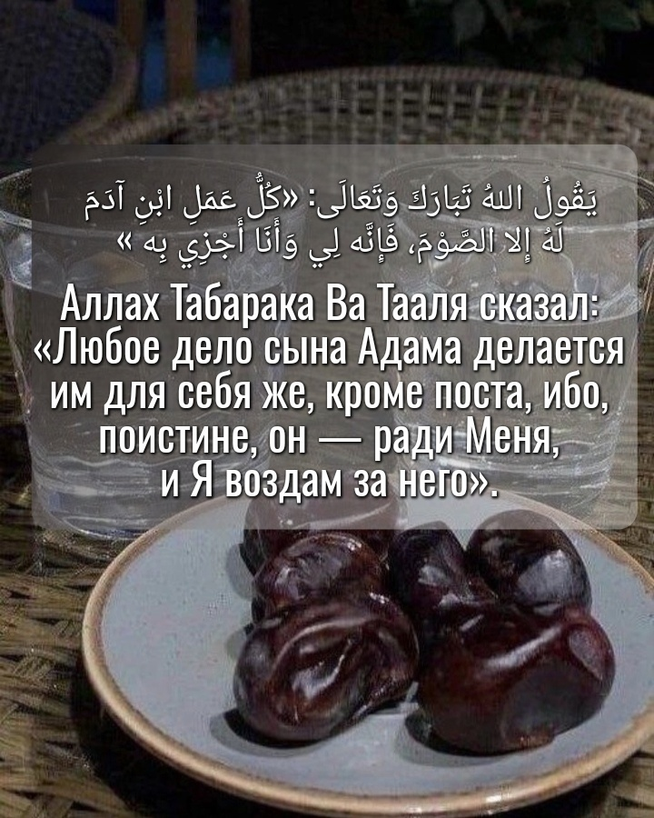

---

## Обращение председателя КГРОМ по случаю наступления Священного месяца Рамадан 2024 года.

بسم الله الرحمن الرحيم
السلام عليكم ورحمة الله وبركاته

Приветствие и благословение Аллаха пророку Мухаммадуﷺ его семье, сподвижникам и всем тем кто следует его призыву до Судного дня.

**Уважаемые братья и сестры! Искренне и от всего сердца поздравляю вас с наступлением благословенного месяца Рамадан**.

10 марта 2024 года с заходом солнца для всех мусульман начинается Священный месяц Рамадан. Обязательный пост является одним из столпов Ислама. В этот священный месяц мусульмане всего мира стремятся к довольству Всевышнего Аллаха, соблюдая обязательный пост совершая молитвы, раздавая милостыню.

Рамадан, месяц Корана, тот самый месяц, в котором все дела должны быть позади. Посвящайте свои сердца в это благо, благодарите Всевышнего за оказанную Милость. Старайтесь опередить друг друга в благих делах, как духовных, так и материальных. Наша цель отдать все предпочтение этому месяцу и укреплять нашу связь с Аллахом Субханаху Ва Тааля.

Рамадан это месяц когда был ниспослан Коран, Рамадан это месяц терпения, Рамадан это месяц покояния. В Рамадане Аллах заковывает шайтанов в кандалы, в Рамадане открываются врата райских садов, в Рамадане Аллах запирает ворота огненной геены, Рамадан это лекарство от всяких бед, лечение от любой печали. Месяц Рамадан ведёт сердца верующих с своему Создателю, в Рамадане Аллах становится ближе к своим рабам.

Месяц Рамадан вместе с ночью предопределения, содержащейся в нем, является временем спокойствия и прощения. Сообщается, что посланник Аллахаﷺ сказал: «Начало Рамадана – милость, середина – прощение, а конец – избавление от огня Ада».

Аллах Свят Он и Велик говорит в Коране:

"شَهْرُ رَمَضَانَ ٱلَّذِىٓ أُنزِلَ فِيهِ ٱلْقُرْآنُ هُدًى لِّلنَّاسِ وَبَيِّنَٰتٍ مِّنَ ٱلْهُدَىٰ وَٱلْفُرْقَانِ ۚ فَمَن شَهِدَ مِنكُمُ ٱلشَّهْرَ فَلْيَصُمْهُ"

***«В месяц Рамадан был ниспослан Коран - верное руководство для людей, ясные доказательства из верного руководства и различение. Тот из вас, кого застанет этот месяц, должен поститься.»*** Сура Бакара 185 аят.

Соблюдение поста предписано в Священном Коране и является обязательным для каждого совершеннолетнего здравомыслящего мусульманина.

أَيَّامًا مَّعْدُودَٰتٍ ۚ فَمَن كَانَ مِنكُم مَّرِيضًا أَوْ عَلَىٰ سَفَرٍ فَعِدَّةٌ مِّنْ أَيَّامٍ أُخَرَ ۚ وَعَلَى ٱلَّذِينَ يُطِيقُونَهُ ۥ فِدْيَةٌ طَعَامُ مِسْكِينٍ ۖ فَمَن تَطَوَّعَ خَيْرًا فَهُوَ خَيْرٌ لَّهُ ۥ ۚ وَأَن تَصُومُوا۟ خَيْرٌ لَّكُمْ ۖ إِن كُنتُمْ تَعْلَمُونَ

***«Поститься следует считанное количество дней. А если кто из вас болен или находится в пути, то пусть постится столько же дней в другое время. А тем, которые способны поститься с трудом, следует в искупление накормить бедняка. А если кто добровольно совершает доброе дело, то тем лучше для него. Но вам лучше поститься, если бы вы только знали!»*** сура Бакара, 184 аят.

Пост это не только воздержание от физических потребностей, но и духовное смирение, отказ от гнева, злословия, зависти и плохих мыслей. И счастлив будет тот, кто сумеет избавиться от подобных болезней сердец.

Благославенный месяц Рамадан - лучшее время для очищения сердца. Пост смягчает наши сердца, учит терпению и силе воли.
Целый месяц мусульмане всего мира проводят в поклонении Господу, вместе постятся, вместе выстаивают молитвы, уповая на Всевышнего.

Священный месяц Рамадан является милостью для всех верующих.
Абу Хурайра сообщил, что Пророкﷺ сказал: ***«Тот, кто соблюдает пост в течение месяца Рамадан из искренней веры и надеясь получить награду Аллаха, тогда все его прошлые грехи будут прощены и стёрты»*** (Аль-Бухари и Муслим).

Прошу Всевышнего Аллаха, чтобы Он позволил нам с верой и смирением поклоняться в этот благославенный месяц.

Пусть Всевышний ниспошлет нам свою Милость и Милосердие.

Пусть Аллах укрепит наше состояние на истине, даст силы и крепкий иман, и позволит сохранить это состояние до конца Судного дня. 

Пусть Аллах Субханаху Ва Тааля дарует всем нам сил и стойкости, мощи и терпения, достойно провести этот благославенный месяц. 

Пусть этот Рамадан наполнит наши дома верой, радостью, прощением и избавлением от трудностей. Амин

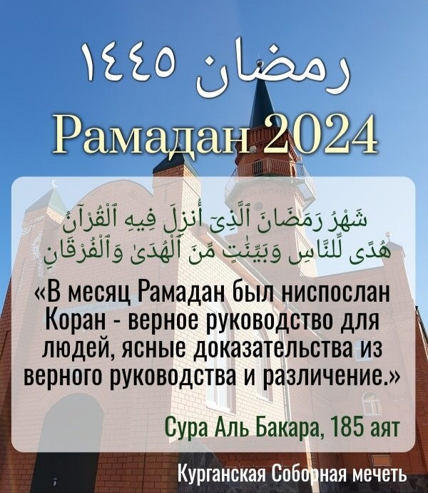

***Также напоминаю, что каждую ночь месяца Рамадан в Курганской Соборной мечети будет проводиться коллективная молитва Таравих, по адресу Сибирская, 2А.***

Да пребудет над вами мир милость и Благославение Аллаха.

**С уважением и добрыми молитвами, Председатель Курганской городской религиозной организации мусульман Зиёдали Хаджи Мизробов**.

---

## 11 марта - 1-й день месяца Рамадан в Саудовской Аравии!

Сегодня вечером 10 марта (29 Шаабана), в Саудовской Аравии **удалось зрительно зафиксировать** появление новой луны месяца Рамадан! 

 ***Поэтому 1-й день месяца Рамадан в Саудовской Аравии начнётся завтра, 11 марта!***

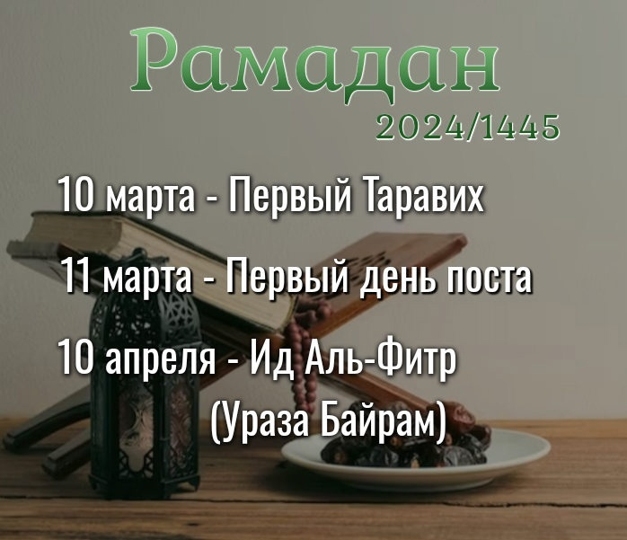

---
 
## Расписание на Рамадан 2024

### Ассаляму алейкум ва рахматуллахи ва баракятух, братья и сестры! До Священного месяца Рамадан осталось совсем чуть чуть, все мы с нетерпением ждём этот месяц. Приближается время поста, предписанного Всевышним Аллахом, время для очищения сердец и души, месяц Милости и прощения.

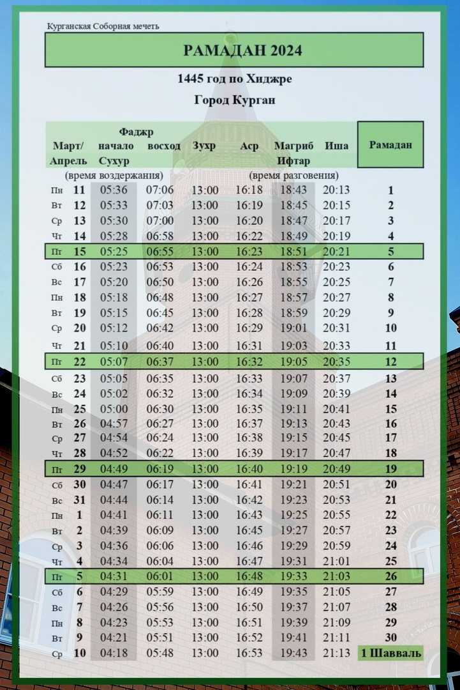

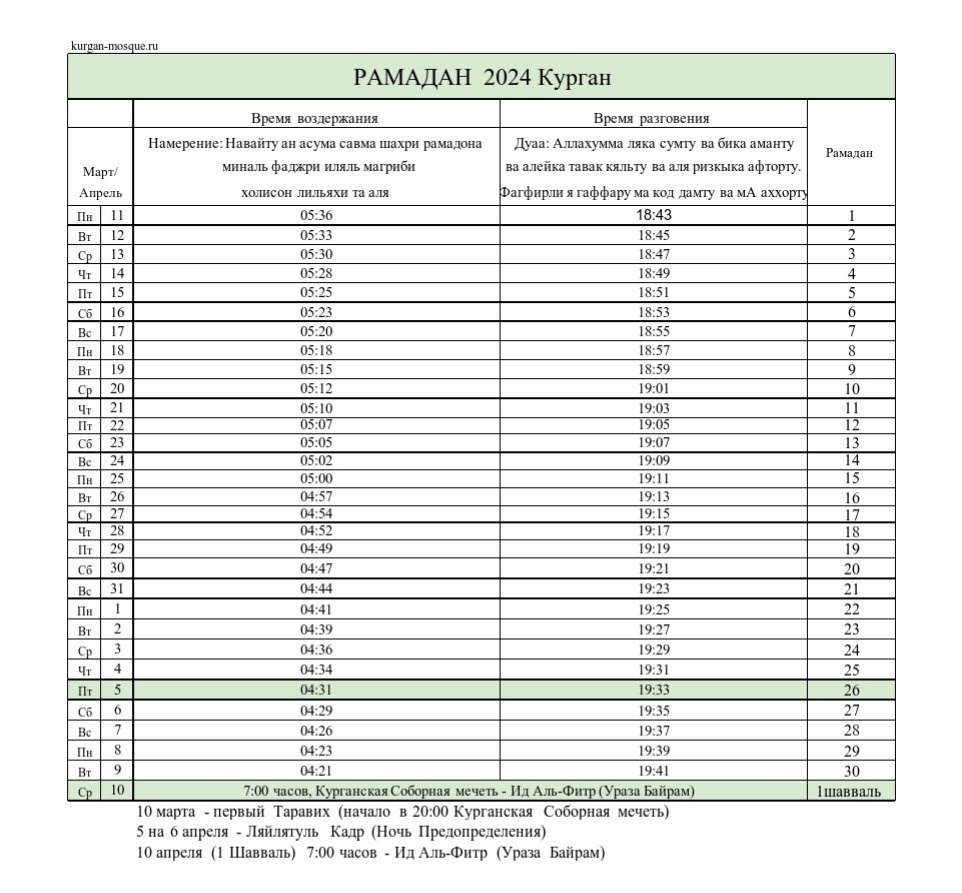

В хадисах говорится:

عن أبي هريرة رضي الله عنه مرفوعاً: «من صَام رمضان إيِمَانًا واحْتِسَابًا، غُفِر له ما تَقدَّم من ذَنْبِه»

Абу Хурайра (да будет доволен им Аллах) передаёт, что Пророкﷺсказал: ***«Кто постился рамадан с верой и надеждой на награду от Аллаха, тому простятся его прошлые грехи»*** (Бухари; Муслим).

عن أبي هريرة رضي الله عنه : أن رسول الله صلى الله عليه وسلم قال: «إِذَا جَاءَ رَمَضَانُ، فُتِحَتْ أبْوَاب الجَنَّةِ، وَغُلِّقَتْ أبْوَابُ النَّارِ، وَصفِّدَتِ الشَّيَاطِينُ»

Абу Хурайра (да будет доволен им Аллах) передаёт, что Посланник Аллахаﷺсказал: ***«Когда приходит рамадан, открываются врата Рая, закрываются врата Ада и заковываются шайтаны»*** (Бухари).

Пусть Аллах Субханаху Ва Тааля позволит нам достойно поклоняться, улучшать свои духовные качества, бороться с нафсом, даст сил и стойкости, и укрепит наш иман🤲🏽🤲🏽

### Дуаа сухура (намерение на пост):

Навайту ан асума савма шахри рамадона миналь фаджри иляль магриби холисон лильяхи та 'аля.

نَوَيْتُ أَنْ أَصُومَ صَوْمَ شَحْرِ رَمَضَانَ مِنَ الْفَجْرِ إِلَى الْمَغْرِبِ خَالِصًا ِللهِ تَعَالَى

Перевод: я намереваюсь соблюдать обязательный пост от рассвета до заката, делая это искренне, ради Всевышнего.

### Дуаа разговения(ифтар):

Аллахумма ляка сумту ва бика аманту ва алейка тавак кяльту ва' аля ризкыка афторту. Фагфирли я гаффару ма код дамту ва мА аххорту.

اَللَّهُمَّ لَكَ صُمْتُ وَ بِكَ آمَنْتُ وَ عَلَيْكَ تَوَكَّلْتُ وَ عَلَى رِزْقِكَ أَفْطَرْتُ. فَاغْفِرْ لِي يَا غَفَّارُ مَا قَدَّمْتُ وَ مَا أَخَّرْتُ

Перевод: О Аллах, ради Тебя я постился, в тебя уверовал, на Тебя положился, Твоей пищей разговелся. О Прощающий, прости мне грехи, которые я совершил или совершу.

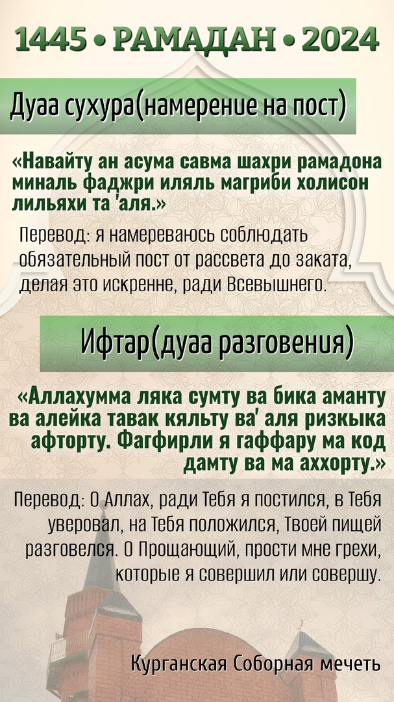

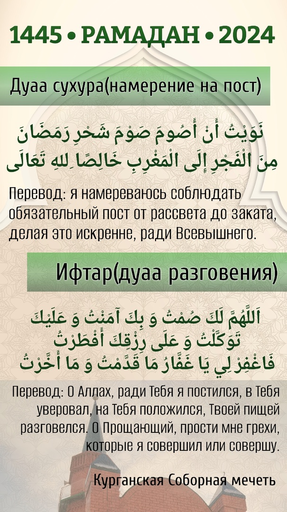

---
---
### Время намаза на МАРТ 2024 года для Кургана

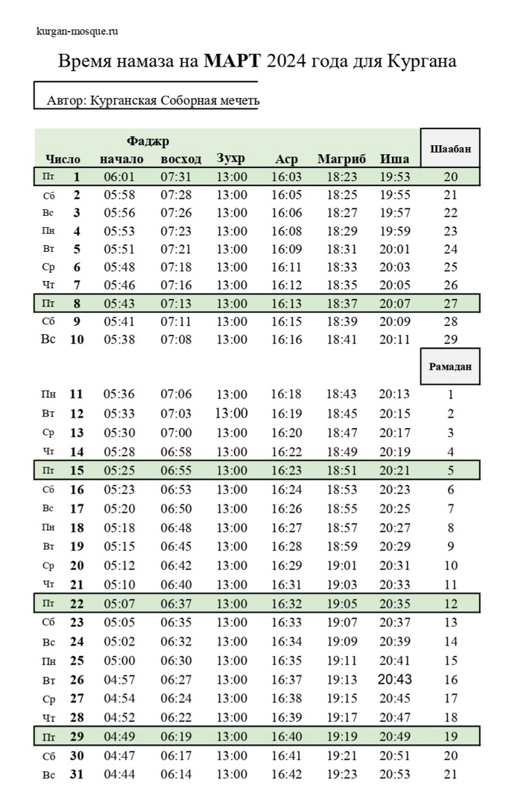

---

### Ша'абан

Ша’ба́н (араб. شعبان) — восьмой месяц лунного мусульманского календаря. Месяц Ша'абан следует за месяцем Раджаб и предшествует месяцу Рамадан. На середину месяца Ша'абан приходится особая ночь «Ляйлятуль-Бараат» - «Ночь очищения».
Ша'абан – месяц, в который раскрываются врата блага и ниспускается благодать.

سُئِلَ النَّبِيُّ صَلَّى اللهُ عَلَيْهِ وَسَلَّمَ: أَيُّ الصَّوْمِ أَفْضَلُ بَعْدَ رَمَضَانَ؟ فَقَالَ: شَعْبَانُ لِتَعْظِيمِ رَمَضَانَ.

Благословенного Пророкаﷺ спросили: «Какой пост лучше всего, после поста в Рамадан?» Он ответил: «Пост, соблюденный в Шаабан из почтения к Рамадану».(Сунан Тирмизи)

От Аиши (Да будет доволен ей Аллах) передаётся:

كَانَ رَسُولُ اللَّهِ - صلى الله عليه وسلم - يَصُومُ حَتَّى نَقُولَ لَا يُفْطِرُ، وَيُفْطِرُ حَتَّى نَقُولَ لَا يَصُومُ، وَمَا رَأَيْتُ رَسُولَ اللَّهِ - صلى الله عليه وسلم - اسْتَكْمَلَ صِيَامَ شَهْرٍ قَطُّ إِلَّا رَمَضَانَ، وَمَا رَأَيْتُهُ فِي شَهْرٍ أَكْثَرَ مِنْهُ صِيَامًا فِي شَعْبَانَ

«Иногда Посланник Аллахаﷺ постился так часто, что мы говорили: “Да ведь он не разговляется!”. А иногда он разговлялся так часто, что мы говорили: “Да ведь он не постится!”. Я никогда не видела, чтобы помимо Рамадана он постился в течение всего месяца, и я никогда не видела, чтобы он когда-нибудь постился больше, чем в Ша'абан». (Бухари, Муслим)

Однажды Асамат бин Зайд поинтересовался у Пророкаﷺо причине его усердия в пост месяца Шаабан, на что получил следующий ответ:

ذَلِكَ شَهْرٌ يَغْفُلُ النَّاسُ عَنْهُ بَيْنَ رَجَبٍ وَرَمَضَانَ، وَهُوَ شَهْرٌ تُرْفَعُ فِيهِ الأَعْمَالُ إِلَى رَبِّ العَالَمِينَ؛ فَأُحِبُّ أَنْ يُرْفَعَ عَمَلِي وَأَنَا صائِمٌ

«В этот месяц между месяцем Раджаб и Рамадан люди проявляют беспечность. В этот период все деяния возносятся к Аллаху. Я хочу, чтобы во время вознесения моих деяний я соблюдал пост». (Абу Давуд, Ан-Насаи, Ибн Маджа)

إِذَا كَانَتْ لَيْلَةُ النِّصْفِ مِنْ شَعْبَانَ فَقُومُوا لَيْلَهَا، وَصُومُوا نَهَارَهَا

«Когда настанет ночь середины месяца Ша'абан, то выстаивайте её, а в этот день поститесь». (Ибн Маджа)

О его достоинствах говорил и сам Пророкﷺ:«Превосходство месяца Раджаб перед другими месяцами такое же, как превосходство Корана перед речью людей. Превосходство месяца Шаабан перед другими месяцами такое же, как мое превосходство перед другими пророками. А превосходство Рамадана – такое же, как превосходство Аллаха перед Его творениями».

Просим Всевышнего Аллаха о Его Бесконечной Милости, чтобы Он даровал нам сил, и стойкость в месяце Ша'абан, и чтобы мы смогли в здравии встретить месяц Рамадан.

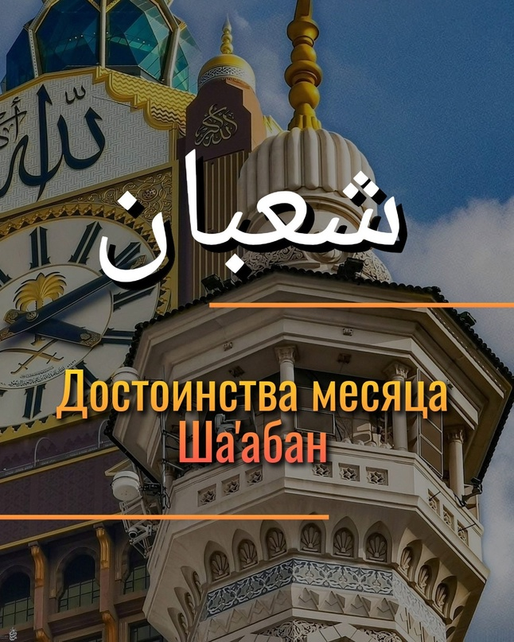

---

### В Кургане открылось кафе с едой халяль

Ассаляму алейкум ва рахматуллахи ва баракятух братья и сестры, Хвала Аллаху, 8 февраля состоялось открытие кафе халяль ***"Ширин"***
Кафе находится в самом центре, по адресу: ***город Курган, улица Советская, дом 115***. 

Пусть Аллах воздаст братьям благом 🤲🏽

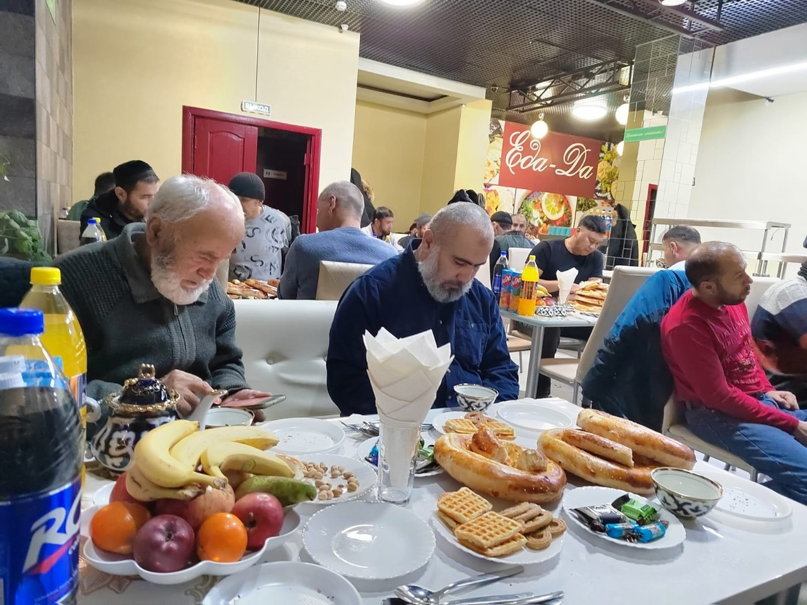

---

---

### Новости со строительства мечети в Куртамыше

بسم الله الرحمن الرحيم
السلام عليكم ورحمة الله وبركاته

Ассаляму алейкум ва рахматуллахи ва баракятух уважаемые братья и сестры.

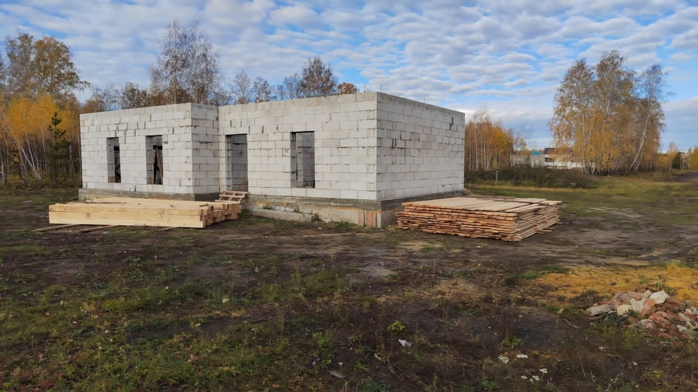

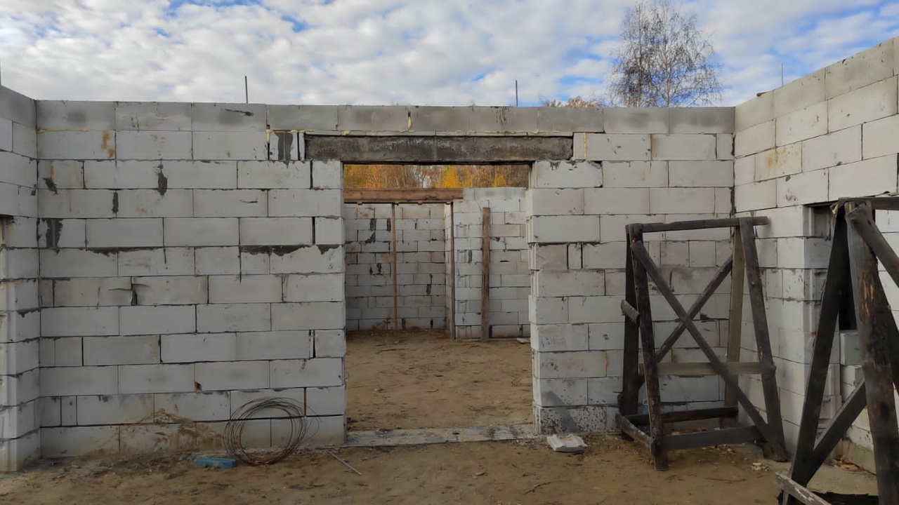

На данном этапе строительства выглядит мечеть в селе Куртамыш.
Хвала Аллаху, Господу миров, братья собрали деньги, мусульмане делали пожертвования, возвели стены, купили доски, брус.
ИншаАллах в этом году закроем крышу.

Молим Аллаха Субханаху Ва Тааля, чтобы помог нам, чтобы все неравнодушные люди принимали участие в строительстве мечети, и чтобы в следующем году завершили работу.

عثمان بن عفان رضي الله عنه سمعت رسول الله صلى الله عليه وسلم يقول:من بنى مسجدا يبتغي به وجه الله بنى الله له بيتا في الجنة.

Усман бин Аффан (да будет доволен им Аллах) сказал: Я слышал, как Посланник Аллахаﷺсказал: «Кто воздвигнет мечеть, желая увидеть Лик Аллаха, тому Аллах возведёт дворец в Раю».

---

### Новости с места строительства мечети в Каргаполье

Ассаляму алейкум ва рахматуллахи ва баракятух дорогие братья и сестры.

Альхамдулиллях шаг за шагом продолжаем работать над строительством мечети в Каргаполье.

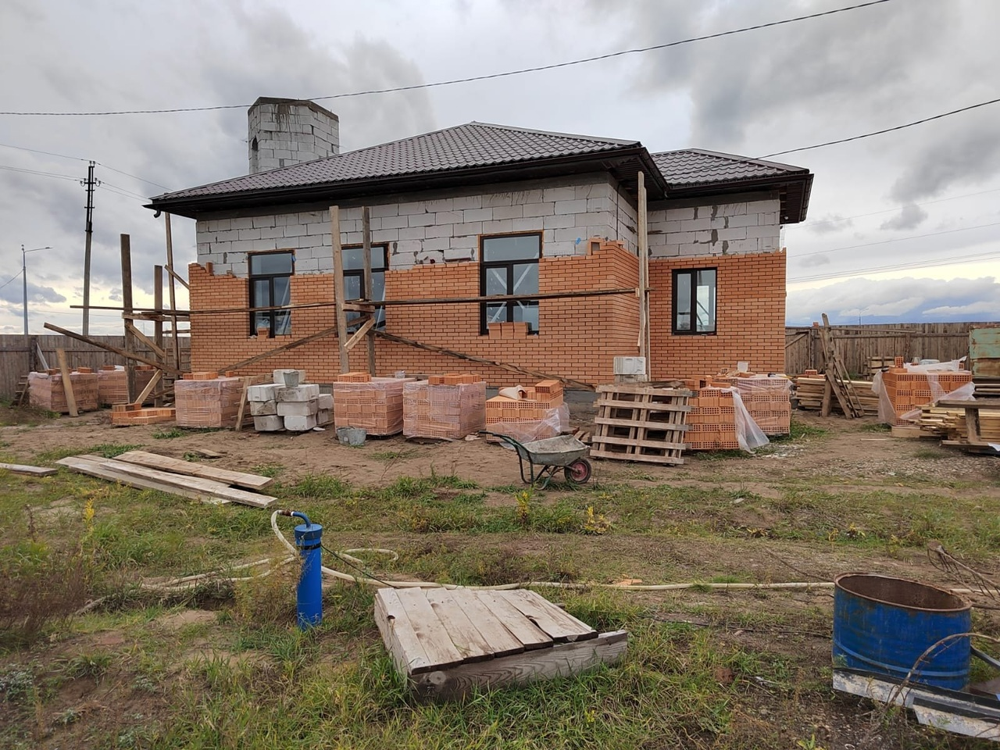

Да вознаградит Всевышний всех кто помогает в строительстве, финансово, своими силами, кто делает дуаа, пусть Аллах дарует Свою Милость вам и вашим семьям.

فَمَن يَعْمَلْ مِثْقَالَ ذَرَّةٍ خَيْرًا يَرَهُ ۥ

**"Тот, кто сделал добро весом в мельчайшую частицу, увидит его."** сура Аз-Зальзаля, 7 аят.
Пусть Аллах Субханаху Ва Тааля поможет нам, даст сил, терпения, чтобы в скорейшем времени завершить это благое дело.

---

**_Готовую еду и выпечку ХАЛЯЛЬ можно приобрести в пекарне «Ширин» по адресу: Курган, Дзержинского 54Б/1_**

---

---

**РЕКВИЗИТЫ ДЛЯ ДОБРОВОЛЬНЫХ ПОЖЕРТВОВАНИЙ:**

Курганская городская религиозная организация мусульман

ООО Банк «КУРГАН»

ИНН 4501055960

КПП 450101001

р/сч 40703810800000000428

БИК 043735830

к/сч 30101810700000000830

НАЗНАЧЕНИЕ: ДОБРОВОЛЬНОЕ ПОЖЕРТВОВАНИЕ

---

---
