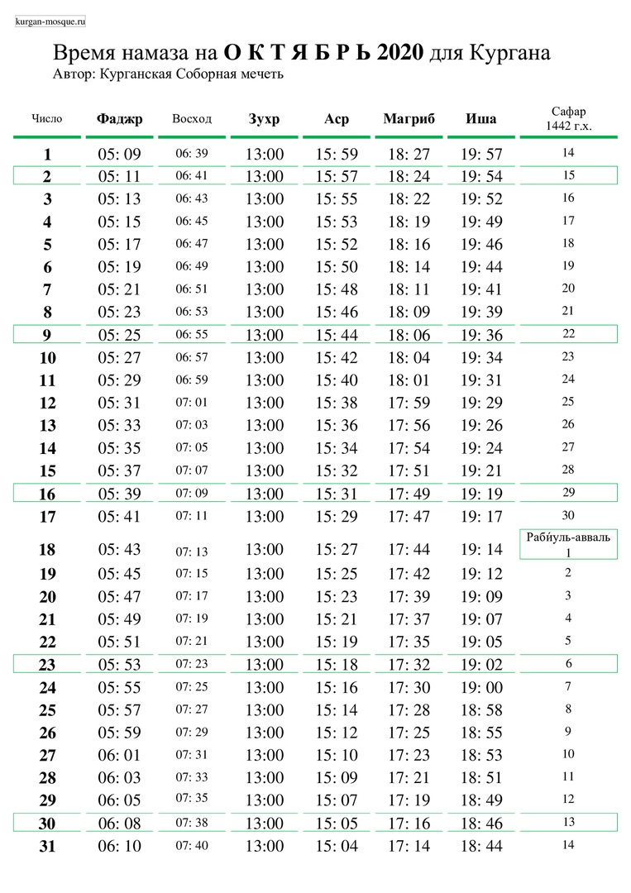
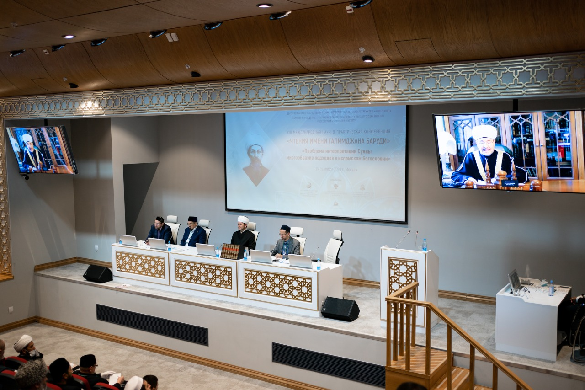
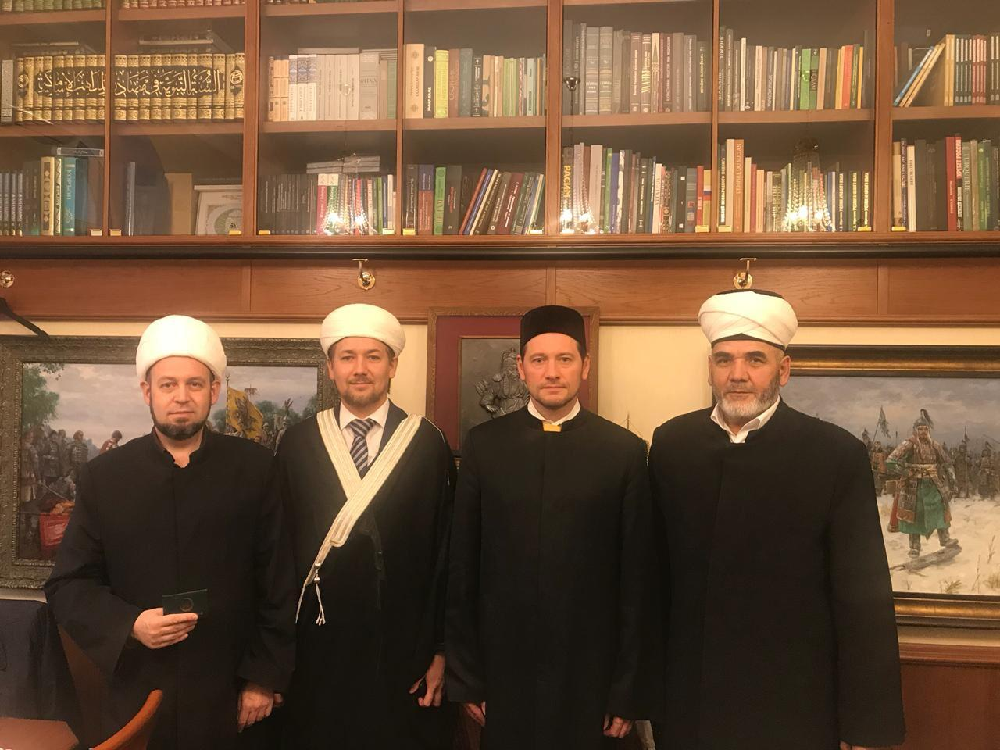
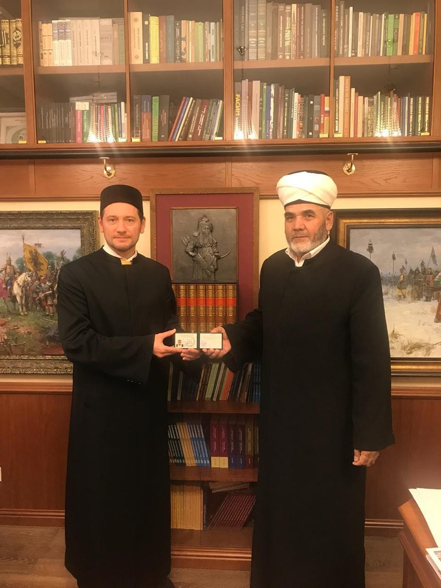
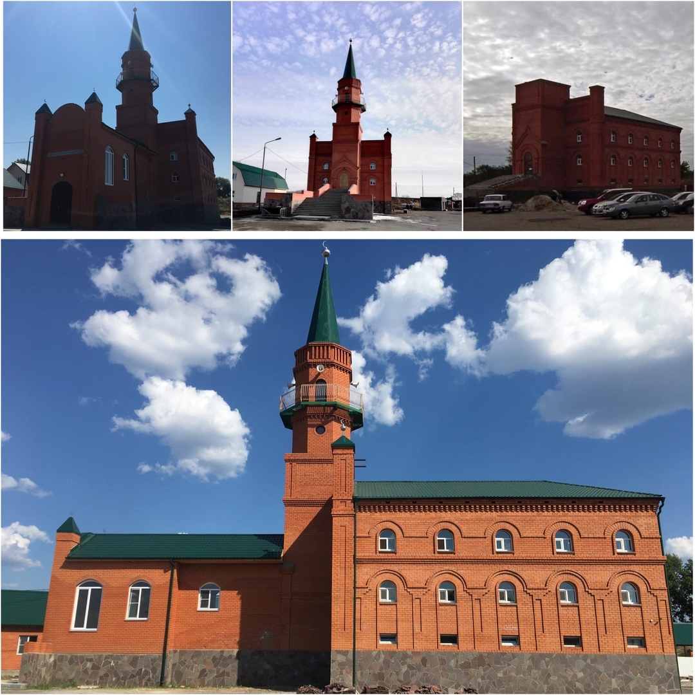

### Время намаза на октябрь 2020 года для Кургана

---

### В Москве завершились Курсы повышения квалификации по программе «Правовое обеспечение деятельности религиозных организаций»

28 сентября, в Москве завершились Курсы повышения квалификации по программе «Правовое обеспечение деятельности религиозных организаций». В курсах приняли участие имамы и сотрудники религиозных организаций, входящих в структуру Духовного управления мусульман РФ – всего около 50 слушателей из разных регионов РФ.

В рамках курсовых занятий с лекциями выступили авторитетные ученые, преподаватели-практики, представители органов государственной власти, религиозных организаций России, в том числе юрист и адвокат Инна Загребина, председатель РОСХВЕ Сергей Ряховский, профессор Леонид Сюкияйнен, мусульманский деятель, глава Европейского мусульманского форума Абдул-Вахед Ниязов, главный военный раввин России Аарон Гуревич, начальник управления мониторинга в сфере межнациональных и межконфессиональных отношений Абдулгамит Булатов и другие.

В субботу, 26 сентября, состоялась церемония вручения удостоверений об окончании курсов. Слушатели получили документ из рук одного из опытнейших мусульманских политиков России, депутата Государственной думы ФС РФ, заместителя руководителя фракции "Справедливая Россия" Гаджимурада Заирбековича Омарова.

Свою оценку деятельности Курсов повышения квалификации и мероприятиям, проходившим в столице под эгидой ДУМ РФ с 21 по 28 сентября, дали представители региональных духовных управлений.

Имам-мухтасиб Артур Мухутдинов, председатель Духовного управления мусульман Свердловской области (Уральский Мухтасибат):
«Первое и очень важное впечатление от курсов – высочайший уровень организации. Выступление шейха муфтия Равиля Гайнутдина – вызвало у всех настоящий духовный подъем. А курсы - это и «интеллектуальная подготовка», и выбор лекторов, спикеров, подбор актуальных тем для лекций. И техническая организация процесса. И, конечно, что также важно в период продолжающейся пандемии Ковид-19 соблюдение всех необходимых санитарно-эпидемиологических предписаний Федеральной службы по надзору в сфере защиты прав потребителей и благополучия человека. Вызывает уважение, что в этот непростой период команда нашего муфтия председателя ДУМ РФ шейха Равиля Гайнутдина приложила столько усилий, чтобы подготовить и организовать это мероприятие. Темы очень актуальные. Высококвалифицированные специалисты читали лекции. По актуальным темам ИД «Медина» была подготовлена и подобрана соответствующая литература. В рамках курсов проходили Чтения имени Галимджана Баруди, посвященные проблеме интерпретации сунны. Хадисам в наше время во всем мире уделяется огромное внимание. Участвовала и Болгарская исламская академия, и ведущие исламские ученые с мировым именем. Сами Курсы повышения квалификации – это и учебный процесс, и способ коммуникации нашей уммы. Мы получаем знания от ведущих специалистов, можем задать актуальные для нас вопросы и получить профессиональные квалифицированные ответы. И, в то же время, у нас – представителей различных регионов – происходит обмен опытом, общение единоверцев». Это и мотивация работать лучше, стремиться к достижению благих целей в духовном окормлении и просвещении нашей уммы».

Имам-мухтасиб Ильхам Бибарсов, председатель Духовного управления мусульман Пермского края (Пермский мухтасибат):
«Для нас эти Курсы повышения квалификации, можно сказать, являются «суперактуальными», особенно в части лекций по юридическим вопросам, касающимся деятельности мусульманских организаций. Особо хочу отметить юриста, адвоката Инну Загребину, лекция которой была посвящена правовому обеспечение деятельности религиозных организаций. Правовое обеспечение, ведение дел для нас, да и для всех мусульманских организаций это очень важно. У меня теперь, что называется «другое видение» многих вопросов и проблем. К сожалению, далеко не все имамы, обладающие немалыми духовными исламскими знаниями, в той же степени обладают познаниями юридическими, знанием правовых норм. Это, иногда, приводит к «неприятным» последствиям. Юридическую «неподготовленность» религиозных деятелей иногда пытаются использовать против них и против религиозных организаций. Вывод прост – имамам необходима юридическая грамотность, умение работать с документами, с договорами, знание своих прав и обязанностей. В том числе 51 статьи Конституции Российской Федерации, где закреплено, что никто не обязан свидетельствовать против себя. У нас работают люди искренние, но незнание или недостаточное знание законодательства недопустимо. Инна Загребина привела много примеров из своей юридической практики. Все очень доступно, понятно. Теперь многие вопросы уже видятся по-другому. Теперь есть понимание, понимание в правовом смысле. И, конечно, слова напутствия от нашего муфтия шейха Равиля Гайнутдина, от первого заместителя ДУМ РФ Дамира Мухетдинова останутся в нашем сердце».

Председатель ЦРО Духовное управление мусульман Тюменской области Зиннат Садыков:
«Для меня все события, происходившие в Москве с 21 по 28 сентября, имеют огромное значение. Пленум, Курсы повышения квалификации, расширенное заседание Совета улемов ДУМ РФ, чтения имени Галимджана Баруди - это важнейшие события для исламского мира не только в России, но и во всем мире. Важно наше единение, ощущение единства уммы, слова нашего муфтия Равиля Гайнутдина. Я думаю, что все эти мероприятия получат большой резонанс в нашем обществе, в СМИ. Ведь они демонстрируют настоящий истинный ислам – миролюбивый и человеколюбивый, ниспосланный Всевышним во благо людям и из любви к человечеству. Для того, чтобы люди любили и уважали друг друга. Еще раз хочу подчеркнуть. Очень важно единение. Мы чувствуем себя в «одной команде», ощущаем заботу руководства ДУМ РФ о каждой общине, каждом мухтасибате и духовном управлении. Здесь собралась вся Россия. Это и есть мусульманская умма, которая движется вперед, развивается. Здесь собрались те, кто не хочет «остаться на обочине».

Имам-мухтасиб Джамал Гарифуллин, председатель Духовного управления мусульман Приморского края (Приморский мухтасибат):
«Как имам-мухтасиб я впервые присутствую на подобных мероприятиях. Это очень масштабная и насыщенная программа. То, что в одну неделю уместилось такое количество важных и полезных мероприятий, говорит об очень слаженной и профессиональной работе Духовного управления мусульман РФ. Для меня как для руководителя «нового» мухтасибата еще очень важно общение с представителями других регионов, общение, обмен опытом. Встречи с нашими аксакалами, которые уже давно работают на этой стезе, имеют немалые достижения. Речь, конечно, идет не только о достижениях, которые мы имеем, но и о проблемах. Мы о них не только говорили. Нам показали пути для их разрешения – духовные, юридические, социальные. Открыли новые направления, новые горизонты, поставили новые задачи. Семь дней, проведенные в Москве, были очень полезными. Они показали слаженную работу Духовного управления мусульман, его единство, способность реализовывать поставленные задачи, способность вникнуть в проблему каждой религиозной организации, находящейся в его составе. Хочу выразить благодарность и глубокую признательность нашему духовному лидеру муфтию шейху Равилю Гайнутдину и всему руководству ДУМ РФ».

Имам-мухтасиб Юсип Абдулаев, председатель Духовного управления мусульман Воронежской области (Воронежский мухтасибат):
«В этом году Курсы повышения квалификации проходили в главной мечети нашей страны – Московской Соборной мечети. Уже одно это дает необыкновенный духовный заряд. Я очень благодарен нашему муфтию шейху – духовному Равилю Гайнутдину. Его слова о консолидации, об укреплении позиций Духовного управления мусульман, я думаю, запомнили все участники. И это не только слова – это реальная поддержка, которую мы все ощущаем. Курсы повышения квалификации – это тоже проявление этой заботы. Хочу выразить благодарность первому заместителю председателя ДУМ РФ Дамиру Мухетдинову за отличную организацию. Для меня очень актуальными были лекции одного из крупнейших российских специалистов по исламскому праву профессора Леонида Сюкияйнена по теме «Шариат и современное российское право» и адвоката Инны Загребиной - «Правовое обеспечение деятельности религиозных организаций». Вопросы государственно-конфессиональных отношений и юридические вопросы сегодня для нас особенно актуальны. Мы должны грамотно выстраивать взаимодействие с властями, работать в юридическом поле на профессиональном уровне. Для этого должны быть в мусульманских структурах соответствующие специалисты. А курсы дают нам нужное направление, нужный вектор движения и развития. Мотивируют. Конечно, было много встреч с представителями других регионов, обмен опытом. Мне очень приятно было, что мои труды получили высокую оценку. Меня наградили медалью «За духовное единение», которую я получил из рук нашего муфтия Равиля Гайнутдина. И вот, что очень важно - мы часть одной единой уммы, часть Духовного управления мусульман Российской Федерации. Сильно заблуждаются те, кто этого не понимает и стремится внести раскол в наше единство. Мы сильны своим единством. К этому призывал нас Пророк (мир ему)».

Пресс-служба ДУМ РФ
http://dumrf.ru/common/event/17738

---

### 20 лет Курганской Соборной мечети

**15 июля 2020 года** - знаменательное событие для мусульман Курганской области. В этот день, ровно 20 лет назад, была совершена закладка первого камня в основание
Соборной мечети г. Кургана.

Местная религиозная организация Курганской области, во главе с её уважаемым председателем Зиёдали Мизробовым, продолжает лучшие традиции мусульман, и помнит о своих
славных предшественниках, своими трудами укреплявших Ислам. За эти 20 лет мусульмане вместе, одной семьёй, преодолели немало трудностей административного, финансового,
организационного плана, и теперь уже уверенно можно сказать, что работа по сооружению главного по значимости областного религиозного центра мусульман – Курганской
Соборной мечети – почти полностью завершен.

За эти годы, из одного камня вырос целый комплекс сооружений. Общими силами мусульман Кургана и Курганской области, представителей различных национальностей, объединенных
единой верой во Всевышнего, практически закончено строительство Соборной мечети и религиозного комплекса при ней. На завершающей стадии строительства находится просторный
зал для проведения маджлисов. Уже сейчас прихожанам доступны: библиотека, помещения для приёма граждан, учебный класс, открытая площадка для проведения мероприятий. Вскоре
по милости Всевышнего Курганская Соборная мечеть станет духовным центром для всех мусульман области и для гостей региона.

Просим Аллаха преумножить добрые дела и увеличить награду всем, кто принимал и принимает участие в становлении мечети и жертвует на благо религиозного центра.

**_Пресс-служба Курганской Соборной мечети_**

---
