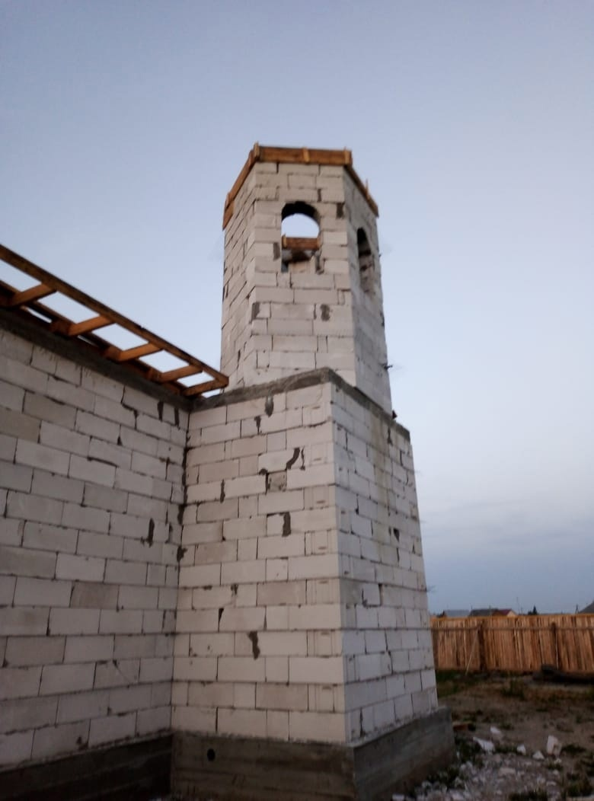
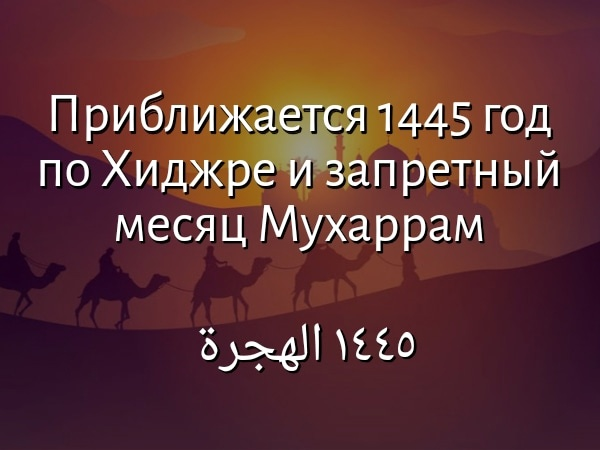
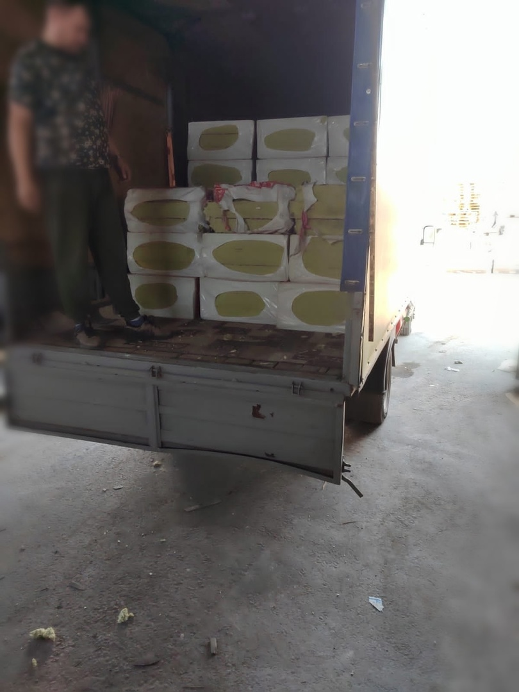
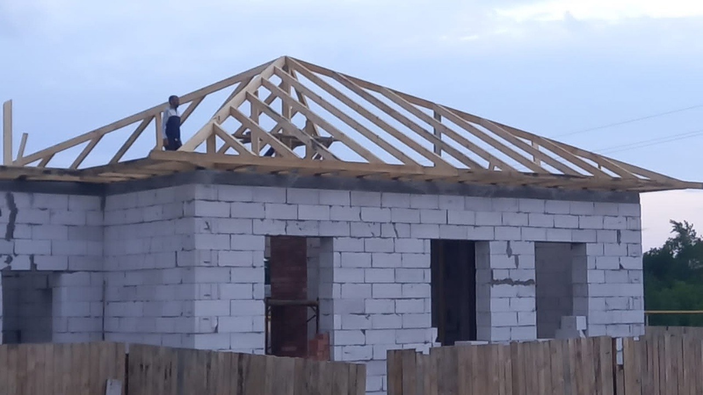
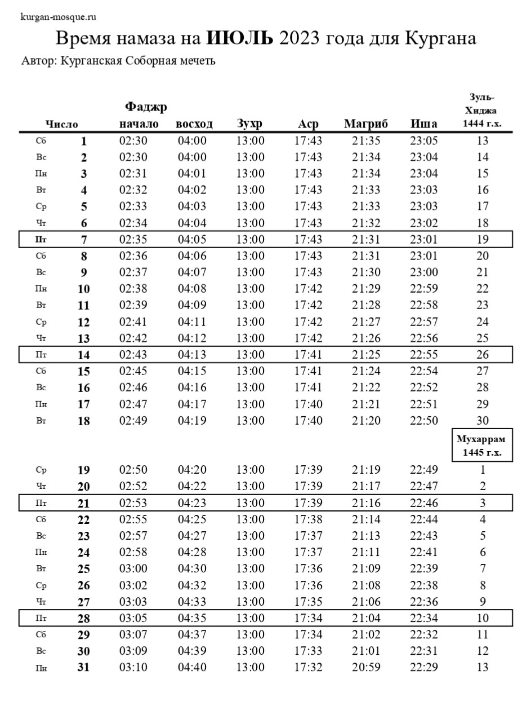
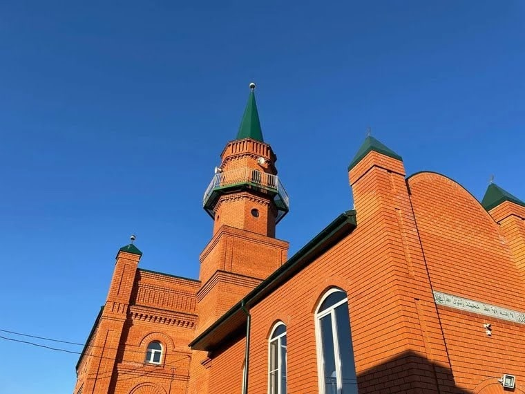
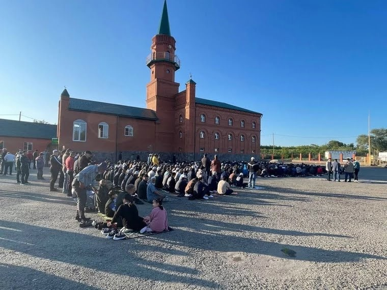
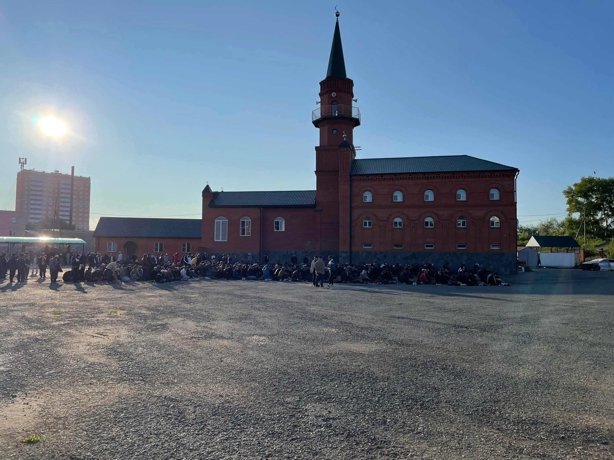

### Хронология строительства мечети в Каргаполье

بسم الله الرحمن الرحيم

Ассаляму алейкум ва рахматуллахи ва баракятух дорогие братья и сестры.

Альхамдулиллях, по воле Всевышнего продолжаем строить мечеть в Каргаполье, за прошедшие выходные возвели минарет.

Сегодня, 12.07.2023, наши братья в Каргаполье продолжают воздвигать Дом Аллаха, поднимают на крышу утеплители, пароизоляцию.

قال الله وتعالى : فَاسْتَبِقُواْ الْخَيْرَاتِ

"Стремитесь же опередить друг друга в благих делах". сура Бакара, 148

Пусть Аллах, Субханаху Ва Тааля, вознаградит всех, кто принимает участие в этом благом деле.

---

### Месяц Мухаррам

18 июля 2023 года с заходом солнца наступит 1 число месяца Мухаррама, и вместе с ним и новый 1445 год по Хиджре.
Хи́джра (араб. هجرة — «переселение»), Хиджра Пророка Мухаммадаﷺ – начало мусульманской эры, 1-ое Мухаррама 622 года – начало мусульманского летоисчисления, переселение мусульманской общины под руководством Пророка Мухаммадаﷺ из Мекки в Ясриб, названный позже "городом Пророка" (Медина). Год хиджры стал первым годом исламского лунного календаря.

В основе мусульманского календаря лежит лунный год, состоящий из 12 месяцев.

В мусульманском календаре использованы названия месяцев из древнего солнечно-лунного арабского календаря.

قال الله وتعالى
إِنَّ عِدَّةَ ٱلشُّهُورِ عِندَ ٱللَّهِ ٱثْنَا عَشَرَ شَهْرًا فِى كِتَٰبِ ٱللَّهِ يَوْمَ خَلَقَ ٱلسَّمَٰوَٰتِ وَٱلْأَرْضَ مِنْهَآ أَرْبَعَةٌ حُرُمٌ ۚ ذَٰلِكَ ٱلدِّينُ ٱلْقَيِّمُ

"Воистину, число месяцев у Аллаха - двенадцать. Так было записано в Писании в тот день, когда Аллах сотворил небеса и землю. Четыре месяца из них - запретные. Такова правая религия, и посему не поступайте в них несправедливо по отношению к себе." Сура Ат-Тауба, 36 аят.

1. Мухаррам (араб. محـرّم) — запретный, священный. Первый месяц исламского календаря. Один из 4 запретных месяцев в исламе. В этот месяц года не разрешалось вести военные действия и нападения. На 10 день месяца Мухаррама выпадает важное событие, День Ашура.

2. Сафар (صفـر) — «жёлтый». По одной из версий, это название осеннего месяца, когда растения желтеют и увядают. Этимология названия месяца сафар возвращается к глаголу «быть пустым». Так этот месяц был прозван потому, что в это время дома арабов были пустыми, так как они выходили в завоевательные походы.

3. Раби' уль-Авваль (ربـيع الأول) — третий месяц лунного календаря. Хотя в современном арабском «раби» означает весну, в древности так называлась осень. В этом месяце родился Посланник Аллаха ﷺ, и в этом же месяце вернулся к своему Господу.

4. Раби' уль-Ахир (ربـيع الآخر) —
Этимология этого слова возвращается к той же, что и месяца Раби'-уль-Авваль.

5. Джумад аль-Авааль(جمادى الأولى) — пятый месяц лунного календаря. Слово «джумада» происходит в арабском языке от того же корня, что и глагол «застывать, замерзать». Это был зимний месяц.  В этом месяце произошло сражение при Муте(629г.)

6. Джумад аль-Ахир(جُمادى الآخرة) – второй холодный месяц.

7. Раджаб (رجب) — седьмой месяц лунного календаря. Раджаб — месяц воздержания от походов и военных действий.
Один из запретных месяцев, в котором арабы не выходили на военные походы и готовились к следующим месяцам.

8. Ша'бан (شعـبان) — от глагола «разделяться». В этот месяц племена отправлялись в походы.

9. Рамада́н (رَمَضان) – быть раскаленным (о жарком солнце). Пожалуй, самый известный исламский месяц как для мусульман, так и для немусульман. Месяц поста, месяц милости Аллаха и прощения грехов, месяц, в котором был ниспослал священный Коран.

10. Шавва́ль (شَوّال) – первый день месяца шавваль является одним из двух исламских праздников – Ид Аль-Фитр, который ознаменовывает собой окончание поста.

11. Зуль-Ка'да (ذو القعدة) - от глагола «сидеть, находиться на месте». Месяц прозван так, потому что арабы не выходили а военные походы. Месяц также считается запретным.

12. Зуль-Хиджа (ذو الحِجّة) – совершать паломничество – аль хаджж (хадж).
Это месяц паломничества в Мекку. В 10 день месяца Зуль-Хиджа мусульманами празднуется Ид Аль-Адха. Зуль-Хиджа также является одним из запретных месяцев.

Календарь хиджры по-прежнему остается важным для мусульман всего мира. Кроме того, что некоторые мусульманские страны официально живут по календарю хиджры, мусульманские памятные даты, и религиозные праздники также привязаны к этому календарю.

Несколько важных фактов о календаре хиджры:

Календарь хиджры ввел Умар бин аль-Хаттаб (да будет доволен им Аллах).
Выдающийся сподвижник Посланника Аллахаﷺ, ввел календарь хиджры и предпочел его всем известным на тот момент календарям и системам отсчета дат. Это было сделано с целью облегчения отсчета времени в разросшемся мусульманском государстве. Жители государства знали о месяце, но не знал о том, какой год сейчас идет.

В качестве точки отсчета была выбрана Хиджра. Было решено выбрать точкой отсчета Хиджру – переселение Посланника Аллахаﷺ в Медину. Основная причина, по которой именно переселение Пророкаﷺ было выбрано точкой отсчета, - то, что Хиджра стала знаковым событием в становлении исламской Уммы.

В мусульманском календаре 4 месяца считаются «запретными»: Мухаррам, Раджаб, Зуль-Ка'да и Зуль-Хиджа. Запретными они считается из-за арабской доисламской традиции запрета в эти месяцы убийств, войн и даже охоты на животных в районе Каабы. А в Исламе их статус был закреплен тем, что ответственность за совершение грехов в эти месяцы возрастает многократно.

---

### Новости с места строительства мечети в Каргаполье

Ассаляму алейкум ва рахматуллахи ва баракятух братья и сестры.

Альхамдулиллях, на пожертвования мусульман, собранные 28 июня, закупили утеплители и 9 штук батарей для отопления мечети Каргаполье.

Также, Хвала Аллаху, 1 июля на пожертвования мусульман были приобретены еще 142 кв.м утеплителя, пароизоляция и гидроизоляция для мечети, установлены стропила.

Проделанно много работы, Альхамдулиллях, но ещё есть над чем работать. Идет подготовка к возведению минарета, что планируется 5 июля, ИншаАллах. Пусть Всевышний поможет нам во всех благих делах.

يَٰٓأَيُّهَا ٱلَّذِينَ آمَنُوٓا۟ أَنفِقُوا۟ مِن طَيِّبَٰتِ مَا كَسَبْتُمْ وَمِمَّآ أَخْرَجْنَا لَكُم مِّنَ ٱلْأَرْضِ ۖ وَلَا تَيَمَّمُوا۟ ٱلْخَبِيثَ مِنْهُ تُنفِقُونَ وَلَسْتُم بِـَٔاخِذِيهِ إِلَّآ أَن تُغْمِضُوا۟ فِيهِ ۚ وَٱعْلَمُوٓا۟ أَنَّ ٱللَّهَ غَنِىٌّ حَمِيدٌ

***"О те, которые уверовали! Делайте пожертвования из приобретенных вами благ и того, что Мы взрастили для вас на земле, и не стремитесь раздать в качестве пожертвования дурное, чего бы вы сами не взяли, пока не зажмурили глаза. И знайте, что Аллах - Богатый, Достохвальный."***
Сура Бакара, 267 аят.

---

### Время намаза на ИЮЛЬ 2023 года для Кургана

---

Сегодня, 28 июня 2023 года в Курганской Соборной мечети состоялась праздничная молитва и проповедь в честь великого мусульманского праздника - Ид Аль-Адха (Курбан Байрам).

Зиёдали Хаджи Мизробов выступил с проповедью об истории пророка Ибрахима и его сына Исмаила, о преданности человека Аллаху и о Милосердии Аллаха к Его праведным рабам.

После проповеди верующие совершили праздничный намаз и праздничные такбиры.

Фото: корреспондент URA.RU Тимур Нуцулханов

---

### Поздравление председателя КГРОМ Зиёдали Хаджи Мизробова с праздником Ид Аль Адха - Курбан Байрам.

بسم الله الرحمن الرحيم
السلام عليكم ورحمة الله وبركاته

Приветствие и благословение Аллаха Пророку Мухаммадуﷺ его семье, сподвижникам и всем тем, кто следует его призыву до Судного дня.

***Уважаемые братья и сестры!***

Примите мои искренние поздравления с одним из самых светлых мусульманских праздников Ид Аль-Адха (Курбан байрам).
Ид аль Адха, один из главных праздников мусульман, напоминающий о преданности человека Всевышнему и о милосердии Аллаха (Субханаху Ва Тааля).

История пророка Ибрахима и Исмаила напоминает нам всем, что Аллах знает обо всех наших истинных намерениях, и когда мы послушны и искренни в своих верованиях, Он вознаграждает нас.

وَنَٰدَيْنَٰهُ أَن يَٰٓإِبْرَٰهِيمُ
قَدْ صَدَّقْتَ ٱلرُّءْيَآ ۚ إِنَّا كَذَٰلِكَ نَجْزِى ٱلْمُحْسِنِينَ

**"Мы воззвали к нему: «О Ибрахим! Ты оправдал сновидение». Воистину, так Мы воздаем творящим добро."** Сура Ас-Саффат, 104-105.

Праздник также венчает собой окончание хаджа, ежегодного паломничества в Мекку.
Он ниспослан нам Всевышним как напоминание о том, что мусульмане должны проявлять милосердие и заботиться друг о друге.
Этот благословенный праздник сплачивает людей в желании творить добро, побуждает нас не оставаться равнодушными, укрепляет веру.

قال الله وتعالى
جَعَلَ ٱللَّهُ ٱلْكَعْبَةَ ٱلْبَيْتَ ٱلْحَرَامَ قِيَٰمًا لِّلنَّاسِ وَٱلشَّهْرَ ٱلْحَرَامَ وَٱلْهَدْىَ وَٱلْقَلَٰٓئِدَ ۚ ذَٰلِكَ لِتَعْلَمُوٓا۟ أَنَّ ٱللَّهَ يَعْلَمُ مَا فِى ٱلسَّمَٰوَٰتِ وَمَا فِى ٱلْأَرْضِ وَأَنَّ ٱللَّهَ بِكُلِّ شَىْءٍ عَلِيمٌ

**"Аллах сделал Каабу, Заповедный дом, а также запретный месяц, жертвенных животных и животных (или людей) с ожерельями опорой для людей. Это - для того, чтобы вы знали, что Аллаху известно о том, что на небесах, и том, что на земле, и что Аллах ведает о всякой вещи."** Сура Маида, 97.

قُلْ إِنَّ صَلَاتِى وَنُسُكِى وَمَحْيَاىَ وَمَمَاتِى لِلَّهِ رَبِّ ٱلْعَٰلَمِينَ
لَا شَرِيكَ لَهُ ۥ ۖ وَبِذَٰلِكَ أُمِرْتُ وَأَنَا۠ أَوَّلُ ٱلْمُسْلِمِينَ

**"Скажи: «Воистину, мой намаз и мое жертвоприношение (или поклонение), моя жизнь и моя смерть посвящены Аллаху, Господу миров. Нет у Него сотоварищей. Это мне велено, и я - первый из мусульман.»"** Сура Ан'ам, 162-163.

С великой радостью в сердце я поздравляю вас с этим благославенным праздником, праздником благодати, очищения, покорности Господу и восхваления Его!
Пусть Всевышний Аллах, по милости Своей, примет все ваши благие деяния, очистит от грехов и многократно вознаградит за ваши дела, добрые слова, чистые намерения и помыслы. Призываю всех мусульман быть отзывчивее друг к другу, простить обиды, если они есть, отказаться от запретных дел и поступков.

Пусть Всевышний Аллах примет все наши молитвы и жертвоприношения и одарит всех нас Своей великой щедростью и довольством, принесет радость, согласие, мир и благополучие в каждый дом!
Прошу Создателя небес и земли услышать наши искренние молитвы, очистить наши намерения и щедро одарить всех нас здоровьем, счастьем, благополучием и мирным небом над головой.

Да благословит нас Всевышний на совершение добрых дел!

Да пребудет с нами милость Всемогущего Аллаха!

السلام عليكم ورحمة الله وبركاته

***С уважением и добрыми молитвами, Председатель Курганской городской религиозной организации мусульман Зиёдали Хаджи Мизробов.***

---

---
## Новости с места строительства мечети в Каргаполье

АльхамдулилЛях, спустя всего неделю с закладки первого камня для мечети в Каргаполье, 11.06.2023 кладка завершена. Выложены дверной и оконные проемы, остаётся смонтировать армопояс.

В хадисах говорится:

"Передают со слов Аиши, да будет доволен ею Аллах, что Посланник Аллаха ﷺ велел возводить мечети в каждом квартале, хранить их в чистоте и умащать благовониями."

عن ابن عباس رضي الله عنهما قال: الْمَسَاجِدُ بُيُوْتُ ﷲِ فِى الاَرْضيِ ءلِاَهْلِ السَّمَا ءِ كَمَا تُضِىْءُ نُجُوْمُ السَّمَا ءلِاَهْلِ الاَرْضيِ.

Ибн Аббас, да будет доволен им Аллах сказал: "Мечети - это дома Аллаха на земле. Они светятся для обитателей небес, как светятся звезды на небе для обитателей земли."

Хотим поблагодарить всех, кто принимает участие в создании дома Всевышнего.

Да воздаст Всевышний Аллах благом всем неравнодушным в обоих мирах.
Пусть Всевышний даст нам сил и терпения в возведении мечети.

---

بسم الله الرحمن الرحيم

Во имя Аллаха Милостивого, Милосердного.

Радостная новость для мусульман.

Альхамдулиллях, Хвала Аллаху, Господу миров.

### 4 июня 2023 года в Каргаполье состоялась торжественная закладка первого камня мечети.

На мероприятии присутствовали представители мусульманских диаспор, и другие неравнодушные люди.

Председатель КГРОМ Зиёдали Мизробов напутствовал мероприятие молитвами и добрыми словами.
В хадисе говорится "Кто построит мечеть ради Аллаха, тому Аллах построит такой же дом в Раю"

وقال تعلى
وَأَنفِقُوا۟ فِى سَبِيلِ ٱللَّهِ وَلَا تُلْقُوا۟ بِأَيْدِيكُمْ إِلَى ٱلتَّهْلُكَةِ ۛ وَأَحْسِنُوٓا۟ ۛ إِنَّ ٱللَّهَ يُحِبُّ ٱلْمُحْسِنِينَ

*"Делайте пожертвования на пути Аллаха и не обрекайте себя на гибель. И творите добро, ведь Аллах любит творящих добро."* Сура Бакара, 195 аят.

Выражаем благодарность всем братьям и сестрам, которые принимают участие в строительстве мечети, пусть Аллах вознаградит всех за благие деяния, в этой жизни и в вечной.
Мы воздаем Дуаа Всевышнему за каждый шаг, за то что есть возможность строить мечети, пусть Аллах поможет нам на Его пути.
---

---

### Обратите внимание!

Уважаемые братья и сестры, в работе Курганской соборной мечети произоли некоторые изменения:

- **_всвязи с переходом Расулова А. С. в другой регион, назначен исполняющий обязанности имама мечети;_**

- **_график работы мечети: ежедневно с 9-00 до 18-00_**

---

**_Продукцию ХАЛЯЛЬ: мясо, готовые блюда, овощи и фрукты для нашего стола, орехи и сухофрукты можно приобрести у наших братьев, на остановочном пункте "Некрасовский рынок"_**.

**_Готовую еду и выпечку ХАЛЯЛЬ можно приобрести в пекарне «Ширин» по адресу: Курган, Дзержинского 54Б/1_**

---

---

**РЕКВИЗИТЫ ДЛЯ ДОБРОВОЛЬНЫХ ПОЖЕРТВОВАНИЙ:**

Курганская городская религиозная организация мусульман

ООО Банк «КУРГАН»

ИНН 4501055960

КПП 450101001

р/сч 40703810800000000428

БИК 043735830

к/сч 30101810700000000830

НАЗНАЧЕНИЕ: ДОБРОВОЛЬНОЕ ПОЖЕРТВОВАНИЕ

---

---
