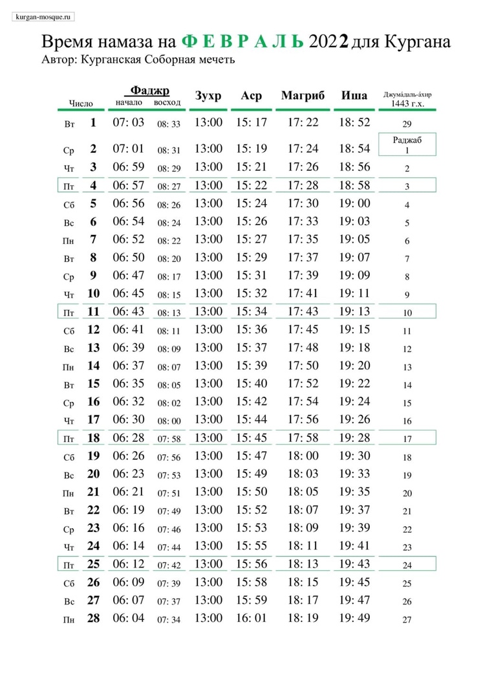
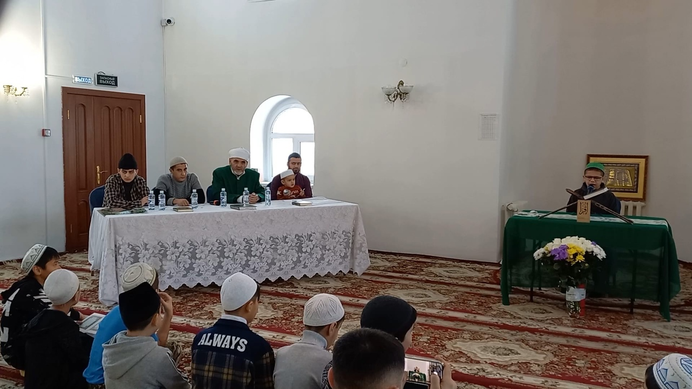
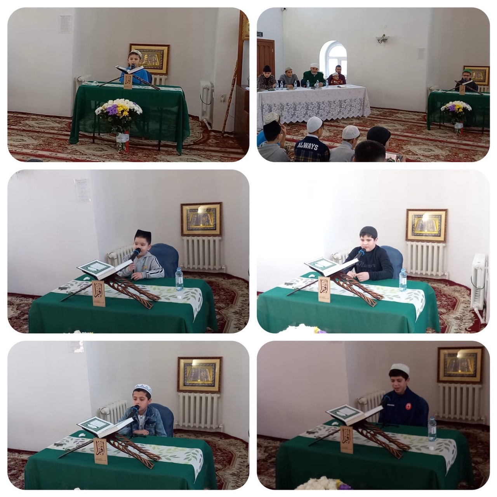
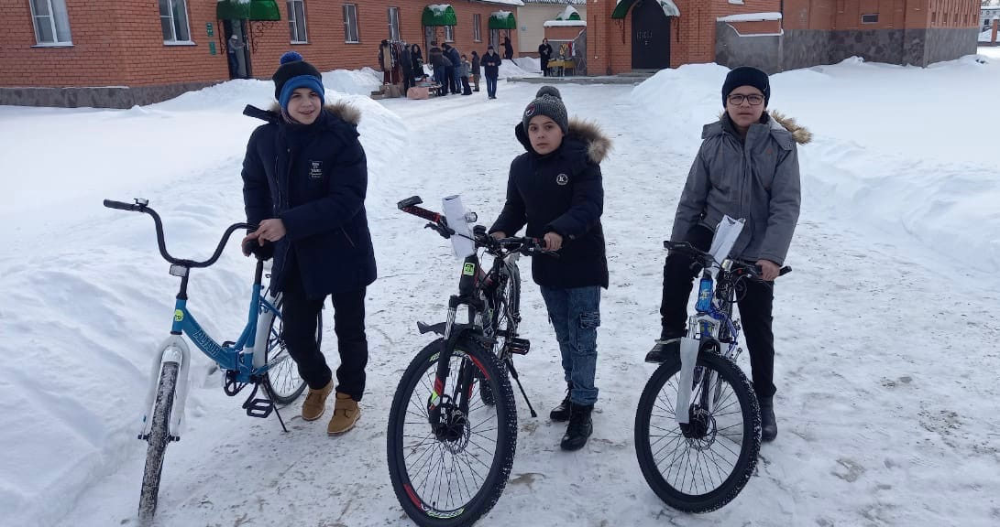
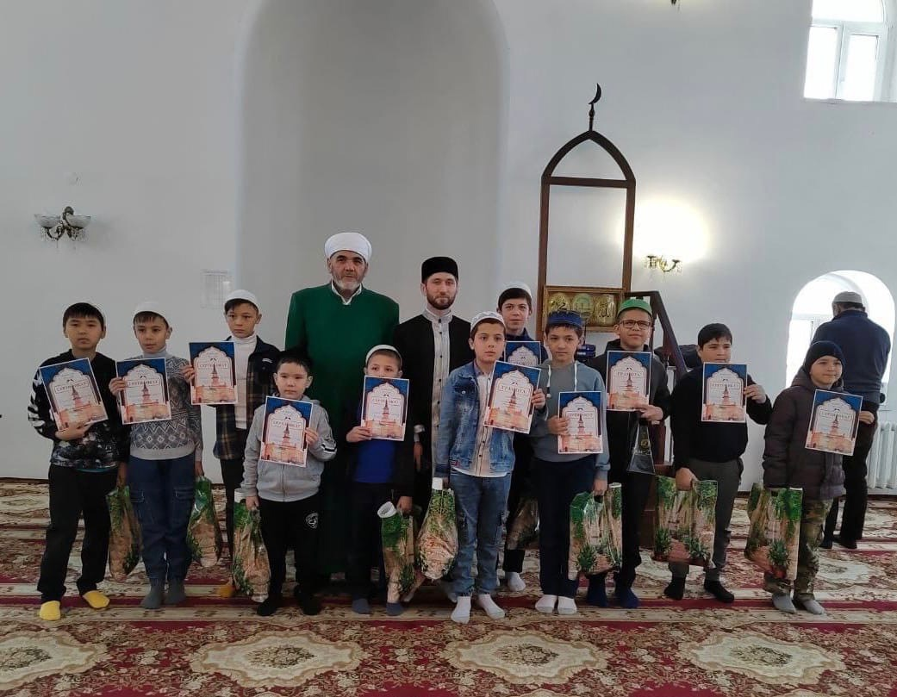

### Время намаза на февраль 2022 года для Кургана

---

### Дорогие братья и сестры!

Рады Вам сообщить, что 31 декабря 2021 года, в Курганской Соборной мечети, состоялся I Конкурс чтецов священного Корана, приуроченный к грядущему празднованию 1100-летия
принятия ислама народами Волжской Булгарии.

В конкурсной программе приняли участие дети в возрасте от 7 до 14 лет.

В номинации знание последних 10 сур Корана, среди мальчиков первое место занял – Рамазан Норматов, второе – Исмоил Парпиев, третье – Руслан Норматов.
Среди девочек первое место заняла – Ойша Боймуллоева, второе место – Алия Курбонова.
Победители получили велосипеды, так же все участники конкурса получили набор подарков.

В состав жюри вошли хафизы Корана, знающие всю священную Книгу наизусть Обиджон Жаббаров, Нурмухаммад Иброгимов и Абдулхамид Абдулаев, а также председатель мусульманской организации Курганской области Зиёдали хаджи Мизробов.

Своим чтением украсила праздник Омина Боймуллоева прочитавшая суры Фатиха, Мульк и Кахф, за что, ей был присужден Приз зрительских симпатий.

Администрация Курганской Соборной мечети благодарит всех, кто принимал участие в организации и проведении I Конкурса чтецов Корана в Кургане.

Видео I Конкурса по чтению Корана в Кургане будет опубликовано на странице мечети в ВКонтакте vk.com/kurgan_mosque

Пресс-служба Курганской Соборной мечети

---

**РЕКВИЗИТЫ ДЛЯ ДОБРОВОЛЬНЫХ ПОЖЕРТВОВАНИЙ:**

Курганская городская религиозная организация мусульман
ООО Банк «КУРГАН»
ИНН 4501055960

КПП 450101001

р/сч 40703810800000000428

БИК 043735830

к/сч 30101810700000000830

НАЗНАЧЕНИЕ: ДОБРОВОЛЬНОЕ ПОЖЕРТВОВАНИЕ

---

---

