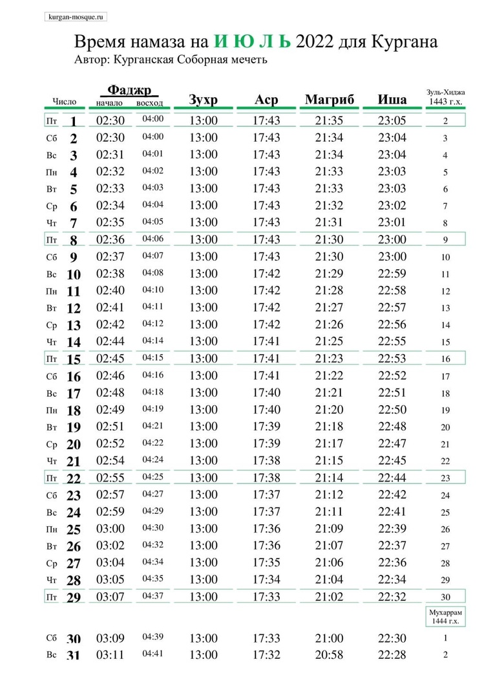
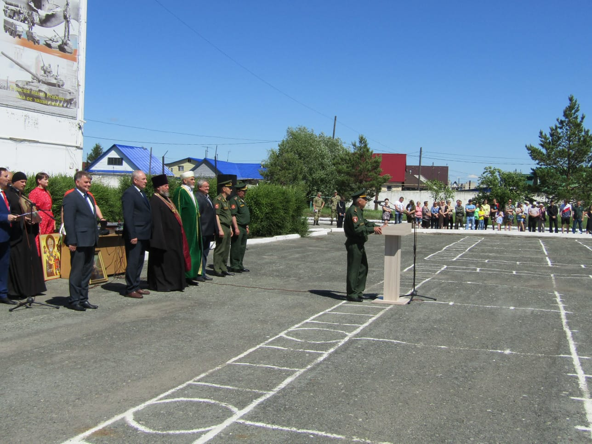
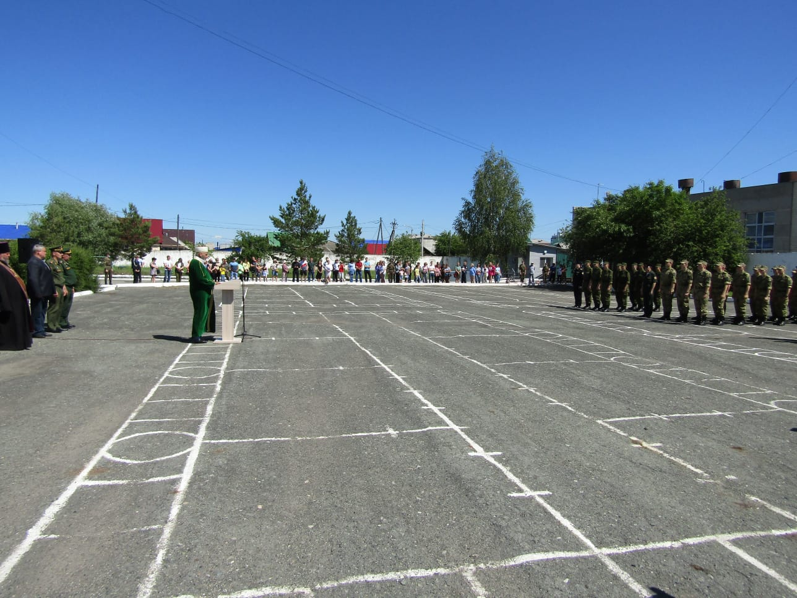
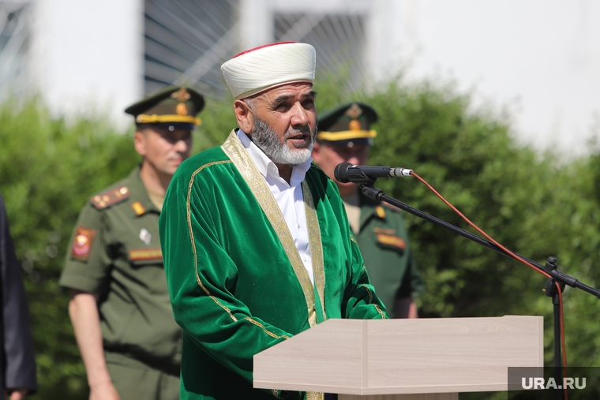

### Поздравление губернатора Курганской области Шумкова Вадима Михайловича
### по случаю наступления праздника Курбан-Байрам.

«Уважаемые жители Курганской области, исповедующие ислам.

9 июля отмечается один из главных праздников мусульман – Курбан-байрам – праздник жертвоприношения.

Этот день для всех мусульман наполнен особым смыслом. Он возвращает к истокам веры и служит олицетворением вечных ценностей: милосердия, бескорыстия, заботы и уважения к окружающим.

Этот праздник - символ безграничной веры в добро. В дни празднования принято совершать добрые дела, собирать родных за одним столом, раздавать еду нуждающимся, оказывать поддержку все тем, кто в ней нуждается.

Эти же традиции добра, милосердия и помощи ближнему, заложены в православии. Желаю, чтобы в дальнейшем межрелигиозные добрососедские отношения в нашей области сохранились и  основывались на этих добрых принципах.

Пусть праздник Курбан-байрам принесет в ваши дома мир, добро и благополучие.»

***Губернатор Курганской области Вадим Шумков.***

---

---

### Время намаза на июль 2022 года для Кургана

---

### Бисмилляхир-рахманир-рахим!

Ассаламу алейкум дорогие братья и сестры!

Сегодня, 23 июня, на территории курганского военкомата состоялись проводы призывников в армию. На службу в Президентский полк, в войска Национальной гвардии и сухопутные войска отправили более 55 призывников из Курганской области.

Отбор призывников проходил очень тщательно, под контролем и при участии начальника подготовки призыва граждан на военную службу Курганской области **Алексея Белокура**.

Майор **Алексей Белокур** подчеркнул: главным критерием отбора являлась категория годности. Также отобранные прошли обучение в ДОСААФ (добровольном обществе содействия армии, авиации и флоту России) и получили водительские удостоверения.*

Призывников напутствовали военный комиссар Курганской области **Айрат Зарипов** и начальник штаба Управления Росгвардии по Курганской области **Егор Фомин**.

- Уважаемые товарищи, давно стало доброй традицией торжественно отправлять наших земляков на военную службу. Отмечаю, что зауральцы с самых давних пор верно и честно служили своему Отечеству, - говорит **Айрат Зарипов**.*

На мероприятии присутствовал председатель Курганской городской организации мусульман России **Зиедали Мизробов** и настоятель храма Святого Георгия Победоносца **отец Владимир**. Срочникам прочитали молитвы, произнесли напутственную речь. 

- Родина - это земля, где покоится прах предков, что возлагает особый долг на потомков. В одном из хадисов сказано: «Двух глаз не коснётся Огонь. Это глаз, который плакал от страха перед Аллахом, и глаз, который нёс дозор на пути Аллаха» (Тирмизи) - напутствовал З. К. Мизробов.

Также он напутствовал: Верующий любит родные края и родную землю. Он привязан к ней, и осознает свою ответственность за ее благополучие. Он уважительно относится к 
различиям между народами и открыт к взаимопомощи и взаимовыручке. Всевышний Аллах сказал: "Помогайте друг другу в благочестии и богобоязненности, но не помогайте друг другу в грехе и вражде" (Коран, 5:2)

- Пусть вас сопровождает хороший настрой, пусть служба будет вам в радость! Пусть только мирное небо будет над вашими головами - завершил свою речь Зиедали Курбонович.

*Подготовлено с использованием материалов информационно-делового портала "Область 45", информационного агентства "URA.RU"

---

### Ассаламу алейкум дорогие братья и сестры!

Хотим сообщить вам радостную новость! Письмом от администрации города Кургана от 23.05.2022, по воле Аллаха, для мусульманской общины утверждено **место для ритуальных захоронений**. Расположение мусульманского кладбища: ориентир - Зайковское кладбище. Ниже прилагаем официальный ответ от администрации города.

---

**РЕКВИЗИТЫ ДЛЯ ДОБРОВОЛЬНЫХ ПОЖЕРТВОВАНИЙ:**

Курганская городская религиозная организация мусульман

ООО Банк «КУРГАН»

ИНН 4501055960

КПП 450101001

р/сч 40703810800000000428

БИК 043735830

к/сч 30101810700000000830

НАЗНАЧЕНИЕ: ДОБРОВОЛЬНОЕ ПОЖЕРТВОВАНИЕ

---

---

