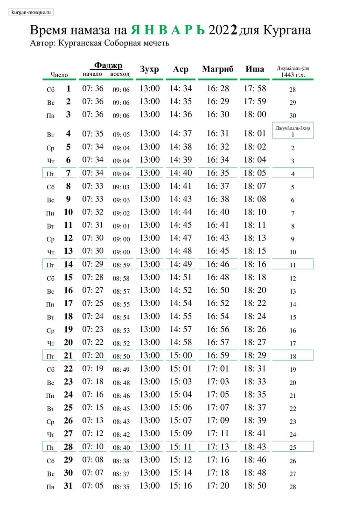

### Дорогие братья и сестры!

Рады Вам сообщить, что **31 декабря в 10:00, в Курганской Соборной мечети, состоится конкурс среди детей по знанию Корана**.

Приглашаем всех, кто желает послушать Коран! Приходите с детьми, они могут участвовать, слушать или начать обучение!

---
### Время намаза на январь 2022 года для Кургана

---

**РЕКВИЗИТЫ ДЛЯ ДОБРОВОЛЬНЫХ ПОЖЕРТВОВАНИЙ:**

Курганская городская религиозная организация мусульман
ООО Банк «КУРГАН»
ИНН 4501055960

КПП 450101001

р/сч 40703810800000000428

БИК 043735830

к/сч 30101810700000000830

НАЗНАЧЕНИЕ: ДОБРОВОЛЬНОЕ ПОЖЕРТВОВАНИЕ

---

---

