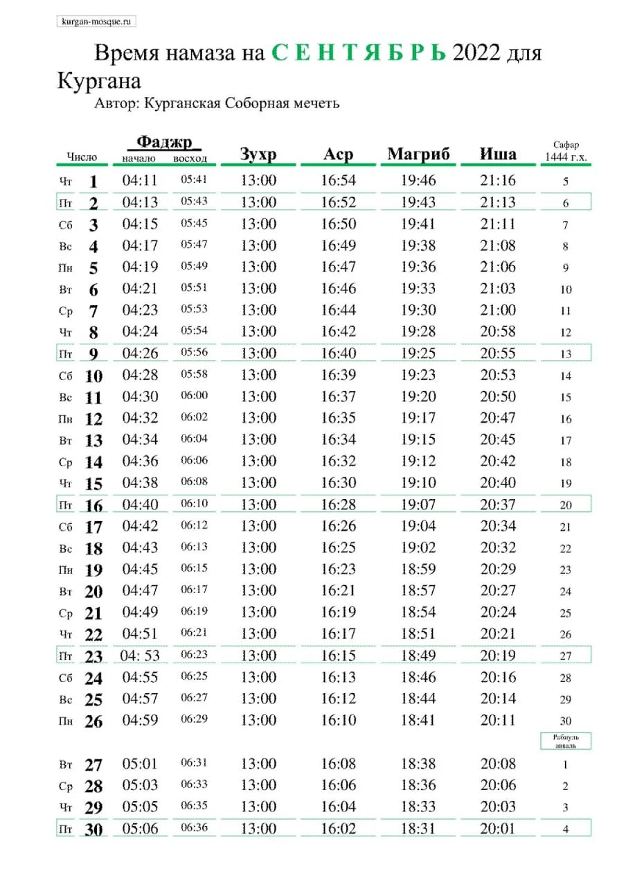

### Новости с места строительства мечети в г. Куртамыш.

18 августа 2022 года на месте строительства состоялась торжественная закладка первого камня в фундамент мечети. На мероприятии присутствовали представители 
мусульманских диаспор, меценаты, и другие неравнодушные люди. 

При содействии партии «Единая Россия», в лице Кучина Николая Григорьевича, было организовано звуковое сопровождение. С речью перед участниками выступил представитель 
администрации Куртамышского района Гвоздев Александр Николаевич.

Религиозное мероприятие не могло обойтись без чтения Курана: перед участниками выступил чтец Обид Джаббаров, после этого мусульмане произнесли коллективное дуа. 

Разделил радость с участниками председатель КГРОМ Мизробов З.К., который выступил с речью: ***«Мечеть – это ось, вокруг которой вращаются идеи и чувства, и школа, в 
которой воспитываются лучшие из лучших: они несут факелы света и верного руководства и шествуют по земле, неся с собой особые свойства мечети, ее дух и ее чистоту. 
Всевышний Аллах обещал построить дом в Раю тому, кто построит Ему дом на земле. Усман ибн Аффан передает, что Пророк (с.а.с.) сказал: «Кто построит мечеть ради Аллаха, 
тому Аллах построит такой же дом в Раю» (Ат-Тирмизи)»***

Мероприятие завершилось традиционным обедом за общим столом от наших добрых дарителей.

На сегодняшний день уже заканчивается укладка фундамента мечети, установлены бетонные блоки. Строительство идет полным ходом. Просим благословения у Аллаха, чтобы
строительство завершилось вовремя и без препятствий. Благодарим наших братьев и сестер за помощь.

---

### Время намаза на сентябрь 2022 года для Кургана

---

### Новости с места строительства мечети в Куртамышском районе

В Куртамышском районе Курганской области, на месте строительства новой мечети, **18 августа в 11-00**, состоится торжественная закладка первого кирпича. 

Напомним, что располагаться она будет по адресу: **город Куртамыш, улица Вишнёвая, дом 1Б.** Приглашаем принять участие всех желающих!

---

### Строительство мечети в Куртамыше

В Куртамышском районе Курганской области положено начало строительству мечети. Располагаться она будет по адресу: **город Куртамыш, улица Вишнёвая, дом 1Б.** 

По воле Аллаха, на участке, выделенном для местной религиозной организации мусульман, уже проложена траншея для будущего фундамента мечети и проведены необходимые измерения для его закладки. Руководит строительством имам будущей мечети, и, по совместительству, председатель МРОМ г. Куртамыша Курганской области, **Назарбаев Акылбек Абдижалилович**.

На 9 число мухаррама к месту строительства были доставлены материалы: рубероид, щебень. Ими покрыли выкопанную траншею. Материалы были закуплены на средства, выделенные **ДУМ РФ** (150000 руб.). Также, на добровольные пожертвования прихожан мечети города Кургана, Альхамдулиллах, выкуплена и доставлена арматура (100000 руб.) и три куба доски для опалубки (45000 руб.). Пусть не иссякнет благо от Аллаха для наших жертвователей.

***В процессе становления мечети, мы будем рады принять любую помощь от наших отзывчивых прихожан. Вы можете помочь стройке любым способом: работой, благими делами, 
дуа и пожертвованиями.***

Ниже указаны реквизиты для наших добрых дарителей:

#### МЕСТНАЯ РЕЛИГИОЗНАЯ ОРГАНИЗАЦИЯ МУСУЛЬМАН ГОРОДА КУРТАМЫША КУРГАНСКОЙ ОБЛАСТИ

Банковские реквизиты: 

БИК 043735650

ИНН 4511010430 

КПП 451101001

р/счет 40703810232000000454

корр.счет 30101810100000000650
в Курганском отделении №8599 ПАО Сбербанк  г. Курган

Назначение: ДОБРОВОЛЬНЫЕ ПОЖЕРТВОВАНИЯ.

---

---

**РЕКВИЗИТЫ ДЛЯ ДОБРОВОЛЬНЫХ ПОЖЕРТВОВАНИЙ:**

Курганская городская религиозная организация мусульман

ООО Банк «КУРГАН»

ИНН 4501055960

КПП 450101001

р/сч 40703810800000000428

БИК 043735830

к/сч 30101810700000000830

НАЗНАЧЕНИЕ: ДОБРОВОЛЬНОЕ ПОЖЕРТВОВАНИЕ

---

---

