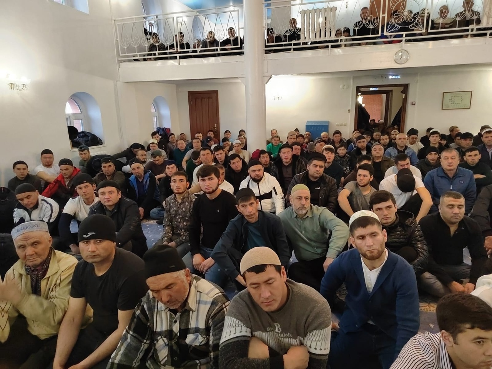
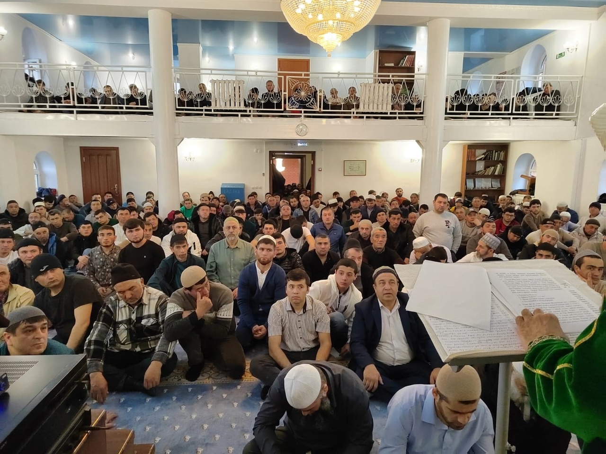
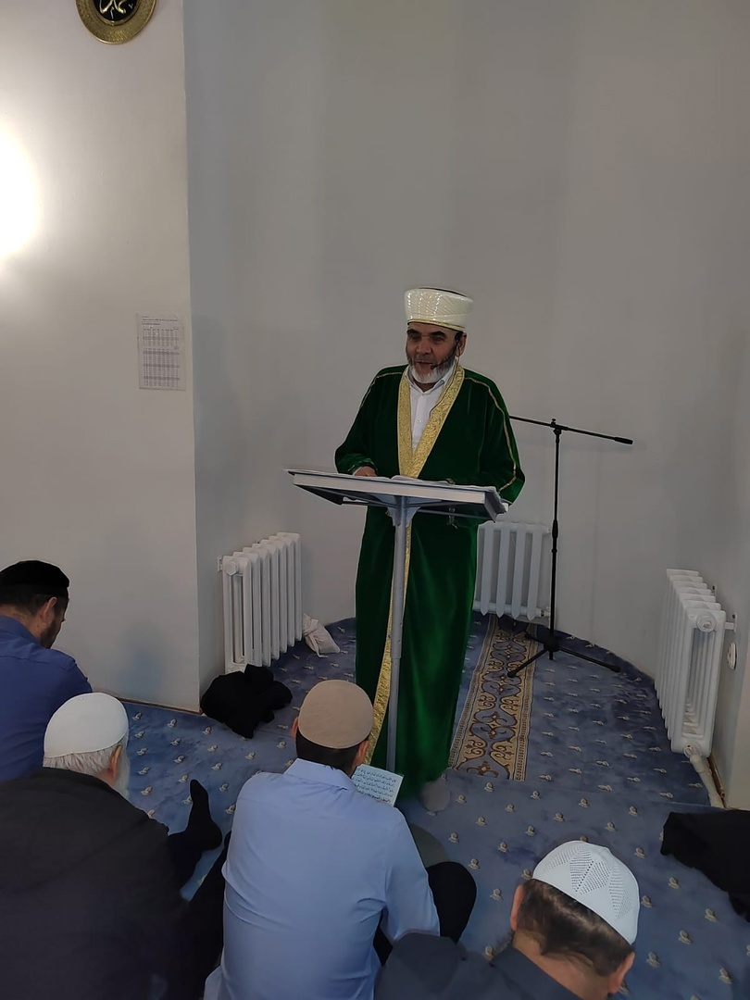
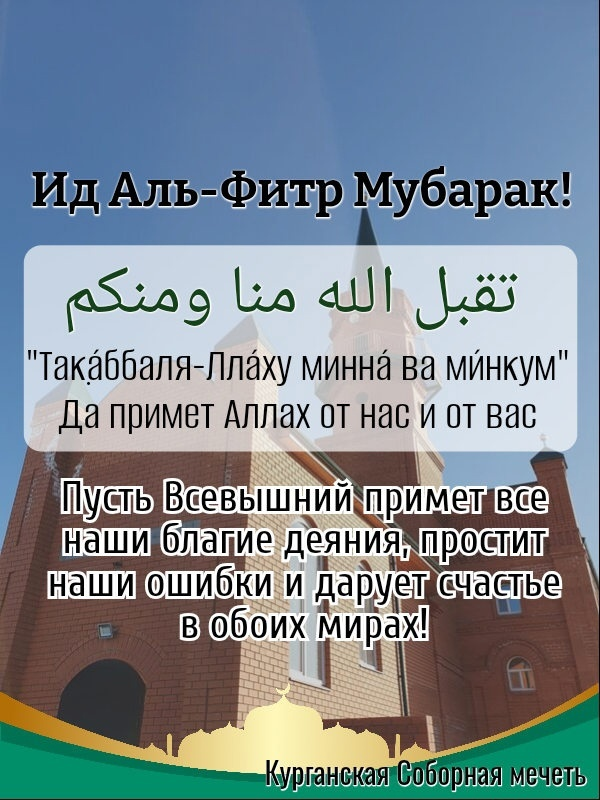

بسم الله الرحمن الرحيم

Ассаляму алейкум ва рахматуллахи ва баракятух уважаемые братья и сестры. Приветствие нашему Пророкуﷺ, его семье, сподвижникам и всем тем кто следует его призыву до Судного дня.

13 апреля мы посетили Куртамышский район, Куртамышскую мечеть. Встретились с имамом мечети Исмурзиновым Зерделы Кадеровичем. Альхамдулиллях братья уже установили доски, балки для крыши. ИншаАллах до конца года достроим, будем проводить джума намазы в этой мечети, 5 раз в день намаз читать будем, ИнШаАллах.

Просим Аллаха Субханаху Ва Тааля чтобы помог нам поскорее завершить работы. Пусть Аллах укрепит наши сердца на Его религии, поможет нам в благом деле, даст терпения и сил🤲🏽🤲🏽

---

## Поздравление губернатора Курганской области с праздником Ураза-Байрам.

10 апреля - Ураза-Байрам

Уважаемые жители Курганской области, исповедующие ислам!

Поздравляю вас с Ураза-байрамом!

Этот светлый день завершает пост священного месяца Рамадан – символа обновления и духовного очищения. Следуя многовековым традициям и ценностям праздника, мусульмане встречают его с особой радостью в сердце и надеждой на лучшее. Сегодня, когда наша страна и наш регион переживают непростые времена, эта надежда нужна каждому вне зависимости от веры.

Праздник напоминает о главных человеческих ценностях – милосердии, стремлении к добрым делам, помощи ближнему.

Пусть Ураза-Байрам принесёт в каждый дом спокойствие, взаимопонимание и благополучие, придаст новых сил и надежду.

Губернатор Курганской области В.М. Шумков

---

## 10 апреля в Курганской Соборной мечети состоялся праздничный намаз по случаю Ид Аль-Фитр.

Зиёдали Курбонович провел проповедь, в которой напомнил о значимости праздника.

"Уважаемые братья и сестры, приветствую вас всех, мир вам и благословение Аллаха, Альхамдулиллях, наступил праздник мусульман всего мира, Ид Аль-Фитр.
После Великого, Благославенного месяца Рамадан, когда мусульмане днем благочестиво держали пост, а ночи проводили в молитве и чтении Священного Кур'ана, наступили праздничные дни. Месяц Рамадан - месяц в котором есть ночь, лучше тысячи ночей. Всевышний, в этом месяце сделал пост - обязанностью для всех мусульман.
О его наступлении Посланник Аллахаﷺ говорил: «О, люди! Истинно, к вам явился благославенный месяц в котором Всевышний предписал вам пост. В этом месяце открываются врата Рая и запираются врата Ада! В нем есть ночь Ляйлятуль Кадр, которая лучше тысячи месяцев. И тот, кто будет лишён благ этого, истинно, будет лишённый блага!»
Месяц Рамадан является месяцем милосердия, когда каждый мусульманин выделяет из щедрот Аллаха садака Аль-Фитр, в помощь нуждающимся и бедным мусульманам. Это - месяц усердно го чтения Кур'ана - Книги Аллаха, в которой Он ясно изложил для нас прямой путь к Раю.

Рамадан - месяц нескончаемой Милости Аллаха и Его Прощения. Этот великий месяц даёт каждому возможность отчиститься перед Аллахом и укрепить свой Иман.

قال الله سبحانه وتعالى
يَٰٓأَيُّهَا ٱلَّذِينَ آمَنُوا۟ كُتِبَ عَلَيْكُمُ ٱلصِّيَامُ كَمَا كُتِبَ عَلَى ٱلَّذِينَ مِن قَبْلِكُمْ لَعَلَّكُمْ تَتَّقُونَ

"О те, которые уверовали! Вам предписан пост, подобно тому, как он был предписан вашим предшественникам, - быть может, вы устрашитесь." сура Аль - Бакара, 183 аят.

Уважаемые братья и сестры, в течение целого месяца мы воздерживались от воды и питья, своими благими деяниями возвеличивали этот великий месяц, который возвеличен самим Аллахом и ниспослан для блага мусульман. Но и после него каждый должен соблюдать договор с Аллахом, о вере и предписанных Им обязанностях, ведущий к успеху и Его Милости.
Всевышний Аллах возложил на мусульман великую миссию - быть Его наместниками на Земле, призывать людей к Исламу и удерживать от греха и заблуждения.

قال الله سبحانه وتعالى
كُنتُمْ خَيْرَ أُمَّةٍ أُخْرِجَتْ لِلنَّاسِ تَأْمُرُونَ بِٱلْمَعْرُوفِ وَتَنْهَوْنَ عَنِ ٱلْمُنكَرِ وَتُؤْمِنُونَ بِٱللَّهِ

"Вы являетесь лучшей из общин, появившейся на благо человечества, повелевая совершать одобряемое, удерживая от предосудительного и веруя в Аллаха." сура Аль Имран, 110 аят.

Мы,в этом Священном месяце Рамадан посредством благих деяний, повиновением Аллаху доказывал свою искренность и преданность в Его религии. В Рамадане, как и в посте, и молитвах, мы как никогда учимся важным принципам Ислама - терпению, взаимопомощи, состраданию и братству.

Наш Пророкﷺ говорил:"Мусульманин для другого мусульманина подобен строению, части когорого укрепляют и поддерживают друг друга."

И эти благие качества каждого мусульманина ясно проявляются во время великого месяца Рамадан и праздника Ид Аль-Фитр.

Пусть эти праздничные дни, как и Священный месяц Рамадан, явятая благом для нас, наших близких и для всех мусульман. Пусть Аллах ниспошлет мир и стабильность туда, где нет сегодня мира для мусульман. Да ниспошлет Аллах свою помощь всем, кто в ней нуждается, да укрепит наши сердца на Его религии, и направит нас на прямой путь."

С уважением и добрыми молитвами, Председатель КГРОМ Зиёдали Хаджи Мизробов.

---

## ИД АЛЬ-ФИТР(УРАЗА БАЙРАМ) 2024

***Поздравление председателя КГРОМ Зиёдали Хаджи Мизробова с праздником "Ид Аль-Фитр" Ураза Байрам 2024 года.***

بسم الله الرحمن الرحيم
السلام عليكم ورحمة الله وبركاته

Приветствие и благословение Аллаха Пророку Мухаммадуﷺ его семье, сподвижникам и всем тем кто следует его призыву до Судного дня.

Дорогие братья и сестры, мы с вами провожаем самый долгожданный месяц в году, султан месяцев – Священный Рамадан.
Целых тридцать дней этот месяц озарял наши дома радостью, добротой и богобоязненностью. Это время было наполнено особым милосердием, состраданием, отзывчивостью и все мусульмане старалась получить как можно больше награды в этом месяце.

Наш Пророк Мухаммадﷺ говорил про месяц Рамадан: «В нем распахиваются врата Рая, затворяются врата Ада, а шайтаны сковываются цепями». В этом хадисе Пророк напоминает нам о тех шайтанах, которых мы сами вскармливаем в себе. Это наша гневливость и зависть, страх, жадность и слабость. Но как бы ни были сильны наши пороки и коварны наши слабости, они все до единого разбиваются о твердыню благочетсивого Рамадана.

К сожалению трагические события омрачили этот Рамадан, терракт, унесший жизни неповинных людей. Священный месяц, лучший из дней, в перерыве между ифтаром и таравих намазом было совершено это страшное злодеяние. Аллах непременно накажет преступников в этой жизни, а в жизни вечной их ждёт Адский огонь.

Мы мусульмане безоговорочно порицаем и осуждаем то, что натворили эти преступники.

В Кур'ане Аллах Субханаху Ва Тааля говорит:

مِنْ أَجْلِ ذَٰلِكَ كَتَبْنَا عَلَىٰ بَنِىٓ إِسْرَٰٓءِيلَ أَنَّهُ ۥ مَن قَتَلَ نَفْسًۢا بِغَيْرِ نَفْسٍ أَوْ فَسَادٍ فِى ٱلْأَرْضِ فَكَأَنَّمَا قَتَلَ ٱلنَّاسَ جَمِيعًا وَمَنْ 
أَحْيَاهَا فَكَأَنَّمَآ أَحْيَا ٱلنَّاسَ جَمِيعًا ۚ وَلَقَدْ جَآءَتْهُمْ رُسُلُنَا بِٱلْبَيِّنَٰتِ ثُمَّ إِنَّ كَثِيرًا مِّنْهُم بَعْدَ ذَٰلِكَ فِى ٱلْأَرْضِ لَمُسْرِفُونَ

"...кто убьет человека не за убийство или распространение нечестия на земле, тот словно убил всех людей, а кто сохранит жизнь человеку, тот словно сохранит жизнь всем людям.." Аль-Маида, 32 аят.

Пусть Всевышний Аллах дарует терпения, стойкости пострадавшим в этой ужасной трагедии, мы будем молиться за души ушедших, и за скорейшее выздоровление тех кто пострадал.

Уважаемые братья и сестры!

Сегодня, в светлый праздник Ид аль-Фитр (Ураза Байрам), мы прощаемся с Благословенным Рамаданом, вознося молитвы Всевышнему Аллаху, чтобы Он принял наш пост и наше поклонение, простил нам, нашим родным и близким ошибки и прегрешения. Позади – особая пора духовного очищения и победы над страстями, в которую сердца верующих устремляются к диалогу с Творцом через благие деяния на земле.

Искренне, от всего сердца, хочу вас поздравить с праздником Ид Аль-Фитр (Ураза Байрам). Ид аль-Фитр - это один из двух великих мусульманских праздников, проповедующий идеалы добра и милосердия, веротерпимости и уважения к людям, праздник духовно-нравственного очищения.

Аллах Свят Он и Велик сказал в Коране:

وَأَنزَلۡنَاۤ إِلَیۡكَ ٱلۡكِتَـٰبَ بِٱلۡحَقِّ مُصَدِّقًا لِّمَا بَیۡنَ یَدَیۡهِ مِنَ ٱلۡكِتَـٰبِ وَمُهَیۡمِنًا عَلَیۡهِۖ فَٱحۡكُم بَیۡنَهُم بِمَاۤ أَنزَلَ ٱللَّهُۖ وَلَا تَتَّبِعۡ 
أَهۡوَاۤءَهُمۡ عَمَّا جَاۤءَكَ مِنَ ٱلۡحَقِّۚ لِكُلٍّ جَعَلۡنَا مِنكُمۡ شِرۡعَةً وَمِنۡهَاجًاۚ وَلَوۡ شَاۤءَ ٱللَّهُ لَجَعَلَكُمۡ أُمَّةً وَٰحِدَةً وَلَـٰكِن لِّیَبۡلُوَكُمۡ فِی مَاۤ ءَاتَىٰكُمۡۖ فَٱسۡتَبِقُوا۟ ٱلۡخَیۡرَٰتِۚ إِلَى ٱللَّهِ مَرۡجِعُكُمۡ جَمِیعًا  فَیُنَبِّئُكُم بِمَا كُنتُمۡ فِیهِ تَخۡتَلِفُونَ

«..Каждому из вас Мы установили закон и путь. Если бы Аллах пожелал, то сделал бы вас одной общиной, однако Он разделил вас, чтобы испытать вас тем, что Он даровал вам. Состязайтесь же в добрых делах. Всем вам предстоит вернуться к Аллаху, и Он поведает вам о том, в чем вы расходились во мнениях.» Сура Аль-Ма'ида, аят 48.

Надо помнить, что с завершением Рамадана не завершается наше стремление к доброте и жизни, преисполненной достоинства и благочестия, наоборот, мы должны быть упорнее в своих поклонениях, чтобы заслужить довольствие Аллаха и Райские сады.

Пусть Аллах Азза Ва Джаль позволит нам дожить до следующего Рамадана чистыми от греха, поможет каждому из нас побороть свой нафс, и стать праведным.

Пусть Всевышний наделит в ближней жизни счастьем следовать Корану и Сунне и быть угодными Ему, а мире вечном быть в обществе Пророкаﷺ в райских садах Фирдаус.

Пусть Аллах Свят Он и Велик, примет наш пост, молитвы и ответит на все дуаа, простит нас всех, примет наше покаяние, очистит наши сердца и осветит их Светом Ислама, Имана и Корана.

Пусть эти праздничные дни, как и Священный месяц Рамадан, явятся благом для нас, наших близких и для всех мусульман. Пусть Аллах ниспошлет мир и стабильность туда, где нет сегодня мира для мусульман. Да ниспошлет Аллах свою помощь всем тем, кто нуждается в ней, и да укрепит наши сердца в Его религии и направит на путь Его нескончаемой Милости.

Да примет Аллах от вас и от нас.

تقبل الله منا ومنكم

С уважением и добрыми молитвами, Председатель Курганской городской религиозной организации мусульман Зиёдали Хаджи Мизробов.

Напоминаем, что праздничная молитва состоится 10.04.2024 года, в 7.00 часов утра, по адресу: Курганская Соборная мечеть, улица Сибирская 2А.

---
بسم الله الرحمن الرحيم

Уважаемые братья и сестры, праздник разговения в этом году отмечается 10 апреля, 9 апреля с заходом солнца наступит 1 день месяца Шавваль.

Поздравляем вас с наступающим праздником Ид Аль-Фитр(Ураза Байрам). Пусть Всевышний Аллах примет ваши посты, молитвы и благие деяния!
Праздничный намаз состоится 10 апреля, 7:00 часов утра, Курганская Соборная мечеть(Сибирская 2А)

---

## Время намаза на апрель 2024 года для Кургана

===
## Закятуль-Фитр

Обязательная милостыня для каждого мусульманина в месяц Рамадан

Намерение для выплаты закатуль-фитр делается сердцем, желательно повторять языком.
Намерение: я намерился выплатить обязательный закатуль-фитр за себя (жену, сына, дочь) ради довольствия Всевышнего Аллаха.

Ибн Умар (да будет доволен им Аллах) сказал:

عن ابن عمر أن النبي صلى الله عليه وسلم أمر بإخراج زكاة الفطر قبل خروج الناس إلى الصلاة

«Пророкﷺ повелел нам выплатить закят разговенья до выхода людей на молитву» (Сахих аль-Бухари).

Закятуль-фитр разрешается выплатить в начале Рамадана, не дожидаясь конца месяца. Но нельзя его выплачивать до наступления Рамадана. Также нужно успеть выплатить закят до праздничной молитвы.

قال الله سبحانه وتعالى
وَأَقِيمُوا۟ ٱلصَّلَوٰةَ وَآتُوا۟ ٱلزَّكَوٰةَ ۚ وَمَا تُقَدِّمُوا۟ لِأَنفُسِكُم مِّنْ خَيْرٍ تَجِدُوهُ عِندَ ٱللَّهِ ۗ إِنَّ ٱللَّهَ بِمَا تَعْمَلُونَ بَصِيرٌ

"Совершайте намаз и выплачивайте закят. Все то доброе, что вы предварите для себя, вы найдете у Аллаха. Воистину, Аллах видит то, что вы совершаете." Аль-Бакара, 110 аят.

Размер закятуль-фитр в 2024 году в Кургане и Курганской области составляет:

•  100 рублей - закятуль-фитр
• 3.000 рублей - фидья садака(за месяц)

---

## Обращение председателя КГРОМ по поводу теракта в московском "Крокус Сити Холле"

24 марта в России официально объявлен днем общенационального траура. Выражаю глубокие соболезнования всем пострадавшим и тем, кто потерял родных в ужасной трагедии. Все мусульмане России и мира скорбят вместе и делают молитвы за невинно расстреляных граждан.

Попытка обвинить мусульман в теракте - это клевета на мусульман всего мира. Ни заказчики, ни исполнители не могут быть мусульманами.
Аллах Субханаху Ва Тааля, запретил убивать людей, в Исламе это считается великим грехом, наказания за которые будет огненная геена.
У террористов нет ни нации, ни религии. Мы безоговорочно порицаем этих невежд, которых даже нельзя назвать людьми.

Пусть Всевышний Аллах дарует всем пострадавшим, и потерявший близких терпения, ведь это невосполнимые утраты.
Также молим Аллаха об упокоении душ жертв этого жестокого злодеяния.

Уважаемые братья и сестры, сегодня 24 МАРТА 2024 ГОДА в Курганской Соборной мечети ИФТАР ОТМЕНЯЕТСЯ в знак солидарности, и скорби о погибших в теракте в Подмосковном "Крокус Сити Холле".
Председатель КГРОМ Зиёдали Курбонович Мизробов.

---
## Обращение Курганской городской религиозной организации мусульман по поводу теракта в подмосковном «Крокус Сити Холле». 

От имени КГРОМ и себя лично, выражаем глубокие соболезнования пострадавшим и близким погибших в этой чудовищной трагедии.

22 марта в торогово - развлекательном центре «Крокус Сити Холл» неизвестные расстреляли зрителей, пришедших на мероприятие, мирных граждан.
Такие бесчеловечные акты насилия в обществе, никогда не будут оправданы не перед Всевышним, ни перед людьми.
Аллах, Свят Он и Велик говорит в Коране :

وَمَن يَقْتُلْ مُؤْمِنًا مُّتَعَمِّدًا فَجَزَآؤُهُ ۥ جَهَنَّمُ خَٰلِدًا فِيهَا وَغَضِبَ ٱللَّهُ عَلَيْهِ وَلَعَنَهُ ۥ وَأَعَدَّ لَهُ ۥ عَذَابًا عَظِيمًا

"Если же кто-либо убьет верующего преднамеренно, то возмездием ему будет Геенна, в которой он пребудет вечно. Аллах разгневается на него, проклянет его и приготовит ему великие мучения", сура Ниса, 93 аят.

مَن قَتَلَ نَفْسًۢا بِغَيْرِ نَفْسٍ أَوْ فَسَادٍ فِى ٱلْأَرْضِ فَكَأَنَّمَا قَتَلَ ٱلنَّاسَ جَمِيعًا وَمَنْ أَحْيَاهَا فَكَأَنَّمَآ أَحْيَا ٱلنَّاسَ جَمِيعًا ۚ وَلَقَدْ جَآءَتْهُمْ رُسُلُنَا بِٱلْبَيِّنَٰتِ ثُمَّ إِنَّ كَثِيرًا مِّنْهُم بَعْدَ ذَٰلِكَ فِى ٱلْأَرْضِ لَمُسْرِفُونَ

"..кто убьет человека не за убийство или распространение нечестия на земле, тот словно убил всех людей, а кто сохранит жизнь человеку, тот словно сохранит жизнь всем людям. Наши посланники уже явились к ним с ясными знамениями, но многие из них после этого излишествуют на земле." Сура Аль-Маида, 32 аят.

Сейчас на фоне этого события очень важно сохранять спокойствие. Самым сильным нашим аргументом перед лицом экстремистов должна стать наша всеобщая тесная сплоченность и единство. Мы, мусульмане, выражаем гневное осуждение действий преступников, убивших невинных людей. Мусульмане России молятся о погибших, разделяя эту тяжелую боль.

Выражаем свои искренние соболезнования близким и родным погибших, молим Всевышнего Аллаха об упокоении душ жертв этого бесчеловечного злодеяния и скорейшем выздоровлении всем пострадавших горожан.
Председатель КГРОМ Зиёдали Курбонович Мизробов.

---

### Хадисы о посте в Рамадан

عَنْ أَبِي هُرَيْرَةَ رَضِيَ اللهُ عَنْهُ أَنَّ رَسُولَ اللهِ ﷺ قَالَ: ”يَقُولُ اللهُ تَبَارَكَ وَتَعَالَى: «كُلُّ عَمَلِ ابْنِ آدَمَ لَهُ إِلا الصَّوْمَ، فَإِنَّه لِي وَأَنَا ‌أَجْزِي ‌بِهِ»“.

📗Передается от Абу Хурайры (да будет доволен им Аллах) как Посланник Аллаха ﷺ сказал: «Всемогущий и Великий Аллах сказал: “Любое дело сына Адама делается им для себя же, кроме поста, ибо, поистине, он — ради Меня, и Я воздам за него”». «Сахих» Аль-Бухари, «Сахих» Муслим.

📗Передают со слов Сахля, да будет доволен им Аллах, что Пророк ﷺ сказал: «Поистине, есть в раю врата, именуемые “Ар-Раййан”, через которые будут входить (туда) постящиеся в День воскресения, и не войдёт через эти врата никто, кроме них. Будет сказано: “Где постившиеся?” − и они поднимутся, и не войдёт через эти врата никто, кроме них, а после того как они войдут, эти врата будут закрыты, и больше никто не войдёт через них» (Аль-Бухари)

📗Пророк Мухаммадﷺсказал: «Пост и Коран заступаются за раба Аллаха в Судный день. Пост говорит: “Господь мой! Я лишил его пищи и питья в светлую часть, так позволь же мне заступиться за него!” А Коран говорит: “Господь мой! Я лишил его сна ночью, так позволь же мне заступиться за него!” — и их заступничества удовлетворяются» (Ахмад)

 
عن أبي هريرة رضي الله عنه قال: قال رسول اللهﷺ: «قال الله عز وجل : كلُّ عَمَل ابن آدَم له إلا الصيام، فإنه لي وأنا أجْزِي به، والصيام جُنَّة، فإذا كان يوم صوم أحدِكُم فلا يَرْفُثْ ولا يَصْخَبْ فإن سَابَّهُ أحَدٌ أو قَاتَلَهُ فليَقل: إنِّي صائم، والذي نفس محمد بيده لَخُلُوفُ فَمِ الصَّائِم أطيب عند الله من رِيحِ المِسْكِ، للصائم فرحتان يَفْرَحُهُمَا: إذا أفطر فَرِح بفطره، وإذا لَقِي ربَّه فَرِح بِصَوْمه». وهذا لفظ رواية البخاري. وفي رواية له: «يَتْرُك طَعَامه، وشَرَابه، وشَهوته من أجلي، الصيام لي وأنا أَجْزِي به، والحسنة بعشر أمثالها». وفي رواية لمسلم: «كلُّ عَمَل ابن آدم يُضَاعَف، الحَسَنة بِعَشر أمْثَالها إلى سَبْعِمِئَة ضِعْف، قال الله تعالى: إلا الصَّوم فإنه لي وأنا أجْزِي به؛ يَدَع شَهَوته وطَعَامه من أجلي، للصائم فرحتان: فَرْحَة عند فِطْره، وفَرْحَة عند لقِاء ربِّه، ولَخُلُوف فيه أطْيَب عند الله من رِيحِ المِسْكِ»

Абу Хурайра (да будет доволен им Аллах) передаёт, что Посланник Аллахаﷺсказал: «Всемогущий и Великий Аллах сказал: “Всякое дело потомок Адама совершает для себя, кроме поста, ибо поистине, он — для Меня, и Я воздаю за него”. Пост – защита. В тот день, когда кто-нибудь из вас будет поститься, пусть избегает всего непристойного и не шумит. Если же кто-нибудь станет бранить его или попытается завязать с ним ссору, пусть он скажет такому: «Поистине, я — человек, соблюдающий пост!»

Всевышний Аллах сказал: " поистине пост, он — для Меня, и Я воздаю за него. Постящийся отказывается от удовлетворения страсти своей и от еды своей ради Меня”.
У постящегося будет две радости: радость при разговении и радость при встрече с Господом своим. И неприятный запах изо рта постящегося будет лучше пред Аллахом, чем благоуханье мускуса».

---

### В Кургане открылось кафе с едой халяль

Ассаляму алейкум ва рахматуллахи ва баракятух братья и сестры, Хвала Аллаху, 8 февраля состоялось открытие кафе халяль ***"Ширин"***
Кафе находится в самом центре, по адресу: ***город Курган, улица Советская, дом 115***. 

Пусть Аллах воздаст братьям благом 🤲🏽

---

---

### Новости со строительства мечети в Куртамыше

بسم الله الرحمن الرحيم
السلام عليكم ورحمة الله وبركاته

Ассаляму алейкум ва рахматуллахи ва баракятух уважаемые братья и сестры.

На данном этапе строительства выглядит мечеть в селе Куртамыш.
Хвала Аллаху, Господу миров, братья собрали деньги, мусульмане делали пожертвования, возвели стены, купили доски, брус.
ИншаАллах в этом году закроем крышу.

Молим Аллаха Субханаху Ва Тааля, чтобы помог нам, чтобы все неравнодушные люди принимали участие в строительстве мечети, и чтобы в следующем году завершили работу.

عثمان بن عفان رضي الله عنه سمعت رسول الله صلى الله عليه وسلم يقول:من بنى مسجدا يبتغي به وجه الله بنى الله له بيتا في الجنة.

Усман бин Аффан (да будет доволен им Аллах) сказал: Я слышал, как Посланник Аллахаﷺсказал: «Кто воздвигнет мечеть, желая увидеть Лик Аллаха, тому Аллах возведёт дворец в Раю».

---

### Новости с места строительства мечети в Каргаполье

Ассаляму алейкум ва рахматуллахи ва баракятух дорогие братья и сестры.

Альхамдулиллях шаг за шагом продолжаем работать над строительством мечети в Каргаполье.

Да вознаградит Всевышний всех кто помогает в строительстве, финансово, своими силами, кто делает дуаа, пусть Аллах дарует Свою Милость вам и вашим семьям.

فَمَن يَعْمَلْ مِثْقَالَ ذَرَّةٍ خَيْرًا يَرَهُ ۥ

**"Тот, кто сделал добро весом в мельчайшую частицу, увидит его."** сура Аз-Зальзаля, 7 аят.
Пусть Аллах Субханаху Ва Тааля поможет нам, даст сил, терпения, чтобы в скорейшем времени завершить это благое дело.

---

**_Готовую еду и выпечку ХАЛЯЛЬ можно приобрести в пекарне «Ширин» по адресу: Курган, Дзержинского 54Б/1_**

---

---

**РЕКВИЗИТЫ ДЛЯ ДОБРОВОЛЬНЫХ ПОЖЕРТВОВАНИЙ:**

Курганская городская религиозная организация мусульман

ООО Банк «КУРГАН»

ИНН 4501055960

КПП 450101001

р/сч 40703810800000000428

БИК 043735830

к/сч 30101810700000000830

НАЗНАЧЕНИЕ: ДОБРОВОЛЬНОЕ ПОЖЕРТВОВАНИЕ

---

---
