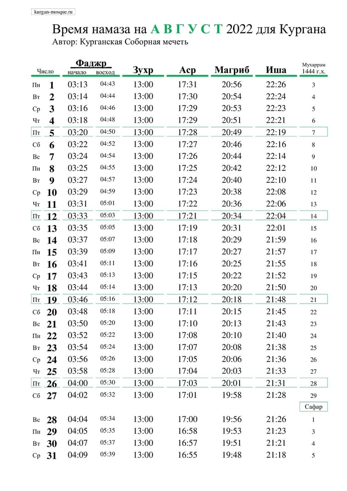

### Строительство мечети в Куртамыше

В Куртамышском районе Курганской области положено начало строительству мечети. Располагаться она будет по адресу: **город Куртамыш, улица Вишнёвая, дом 1Б.** 

По воле Аллаха, на участке, выделенном для местной религиозной организации мусульман, уже проложена траншея для будущего фундамента мечети и проведены необходимые измерения для его закладки. Руководит строительством имам будущей мечети, и, по совместительству, председатель МРОМ г. Куртамыша Курганской области, **Назарбаев Акылбек Абдижалилович**.

На 9 число мухаррама к месту строительства были доставлены материалы: рубероид, щебень. Ими покрыли выкопанную траншею. Материалы были закуплены на средства, выделенные **ДУМ РФ** (150000 руб.). Также, на добровольные пожертвования прихожан мечети города Кургана, Альхамдулиллах, выкуплена и доставлена арматура (100000 руб.) и три куба доски для опалубки (45000 руб.). Пусть не иссякнет благо от Аллаха для наших жертвователей.

***В процессе становления мечети, мы будем рады принять любую помощь от наших отзывчивых прихожан. Вы можете помочь стройке любым способом: работой, благими делами, 
дуа и пожертвованиями.***

Ниже указаны реквизиты для наших добрых дарителей:

#### МЕСТНАЯ РЕЛИГИОЗНАЯ ОРГАНИЗАЦИЯ МУСУЛЬМАН ГОРОДА КУРТАМЫША КУРГАНСКОЙ ОБЛАСТИ

Банковские реквизиты: 

БИК 043735650

ИНН 4511010430 

КПП 451101001

р/счет 40703810232000000454

корр.счет 30101810100000000650
в Курганском отделении №8599 ПАО Сбербанк  г. Курган

Назначение: ДОБРОВОЛЬНЫЕ ПОЖЕРТВОВАНИЯ.

---

### Месяц Мухаррам

30 июля 1444 года по хиджре начался месяц мухаррам. Первое число этого священного месяца является началом нового года по исламскому календарю. 

**Месяц Мухаррам** – один из четырех запретных месяцев, упомянутых в Коране: *«Воистину, число месяцев у Аллаха — двенадцать. Так было записано в Писании в тот день, когда Аллах сотворил небеса и землю. Четыре месяца из них—запретные»* (ат-Тауба 9/36). 

Аллах возвеличивает ценность этих четырех запретных месяцев по сравнению с другими. Ибн 'Аббас (да будет доволен им Аллах) говорит об этом в своем хадисе: *“Аллах выбрал из двенадцати месяцев четыре, сделав их запретными, возвеличив их неприкосновенность. И Он сделал так, что грехи в эти четыре месяца хуже, а награда за благодеяния в них выше”*. 

Тем не менее это не значит, что остальные месяцы не имеют значения или менее ценны. Священность вышеупомянутых месяцев обуславливается особенными датами и особыми наградами Аллаха за благие деяния, тем, что Аллах выделил их для особого поклонения, и что эти месяцы были признаны священными даже язычниками Мекки. Но истинный мусульманин должен быть заинтересован в  приближении к  Аллаху и обретении Его довольства в любое время года. 

10-й день месяца мухаррам известен, как **день Ашура**. **Ашура** – особенный день в исламской истории. Это благословенный день, милостью которого было даровано спасение многим пророкам. Всевышний по Своей милости принял покаяние Адама в День Ашура. В этот день Аллах даровал Нуху (мир ему) и его последователям, находившимся вместе с пророком на ковчеге, спасение от гибели в потопе. В этот день Аллах даровал спасение пророку Мусе (мир ему) и его общине. В этот день Всевышний Аллах оградил Своего Пророка (мир ему) и его последователей от вреда неверующих. На этот день приходится сотворение Всевышним Аллахом Небес, Земли, Арша, Курса, ангелов, первого человека – Адама (мир ему).

Пророк Мухаммад (мир ему и благословение Аллаха) сказал: *«Я надеюсь на Аллаха, что пост в день Ашура послужит искуплением грехов прошедшего года!»*
Пост дня Ашура следует держать с одним днем до или после, чтобы не уподобляться людям Писания. Ибн ‘Аббас рассказывал: *«Когда посланник Аллаха (мир ему и благословение Аллаха) постился в день Ашуры и приказал своим сподвижникам делать то же самое, они сказали: «О посланник Аллаха, это – день, который чтят евреи и христиане». Тогда посланник Аллаха (мир ему и благословение Аллаха) сказал: «Следующий год, даст Аллах, мы будем поститься и девятого числа»*. Также пророк (мир ему) сказал: *«Соблюдайте пост в день Ашура; однако отличайтесь от иудеев, соблюдая пост также в день до этого дня или же в день после него»*.

---

### Время намаза на август 2022 года для Кургана

---

**РЕКВИЗИТЫ ДЛЯ ДОБРОВОЛЬНЫХ ПОЖЕРТВОВАНИЙ:**

Курганская городская религиозная организация мусульман

ООО Банк «КУРГАН»

ИНН 4501055960

КПП 450101001

р/сч 40703810800000000428

БИК 043735830

к/сч 30101810700000000830

НАЗНАЧЕНИЕ: ДОБРОВОЛЬНОЕ ПОЖЕРТВОВАНИЕ

---

---

