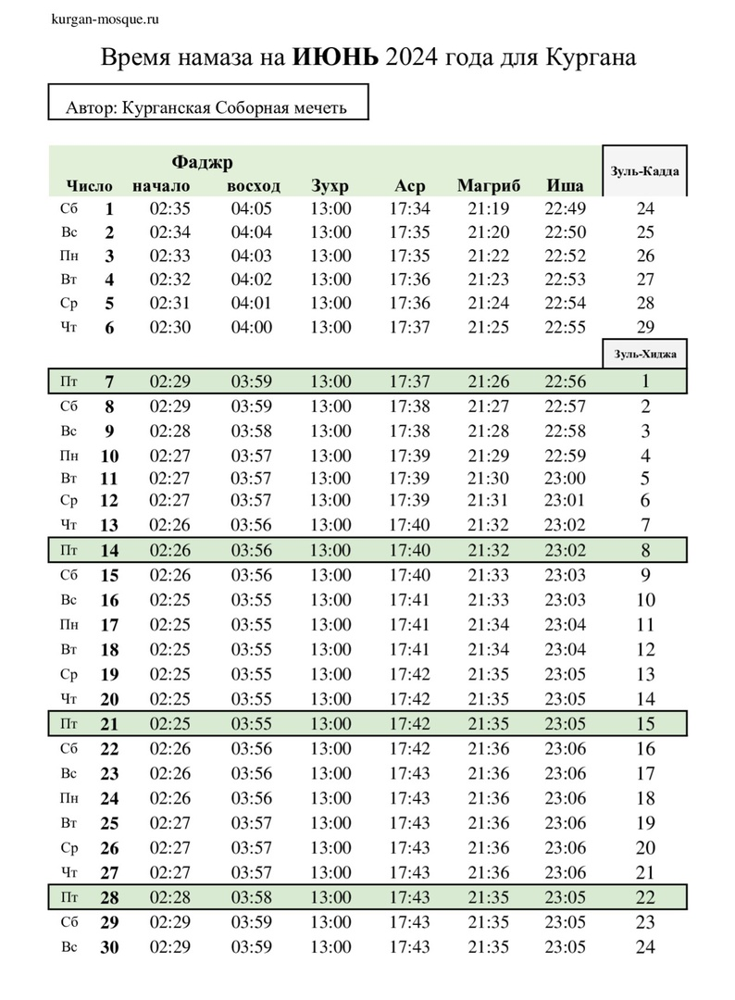

## Время намаза на июнь 2024 года для Кургана

===
بسم الله الرحمن الرحيم

Ассаляму алейкум ва рахматуллахи ва баракятух уважаемые братья и сестры. Приветствие нашему Пророкуﷺ, его семье, сподвижникам и всем тем кто следует его призыву до Судного дня.

13 апреля мы посетили Куртамышский район, Куртамышскую мечеть. Встретились с имамом мечети Исмурзиновым Зерделы Кадеровичем. Альхамдулиллях братья уже установили доски, балки для крыши. ИншаАллах до конца года достроим, будем проводить джума намазы в этой мечети, 5 раз в день намаз читать будем, ИнШаАллах.

Просим Аллаха Субханаху Ва Тааля чтобы помог нам поскорее завершить работы. Пусть Аллах укрепит наши сердца на Его религии, поможет нам в благом деле, даст терпения и сил🤲🏽🤲🏽

---

## Поздравление губернатора Курганской области с праздником Ураза-Байрам.

10 апреля - Ураза-Байрам

Уважаемые жители Курганской области, исповедующие ислам!

Поздравляю вас с Ураза-байрамом!

Этот светлый день завершает пост священного месяца Рамадан – символа обновления и духовного очищения. Следуя многовековым традициям и ценностям праздника, мусульмане встречают его с особой радостью в сердце и надеждой на лучшее. Сегодня, когда наша страна и наш регион переживают непростые времена, эта надежда нужна каждому вне зависимости от веры.

Праздник напоминает о главных человеческих ценностях – милосердии, стремлении к добрым делам, помощи ближнему.

Пусть Ураза-Байрам принесёт в каждый дом спокойствие, взаимопонимание и благополучие, придаст новых сил и надежду.

Губернатор Курганской области В.М. Шумков

---

---
بسم الله الرحمن الرحيم

---

**РЕКВИЗИТЫ ДЛЯ ДОБРОВОЛЬНЫХ ПОЖЕРТВОВАНИЙ:**

Курганская городская религиозная организация мусульман

ООО Банк «КУРГАН»

ИНН 4501055960

КПП 450101001

р/сч 40703810800000000428

БИК 043735830

к/сч 30101810700000000830

НАЗНАЧЕНИЕ: ДОБРОВОЛЬНОЕ ПОЖЕРТВОВАНИЕ

---

---
