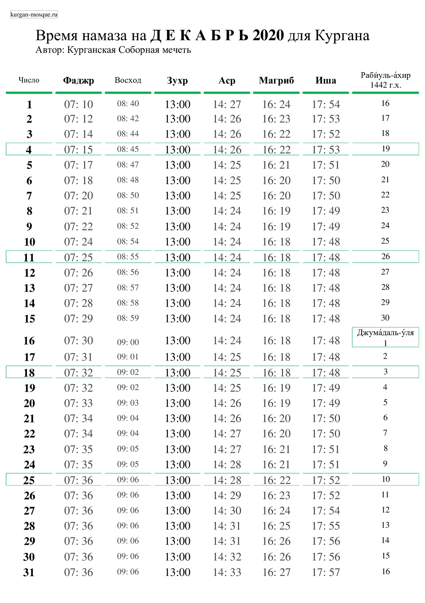
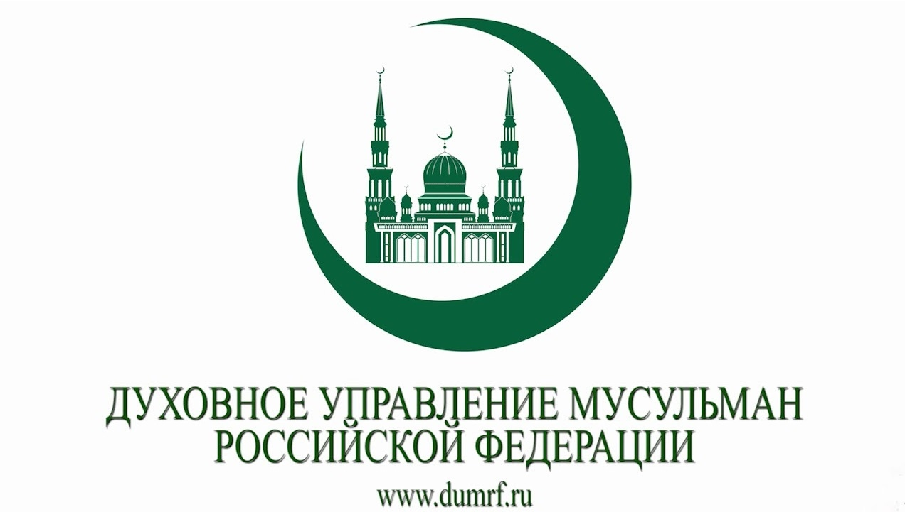

### Зиёдали хаджи Мизробов переизбран председателем КГРОМ

Зиёдали хаджи Мизробов переизбран на пост председателя Курганской городской религиозной организации мусульман на новый пятилетний срок на Отчетно-выборном съезде организации. Действующий председатель переизбран на съезде единогласно, открытым голосованием.

Перед процедурой голосования Зиёдали хаджи Мизробов выступил с докладом, в котором отчитался по основным направлениям работы КГРОМ за период с 2015 по 2020 годы. Делегаты съезда единогласно приняли и утвердили текст отчетного доклада.

После процедуры избрания Зиёдали хаджи Мизробов поблагодарил делегатов съезда и своих соратников за оказанные доверие и поддержку и вознес молитвы Всевышнему Аллаху о помощи Творца в дальнейшей деятельности и служении.

***Пресс-служба Курганской Соборной мечети***

### Время намаза на декабрь 2020 года для Кургана

---

## Уведомление

Курганская городская религиозная организация мусульман (КГРОМ) уведомляет:

***27 ноября 2020 года в 10 часов 30 минут состоится отчётно-выборное собрание*** участников организации по адресу:
                                  
 г. Курган, ул. Сибирская, 2А (Соборная мечеть).
 
 ### Повестка дня:
 
 1. Отчет председателя КГРОМ.
 2. Отчет председателя религиозной комиссии КГРОМ.
 3. Выборы председателя КГРОМ.
 4. Рассмотрение Плана работы КГРОМ на период 2021-2026 гг.
 5. Прочие вопросы.
 
 Председатель Курганской городской религиозной организации мусульман ****Мизробов Зиедали Курбонович****.
 
 ---
 ---

### Заявление Президиума ДУМ РФ в связи с трагическими событиями во Франции

***Во имя Аллаха, Милостивого, Милосердного!***

Духовное управление мусульман Российской Федерации обращается ко всем своим последователям, к представителям мусульманского населения России и сопредельных стран с призывом сохранять спокойствие, самообладание и трезвость рассудка в условиях вызовов, с которыми мир столкнулся при совершении террористических актов в различных городах мира. К сожалению, эти преступные деяния самозваные «защитники ислама» проводят под лозунгами защиты религии. От их зверских поступков страдает не только имидж нашей религии, но под угрозой оказываются и жизни представителей разных сообществ.

Ключевой посыл, который Всевышний Аллах довел до человечества посредством благородного Корана: «Кто убьет человека не за убийство или распространение нечестия на земле, тот словно убил всех людей, а кто сохранит жизнь человеку, тот словно сохранит жизнь всем людям. Наши посланники уже явились к ним с ясными знамениями, но многие из них после этого преступили границы дозволенного на земле» (5:32). Кто преступает границы дозволенного? – преступники, хотя бы они и причисляли себя к мусульманам. Против кого были созданы карающие законы Божественного шариата, определявшие наказание за убийства и другие преступления против жизни и свободы? – против преступников, хотя они и выросли в мусульманской среде и считали себя мусульманами. Для чего нужна была шурта (полиция) и кадии (судьи) в мусульманских обществах? − чтобы контролировать и наказывать преступность в мусульманской среде! Следовательно, мусульмане, как и другие граждане – это не ангелы, а обычные люди, которые нуждались и нуждаются в законах, правоохранителях, наказаниях, чтобы общество было ограждено от преступлений и преступников, кем бы они себя ни называли.

Так как террористы своими атаками нарушают закон, преступают границы дозволенного, убивают мирных граждан и угрожают спокойствию в обществе – их необходимо судить по законам государства, гражданами которого они являются. Никакая апелляция к их вероисповеданию и их религиозности, оговорки о том, что они «мстили» за религию – неприемлемы и ничтожны перед лицом закона, который они преступили. За убийства мирных граждан их следует судить и, в случае признания их психической дееспособности, приговорить к той мере наказания, которая оговорена в законах соответствующих государств.

К сожалению, провокационная деятельность по размещению карикатур на пророков и посланников Божьих способствует взрывному росту террористической активности, с одной стороны, и последующим актам исламофобии в европейских странах, с другой стороны. Это замкнутый круг, из которого может быть найден выход – либо французское государство принимает соответствующие законы, запрещающие оскорбление чувств верующих, как это произошло в Российской Федерации; либо мусульмане Франции и ЕС через суды привлекают авторов и распространителей карикатур к уголовной и административной ответственности. Последние шаги можно предпринимать уже сегодня, не дожидаясь усиления конфликта, однако для этого мусульмане Франции должны иметь соответствующие юридические познания. Мы также призываем французских мусульман проявлять свою активную гражданскую позицию во время выборов президента и парламента Республики, чтобы многие миллионы голосов этого сообщества позволили их избранникам менять и принимать законы в интересах верующих. Мы уверены, что подавляющее большинство рядовых мусульман – граждан Французской Республики желает разрядить обстановку путем грамотных, юридически выверенных шагов. Как сказал Всевышний Аллах в Коране, «всякий раз, когда они разжигают огонь войны, Аллах тушит его» (5:64).

Как бы ни развивались события в зарубежных странах, российские мусульмане должны соблюдать принципы мирного сосуществования представителей разных религий, сторониться провокаторов и следовать указанию Всевышнего Аллаха, который сказал в благородном Коране: «Мы сделали вас общиной умеренной, чтобы вы были свидетелями обо всем человечестве» (2:143). Настоятельно призываем имамов в условиях развязанной информационной войны против ислама выверять каждое свое слово, произнесенное на публике – в мечетях и молельных залах, в СМИ и в частных домах. Вы должны быть мудрее провокаторов, выше розни и втягивания в скандалы, ибо в этом и состоит цель провокаций с карикатурами. Ваше предназначение в условиях фитны (смуты, провокации) – призывать к терпению, согласно приказу Всевышнего Аллаха: «Воистину, все человечество – в убытке, кроме тех, которые уверовали, совершали праведные деяния, заповедали друг другу истину и заповедали друг другу терпение!» (103:2-3). Имамы, помните сами и напоминайте верующим прихожанам, что каждое деяние получит свой ответ от Всевышнего Аллаха, ибо сказано в Коране: «И тот, кто сделал добро весом в мельчайшую частицу, увидит его; и тот, кто сделал зло весом в мельчайшую частицу, увидит его» (99:7-8).

***Мир да пребудет с теми, кто следует путем праведников!***

30 октября 2020 г.
http://dumrf.ru/upravlenie/documents/17913

---

