## Время намаза на ноябрь 2024 года для Кургана

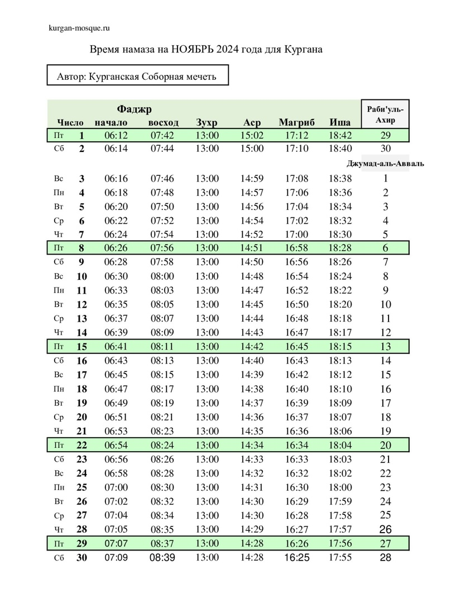

---

## Объявление

Уважаемые братья и сестры!

Курганская городская религиозная организация мусульман уведомляет, что ***28 ноября 2024 года в 10 часов 30 минут состоится отчетное собрание*** по адресу: г.Курган, ул. Сибирская, 2а, Соборная мечеть.

***На повестке дня будут рассмотрены:***

1. Отчет председателя КГРОМ за 2024 г.

2. Отчет председателя ревизионной комиссии за 2024 г.

3. План на 2025 год.

---
Ассаляму алейкум ва рахматуллахи ва баракятух уважаемые братья и сестры.
21 октября в Курганском Государственном университете состоялась встреча студентов с религиозными деятелями, просмотр и обсуждение фильма "Общими молитвами". В фильме была затронута тема братства, сплоченности и единства. О том, как мусульмане и христиане вместе защищают нашу родину, сражаются в зонах СВО.
Зиёдали Курбонович выступил на мероприятии со словами:
"Сейчас на фронте, бойцы СВО защищают справедливость, суверенитет и независимость страны, в том числе и право каждого ее жителя, гражданина исповедовать свою веру.
Мы все едины - и мусульмане, и православные потому что у нас Родина одна - наша великая Россия.

Сегодня мы видим, что, к сожалению, есть силы, которые заинтересованы в разжигании межрелигиозной розни, которые хотят поссорить мусульман с христианами. Именно сейчас, как никогда ранее, важен активный межрелигиозный диалог, целью которого является свидетельство каждой из общин о своей вере и традиции, а также укрепление мира.
Наши религии призывают к миру и добрососедству.

Всевышний Аллах говорит в Кур'ане:

وَلِكُلٍّ وِجْهَةٌ هُوَ مُوَلِّيهَا ۖ فَٱسْتَبِقُوا ٱلْخَيْرَٰتِ ۚ أَيْنَ مَا تَكُونُوا يَأْتِ بِكُمُ ٱللَّهُ جَمِيعًا ۚ إِنَّ ٱللَّهَ عَلَىٰ كُلِّ شَىْءٍ قَدِيرٌ

"У каждого есть сторона, куда он обращается лицом. Стремитесь же опередить друг друга в добрых делах. Где бы вы ни были, Аллах приведет всех вас вместе. Воистину, Аллах способен на всякую вещь." сура Аль Бакара, 148 аят.

"Если бы Аллах пожелал, то сделал бы вас одной общиной, однако Он разделил вас, чтобы испытать вас тем, что Он даровал вам. Состязайтесь же в добрых делах. Всем вам предстоит вернуться к Аллаху, и Он поведает вам о том, в чем вы расходились во мнениях." сура Аль-Маида, 48 аят.

Поэтому мы, мусульмане и христиане, должны выступить единым фронтом против общественных пороков, сообща отстаивать право жить по своим убеждениям, воспитывать детей, обучать их нашей вере, учить их добру, быть свободными от насмешек и издевательств со стороны людей, которые забыли свое прошлое и пренебрегли духовным наследием предков.
Мы все должны жить в мире, построенном на взаимному уважении, и противостоянию безнравственному нечестии."

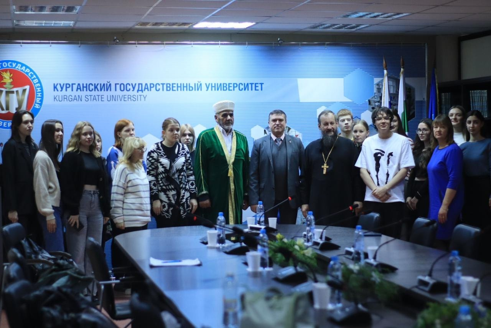
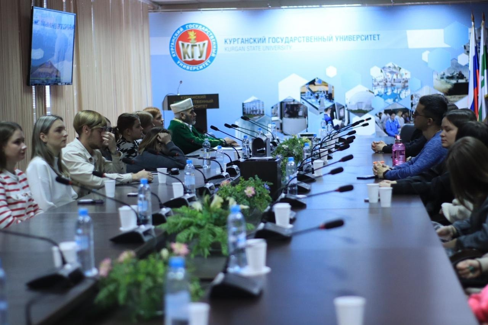

---
Ассаляму алейкум ва рахматуллахи ва баракятух уважаемые братья и сестры. В воскресенье 20 октября Курганскую Соборную мечеть посетил 
наш брат путник Хайрулла, который пешком направляется к священным землям Саудовской Аравии, чтобы совершить хадж.
После намаза Хайрулла пообщался с местными мусульманами за обеденным столом.

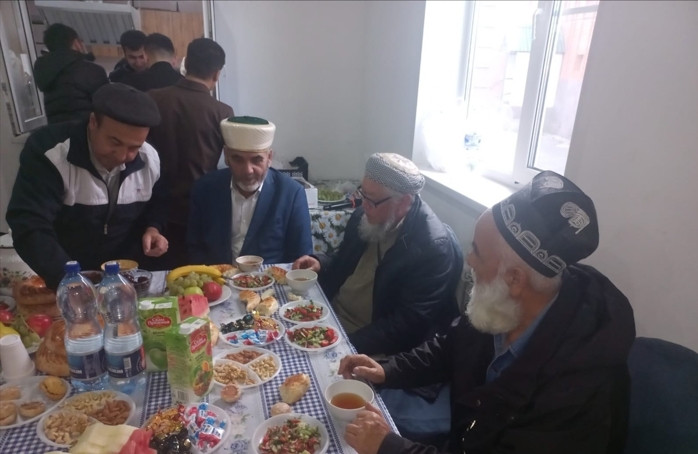
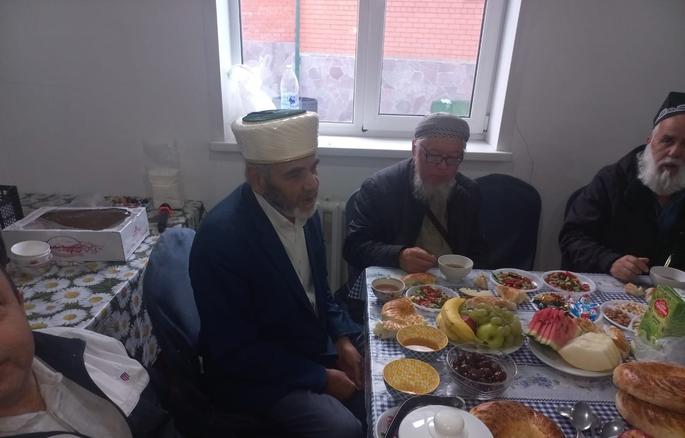
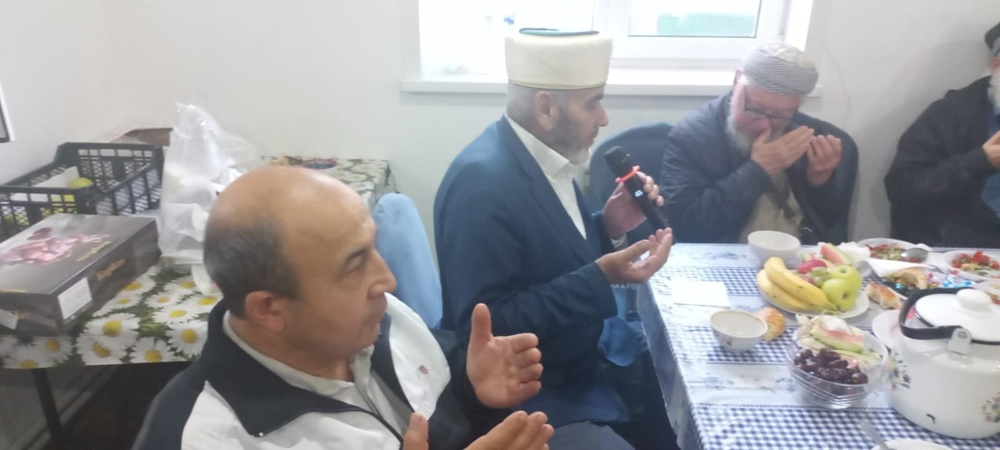

От лица Курганской Соборной мечети и мусульман нашего города мы пожелали брату хорошей дороги, лёгкого пути, и чтобы Всевышний 
принял его хадж.

---

بسم الله الرحمن الرحيم

Ассаляму алейкум ва рахматуллахи ва баракятух уважаемые братья и сестры.
Альхамдулилях, Хвала Аллаху, Господу миров, завершили кладку кирпича в мечети Каргаполье.

قال رسول الله صلى الله عليه وسلم :(من بنى لله مسجدا بنى الله له بيتا في الجنة

Пророкﷺсказал: «Тому, кто построит мечеть, даже с размером гнезда куропатки, Всевышний построит дом в Раю».

Любая помощь, оказанная в строительстве мечети и других благих делах, должна подкрепляться чистым, искренним намерением только для получения довольства Всевышнего Аллаха.

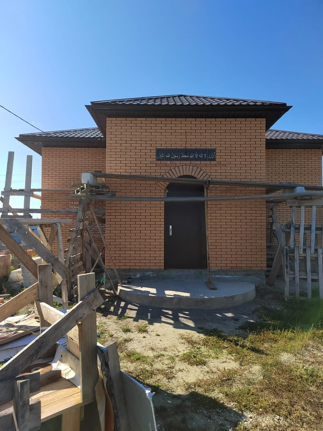
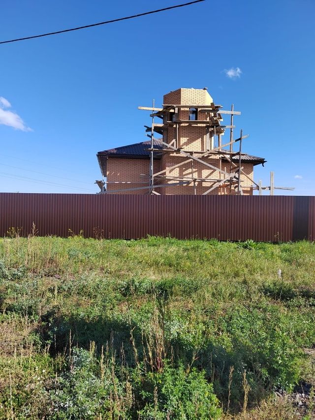
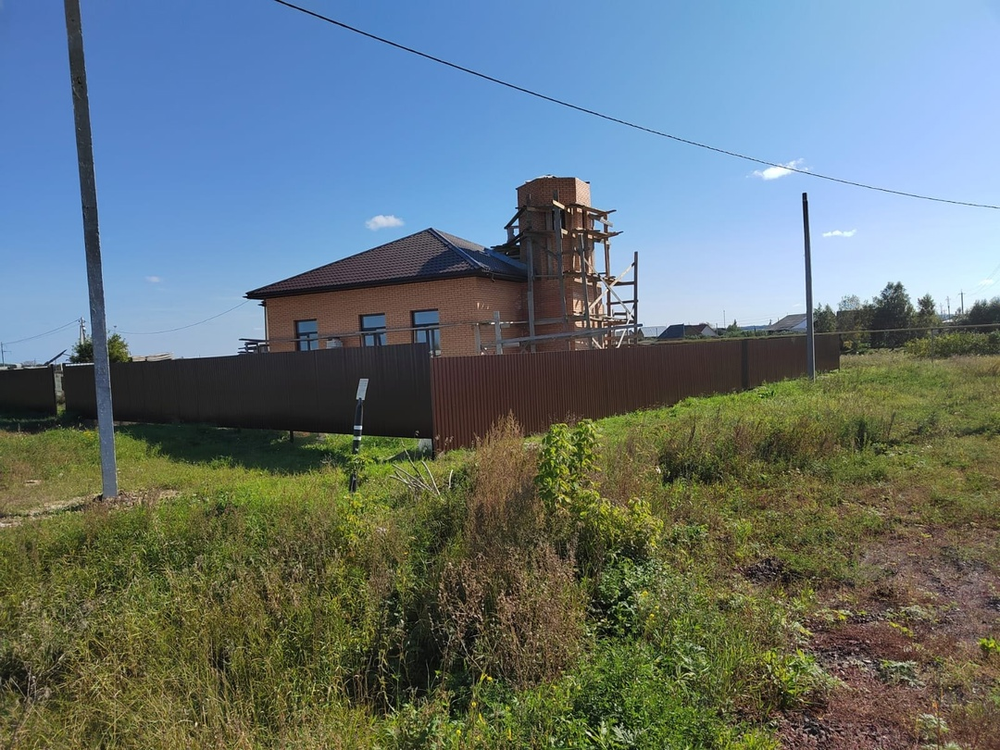

Всевышний Аллах в священном Коране говорит:

إِنَّمَا يَعْمُرُ مَسَاجِدَ اللَّهِ مَنْ آمَنَ بِاللَّهِ وَالْيَوْمِ الْآخِرِ وَأَقَامَ الصَّلَاةَ وَآتَى الزَّكَاةَ وَلَمْ يَخْشَ إِلَّا اللَّهَ، فَعَسَىٰ أُولَٰئِكَ أَنْ يَكُونُوا مِنَ الْمُهْتَدِينَ.

"Оживляет мечети Аллаха (только) тот, кто уверовал в Аллаха и в Последний день, совершал молитву, давал обязательную милостыню и не боялся (никого), кроме Аллаха. И такие обязательно будут из (числа) идущих (истинным) путем!", Сура Ат -Тауба, 18 аят.

Пусть Аллах, Субханаху Ва Та'аля, дарует баракят всем, кто принимает участие, вносит свой вклад, делает пожертвования, помогает финансово, делает дуаа.
И пусть Аллах дарует нам терпения и сил, чтобы поскорее завершить работы по строительству мечети.

---

### Ассаляму алейкум ва рахматуллахи ва баракятух уважаемые братья и сестры.

Хвала Аллаху, Господу миров, начали устанавливать забор в мечети Каргаполье.

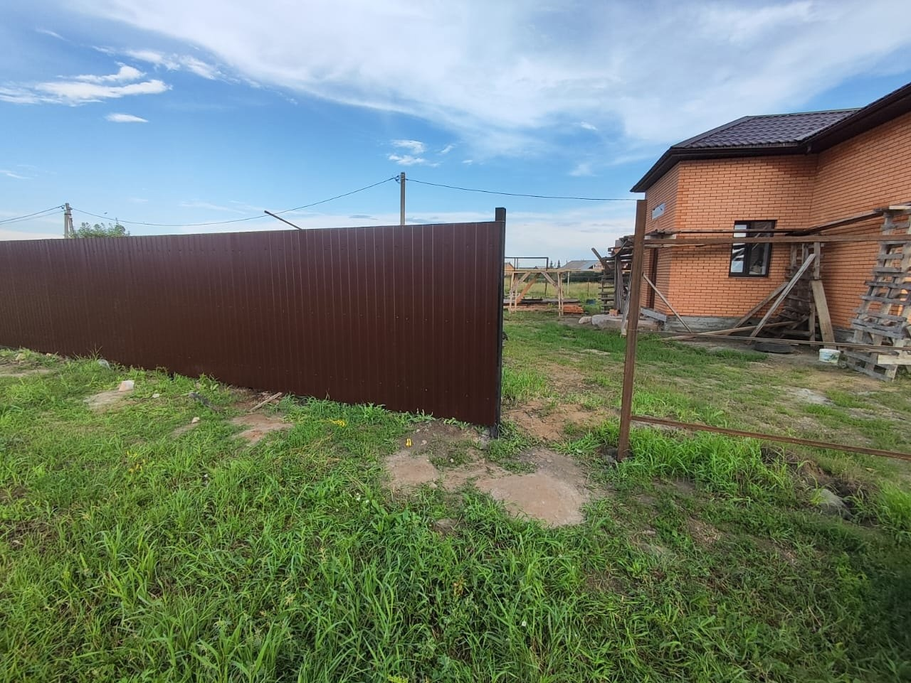
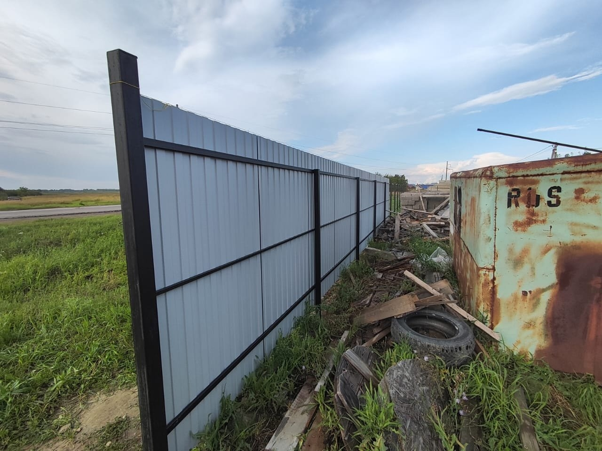

Также остаётся сделать кладку кирпича минарета. Просим Всевышнего чтобы помог нам, дал сил и терпения, чтобы в скорейшем времени завершить работы по строительству.

Пусть Аллах ниспошлет Свою Милость всем кто принимает участие в строительстве мечети!

Аллах Субханаху Ва Та'аля говорит в Кур'ане:

فِى بُيُوتٍ أَذِنَ ٱللَّهُ أَن تُرْفَعَ وَيُذْكَرَ فِيهَا ٱسْمُهُ ۥ يُسَبِّحُ لَهُ ۥ فِيهَا بِٱلْغُدُوِّ وَٱلْآصَالِ

"В домах, которые Аллах дозволил воздвигнуть, поминается Его имя. Его славят в них по утрам и перед закатом." сура Ан-Нур, 36 аят.

---

بسم الله الرحمن الرحيم

Ассаляму алейкум ва рахматуллахи ва баракятух уважаемые братья и сестры. Хвала Аллаху, Господу миров, мы продолжаем работы по строительству мечети в Каргаполье. На пожертвования мусульман братья приступили к установке забора (190 кв.м). Также доделывают кирпичную кладку, облицовочным кирпичом.

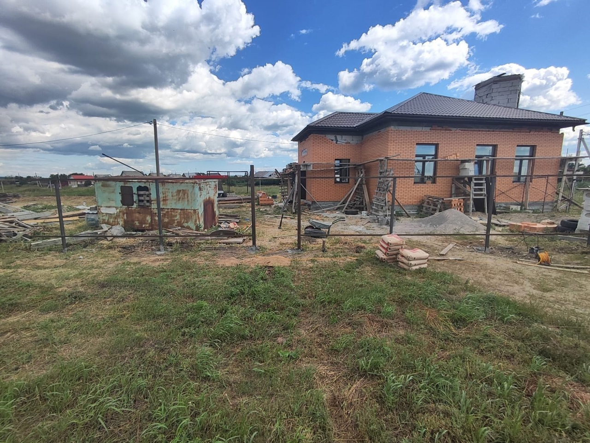

В хадисе говорится:

«عثمان بن عفان رضي الله عنه سمعت رسول الله صلى الله عليه وسلم يقول:«من بنى مسجدا يبتغي به وجه الله بنى الله له بيتا في الجنة» وفي رواية «بنى الله له مثله في الجنة

Усман бин Аффан (да будет доволен им Аллах) сказал: «Я слышал, как Посланник Аллахаﷺ сказал: «Кто воздвигнет мечеть, желая увидеть Лик Аллаха, тому Аллах возведёт дворец в Раю». В другом риваяте приводится: «Кто воздвигнет мечеть, желая увидеть Лик Аллаха, тому Аллах возведёт подобное этой мечети в Раю». «Сахих» Аль-Бухари и «Сахих» Муслим.

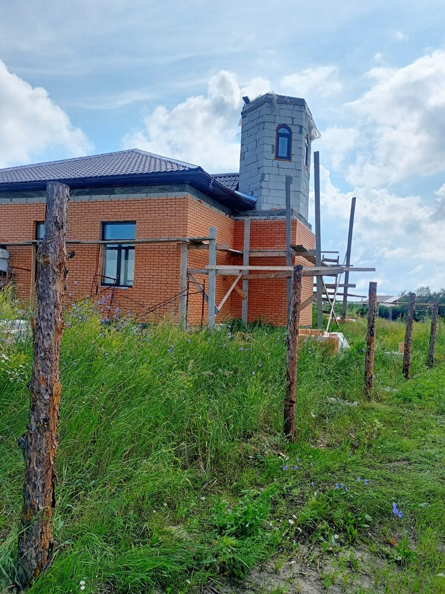
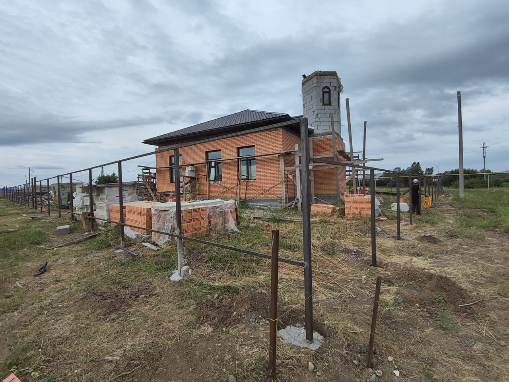

Пусть Аллах Субханаху Ва Та'аля дарует нам сил и поможет в скором времени завершить строительство, и пусть данная мечеть принесёт пользу мусульманам нашего края.

---
## Время намаза на июль 2024 года для Кургана

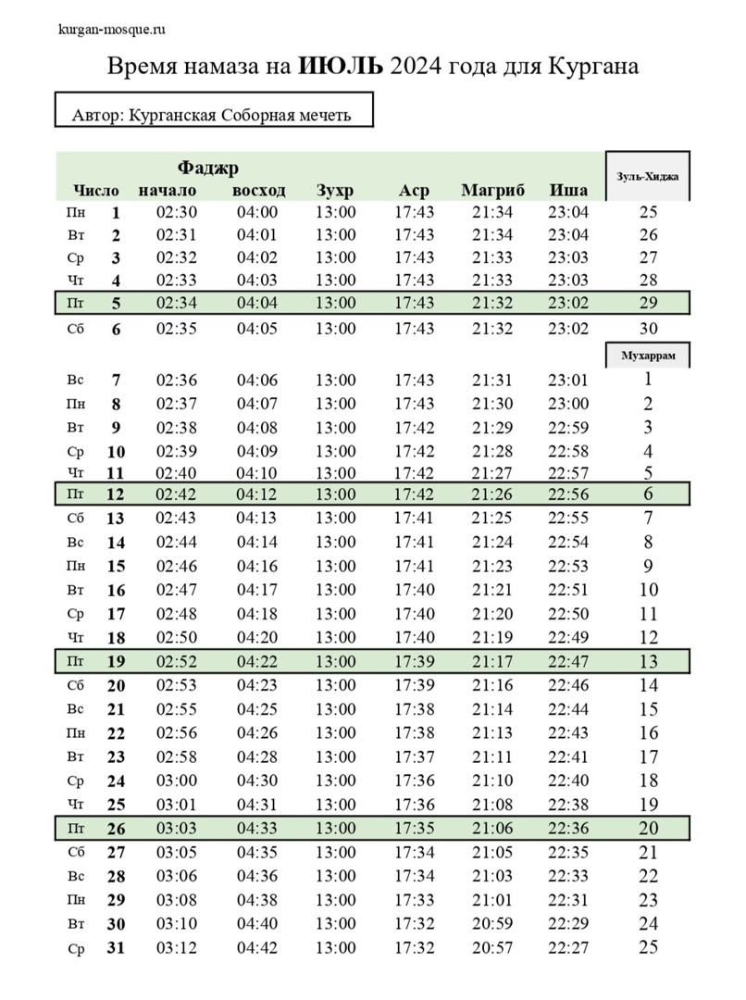

---

## Поздравление губернатора Курганской области Шумкова В. М. с праздником Ид Аль-Адха (Курбан Байрам).

16 июня – Курбан-байрам

Уважаемые жители Курганской области, исповедующие ислам, поздравляю вас с праздником Курбан-байрам!

Этот день возвращает к истокам веры и напоминает о вечных ценностях, общих для всех – бескорыстии, справедливости, милосердии, заботе и уважении о ближнем.

Вне зависимости от вероисповедания жителей нашей области объединяет любовь к нашей стране и региону. Вместе мы реализуем амбициозные проекты, делаем добрые дела, поддерживаем наших ребят на СВО. На деле доказываем, что понимаем наш путь и чувствуем себя единой командой, не зависимо христиане мы или мусульмане.

Пусть каждому, кто отмечает Курбан-байрам, праздник принесёт радость и любовь, пусть в ваших домах будет благополучие и счастье.

Губернатор Курганской области В.М. Шумков

---

## Поздравление председателя КГРОМ Зиёдали Хаджи Мизробова с праздником Ид Аль-Адха (Курбан Байрам) 2024 года.

بسم الله الرحمن الرحيم

Приветствие и благословение Аллаха Пророку Мухаммадуﷺ его семье, сподвижникам и всем тем кто следует его призыву до Судного дня.

السلام عليكم ورحمة الله وبركاته

Мир вам, Милость Всевышнего Аллаха и Его Благославение!

Уважаемые братья и сестры! Искренне, от чистого сердца поздравляю вас с благословенным праздником Ид Аль-Адха(Курбан Байрам)!

Ид Аль-Адха - это праздник стремления к милости Господа миров через милосердие и сострадание, любовь и добродетель к близким и далеким, восстановление уз братства и добрососедства со всеми людьми.

Аллах Субханаху Ва Тааля говорит в Кур'ане:

وَلِكُلِّ أُمَّةٍ جَعَلْنَا مَنْسَكًا لِيَذْكُرُوا اسْمَ اللَّهِ عَلَىٰ مَا رَزَقَهُمْ مِنْ بَهِيمَةِ الْأَنْعَامِ ۗ فَإِلَٰهُكُمْ إِلَٰهٌ وَاحِدٌ فَلَهُ أَسْلِمُوا ۗ وَبَشِّرِ الْمُخْبِتِينَ (34) الَّذِينَ إِذَا ذُكِرَ اللَّهُ وَجِلَتْ قُلُوبُهُمْ وَالصَّابِرِينَ عَلَىٰ مَا أَصَابَهُمْ وَالْمُقِيمِي الصَّلَاةِ وَمِمَّا رَزَقْنَاهُمْ يُنْفِقُونَ(35)

«Для каждой общины Мы установили места жертвоприношений (или религиозные обряды), чтобы они поминали имя Аллаха над скотиной, которой Он наделил их. Ваш Бог - Бог Единый. Будьте же покорны Ему. А ты сообщи благую весть смиренным,
сердца которых при упоминании имени Аллаха переполняются страхом, которые терпеливы к тому, что их постигает, совершают намаз и расходуют из того, чем Мы их наделили.», Сура Аль-Хадж (34-35 аяты).

Уважаемые братья и сестры! Искренне поздравляю вас с праздником Ид Аль-Адха (Курбан Байрам)!
Этот священный праздник воплощает в себе нравственные принципы ислама - милосердие, доброту, любовь к людям, сочувствие к ближнему. Пусть эти ценности помогают сохранять в наших сердцах душевную чистоту и направляют нас на свершение благих дел.
Дай Аллах, чтобы в наших семьях всегда царили любовь и искренняя вера во Всевышнего, и пусть ответом на наши молитвы и добрые дела станут милость и безграничное милосердие Аллаха.

Пусть Аллах Азза Ва Джаль, благославит всех людей мира, жить в мире и согласии, радуясь успехам друг друга, достойными счастья этого и Вечного мира.

Пусть Аллах дарует вам и вашим семьям благополучия, крепкий иман, и ведёт вас прямым путем.

Пусть Аллах ответит на все ваши молитвы, примет благие деяния на Его пути, и дарует Райские сады в вечной жизни. Пусть этот праздник будет наполнен радостью и баракятом.

Да пребудет над вами мир, Милость Аллаха и Его Благославение.

Напоминаем, что праздник жертвоприношения в этом году отмечается 16 июня.

Праздничный намаз состоится 16 июня в 7 часов утра в Курганской Соборной мечети (Сибирская 2А)

السلام عليكم ورحمة الله وبركاته

С уважением и добрыми молитвами, Председатель Курганской городской религиозной организации мусульман Зиёдали Хаджи Мизробов.

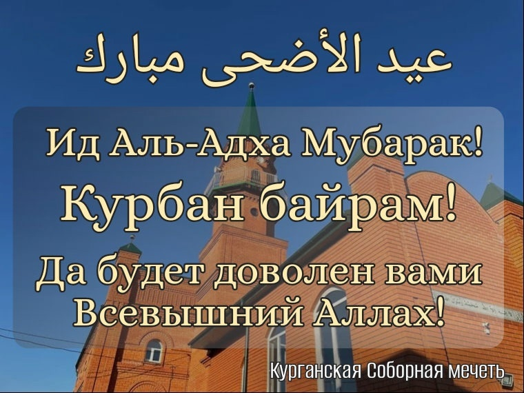

---
---
بسم الله الرحمن الرحيم

Ассаляму алейкум ва рахматуллахи ва баракятух уважаемые братья и сестры. Приветствие нашему Пророкуﷺ, его семье, сподвижникам и всем тем кто следует его призыву до Судного дня.

13 апреля мы посетили Куртамышский район, Куртамышскую мечеть. Встретились с имамом мечети Исмурзиновым Зерделы Кадеровичем. Альхамдулиллях братья уже установили доски, балки для крыши. ИншаАллах до конца года достроим, будем проводить джума намазы в этой мечети, 5 раз в день намаз читать будем, ИнШаАллах.

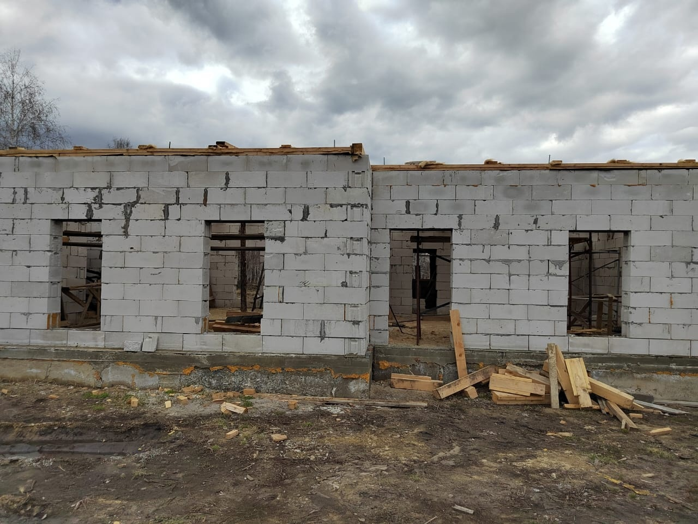
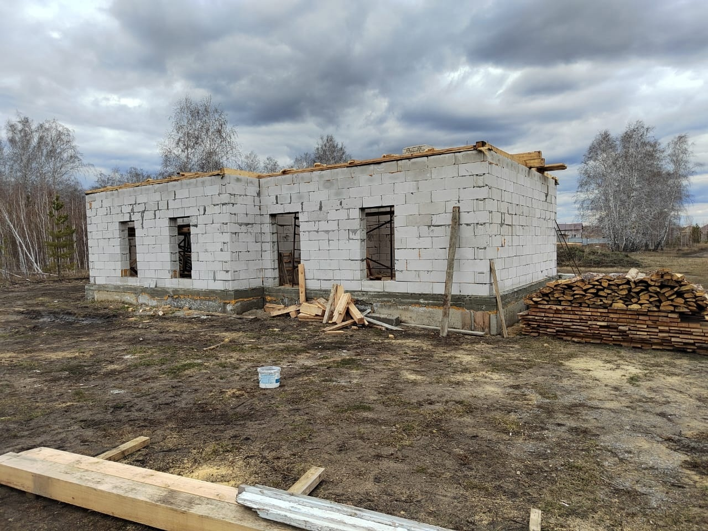

Просим Аллаха Субханаху Ва Тааля чтобы помог нам поскорее завершить работы. Пусть Аллах укрепит наши сердца на Его религии, поможет нам в благом деле, даст терпения и сил🤲🏽🤲🏽

---

## Поздравление губернатора Курганской области с праздником Ураза-Байрам.

10 апреля - Ураза-Байрам

Уважаемые жители Курганской области, исповедующие ислам!

Поздравляю вас с Ураза-байрамом!

Этот светлый день завершает пост священного месяца Рамадан – символа обновления и духовного очищения. Следуя многовековым традициям и ценностям праздника, мусульмане встречают его с особой радостью в сердце и надеждой на лучшее. Сегодня, когда наша страна и наш регион переживают непростые времена, эта надежда нужна каждому вне зависимости от веры.

Праздник напоминает о главных человеческих ценностях – милосердии, стремлении к добрым делам, помощи ближнему.

Пусть Ураза-Байрам принесёт в каждый дом спокойствие, взаимопонимание и благополучие, придаст новых сил и надежду.

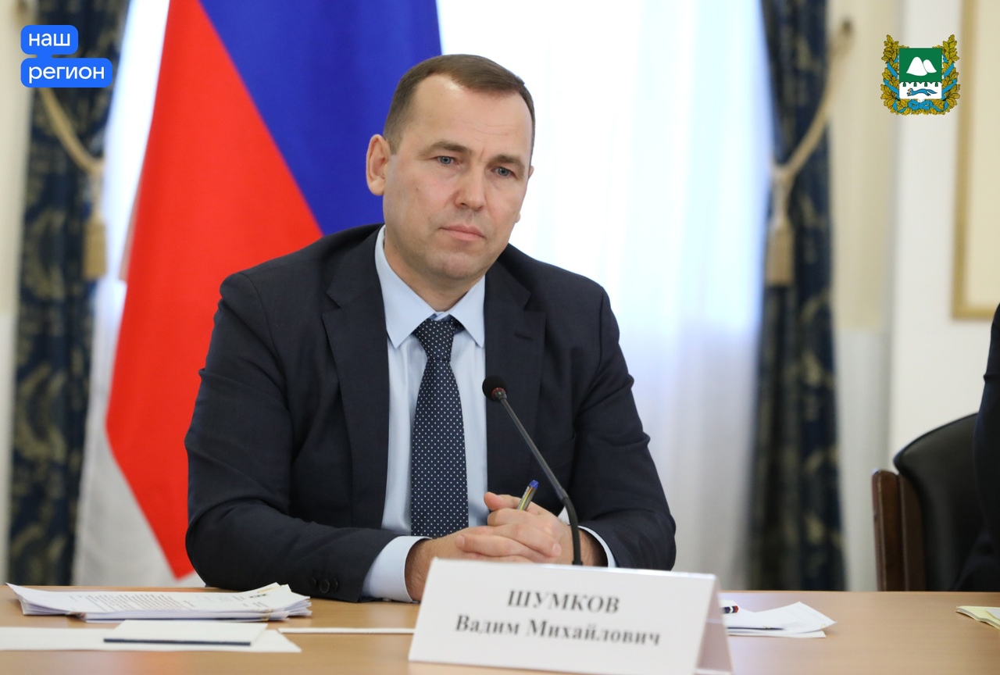

Губернатор Курганской области В.М. Шумков

---

---
بسم الله الرحمن الرحيم

---

**РЕКВИЗИТЫ ДЛЯ ДОБРОВОЛЬНЫХ ПОЖЕРТВОВАНИЙ:**

Курганская городская религиозная организация мусульман

ООО Банк «КУРГАН»

ИНН 4501055960

КПП 450101001

р/сч 40703810800000000428

БИК 043735830

к/сч 30101810700000000830

НАЗНАЧЕНИЕ: ДОБРОВОЛЬНОЕ ПОЖЕРТВОВАНИЕ

---

---
