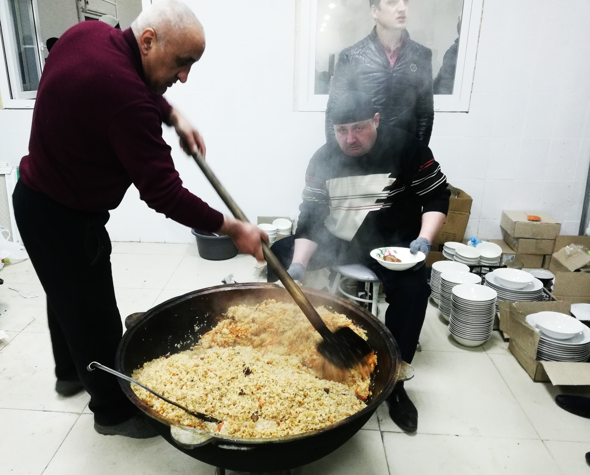
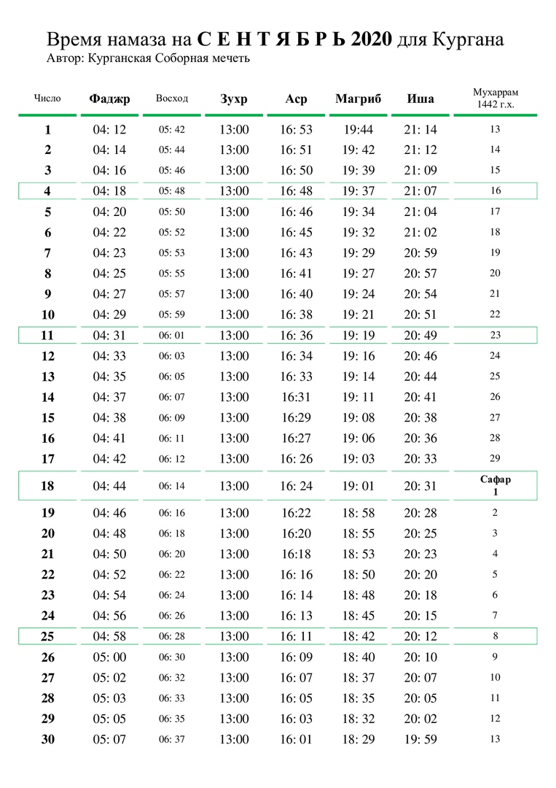
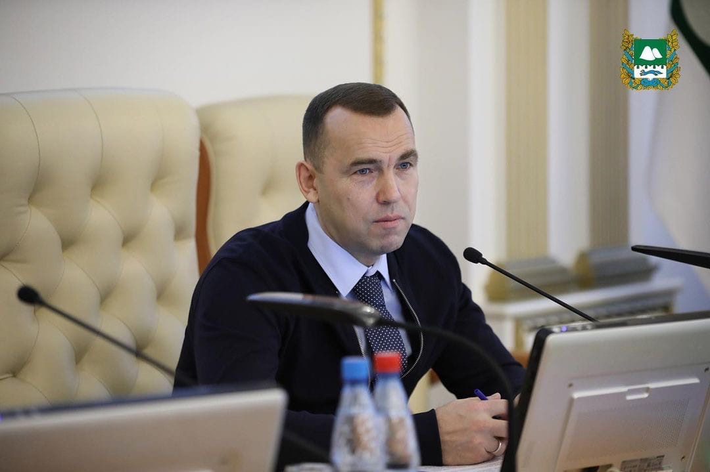
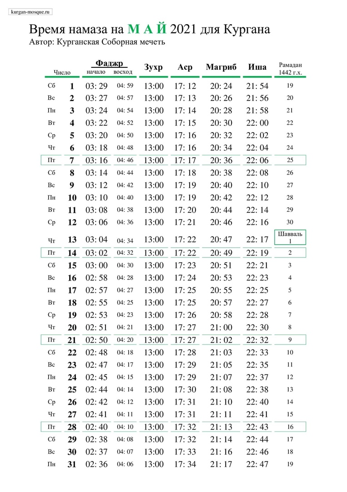
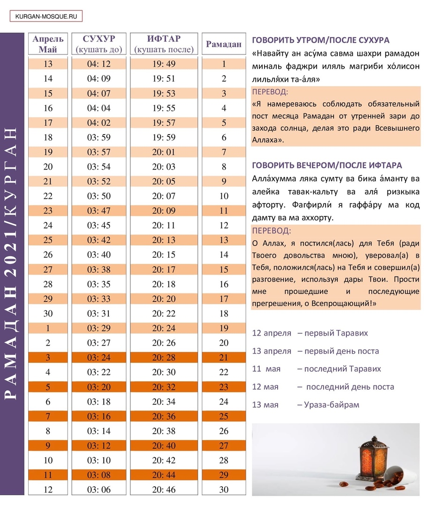
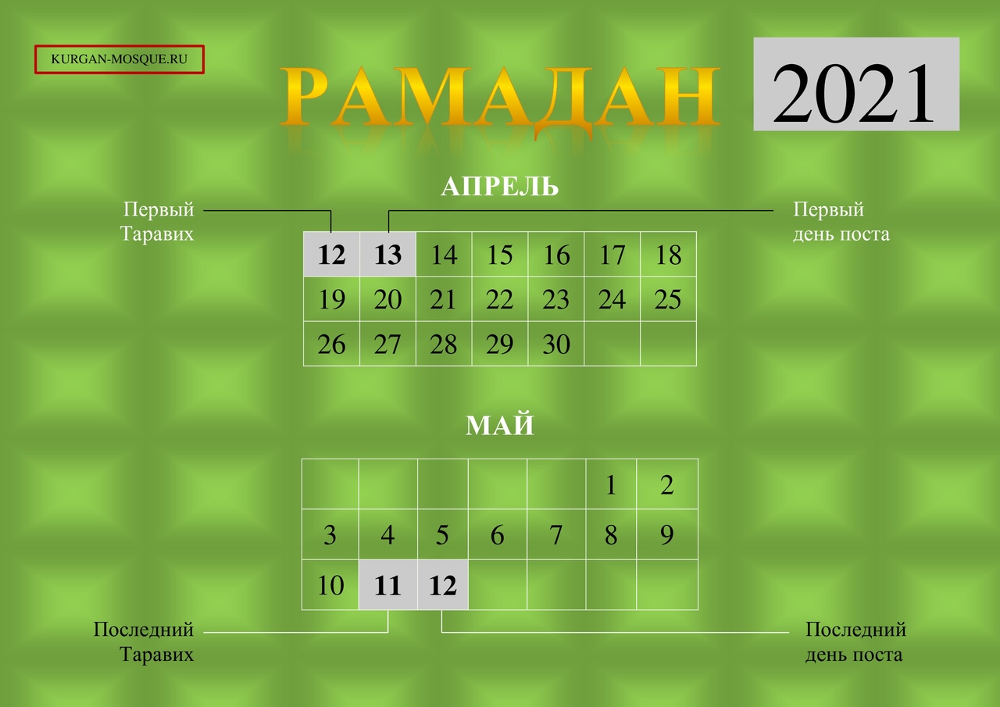

### Итоги Рамадана 2021

***«Кто постился в Рамадан с верой и надеждой на вознаграждение, тому будут прощены совершенные ранее грехи» (Аль-Бухари, Муслим)***
Вот и закончился Священный Рамадан. Он принес благо в наши дома, покой и радость в наши семьи. В этом году мы вместе с Вами прочитали все 30 джузов Корана, изучив его от начала до конца за 16 дней Рамадана. В этом нам с вами помогли два хафиза, которые присутствовали в эти ночи в мечети. Аллах сказал: ***«Если мои рабы спросят тебя обо Мне, то ведь Я близок и отвечаю на зов молящегося, когда он взывает ко Мне»*** (Коран, 2:186)

В этом году ифтары в мечети проводились по новому - перед постящимися распахнул свои двери просторный зал для торжеств. Этот зал способен вместить в себя до 150 человек, и построен полностью на пожертвования наших братьев мусульман. Мир и благословение их семьям. Аллах в Священном Коране сказал: ***«Воистину, Аллах любит творящих добро»***(Коран, 3:134)

Все работы, необходимые для функционирования зала, с благословения Аллаха, были окончены в месяц Рамадан: благодаря Вам, дорогие прихожане, мы подвели газ, оборудовали кухню и септик. АльхамдулиЛлях, зал торжеств готов принять гостей по любому поводу.

Иногда в этом зале не хватало мест всем присутствующим: поучаствовать в ифтаре иногда приходило до 200 человек. Ифтары организовывали узбеки, таджики, чеченцы, дагестанцы, киргизы, азербайджанцы, казахи. Они словно соревновались в своей щедрости – прихожане восхищались количеством еды и ее разнообразием. ***«Если вы одолжите Аллаху прекрасный заем, то Он приумножит его для вас и простит вас.»*** (Коран, 64:17) Пусть Аллах примет все ваши дела и простит вас! ***«Воистину, Аллах - с теми, кто богобоязнен и кто творит добро*** (Коран, 16:128)

Ночь Лейлят-аль-Кадр в мечети посетили и провели в молитвах около 200 человек. Окончание Рамадана омрачило печальное известие из Казани, и мы с вами делали дуа за их души.
Аллах в Коране говорит: ***«Мир вам! Войдите в Рай благодаря тому, что вы совершали.»*** (Коран, 16:32) Мы желаем Рая всем, кто совершает благо. ***«Тот, кто надеется на встречу со своим Господом, пусть совершает праведные деяния и никому не поклоняется наряду со своим Господом.»*** (Коран, 18:110) Поклоняйтесь Аллаху, делайте добрые дела, и надейтесь на прощение!

***С уважением и добрыми молитвами во всех ваших благих делах, Председатель Курганской городской религиозной организации мусульман, Зиедали хаджи Мизробов***

---

### Поздравление губернатора В.М. Шумкова с Ураза-байрамом

***Уважаемые жители Курганской области, исповедующие ислам!***

Поздравляю вас с одним из главных мусульманских праздников - окончанием священного месяца Рамадан. Пусть Ураза-байрам войдёт в ваши души светлой радостью, наполнит ваши дома любовью, весельем и улыбками родных и близких.

Многовековые обычаи ислама – это бесценная сокровищница духовности, нравственных идеалов, чистоты помыслов, примеров милосердного отношения к ближнему, созидательного единения. И сакральный месяц Рамадан, атмосфера праздника Ураза-байрам, как нельзя лучше это передают и способствуют сохранению и укреплению добрых традиций. В современном мире, в сложный период пандемии это особенно важно.

Благодарю мусульманские организации Курганской области, жителей региона, исповедующих ислам за весомый вклад в развитие экономики и культуры нашего края, в сохранение межконфессионального мира и согласия, противодействие экстремизму.

От всей души, друзья, желаю вам и вашим близким здоровья и благополучия!

***Губернатор Курганской области В.М. Шумков***

https://kurganobl.ru/content/uraza-bayram

---

### ПОЗДРАВЛЕНИЕ
### С праздником Ураза Байрам (Ид аль-Фитр) 2021

***Хвала Аллаху, Господу миров, приветствия и благословения Аллаха Пророку Мухаммаду, его семье и сподвижникам, и всем тем, кто следует Его призыву до судного дня!***

ДОРОГИЕ БРАТЬЯ И СЕСТРЫ!

Поздравляю вас с наступлением священного праздника всех мусульман, с праздником Ид аль-Фитр, который состоится **13 мая 2021 г.**

Пусть этот праздник Ураза байрам станет днем милости Аллаха для всех нас, днем очищения нашего духа, укрепления веры и днем исламского единства, ради достижения благородных целей нашей великой веры!

Уважаемые братья и сестры, в течение месяца Рамадан мы воздерживались от еды и питья, своими благими деяниями возвеличивали этот Священный месяц, который возвеличен самим
Аллахом и ниспослан для блага мусульман. Также все мы знаем, что последние дни Рамадана были омрачены чудовищной трагедией, произошедшей в Казани. Мы возносим свои молитвы
за души погибших и за выздоровление пострадавших. ***"Воистину, мы принадлежим Аллаху, и к Нему мы вернемся." (Св. Коран, 2:156)***

Пусть эти праздничные дни, как и Священный месяц Рамадан, явятся благом для нас, наших близких и для всех мусульман. Пусть Аллах ниспошлет в каждый дом, и в каждую семью
счастье, мир и благополучие!

### НАПОМИНАЕМ: ПРАЗДНИЧНЫЙ СОВМЕСТНЫЙ НАМАЗ СОСТОИТСЯ 13 МАЯ 2021 Г. В 9-00 ПО АДРЕСУ: УЛ. СИБИРСКАЯ, 2А, КУРГАНСКАЯ СОБОРНАЯ МЕЧЕТЬ.

***С уважением и добрыми молитвами во всех ваших благих делах, Председатель Курганской городской религиозной организации мусульман, Зиедали хаджи Мизробов***

---
---
### Соболезнования всвязи с трагедией в Казани

От имени мусульман Кургана и Курганской области выражаем искренние и глубокие соболезнования родным и близким погибших в трагедии, которая произошла в Казани 11.05.2021.  Пусть упокоит Аллах с миром души тех, кто покинул мир в дни уходящего Рамадана. Поистине, мы от Аллаха и к Нему наше возвращение.
⠀
Скорбим и возносим свои молитвы за погибших. Делаем дуа за скорейшее выздоровление раненых.

***С уважением, администрация Курганской соборной мечети.***

### Время намаза на май 2021 года для Кургана

---

## Поздравление с наступлением благословенного Рамадана 2021 года.
***Во имя Аллаха, милостивого и милосердного!***

Хвала Аллаху, Господу миров, ниспославшему своим рабам священный месяц Рамадан, чтобы очистить их от грехов и заблуждений. Мир, милость Аллаха и его благословение Пророку Мухаммаду, его семье и сподвижникам, а также всем, кто последовал Его призыву до судного дня.

Уважаемые братья и сестры! Поздравляю вас с наступлением священного месяца Рамадан. В ночь с 12 на 13 апреля, с появлением новой луны, начинается священный месяц Рамадан. Вот приближается время, когда нисходит милость Аллаха, и каждый верующий, поклоняющийся, может очиститься от накопившихся грехов и ошибок. Это благословенное время – священный месяц Рамадан, о котором Пророк говорил: **«Его начало – милость Аллаха, середина – прощение, а последние дни – спасение от адского огня».**

Эти слова Пророка (мир ему) обращены ко всем, кто с радостью ожидает прихода Рамадана, чтобы совершить предписанный пост-ураза, благо за который будет воздано человеку самим Аллахом. В одном из хадисов, со слов самого Всевышнего Аллаха, сказано: **«Пост ради Меня, и Я лично вознагражу за него»**, - говорит Аллах. Таким образом, месяц Рамадан – месяц великой награды и нескончаемого милосердия. Каждый мусульманин должен помнить об этом, и, нравственно очищаясь, с радостью ждать наступления Рамадана.

Также тому свидетельствуют слова пророка Мухаммада (мир ему), который однажды обратился к своим сподвижникам (сахабам) в последний день месяца Шаабан и сказал: **«О, люди! Истинно наступает великий и благословенный месяц. Месяц, в котором есть ночь, превосходящая по благости тысячу месяцев. Аллах в этом месяце сделал обязательным пост. И предписано чтение ночных молитв (таравих). Тот, кто добровольно увеличит поклонение в этом месяце, тому будет вознаграждение, как за выполнение обязательного (фарза). А тот, кто исполнит обязательное (фарз), наградой ему будет то, как будто он исполнил семьдесят фарзов. Это месяц терпения! А награда за терпение – Рай. Это месяц, когда Аллах увеличивает долю (ризк) верующего в Него. Тот, кто сделает ифтар постящемуся, тому Аллах простит его грехи, спасет от огня и вознаградит равным тому, чем вознаградит постящегося, не умалив его награды».** (Хадис)

Поэтому, в это благословенное время, которое скоро наступит, мы должны больше молиться, держать уразу, совершать таравих намазы в коллективе и делать ифтар тем, кто в этом нуждается. Особенно важно это сейчас, когда нравственные устои нашего общества разрушаются, молодежь, нередко, склонна к порочным привычкам. Этот благословенный месяц должен стать месяцем нашего единения, взаимных прощений обид и огорчений, должен послужить укреплению нравственного состояния нашего народа.
Пусть Аллах ниспошлет свою милость тем, кто поклоняется Ему, творит добро и благое, ожидая встречи с Создателем в день, когда не будет у него защитника кроме Господа миров – Всевышнего Аллаха.

***Пусть Аллах даст всем нам счастья в обоих мирах и в день страшного Суда сохранит нас от огненного наказания! Амин!***

### Также напоминаю, что каждую ночь месяца Рамадан совершается дополнительная молитва Таравих.
### Коллективная молитва Таравих будет проводиться в мечети города Кургана, по адресу: ул. Сибирская, 2А.

***С уважением и добрыми молитвами во всех ваших благих делах,председатель Курганского городского религиозного общества мусульман,Зиёдали Хаджи Мизробов.***

---
## РАМАДАН 2021

---
## СОБЛЮДЕНИЕ ПОСТА В МЕСЯЦ РАМАДАН (2021)

Совет улемов Централизованной религиозной организации «Духовное управление мусульман Российской Федерации» (далее — ДУМ РФ) в ходе дистанционного заседания, состоявшегося 12-го числа месяца Шабан 1442 года по лунному календарю, что соответствует 25-му марта 2021 г. по григорианскому календарю,

### постановил:

1. Согласно лунному календарю, месяц Рамадан 2021 наступит с заходом солнца **12 апреля**. После пятой молитвы в этот же день совершается Таравих. Первым днем поста следует считать 13 апреля, последним же днем — 12 мая. Первый день месяца Шавваль и Ураза-байрам — 13 мая. Последний Таравих — 11 мая.

2. Размер закятуль-фитр на 2021 год составляет:
⎯ 100 рублей для малоимущих;
⎯ 300 рублей для людей со средним достатком;
⎯ от 500 рублей для состоятельных.
Данные суммы закятуль-фитр выведены из расчета средней стоимости таких продуктов питания, как финики, ячмень, пшеница и изюм, о которых есть упоминание в достоверных хадисах. Сумма в 100 рублей является минимальной и обязательной к выплате. Суммы в 300 и 500 рублей являются рекомендуемыми. Если верующий не успел выплатить закятуль-фитр до праздничной молитвы, то обязательность налога все равно сохраняется: верующий должен передать его сразу, как представится возможность.

3. Минимальная сумма искупительной милостыни (фидья-садака), выплачиваемой человеком, который не в состоянии соблюдать пост по веским причинам, составляет 250 рублей, однако сумма может быть увеличена в зависимости от собственных среднесуточных затрат на питание.

Выдержка из БОГОСЛОВСКОГО ЗАКЛЮЧЕНИЯ № 2/21 Совета улемов ЦРО ДУМ РФ.

---

---

