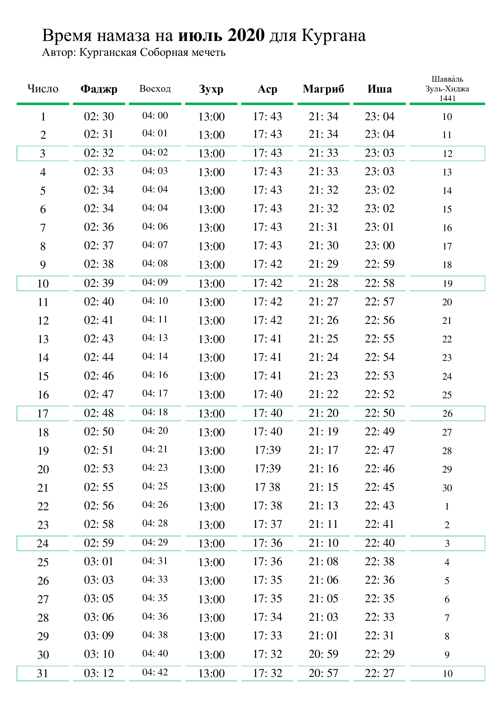

### 20 лет Курганской Соборной мечети

**15 июля 2020 года** - знаменательное событие для мусульман Курганской области. В этот день, ровно 20 лет назад, была совершена закладка первого камня в основание 
Соборной мечети г. Кургана.

Местная религиозная организация Курганской области, во главе с её уважаемым председателем Зиёдали Мизробовым, продолжает лучшие традиции мусульман, и помнит о своих 
славных предшественниках, своими трудами укреплявших Ислам. За эти 20 лет мусульмане вместе, одной семьёй, преодолели немало трудностей административного, финансового, 
организационного плана, и теперь уже уверенно можно сказать, что работа по сооружению главного по значимости областного религиозного центра мусульман – Курганской 
Соборной мечети – почти полностью завершен.

За эти годы, из одного камня вырос целый комплекс сооружений. Общими силами мусульман Кургана и Курганской области, представителей различных национальностей, объединенных 
единой верой во Всевышнего, практически закончено строительство Соборной мечети и религиозного комплекса при ней. На завершающей стадии строительства находится просторный 
зал для проведения маджлисов. Уже сейчас прихожанам доступны: библиотека, помещения для приёма граждан, учебный класс, открытая площадка для проведения мероприятий. Вскоре 
по милости Всевышнего Курганская Соборная мечеть станет духовным центром для всех мусульман области и для гостей региона.

Просим Аллаха преумножить добрые дела и увеличить награду всем, кто принимал и принимает участие в становлении мечети и жертвует на благо религиозного центра.

***Пресс-служба Курганской Соборной мечети***

_________________________________________________________________________________________________________________________________________________________________________________

### Время намаза на июль 2020 года для Кургана

________________________________________________________________________________________________________________________________________

### МРОМ Кургана в юрисдикции ДУМ РФ РФ рекомендован поэтапный выход из ограничений

**Местной религиозной организации мусульман Кургана Курганской области** в юрисдикции Духовного управления мусульман РФ поступило циркулярное письмо за подписью первого заместителя председателя ДУМ РФ Дамира Мухетдинова с рекомендациями по поэтапному выходу из ограничений.

***«Учитывая заявление главы Роспотребнадзора Анны Поповой о стабилизации эпидемиологической ситуации в стране (от 25 мая 2020 г.), в связи с чем во многих регионах России планируется поэтапное смягчение ограничений из-за пандемии, Духовное управление мусульман Российской Федерации считает целесообразным для мусульманских организаций в своей юрисдикции постепенное снятие ограничений на коллективные богослужения начиная с 1 июня 2020 г.»***, - говорится в документе.

Согласно циркулярному письму, при выходе из ограничений должны быть соблюдены ряд условий, в том числе учитываться постановления, указы и иные документы органов государственной и местной власти, экспертные мнения и оценки; во время коллективных молитв размещать в храмах людей на определенной дистанции друг от друга; лицам старше 65 лет и хроническим больным рекомендовать воздержаться от посещения молитв; при входе в мечети и молельные залы продолжать соблюдение масочно-перчаточного режима и т.д.

Напомним, в Курганской Соборной мечети были введены ограничения по приёму верующих на протяжении более двух месяцев в связи с угрозой распространения новой коронавирусной инфекции.

***Пресс-служба Курганской Соборной мечети***
________________________________________________________________________________________________________________________________________
________________________________________________________________________________________________________________________________________

