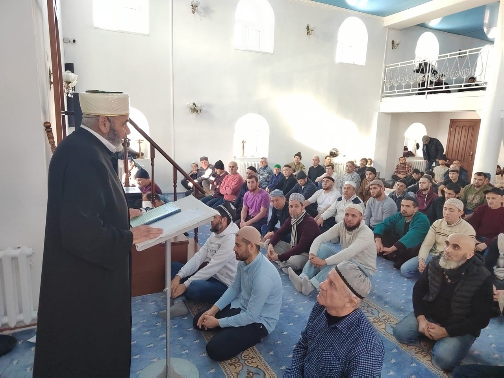

9 февраля 2024, в Курганской Соборной мечети, Зиёдали Курбонович Мизробов провел хутбу на тему «Исра-Валь - Мирадж».

Ночной Перенос и Вознесение Пророкаﷺ являются величайшими знамениями Аллаха, указывающими на правдивость 
Посланника Аллахаﷺ а также на его высокое положение перед Великим и Всемогущим Аллахом. 
Также эти события свидетельствуют об огромном могуществе Аллаха и Его возвышенности над всеми творениями.
Всевышний Аллах сказал в Коране:

سُبْحَانَ الَّذِي أَسْرَى بِعَبْدِهِ لَيْلًا مِنَ الْمَسْجِدِ الْحَرَامِ إِلَى الْمَسْجِدِ الأَقْصَى الَّذِي بَارَكْنَا حَوْلَهُ لِنُرِيَهُ مِنْ آيَاتِنَا إِنَّه هُوَ السَّمِيعُ الْبَصِيرُ

"Пречист Тот, Кто перенес ночью Своего раба, чтобы показать ему некоторые из Наших знамений, 
из Заповедной мечети в мечеть аль-Акса, окрестностям которой Мы даровали благословение. 
Воистину, Он - Слышащий, Видящий", сура Аль-Исра(Ночной Перенос), 1 аят.

