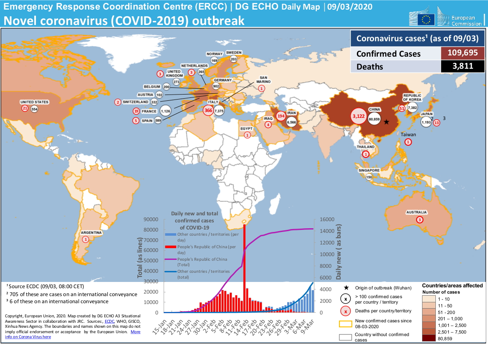

# Новости

## Пленум ДУМ РФ рассмотрел вопросы функционирования общин в месяц Рамадан и в период пандемии

**Первое в истории Духовного управления мусульман Российской Федерации заседание пленума (был создан решением Съезда ДУМ РФ в 2019 г.) состоялось 22 апреля 2020 г. в режиме видеоконференции.** Руководители региональных централизованных религиозных организаций в юрисдикции ДУМ РФ под председательством первого заместителя председателя ДУМ РФ Дамира Мухетдинова изложили основные проблемы, с которыми сталкиваются религиозные организации в условиях пандемии.
 
В ходе онлайн-заседания из своей резиденции при Московской Соборной мечети к заседанию подключился председатель Духовного управления мусульман РФ и Совета муфтиев России муфтий шейх **Равиль Гайнутдин.** В своих наставлениях к духовенству, он призвал в эти нелегкие времена поддерживать верующих морально и духовно, дать людям чувство надежды, объяснить, что за испытанием от Всевышнего обязательно последует и облегчение и награда. Духовный лидер российских мусульман подчеркнул, что в условиях самоизоляции общинам следует перенаправить свою социальную активность на совершение добрых дел, поддержку одиноких, стариков и малоимущих.
 
Затем председательствовавший на заседании **Д.Мухетдинов** проинформировал его участников о тех шагах, которые предприняты Духовным управлением в связи с тяжелым материальным положением большинства мечетей и общин в период пандемии. Он сообщил о состоявшихся на днях телефонных разговорах муфтия шейха **Равиля Гайнутдина** с первым заместителем руководителя Администрации Президента России **С.Кириенко** и мэром Москвы **С.Собяниным**. В этих беседах до государственных деятелей были доведены основные проблемы общин в связи с вынужденным закрытием мечетей, молельных домов, культурно-просветительских центров и учебных заведений. Итог состоявшихся диалогов позволяет надеяться на то, что общины не останутся наедине со своими проблемами в трудные для всего общества времена.
 
С отчетами о режиме работы во время пандемии и текущем состоянии дел выступили все члены Пленума. Им были даны рекомендации по санитарно-профилактическим мерам, организации богослужений во время месяца Рамадан. По вопросам, с которыми обратились главы централизованных религиозных организаций, в структуре ДУМ РФ **Д.Мухетдиновым** сформирован пул поручений для заместителей муфтия и глав департаментов.

______________________________________________________________________________________________________________________________________

### ОБРАЩЕНИЕ
## муфтия шейха Равиля Гайнутдина по случаю наступления месяца Рамадан 1441 года Хиджры (2020 г.)

***С именем Аллаха, Милостивого и Милосердного!***

Вся хвала Всемилостивому Аллаху, Господу миров, Чья милость объемлет всякую вещь! Мир и благословение заключительному Божьему посланнику Мухаммаду, его семье, сподвижникам и всем тем, кто последовал за ним по пути истины вплоть до Дня Великого суда!

**Ас-саляму алейкум ва рахматуллахи ва баракатух!
Мир вам, милость Аллаха и Его благословение!
Дорогие мои братья и сестры!**

Наступает долгожданный месяц Рамадан. Месяц, когда мы, сплотившись вокруг идеалов добра, раскрываем в себе исконную фитру (природу), заложенную Всевышним в каждом человеке без исключения. Эта фитра, освободившись от плена мирской суеты и как следствие от мелочных мыслей, начинает сиять в нас созвездием самых лучших добродетелей: милосердием, состраданием, отзывчивостью, терпением, благоразумием. Сказано нашим благословенным Пророком:

إِذَا دَخَلَ شَهْرُ رَمَضَانَ فُتِّحَتْ أَبْوَابُ السَّمَاءِ، وَغُلِّقَتْ أَبْوَابُ جَهَنَّمَ، وَسُلْسِلَتِ الشَّيَاطِينُ

***«Когда наступает месяц Рамадан, распахиваются врата Рая и затворяются двери Ада, а шайтаны сковываются цепями» (Бухари, Муслим).***

Путь Рамадана начинается со встречи с самим собой, когда мы по повелению Господа избавляем разум от диктата двух первоначал телесности: еды и интимного вожделения. В этих потребностях тела нет ничего противоестественного и противозаконного по своей сути, но только до тех пор, пока они подчинены нам, а не мы им. Пост в месяц Рамадан как раз и помогает нам узнать правду о себе, понять, насколько велика власть тела над нашим духом. Не просто понять, а освободиться от этих незримых пут, неизменно стремящихся поработить человека, и вместе с тем закрепить или даже вернуть себе роль рулевого на корабле своей жизни. Рамадан — месяц самоосвобождения людей, когда мы через воздержание и молитвенное смирение выравниваем внутренний компас души с истинным камертоном жизни — божественной природой человека.

Возвращение к себе пробуждает человека от полудремы, которую нам ежедневно навеивает мир потребительских ценностей. В итоге мы с отчетливой ясностью осознаем, что подлинное счастье не в последних моделях смартфонов, модных нарядах, машинах и дорогостоящем убранстве дома. Подлинное счастье — в служении другому человеку, в помощи ближнему. Именно по этой причине завершение Рамадана венчает общемусульманский порыв братской и сестринской солидарности, который явлен в повсеместной раздаче фитра садака, то есть милостыни разговения. Милостыня разговения для страждущих и нуждающихся становится манифестацией преображения людей, закалившихся постным испытанием, символом нашего преодоления собственного эгоцентризма и готовности с новой силой служить людям. Это крайне важно, ведь именно служение людям составляет основу всякого нравственно здорового общества и нашего собственного счастья, которое мы неизбежно утрачиваем в погоне за ложными идеалами и целями.

Дорогие мои братья и сестры!

Все эти уроки Рамадана сегодня актуальны как никогда. Человечество столкнулось с колоссальным вызовом, который бросила миру коронавирусная пандемия. Смертельный вирус оставил на планете глубокий шрам в виде десятков тысяч погибших, миллионов зараженных, массовой потери работы, обеднении и обнищании многих и многих людей. Сегодня мир пребывает в потрясении. Людей охватило смятие и страх за свое будущее и будущее близких.

Вот почему так важна сегодня для нас глубинная мудрость Рамадана, тридцатидневного марафона добрых дел. Сейчас не время думать только о себе и своих интересах. Общепланетарная эпидемия наглядно показала, что все мы плывем на одном общем корабле и можем спастись лишь вместе.

Дорогие мои единоверцы!

Следуя идеалам священного Рамадана, призываю всех нас распахнуть сердца навстречу ближнему — не абстрактному ближнему, витающему в вакууме, а тому, кого мы видим каждый день на лестничной площадке, с кем вместе строим общее дело или сидим за одной студенческой скамьей. Ближний — это всякий, кого мы можем поддержать добрым словом, кому сумеем протянуть руку помощи или хотя бы сделать так, чтобы ему не стало еще тяжелее. Ближний сегодня — это наши родственники, друзья, соседи, коллеги, партнеры, клиенты, и даже конкуренты, а также те, кого мы по своей ограниченности мыслим врагами. Ближний — каждый, кого мы встречаем на жизненном пути, ибо все мы действительно в одной лодке.

Мои братья и сестры!

Когда Бог создавал человека,

وَنَفَخَ فِيهِ مِن رُّوحِهِ

***«Он вдохнул в него от Духа Своего» (Св. Коран 32:9).***

Мы — носители этого дыхания в себе. Мы — наместники Бога на земле. Мы — самое лучшее, что существует во Вселенной, ибо сказано в Св. Коране:

لَقَدْ خَلَقْنَا الْإِنسَانَ فِي أَحْسَنِ تَقْوِيمٍ

***«И мы создали человека совершеннейшим образом» (Св. Коран 95:4).***

Вот что составляет подлинную природу человека, которую мы прячем от себя и от людей за мертвой стеной страха, недоверия, зависти, жадности и алчности. Сегодня настало время отбросить всю эту наносную фальшь и раскрыть миру себя настоящих.

Если у нас есть руки и ноги, мы можем посвятить свободное время волонтерскому служению и позаботиться об одиноких людях и инвалидах. Если кто-то из нас поставляет товары и услуги, то он может снизить, насколько возможно, расцен ки тем, кто в этом особенно нуждается. А если кто из нас является работодателем, то он должен сделать все, что от него зависит, чтобы кормильцы семей, работающие под его началом, не оставили бы своих детей без средств к существованию. Только жертвуя и действуя во благо ближнего, мы сможем пройти через нынешнее суровое испытание. И только так все мы сможем выиграть в долгосрочной перспективе. В этом, собственно, и состоит глубинный урок Рамадана: жить не сиюминутными импульсами, а разумом и дальновидностью.

Дорогие мои соотечественники, единоверцы, братья и сёстры!

Молю Всевышнего Аллаха даровать всем нам доброго здравия, сил и стойкости. Да сохранит каждый из нас в это непростое время человеческое достоинство, несмотря на все невзгоды и трудности. Преклоняю колени пред Всевышним, моля Его о том, чтобы мы не очерствели сердцами, но встретили и провели великий месяц Рамадан так, как и подобает истинным верующим — с готовностью меняться к лучшему и неустанно помогая людям.

_С уважением и добрыми молитвами, Муфтий шейх Равиль Гайнутдин, Председатель Духовного управления мусульман Российской Федерации, Председатель Совета муфтиев России_

______________________________________________________________________________________________________________________________________

## Муфтий шейх Равиль Гайнутдин: Победить «COVID-19» через сотрудничество на путях мира и добра

Обращение духовного лидера российского мусульманства муфтия шейха Равиля Гайнутдина об объединении и солидарности в условиях противостояния человечества смертоносному вирусу:

***Во имя Аллаха Всемилостивого, Милосердного!***
 
Беспрецедентные по своим масштабам форсмажорные меры в борьбе против пандемии коронавируса «COVID-19», обвальный экономический спад в большинстве стран, разрушительное сокращение транспортных связей и гуманитарных контактов между людьми, странами и регионами охватили весь мир. Ко многим пришло понимание – невидимые глазу микроорганизмы, активизировавшиеся где-то очень далеко, за несколько месяцев могут не только стать проблемой №1 в мировой политике, но перевернуть весь образ жизни буквально каждого жителя планеты. Не об этом ли говорит в священном Коране Аллах: ***«Если мы пожелаем, то ниспошлем им с неба знамение, перед которым покорно склонятся их шеи» (26:4)***?!

Людей самых разных вероисповеданий и убеждений, говорящих на разных языках и имеющих самое разнообразное положение в обществе, объединяет в эти дни одно: осознание, что к ним пришла поистине вселенская беда, грозящая последствиями, вполне сравнимыми с теми, что приносят с собой большие мировые войны. Никто не знает сейчас, кроме Всевышнего Аллаха, каким выйдет мир из этого кризиса. Неизвестность порождает страх и тревогу, которые пронизывают буквально все слои общества.

В первую очередь, хочу обратиться к своим единоверцам. Многие из нас ощущают себя, словно они оказались в ловушке, многие опасаются потерять близких или не суметь завтра прокормить свою семью.

***Дорогие братья и сестры!***

В молитве – наше спасение, убежище и утешение! Испытание нам выпало суровое, но наш долг – принять его со смирением и терпеливостью, укрепить твердыню своей веры, прочувствовать всем сердцем то назидание, которое кроется в нашем вынужденном затворничестве. Давайте помнить, милость, щедрость Аллаха – безграничны, Его мудрость – превыше разумения человека. Самым праведным и подобающим мусульманину путем я считаю такой: сделать все от себя зависящее, чтобы обезопасить себя и своих близких, предпринять то, что в наших руках. А остальное – на что мы повлиять не в силах – оставить на Божью милость. Будем же уповать на Господа миров, ведь поистине, Он никогда не оставляет свои создания без попечения и милости!

Не исключено, мы так упорствовали в разделении и вражде, что Всевышний через напасть коронавирусной инфекции напоминает нам о братстве и родстве человечества, о нашем происхождении от одного прародителя.

Пандемия – беда, которую победить можно только совместно, только объединившись на пути мира и добра. Я призываю своих единоверцев проявлять заботу и милосердие в меру своих сил ко всем окружающим, вне зависимости от их вероисповедания, молиться о здоровье и избавлении от опасности коронавируса всех людей, всего человечества.

Обратимся же к лучшим примерам из нашей недавней истории – вспомним, как во время Великой Отечественной войны все народы нашей страны, представители всех вероисповеданий, да и заявлявшие о своем безверии наши сограждане, объединились, прежде всего сердцами и душевным настроем, на совместную борьбу и изгнание общего врага. Мы с трепетом в сердце говорим об истории Великой Отечественной войны, с бесконечным уважением относимся к подвигу победителей. Сегодня – буквально накануне 75-летия той великой Победы духа, давайте же будем достойны имени своих дедов, отвоевавшей мир у коричневой чумы!

Нас воспитывали на примере героев Великой Отечественной войны. Давайте сегодня поступать так, чтобы в будущем наши внуки воспитывали своих детей на нашем примере! Примере стойкости, гуманизма, верности и своему долгу, и призванию человечности.

Среди нас есть те, кто в это сложное время находится фактически на передовой. Это врачи и весь медицинский персонал, ученые-эпидемиологи и вирусологи, управленческий аппарат, занятый выстраиванием обороны от нашествия этого вируса, все те, кто денно и нощно совершает настоящий гражданский и профессиональный подвиг ради нашего с вами благополучия.

С большой гордостью за нашу страну и благодарностью к нашим руководителям мы воспринимаем ту помощь, которую сегодня Россия оказывает различным странам, даже за океаном, и даже тем, кто не всегда дружественно к нам настроен. Протягивать руку помощи в критический момент даже своему недоброжелателю, сопернику или очень далекому соседу – это признак сильного духом.

Я призываю высшее руководство страны и нашего национального лидера Владимира Путина не обделить своим вниманием и страны мусульманского мира, многие из которых видят в России гаранта многополярного мира и справедливого отношения ко всем участникам международной жизни. Этим Россия еще раз подтвердит свой статус не только великой военной, научной, культурной державы, но и державы гуманной.

Сегодня россияне как никогда с большим вниманием и надеждой воспринимают каждое слово, каждое действие облеченных властью мужей. Все россияне ждут от государства продуманных, выверенных и четких действий не только по предотвращению распространения инфекции, но и по купированию экономических последствий пандемии. Мы, в свою очередь, готовы оказать Президенту и всему нашему Отечеству всяческую поддержку и содействие в том, чтобы облегчить ношу людей, дать им надежду и уверенность в завтрашнем дне.

Российские мусульмане вместе со всеми народами нашей страны по достоинству оценили четкую позицию Генерального секретаря ООН Антониу Гутерреша против политики санкций, которая, по его справедливому мнению, мешает объединиться для борьбы с этой главной угрозой последних месяцев. На экстренном саммите «Большой двадцатки» 26 марта Президент В.Путин предложил отказаться от торговых войн и международных санкций и ввести солидарный мораторий на ограничения в отношении товаров первой необходимости, а также на финансовые транзакции для их закупок, что не может не вызывать нашей полной поддержки и одобрения.

Перед лицом единой и общей опасности всему миру, не время сводить счеты! И да наставит Всевышний каждое чадо Пророка Адама, мир ему, на путь добра, сострадательности, вдумчивости и гуманизма. И да дарует Он мудрости, великодушия, человеколюбия и трезвого рассудка всем тем, кто в эти дни принимает важные политические решения по всему миру! И да будет этот период испытаний поводом для человечества стать выше своих эгоистичных амбиций и осмыслить причины этих бед!

И да поможет нам всем Всевышний Создатель объединиться под еще одним великим исламским лозунгом – «А дело их по [доброму] совету между ними!» Только осознав великий смысл этого Божьего Наставления, скоординировав на его основе свои действия, оказывая друг другу бескорыстную помощь, мы сможем справиться с обрушившейся на всё человечество бедой и выйти из неё с минимальными потерями.

**Муфтий Шейх Равиль Гайнутдин**

**Председатель Духовного управления мусульман РФ, Председатель Совета муфтиев России, Член Совета по взаимодействию с религиозными объединениями при Президенте Российской Федерации**

3 апреля 2020 г., Москва                                                                                        Источник: dumrf.ru

## Уведомление о приостановке коллективных молитв в Курганской Соборной мечети

***В связи с угрозой распространения коронавирусной инфекции (COVID-19)***, учитывая высокую степень опасности этого заболевания, в соответствии с установлениями религии Ислам, руководствуясь богословским заключением Совета улемов (учёных) Духовного управления мусульман РФ No 1/20 от 17.03.2020 года, в Курганской Соборной мечети приостанавливается проведение коллективных пятикратных и пятничных молитв.

**Приостанавливается также практика проведения маджлисов, никахов и имянаречения с участием большого количества людей.**
Ввиду невозможности отложить проведение погребальных обрядов и джаназа-намаза, предписывается проводить обряды с минимальным количеством людей.

**Рекомендуется воздерживаться от традиционного приветствия через рукопожатия и объятия.**
Приведенные правила подлежат исполнению со дня публикации, и прекращают своё действие после специального извещения, которое также будет доведено до уммы.

***Руководство Курганской Соборной мечети***

## Обращение Совета улемов в связи с распространением коронавируса COVID-2019

На иллюстрации: карта распространения коронавируса по данным портала reliefweb.int

#### Совет улемов Духовного управления мусульман Российской Федерации обнародует обращение к верующим в связи с распространением по всему миру коронавирусной пневмонии COVID-2019:

**Ассаламу алейкум ва рахматуллахи ва баракатуху!
Нескончаемая хвала Всемилостивому Аллаху и благословение Его посланнику Мухаммаду!**

 Всевышний Аллах каждого человека одарил бесценным даром – жизнью. Она есть «дыхание Бога» (нафха иляхийа) в нас (См. Св. Коран, 32:9), сакральная тайна мироздания, доверенная людям на сбережение (аманат) и одна из пяти фундаментальных шариатских ценностей, на страже которых должен стоять каждый мусульманин и каждая мусульманка.

Верующие призваны Всевышним ценить как свою жизнь, так и жизни других. Сказано в Св. Коране: «Не бросайтесь своими руками к собственной гибели» (2:195) и сказано, что кто убьет невинную душу, «тот словно убил всех людей на земле, а кто сохранит жизнь человеку, тот словно сохранит жизнь всему человечеству» (5:32).

Российские мусульмане с тревогой восприняли известия о глобальной смертельной угрозе, которую принесла миру коронавирусная пневмония COVID-2019, уже поразившая более сотни тысяч человек и признанная ВОЗ чрезвычайной ситуацией в области общественного здравоохранения, имеющей международное значение.

**В этой связи Духовное управление мусульман РФ призывает верующих мусульман быть максимально бдительными и осмотрительными. Мы безоговорочно осуждаем смертоносную легкомысленность и губительную безответственность тех лиц, кто пренебрегает мерами предосторожности, направленными на купирование и погашение очагов распространения вируса.**

Братья и сестры, в эти тревожные дни особенно старательно руководствуйтесь следующими наставлениями нашего Пророка, да пребудет с ним мир и благословение Аллаха:

 «Нельзя наносить вред ни себе, ни другим» (Сб. Ахмада, Сб. Ибн Маджи).

«Истинно, Аллах наказывает тех, кто причиняет людям страдания в жизни» (Сб. Муслима).

«От каждой болезни есть лекарство, и если лекарство и болезнь совпадут, то с позволения Аллаха наступит выздоровление» (Сб. Муслима).

Духовное управление мусульман РФ призывает верующих внимательно изучать и постоянно мониторить всю официальную информацию органов российской власти, касающуюся распространения коронавируса, и строго соблюдать все рекомендации и ограничения, возникающие в связи с распространением этой эпидемии.

Помните, что, как и другие респираторные вирусы, коронавирус распространяется через капли, которые образуются, когда инфицированный человек кашляет или чихает. Кроме того, он может распространяться, когда кто-то касается любой загрязнённой поверхности, например дверной ручки. Люди заражаются, когда они касаются загрязнёнными руками рта, носа или глаз.

В этой связи самое важное, что можно сделать, чтобы защитить себя, –  это поддерживать чистоту рук и поверхностей. Держите руки в чистоте, часто мойте их водой с мылом или используйте дезинфицирующее средство. Помните, что, согласно хадисам, за каждое совершенное малое омовение Всевышний дарует нам саваб (награду). В период распространения эпидемии старайтесь не касаться рта, носа или глаз немытыми руками. Носите с собой дезинфицирующее средство для рук, чтобы в любой обстановке вы могли очистить руки. Всегда мойте руки перед едой. Помните хадис Пророка: «Кто хочет, чтобы Всевышний Аллах увеличил ему благодать в доме, тот пусть моет руки перед трапезой и после неё». (Сб. Ибн Маджи). Будьте особенно осторожны, когда находитесь в людных местах, аэропортах и других системах общественного транспорта. Максимально сократите прикосновения к находящимся в таких местах поверхностям и предметам, и не касайтесь лица. Носите с собой одноразовые салфетки и всегда прикрывайте нос и рот, когда вы кашляете или чихаете, и обязательно утилизируйте их после использования. Пророк сказал: «Если кто-то из вас чихает, то пусть обеими руками закроет лицо». (Сб. аль-Хакима, сб. аль-Байхакы). На работе регулярно очищайте поверхности и устройства, к которым вы прикасаетесь (клавиатура компьютера, панели оргтехники общего использования, экран смартфона, пульты, дверные ручки и поручни). Пусть на это вас вдохновляют слова Пророка: «Чистота – половина веры» (Сб. Муслима). Не ешьте еду (орешки, чипсы, печенье и другие снеки) из общих упаковок или посуды, если другие люди погружали в них свои пальцы.

**Избегайте приветственных рукопожатий и поцелуев в щеку, пока эпидемиологическая ситуация не стабилизируется. При пребывании в местах скопления людей старайтесь носить медицинскую маску. До ликвидации опасности пандемии воздержитесь от международных поездок, даже если они связаны с исполнением умры и посещением святых мест ислама.**

Помните, что сохранение своей и чужих жизней есть первый фард (религиозная обязанность), который стоит выше прочих благодеяний. Когда халиф Умар, вышедший в путь, был оповещен о распространении впереди чумы, он распорядился повернуть караван обратно. Тогда некоторые невежды возразили: «Ты хочешь убежать от того, что уже предопределил Всевышний?!». «Да, – ответил Умар. – Мы убегаем от одного переопределения Аллаха к другому» (Сб. Бухари).

Обязательно расскажите детям о профилактике коронавируса. Объясните им, как распространяются микробы, и почему важна хорошая гигиена рук и лица. Помните, что наш благословенный Пророк сказал: «Каждый из вас пастух, и каждый из вас будет спрошен за свою паству» (Сб. Бухари, Сб. Муслима). Семья – главная ваша паства, за которую вы несете ответственность во всех смыслах этого слова. Позаботьтесь и о своих родителях. Они в силу возраста находятся в зоне риска тяжёлого течения заболевания, и при этом, зачастую, плохо информированы о происходящих в мире событиях. Расскажите им об опасности появившегося коронавируса и необходимых мерах предосторожности. Пророк учил: «Позор тому, кто оставит родителей в старости. Он не войдет в рай» (Сб. Бухари)

И никогда не забывайте обращаться ко Всевышнему в молитве. Известно, что Пророк часто повторял:

 اللَّهُمَّ إنِّي أَعُوذُ بِكَ مِنَ البَرَصِ، والجُنُونِ، والجُذَامِ، وَسَيِّيءِ الأسْقَامِ

- О, Аллах, поистине, я прибегаю к Твоей защите от проказы, безумия, лепры и (прочих) тяжких болезней!

- Аллахумма, инни а‘узу бикя миналь-барасы, валь-джунуни, валь-джузами ва сайи’иль-аскам (Сб. Абу Дауда).

А потому, соблюдая все меры предосторожности, чаще обращайтесь ко Всевышнему со следующими словами искренней молитвы:

 باسْمِ اللَّهِ الَّذي لاَ يَضُرُّ مَعَ اسْمِهِ شَيْءٌ فِي الأرْضِ وَلا في السَّماءِ، وَهُوَ السَّمِيعُ العَلِيم

- Бисмиль-ляхиль-лязи ля ядурру ма‘а исмихи шай’ун филь-арди ва ля фиссама’, ва хувас-сами‘уль-‘алим.

***Источник: http://dumrf.ru/islam/sermon/16801***

 

## Духовное управление мусульман РФ

**Духовное управление мусульман Российской Федерации** имеет свои организации во всех восьми федеральных округах, ведет деятельность в 55 субъектах Российской Федерации.

Помимо ежедневной духовной и просветительской деятельности в виде, удовлетворения религиозных потребностей верующих, распространения исламских ценностей и наставления верующих, большинство региональных духовных управлений ведут работу по просвещению населения через интернет (более чем в 40 регионах работают сайты духовных управлений и местных религиозных организаций), ведется масштабная издательская деятельность газет и журналов (18 ежемесячных изданий). Аппаратом ЦРО ДУМ РФ оказывается юридическое, методическое и научное сопровождение этой деятельности, воспитываются духовные кадры и специалисты, которые затем направляются в регионы. Осуществляется поддержка религиозного просвещения через направление литературы, через ежегодные курсы повышения квалификации имамов и председателей.

Сама пирамидальная структура ЦРО ДУМ РФ в виде местных общин, региональных централизованных религиозных организаций мухтасибатов и центрального аппарата ЦРО ДУМ РФ обеспечивает единство, сплоченность уммы, является условием успешной реализации крупных и знаковых проектов.

## В Курганской области укрепляется умма

***Мусульмане Курганской области при помощи и содействии Духовного управления мусульман Российской федерации создают   все условия для  соблюдения религиозных требований и приобщения к исламу.***

В ноябре прошлого года областной центр город Курган посетили с рабочим визитом руководитель департамента внутренних дел Духовного 
управления мусульман Российской Федерации Наиль хазрат Шакиров и полномочный представитель муфтия в Уральском федеральном округе, 
председатель Духовного управления мусульман Свердловской области имам-мухтасиб Артур хазрат Мухутдинов. Во время поездки были проведены 
встречи с руководством Соборной мечети, с уммой,с ответственными сотрудниками областной администрации. 

По результатам поездки, мусульмане Кургана обратились к председателю Духовного управления мусульман Российской Федерации и Совета
муфтиев России муфтию шейху Равилю Гайнутдину с просьбой оказать содействие в организации религиозной жизни местной уммы. Было 
направлено коллективное обращение с просьбой отправить имама в Курганскую соборную мечеть для проведения джума-намазов, проведения 
уроков по основам ислама и Священному Корану, других религиозных обрядов на постоянной основе. Муфтий **Равиль Гайнутдин** с большим 
вниманием отнёсся к просьбам местной уммы,и в Курган был направлен имамом выпускник Московского исламского института **Расулов Алишер 
Сафаралиевич**.

В январе этого года была зарегистрирована местная религиозная организация мусульман Кургана и Курганской области в юрисдикции ДУМ РФ 
под председательством **Мизробова Зиедали Курбоновича**. Мусульмане областного центра и Курганской области приняли это решение с большим 
воодушевлением: в новую религиозную организацию делегировали своих представителей различных диаспор, а мусульмане в десятках районов 
области отметили работу по укреплению  уммы, увидели конкретные дела по организации духовной жизни. Под руководством Алишера хазрата 
проводятся ежедневные занятия по основам ислама, регулярно совершается намаз и пятничные богослужения. Значительную организационную, 
методическую, юридическую помощь постоянно оказывает Духовное управление мусульман России. Мусульмане Курганской области выражают 
уверенность, что при такой организации духовной жизни ислам в регионе будет планомерно укрепляться,а местная умма станет единой и сплочённой.

