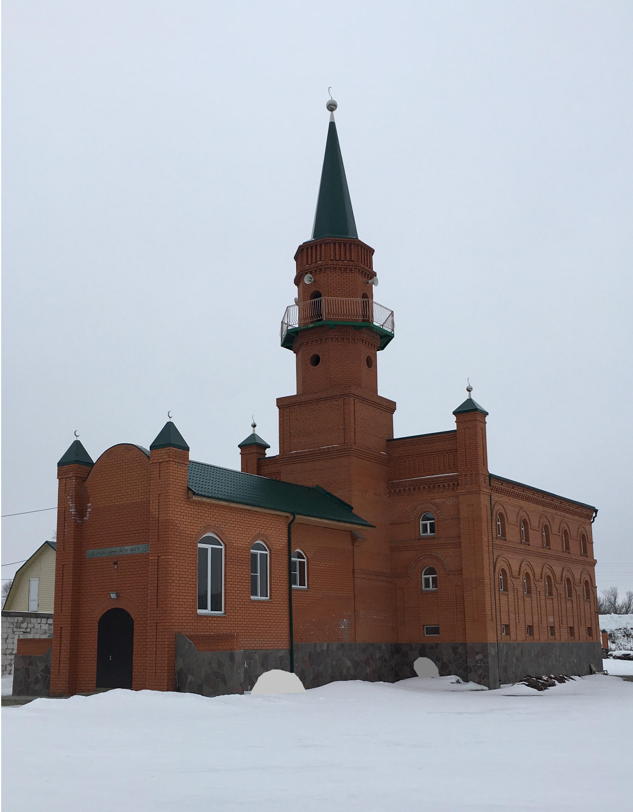
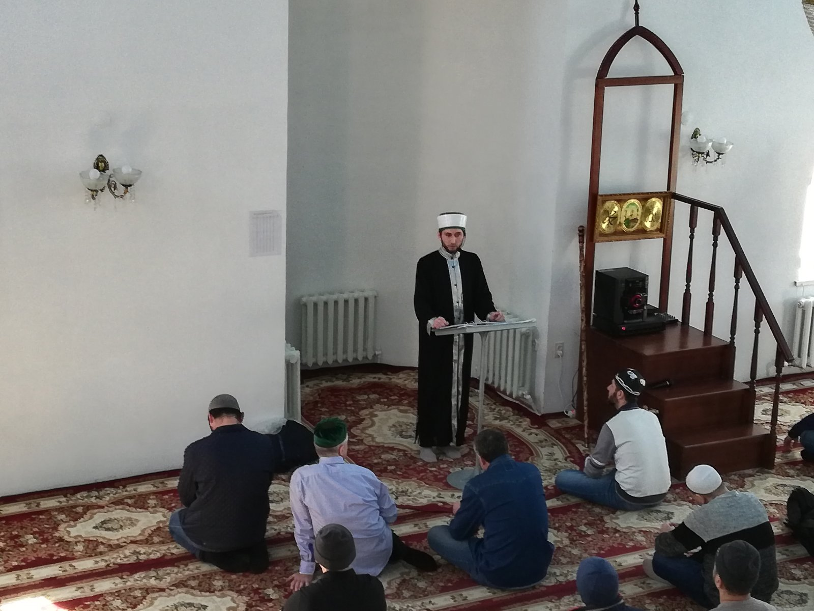
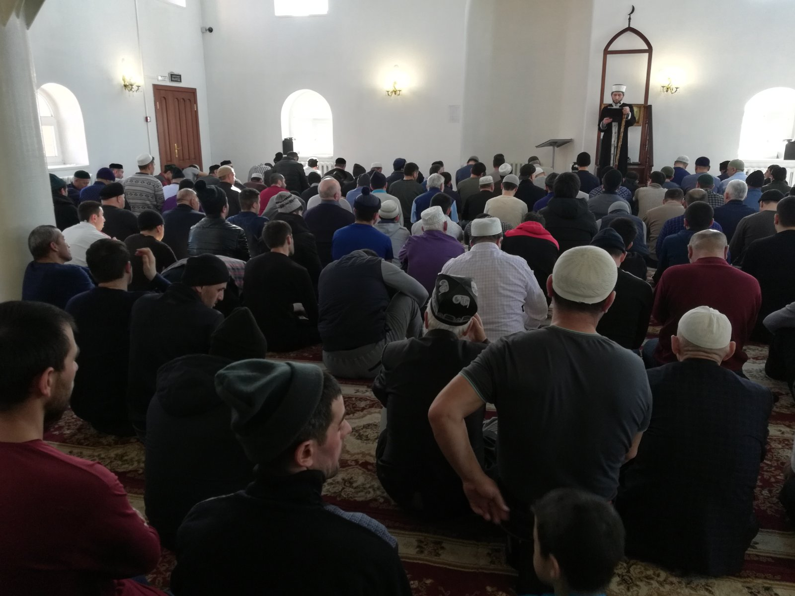

**_Мусульмане Курганской области при помощи и содействии Духовного управления мусульман Российской федерации создают все условия для соблюдения религиозных требований и приобщения к исламу._**

В ноябре прошлого года областной центр город Курган посетили с рабочим визитом руководитель департамента внутренних дел Духовного
управления мусульман Российской Федерации Наиль хазрат Шакиров и полномочный представитель муфтия в Уральском федеральном округе,
председатель Духовного управления мусульман Свердловской области имам-мухтасиб Артур хазрат Мухутдинов. Во время поездки были проведены
встречи с руководством Соборной мечети, с уммой,с ответственными сотрудниками областной администрации.

По результатам поездки, мусульмане Кургана обратились к председателю Духовного управления мусульман Российской Федерации и Совета
муфтиев России муфтию шейху Равилю Гайнутдину с просьбой оказать содействие в организации религиозной жизни местной уммы. Было
направлено коллективное обращение с просьбой отправить имама в Курганскую соборную мечеть для проведения джума-намазов, проведения
уроков по основам ислама и Священному Корану, других религиозных обрядов на постоянной основе. Муфтий **Равиль Гайнутдин** с большим
вниманием отнёсся к просьбам местной уммы,и в Курган был направлен имамом выпускник Московского исламского института **Расулов Алишер
Сафаралиевич**.

В январе этого года была зарегистрирована местная религиозная организация мусульман Кургана и Курганской области в юрисдикции ДУМ РФ
под председательством **Мизробова Зиедали Курбоновича**. Мусульмане областного центра и Курганской области приняли это решение с большим
воодушевлением: в новую религиозную организацию делегировали своих представителей различных диаспор, а мусульмане в десятках районов
области отметили работу по укреплению уммы, увидели конкретные дела по организации духовной жизни. Под руководством Алишера хазрата
проводятся ежедневные занятия по основам ислама, регулярно совершается намаз и пятничные богослужения. Значительную организационную,
методическую, юридическую помощь постоянно оказывает Духовное управление мусульман России. Мусульмане Курганской области выражают
уверенность, что при такой организации духовной жизни ислам в регионе будет планомерно укрепляться,а местная умма станет единой и сплочённой.

