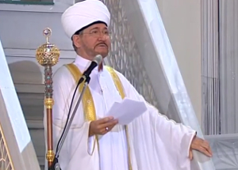

Обращение духовного лидера российского мусульманства муфтия шейха Равиля Гайнутдина об объединении и солидарности в условиях противостояния человечества смертоносному вирусу:

**_Во имя Аллаха Всемилостивого, Милосердного!_**

Беспрецедентные по своим масштабам форсмажорные меры в борьбе против пандемии коронавируса «COVID-19», обвальный экономический спад в большинстве стран, разрушительное сокращение транспортных связей и гуманитарных контактов между людьми, странами и регионами охватили весь мир. Ко многим пришло понимание – невидимые глазу микроорганизмы, активизировавшиеся где-то очень далеко, за несколько месяцев могут не только стать проблемой №1 в мировой политике, но перевернуть весь образ жизни буквально каждого жителя планеты. Не об этом ли говорит в священном Коране Аллах: **_«Если мы пожелаем, то ниспошлем им с неба знамение, перед которым покорно склонятся их шеи» (26:4)_**?!

Людей самых разных вероисповеданий и убеждений, говорящих на разных языках и имеющих самое разнообразное положение в обществе, объединяет в эти дни одно: осознание, что к ним пришла поистине вселенская беда, грозящая последствиями, вполне сравнимыми с теми, что приносят с собой большие мировые войны. Никто не знает сейчас, кроме Всевышнего Аллаха, каким выйдет мир из этого кризиса. Неизвестность порождает страх и тревогу, которые пронизывают буквально все слои общества.

В первую очередь, хочу обратиться к своим единоверцам. Многие из нас ощущают себя, словно они оказались в ловушке, многие опасаются потерять близких или не суметь завтра прокормить свою семью.

**_Дорогие братья и сестры!_**

В молитве – наше спасение, убежище и утешение! Испытание нам выпало суровое, но наш долг – принять его со смирением и терпеливостью, укрепить твердыню своей веры, прочувствовать всем сердцем то назидание, которое кроется в нашем вынужденном затворничестве. Давайте помнить, милость, щедрость Аллаха – безграничны, Его мудрость – превыше разумения человека. Самым праведным и подобающим мусульманину путем я считаю такой: сделать все от себя зависящее, чтобы обезопасить себя и своих близких, предпринять то, что в наших руках. А остальное – на что мы повлиять не в силах – оставить на Божью милость. Будем же уповать на Господа миров, ведь поистине, Он никогда не оставляет свои создания без попечения и милости!

Не исключено, мы так упорствовали в разделении и вражде, что Всевышний через напасть коронавирусной инфекции напоминает нам о братстве и родстве человечества, о нашем происхождении от одного прародителя.

Пандемия – беда, которую победить можно только совместно, только объединившись на пути мира и добра. Я призываю своих единоверцев проявлять заботу и милосердие в меру своих сил ко всем окружающим, вне зависимости от их вероисповедания, молиться о здоровье и избавлении от опасности коронавируса всех людей, всего человечества.

Обратимся же к лучшим примерам из нашей недавней истории – вспомним, как во время Великой Отечественной войны все народы нашей страны, представители всех вероисповеданий, да и заявлявшие о своем безверии наши сограждане, объединились, прежде всего сердцами и душевным настроем, на совместную борьбу и изгнание общего врага. Мы с трепетом в сердце говорим об истории Великой Отечественной войны, с бесконечным уважением относимся к подвигу победителей. Сегодня – буквально накануне 75-летия той великой Победы духа, давайте же будем достойны имени своих дедов, отвоевавшей мир у коричневой чумы!

Нас воспитывали на примере героев Великой Отечественной войны. Давайте сегодня поступать так, чтобы в будущем наши внуки воспитывали своих детей на нашем примере! Примере стойкости, гуманизма, верности и своему долгу, и призванию человечности.

Среди нас есть те, кто в это сложное время находится фактически на передовой. Это врачи и весь медицинский персонал, ученые-эпидемиологи и вирусологи, управленческий аппарат, занятый выстраиванием обороны от нашествия этого вируса, все те, кто денно и нощно совершает настоящий гражданский и профессиональный подвиг ради нашего с вами благополучия.

С большой гордостью за нашу страну и благодарностью к нашим руководителям мы воспринимаем ту помощь, которую сегодня Россия оказывает различным странам, даже за океаном, и даже тем, кто не всегда дружественно к нам настроен. Протягивать руку помощи в критический момент даже своему недоброжелателю, сопернику или очень далекому соседу – это признак сильного духом.

Я призываю высшее руководство страны и нашего национального лидера Владимира Путина не обделить своим вниманием и страны мусульманского мира, многие из которых видят в России гаранта многополярного мира и справедливого отношения ко всем участникам международной жизни. Этим Россия еще раз подтвердит свой статус не только великой военной, научной, культурной державы, но и державы гуманной.

Сегодня россияне как никогда с большим вниманием и надеждой воспринимают каждое слово, каждое действие облеченных властью мужей. Все россияне ждут от государства продуманных, выверенных и четких действий не только по предотвращению распространения инфекции, но и по купированию экономических последствий пандемии. Мы, в свою очередь, готовы оказать Президенту и всему нашему Отечеству всяческую поддержку и содействие в том, чтобы облегчить ношу людей, дать им надежду и уверенность в завтрашнем дне.

Российские мусульмане вместе со всеми народами нашей страны по достоинству оценили четкую позицию Генерального секретаря ООН Антониу Гутерреша против политики санкций, которая, по его справедливому мнению, мешает объединиться для борьбы с этой главной угрозой последних месяцев. На экстренном саммите «Большой двадцатки» 26 марта Президент В.Путин предложил отказаться от торговых войн и международных санкций и ввести солидарный мораторий на ограничения в отношении товаров первой необходимости, а также на финансовые транзакции для их закупок, что не может не вызывать нашей полной поддержки и одобрения.

Перед лицом единой и общей опасности всему миру, не время сводить счеты! И да наставит Всевышний каждое чадо Пророка Адама, мир ему, на путь добра, сострадательности, вдумчивости и гуманизма. И да дарует Он мудрости, великодушия, человеколюбия и трезвого рассудка всем тем, кто в эти дни принимает важные политические решения по всему миру! И да будет этот период испытаний поводом для человечества стать выше своих эгоистичных амбиций и осмыслить причины этих бед!

И да поможет нам всем Всевышний Создатель объединиться под еще одним великим исламским лозунгом – «А дело их по [доброму] совету между ними!» Только осознав великий смысл этого Божьего Наставления, скоординировав на его основе свои действия, оказывая друг другу бескорыстную помощь, мы сможем справиться с обрушившейся на всё человечество бедой и выйти из неё с минимальными потерями.

**Муфтий Шейх Равиль Гайнутдин**

**Председатель Духовного управления мусульман РФ, Председатель Совета муфтиев России, Член Совета по взаимодействию с религиозными объединениями при Президенте Российской Федерации**

3 апреля 2020 г., Москва Источник: dumrf.ru
