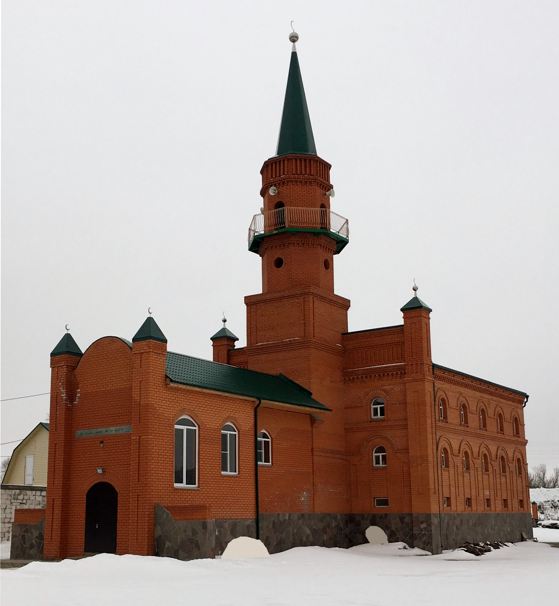

***В связи с угрозой распространения коронавирусной инфекции (COVID-19)***, учитывая высокую степень опасности этого заболевания, в соответствии с установлениями религии Ислам, руководствуясь богословским заключением Совета улемов (учёных) Духовного управления мусульман РФ No 1/20 от 17.03.2020 года, в Курганской Соборной мечети приостанавливается проведение коллективных пятикратных и пятничных молитв.

**Приостанавливается также практика проведения маджлисов, никахов и имянаречения с участием большого количества людей.**
Ввиду невозможности отложить проведение погребальных обрядов и джаназа-намаза, предписывается проводить обряды с минимальным количеством людей.

**Рекомендуется воздерживаться от традиционного приветствия через рукопожатия и объятия.**
Приведенные правила подлежат исполнению со дня публикации, и прекращают своё действие после специального извещения, которое также будет доведено до уммы.

***Руководство Курганской Соборной мечети***

