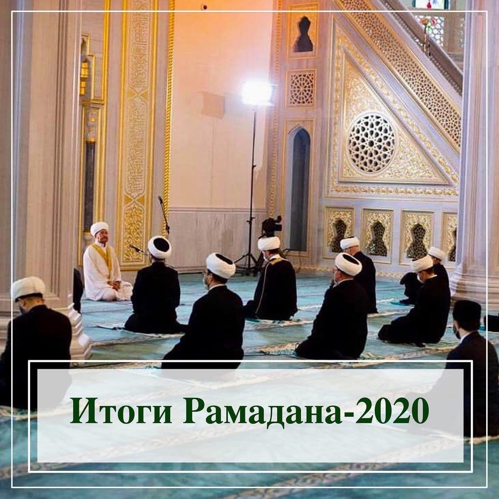

Настала пора подвести итоги месяца Рамадан 1441 г. по хиджре, который российские мусульмане, как и большинство наших единоверцев 
во всем мире, провели в самоизоляции, иначе говоря, в воздержании от социальных контактов помимо наших домочадцев.

Первое, с чего хочу начать и на что обратили внимание журналисты: мусульмане продемонстрировали в целом очень высокий уровень дисциплины, сознательности и самоорганизации. Перед началом Рамадана многие, возможно, ожидали картину свирепых мусульман, в фанатичном исступлении штурмующих закрытые мечети, но ничего такого, хвала Всевышнему, не произошло. Призыв мусульманского духовенства оставаться дома, не посещать мечети был услышан и воспринят, да и в целом выяснилось, что влияние муфтиев и имамов на свою паству, на свою целевую аудиторию высоко.

Еще одним приятным открытием в эпоху пандемии стало повсеместное распространение практики добрых дел. Во время еженедельных заседаний 
пленума Духовного управления мусульман Российской Федерации мы слышим свидетельства из многих регионов: тысячи и тысячи мусульман 
откликнулись на чужую беду, вызвались быть волонтерами, жертвовали свои средства для доставки продуктов нуждающимся. Центрами такой 
самоорганизации мусульман, сплочения ради общего дела стали духовные управления мусульман, мечети, общины. Пульс общества бился именно 
в них, причем заметили и оценили это далеко не только сами мусульмане, но и многие десятки тысяч россиян всех национальностей и 
вероисповеданий, получившие в эти дни помощь и поддержку. Российское мусульманство обрело за эти дни свой коллективный голос, и это был 
голос доброты и солидарности.

Я возношу хвалу Господу за то, что даже в самые трудные дни умма не потеряла самообладания, не была дезориентирована, разобщена. О 
региональных и местных религиозных организациях, работающих в юрисдикции Духовного управления мусульман Российской Федерации под 
началом муфтия Гайнутдина я могу сказать совершенно точно: адекватная оценка ситуации, мобилизация горизонтальных связей произошли 
довольно быстро и это оказало большое влияние на настроения людей, на веру в то, что они не брошены, они не одни в своих трудных 
обстоятельствах.

Не секрет, что религиозные организации и сами остались в довольно сложной ситуации, выйти из которой, по милости Аллаха, помогли 
дополнительные выплаты общинам из Фонда поддержки исламской культуры, науки и образования. Широкий и великодушный жест был сделан 
меценатом Сулейманом Керимовым, который моментально откликнулся на обращение муфтия Гайнутдина и выполнил свое обещание. Говоря о 
благодеянии Сулеймана Керимова, мы вспоминаем о таких меценатах как Шамси Асадуллаев, Ахмед бай Хусаинов, о Рамиевых, Яушевых, 
Агафуровых и многих других, коими укреплялась умма, на средства которых умма шла вперед. Я уверен, в будущем историки будут перечислять 
имя С.Керимова наряду с этими крупнейшими благотворителями уммы прошлых столетий.

На эти непростые дни пришлось 75-летие Победы в Великой Отечественной войне. Начиная с прошлого года мы готовились отметить эту дату 
широко и торжественно. Аллах внес коррективы в эти планы, но сохранил в наших сердцах духовный подъем, живое чувство благодарности 
предкам за Победу, осознание единения народа-победителя. Поэтому даже не встречаясь в общем зале на торжестве, а проведя конференцию 
онлайн, мы смогли передать дух Дня Победы в общины наших единоверцев в России и в ближнем зарубежье. 75-летие Победы стало еще одной 
линией единения мусульман в дни пандемии.

Смысловой точкой прошедшего в условиях пандемии Рамадана стал праздник Ид аль-Фитр и праздничная проповедь муфтия шейха Равиля 
Гайнутдина из Московской Соборной мечети. Главная его мысль: пандемия – не апокалипсис, а испытание наших нравственных качеств и 
испытание состоятельности нашего образа жизни. Это перезагрузка, но в наших силах сделать ее перезагрузкой в пользу более человечного, 
более отвечающего первоначальному Божьему замыслу мироустройства.

В проповеди прозвучала и высокая оценка усилий государства в преодолении пандемии, от лица мусульман наш духовный лидер поблагодарил 
президента В.Путина, премьер-министра М.Мишустина и мэра Москвы Сергея Собянина за четкость действий по защите населения от 
коронавируса. И помощь Фонда поддержки исламской культуры, науки и образования, разумеется, у мусульман ассоциируется непосредственно с 
именем главы государства, давшего добро на его создание в 2007 г. Выраженная благодарность Сулейману Керимову – это также коллективный и 
искренний голос российского мусульманства, которое в эти дни в молитве за душу погибшего от коронавируса муфтия Ингушетии Абдурахмана 
Мартазанова, в молитве об исцелении и полном восстановлении здоровья муфтиев Ахмада Абдуллаева, Исмаила Бердиева, Хаджимурата Гацалова.

Как и подчеркнул в своей проповеди муфтий Гайнутдин, окончание месяца Рамадан и праздник Ураза-байрам принесли первые признаки 
стабилизации эпидемиологической ситуации. Думаю, что постепенного, поэтапного открытия мечетей, возобновления коллективных молитв 
осталось ждать не долго.

Традиционные ежегодные пожелания на окончание Рамадана – не растерять, сохранить благодать этого месяца в душе – становятся в этом году 
еще более актуальными. За два месяца добровольного воздержания от коллективных молитв ради общественного блага, умма накопила очень 
ценный капитал – доверие всего общества, высокий уровень внутреннего единения и солидарности. Мы стали больше ценить друг друга и ценить 
наше братство. Не позволяя себе преклонить колени в мечетях, мы стали многократно больше ценить эту возможность и надеюсь, объединим 
свои усилия в строительстве новых домов Аллаха, которые доказали свою нужность не только мусульманам, а всему российскому обществу.

И еще подчеркну: пандемия полностью и безоговорочно доказала стратегическую верность всех тех планов и идей, с которыми выступил наш 
духовный лидер муфтий шейх Равиль Гайнутдин на Съезде Духовного управления мусульман в сентябре 2019 г., правильность всех принятых 
съездом решений о новых принципах самоорганизации, консолидации, субординации уммы, о ее приоритетах и долгосрочных планах.

Сегодня как никогда важно, не растеряв ни крупицы из достигнутого в Рамадан, продолжить наше восхождение к вершинам созидания, 
построения мира и добрососедства.

**Дамир Мухетдинов,
Первый заместитель Председателя Духовного управления мусульман России,
Ректор Московского исламского института**
