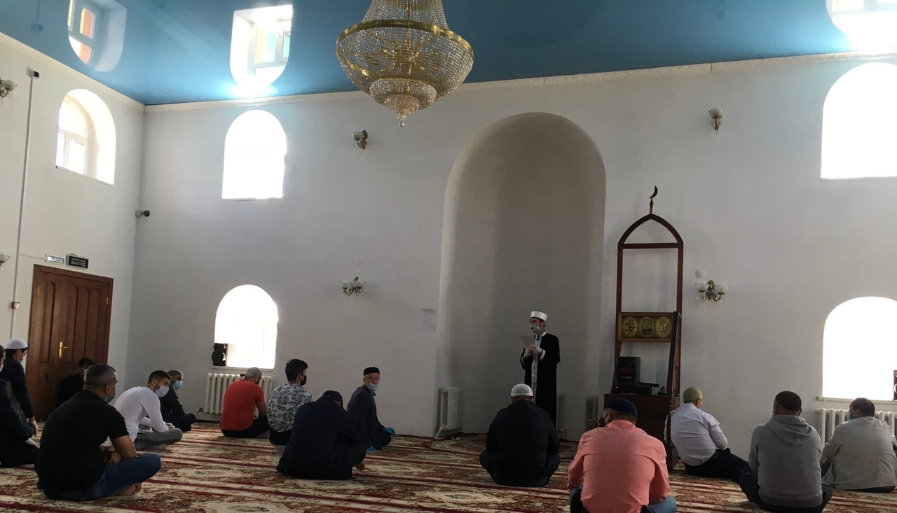
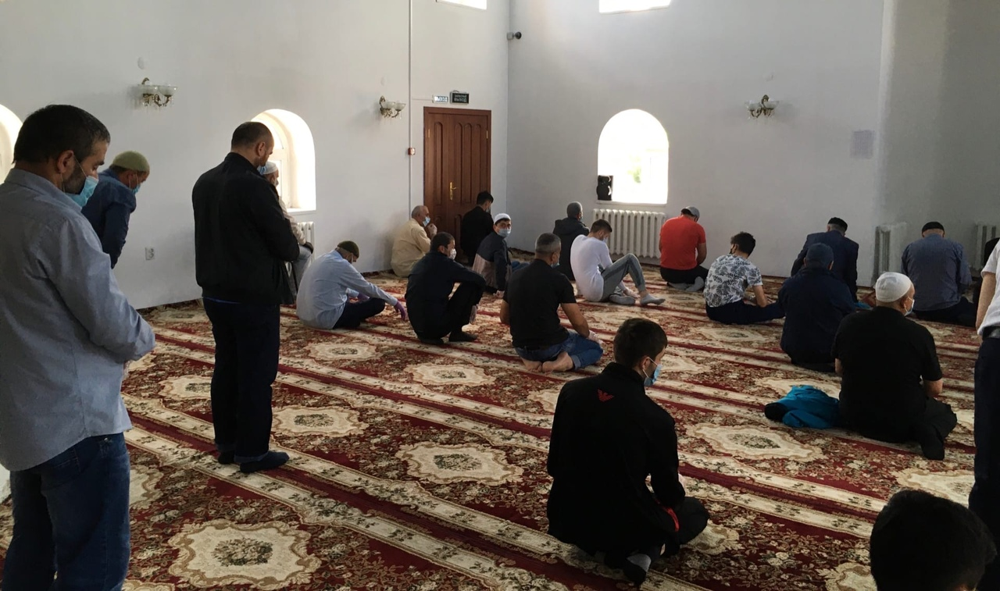
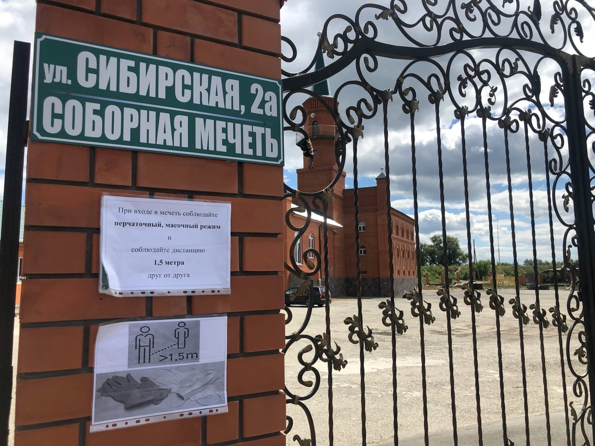
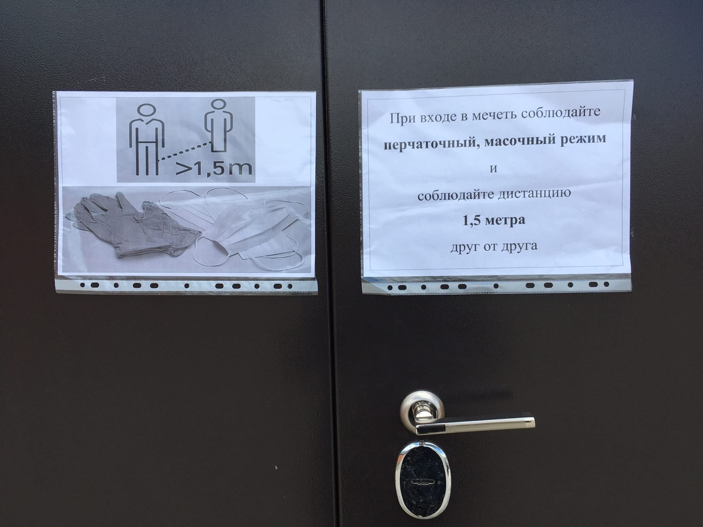

**19 июня 2020 г.** в Курганской Соборной мечети состоялась первая коллективная общедоступная пятничная молитва после 12 недельного 
вынужденного перерыва в связи с пандемией нового коронавируса.

Проведение пятничной молитвы осуществлялось с соблюдением всех необходимых санитарно-эпидемиологических предписаний Федеральной службы 
по надзору в сфере защиты прав потребителей и благополучия человека, в том числе — социальной дистанции при участии верующих в 
богослужениях и максимально допустимой вместимости, предписываемой Роспотребнадзором.

Кроме того, во время нахождения в храме верующие соблюдали перчаточно-масочный режим, ограничивались только устным приветствием, временно 
отказавшись от рукопожатий и объятий.

Пятничная проповедь и коллективный намаз также были исполнены в краткой форме.

***Пресс-служба Курганской Соборной мечети***
