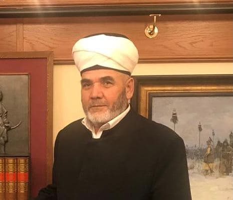

***Зиёдали хаджи Мизробов*** переизбран на пост председателя Курганской городской религиозной организации мусульман на новый пятилетний срок на Отчетно-выборном съезде организации. Действующий председатель переизбран на съезде единогласно, открытым голосованием.

Перед процедурой голосования Зиёдали хаджи Мизробов выступил с докладом, в котором отчитался по основным направлениям работы КГРОМ за период с 2015 по 2020 годы. Делегаты съезда единогласно приняли и утвердили текст отчетного доклада.

После процедуры избрания Зиёдали хаджи Мизробов поблагодарил делегатов съезда и своих соратников за оказанные доверие и поддержку и вознес молитвы Всевышнему Аллаху о помощи Творца в дальнейшей деятельности и служении.

***Пресс-служба Курганской Соборной мечети***
