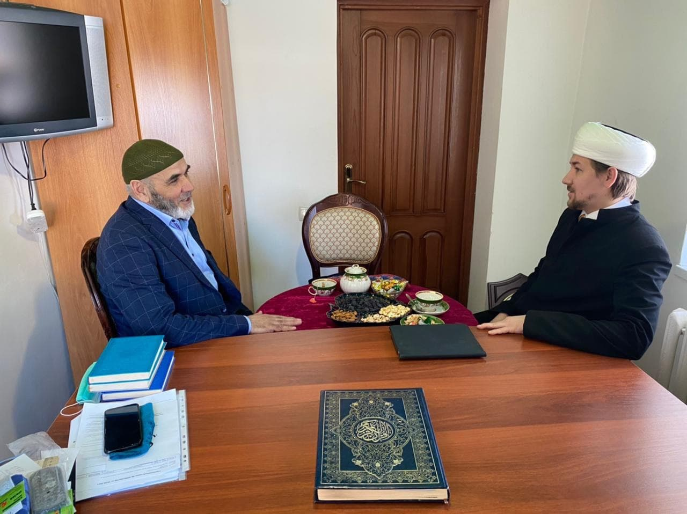
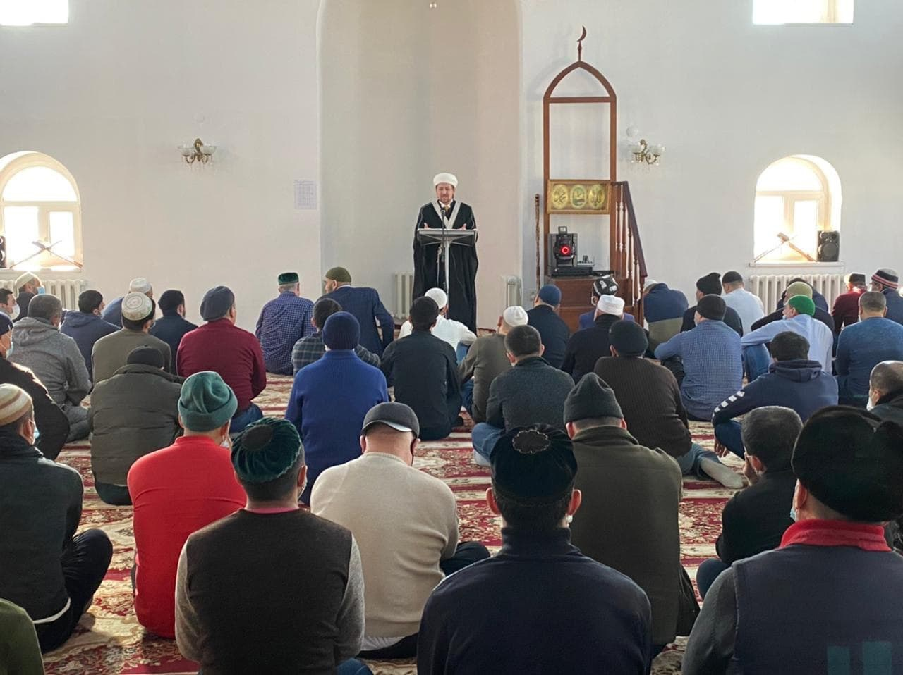

**19 февраля полномочный представитель муфтия шейха Равиля Гайнутдина в Уральском федеральном округе имам-мухтасиб Артур Мухутдинов посетил с рабочей поездкой город Курган, 
где встретился с председателем Курганской религиозной организации мусульман Зиедали Мизробовым.**

Зиедали-хазрат в ходе встречи рассказал о деятельности организации в период пандемии. «Несмотря на эпидемию, количество прихожан не сократилось, – отметил он, – 
однако все противоэпидемиологические меры строго соблюдаются в соответствии с постановлением Правительства Курганской области». Глава мусульманской организации Кургана осветил 
работу уммы, направленную на образовательную деятельность среди прихожан, на развитие государственно-конфессиональных отношений в регионе, взаимодействие с диаспорами.

Точкой посещения в числе прочего стала и Соборная мечеть города Кургана, куда на служение по запросу курганских мусульман Духовным управлением мусульман Российской Федерации 
(ДУМ РФ) год назад был направлен молодой специалист Алишер Расулов, выпускник Московского Исламского Института. Зиедали-хазрат выразил особую значимость поддержки для курганских 
мусульман лидером российских мусульман муфтием шейхом Равилем Гайнутдином в тяжелые времена пандемии, отметив, что последовали примеру Московской соборной мечети и перешли на 
самоизоляцию, чем внесли свой немаловажный вклад в преодоление пандемии.

Напомним, что решением Совета улемов ДУМ РФ были приостановлены пятничные и пятикратные молитвы в мечетях Москвы из-за угрозы распространения коронавируса, и ДУМ РФ первое в 
России пошло на этот шаг, несмотря на всю беспрецедентность ситуации, после чего многие региональные мусульманские организации России последовали этому примеру.

Поскольку визит проходил в священную пятницу, Артур Мухутдинов совершил джума-намаз в Соборной мечети Кургана (пятничное богослужение). В своей проповеди, обращаясь к прихожанам 
мечети, имам-мухтасиб передал слова приветствия и дуа (мольбы) за мусульман Кургана от председателя ДУМ РФ муфтия шейха Равиля Гайнутдина, рассказал о текущем месяце Раджаб 
1442 г. по хиджре и подготовке к Священному месяцу Рамадан.

После совершения пятничной молитвы (джума) состоялась встреча с органами правления организации мусульман, где обсуждались вопросы взаимодействия и развития. Полпред муфтия 
рассказал об актуальных программах ДУМ РФ, в которых можно принимать участие, таких как различные гранты, направление на учебу молодых кадров, запрос на обновление библиотечного 
фонда, помощь в консультации актуальных богословских вопросов, которые возникают на местах и т. д.

Вместе с тем обсуждалось важное событие для всех российских мусульман – 1100-летие принятия Ислама народами Волжской Булгарии, и как курганские мусульмане будут принимать участие в ней. Известно, что 4 ноября 2020 г. муфтий Гайнутдин обратился с предложением о проведении празднования этой даты на государственном уровне к Президенту России Владимиру Путину и получил поддержку – Президент поручил правительству страны и кабинету министров Татарстана подготовить предложения о праздновании 1100-летия принятия ислама Волжской Булгарией, ответственными за исполнение поручения назначены премьер-министр Михаил Мишустин и президент РТ Рустам Минниханов.

Конечным пунктом рабочей поездки полпреда стала встреча в Центре татарской культуры Курганской области. Здесь в ходе встречи гостю была организована экскурсия, которую провел 
заместитель председателя организации Мурадымов Газинур, также встречающей стороне от имени ДУМ РФ были вручены книги на русском и татарском языках.

Итогом рабочего визита полпреда муфтия шейха Равиля Гайнутдина в УрФО стало обсуждение плана взаимодействия и совместной работы.

Пресс-служба Духовного управления мусульман
Свердловской области (Уральский Мухтасибат)
