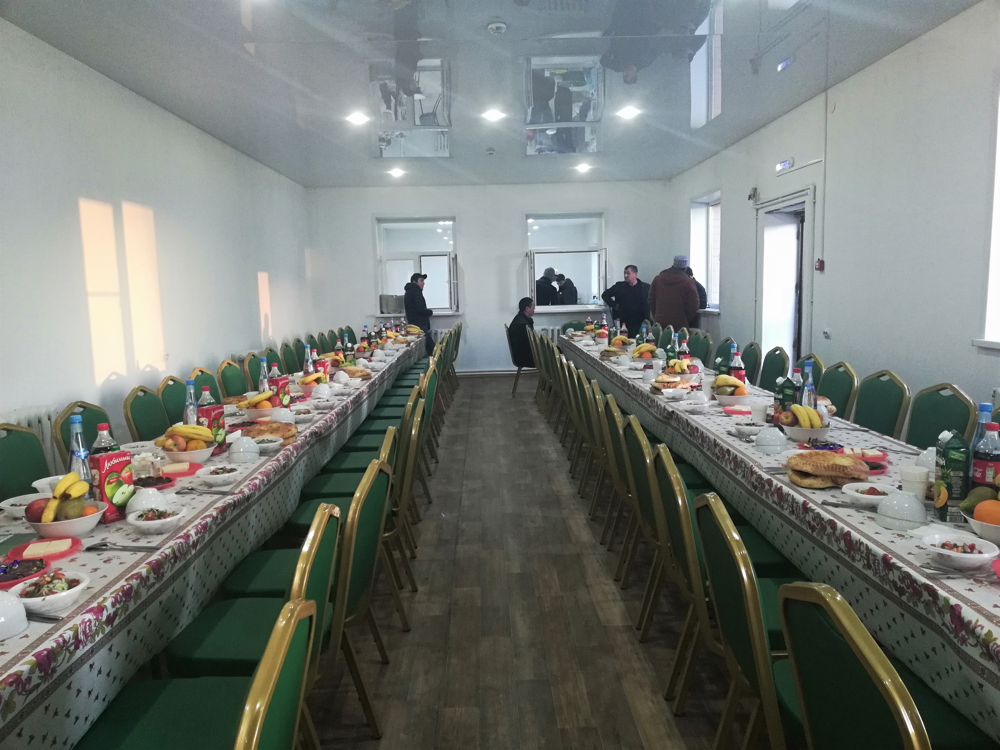
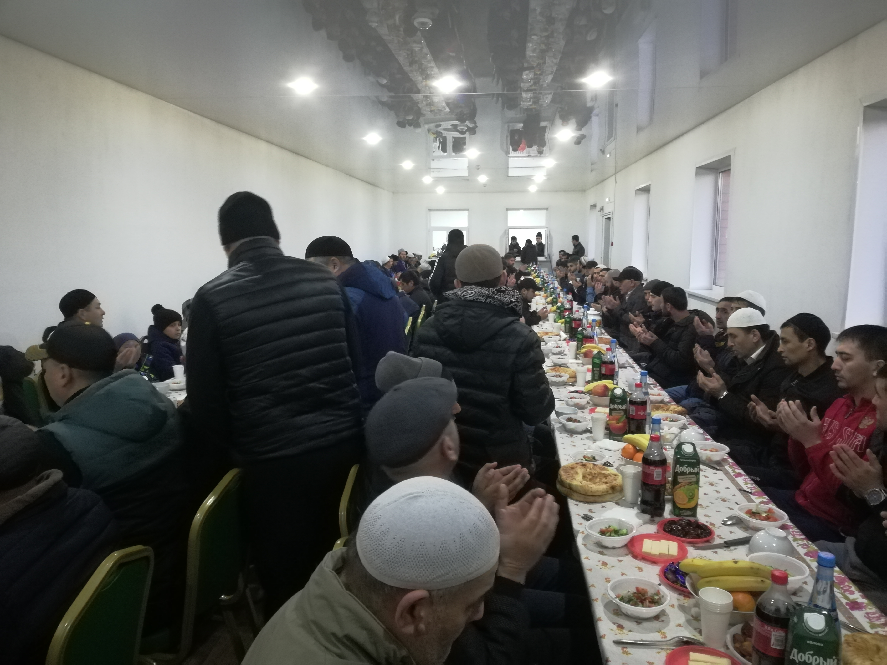
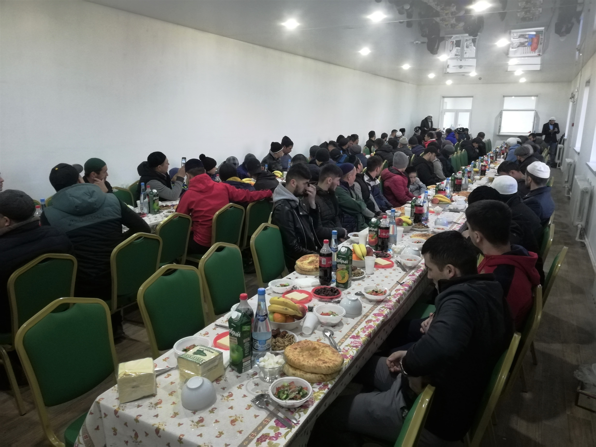
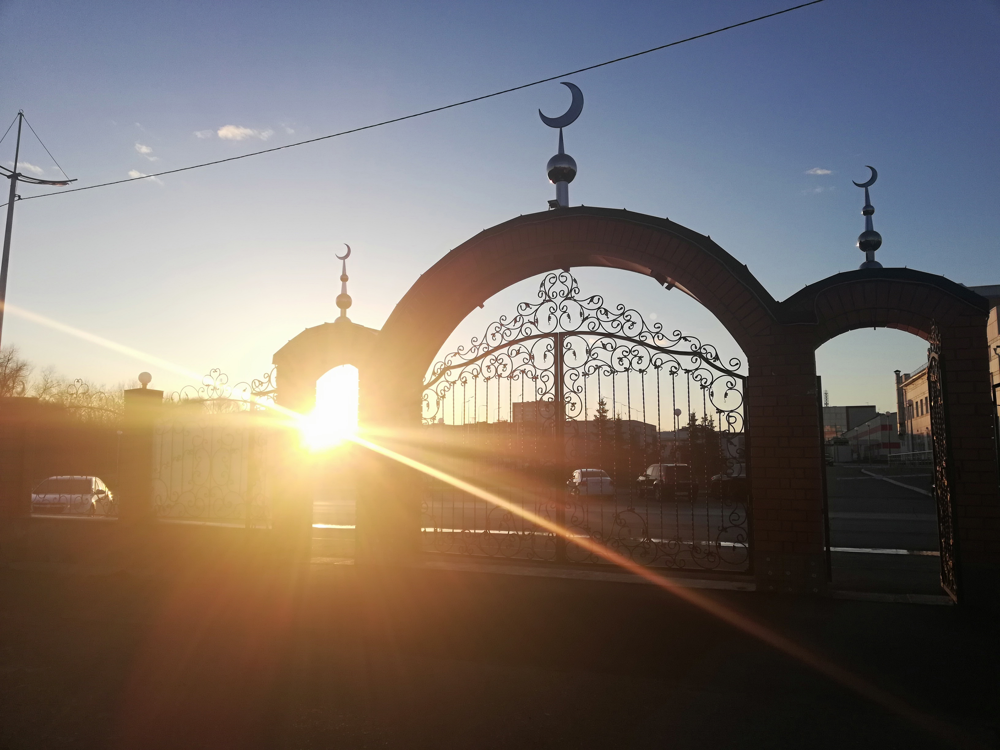

***Вчера, 19 апреля***, прошел очередной масштабный ифтар, организованный при мечети. Все прихожане получили свою порцию угощения. 

В разговении приняли участие Председатель КГРОМ **Зиедали Мизробов** и имам мечети **Алишер Расулов**. Перед приемом пищи Зиедали Курбонович взял слово, и напомнил о 
важности Садака и награде за нее. 

**Пророк (мир ему и благословение Аллаха) побуждал свою общину проявлять заботу о постящихся, и он говорил: «Разговевший постящегося получит такую же награду, как и он сам, 
но при этом награда (постящегося) не уменьшится ни на йоту».** Ахмад 5/192, ат-Тирмизи 807. 

Напоминаем, что в течение всего месяца Рамадан, по возможности каждый вечер, в стенах мечети проводятся ифтары, и каждый может совершить благое дело принять участие 
в их организации. 

Также, приглашаем поучаствовать в разговении всех желающих, ежедневно, до конца Благословенного месяца.

