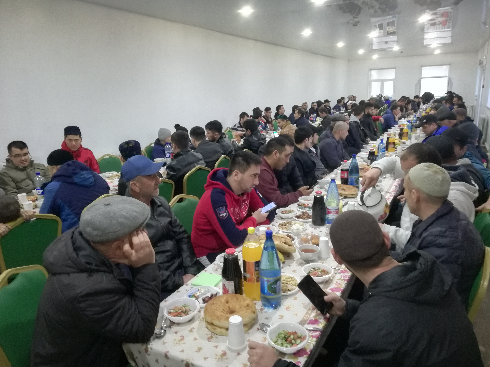

Рамадан – благодатное время для верующего, так как он может получить щедрую награду за любое благое дело. Ну и конечно, главная составляющая Рамадана – пост. 
***«Тому, кто постился в месяц Рамадан с верой и надеждой, будут прощены совершенные им грехи»*** (Бухари, Муслим). В Рамадан верующий ведет борьбу с собственной душой: 
днем – с помощью поста, а ночью – с помощью молитвы.

**Сегодня мы разберем тему важности и мудрости поста.**

***«Пост – для Меня, и Я воздаю за него»*** (хадис Кудси, передал Ан-Насаи).
Аллах наделил пост двумя отличительными чертами. Во-первых, Аллах связал пост в Рамазан с собой, сказав: «Пост – для меня». Так Аллах почтил пост. Во-вторых, за пост воздаёт 
сам Аллах, а это предполагает, что награда будет щедрой и великой, и о её размерах известно только Всевышнему Аллаху.

**Смысл и мудрость поста.** 
Конечно же, смысл поста - исполнение обязательства перед Всевышним. Для мусульманина это еще и возможность получить увеличенную награду от Аллаха. Чем мы можем достичь 
наибольшей награды?
*Во-первых*, постящийся всегда будет вспоминать Аллаха: каждый раз, когда ему захочется есть и пить, он вспомнит, что постится, и действия, нарушающие пост, Аллах ему 
запретил.
*Во-вторых*, во время поста облегчается тело, проясняются мысли, поклонение Всевышнему оказывается доступным и приятным. 
*В-третьих*, у пребывающего постоянно в сытости черствеет сердце, грубеет нрав. Эти качества способствуют порождению других, более опасных, таких, как притеснение, 
заблуждение, куфр и др., а пост препятствует этому.
*В-четвертых*, сытый не знает, что такое голод, и поэтому не способен понять состояние голодающего. В сердце постящегося рождается чувство сострадания к голодным и возникает 
желание помогать им. Этим среди мусульман возраждается любовь и взаимоуважение.
*В-пятых*, шариат учит, что пост – это не только отказ от еды и питья, но и убережения языка от хулы и клеветы, глаз и ушей, от видения и слушания греховного, страсти от 
прелюбодеяния и причинения вреда другому.
*В-шестых*, самым большим несчастьем для человека является служение своим земным, животным страстям. Пост дает силы бороться со страстями воздержанием от них в течение целого 
дня.

**Пост позволяет оценить значение благ, дарованных нам Аллахом.** Всевышний наполнил мир несметным количеством благ и отдал в пользование своему любимому творению – 
человеку. В любое время года – лето, зиму, весну, осень, - Аллах беспрерывно дарует нам всевозможное благо. К сожалению, человечество подобно рыбе, плавающей в воде и не 
знающей цены все тем благам, которыми пользуется ежесекундно. А постящийся человек учится ценить дары Аллаха и по-настоящему довольствоваться малым. Пост усмиряет нафс 
человека, учит терпению и порядку. Также в это время мы можем понять, в каком положении находится бедняк и нуждающийся, не имеющий пресной воды. ***Однажды у пророка Юсуфа 
(мир ему) спросили: «Как ты можешь голодать, ведь у тебя в руках ключи от казны?» На что он ответил: «Боюсь, если я буду сытым, то я забуду о голодных.»***

### Дорогие единоверцы! Поститесь в эти благодатные дни, воздерживайтесь от мирского днем, и молитесь ради Аллаха, и пусть Милостивый одарит вас щедрой наградой за ваше служение в обоих мирах!
