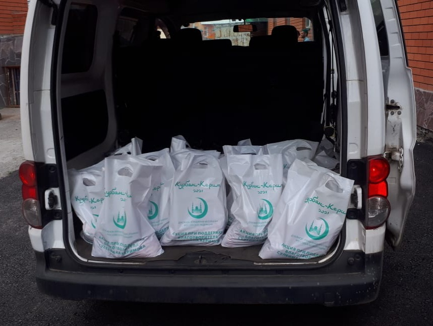
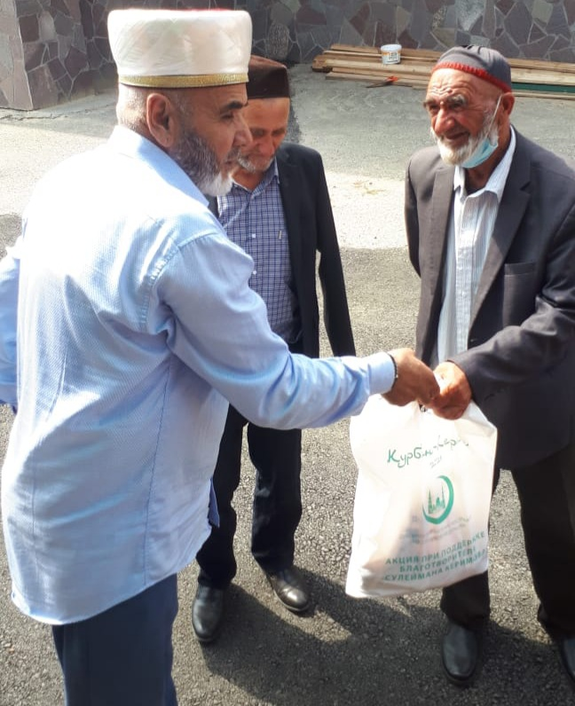
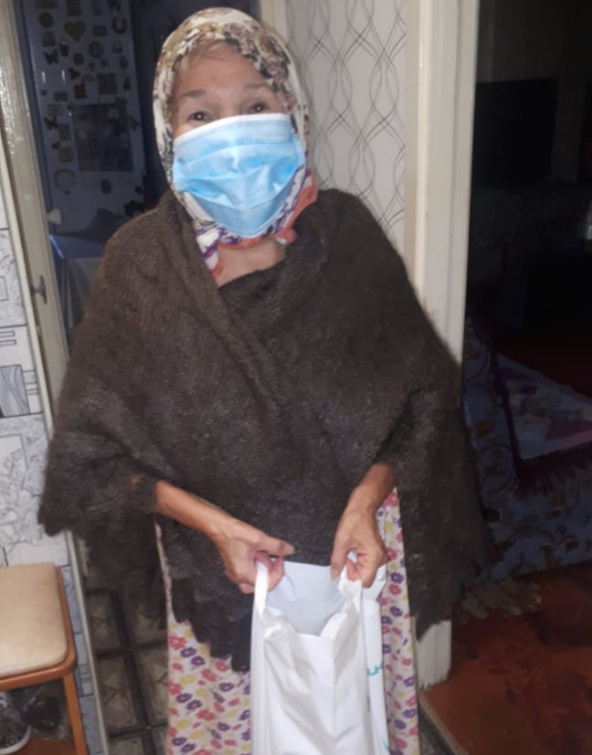
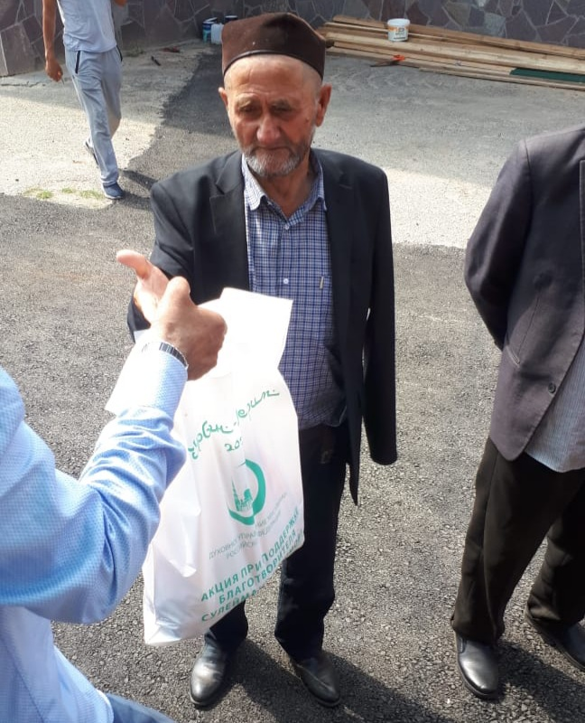

***Хвала Аллаху, Господу Миров, который одарил нас благословенным праздником Курбан Байрам. 
Приветствия и благословения Аллаха Пророку Мухаммаду, его семье и сподвижникам, и всем тем, кто следует Его призыву до Судного Дня!***

**Дорогие братья и сестры!**

20 июля 2021, с восходом солнца, наступил светлый праздник Ид аль Адха. Начало дня мы с вами встретили праздничной молитвой, которая состоялась в Соборной мечети города Кургана. 
Также в этом году многие молились дома – сказались ограничения, связанные с пандемией Ковид-19. Несмотря на это, наши молитвы объединились в одну с верой и надеждой в прощение и 
благословение Аллаха. 

Курбан байрам – праздничный день в исламе, который знаменует окончание хаджа. Курбан байрам отмечают после Ураза байрам по истечении семидесяти дней в десятый день Зуль-хиджа. 
Этот праздник отмечается в память о жертвоприношении, которое совершил Ибрахим, второй по значимости пророк в мусульманской религии после Пророка Мухаммада (с.а.с.)

В этот благословенный день мы поздравляли друг друга и принимали поздравления от известных людей: губернатора Курганской области **Шумкова Вадима Михайловича**, председателя 
ДУМ РФ муфтия шейха **Равиля Гайнутдина**.

Аллах в Священном Коране сказал: ***«Если вы будете благодарны, то Я одарю вас еще большей (милостью). (Коран, 14:7) Жертвуя малым, в этот день мусульмане приобретают великое благо от Аллаха!***

Каждый год, с надеждой на милость Аллаха, шейх **Равиль Гайнутдин** при поддержке известного благотворителя **Сулеймана Керимова** в дни праздника Курбан-байрам во многих 
российских городах проводят обряды жертвоприношения и распределяют мясо жертвенных животных среди нуждающихся. В этом году Садака в Курганской области получили 76 семей.

***«Тем, кто творил в этом мире добро, будет воздано добром. А Последняя обитель будет еще лучше. И прекрасен, воистину, Дом праведных! Сады Вечности, в которые они войдут: 
в них текут (отрадные) реки. Они получат там все, чего пожелают. Так Аллах награждает праведных, (а именно) тех, чьи жизни ангелы забирают чистыми, говоря (им): «Мир вам! 
Войдите в Сады из-за (добра), что вы совершали (в мире).»»*** (Св. Коран: аяты 30-32)

Да будет доволен Аллах всеми мусульманами, и одарит совершивших садака райскими садами! Да поможет нам всем Аллах, Пречист Он и Всевышний, в наших благих делах! Да облегчит Он 
нам и благоволит к нам в достижении более достойных результатов, чем мы ожидали! Аминь!

***С уважением и добрыми молитвами, председатель КГРОМ Зиедали хаджи Мизробов***

