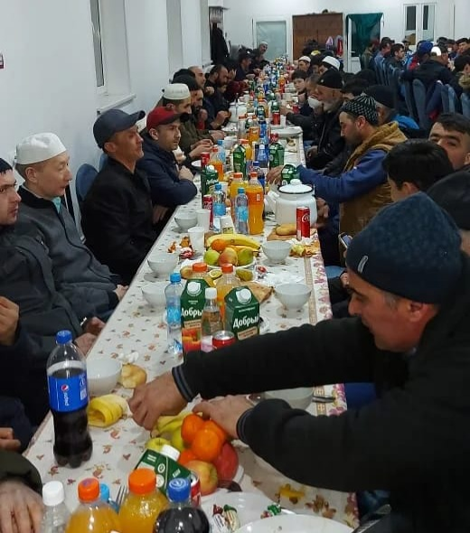
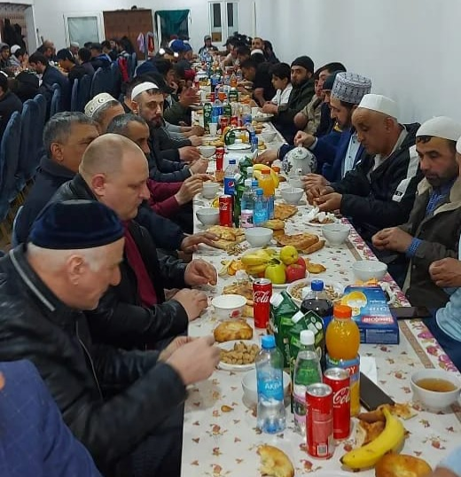

Месяц Рамадан приходит, как пора щедрости и милосердия, в которую правоверные соревнуются между собой в благих делах, проявлении милости и воздаяния. 

Пророк Мухаммад (с.а.с.) сказал: ***«Кто позаботится о постящемся, получит равную, что и он, награду и не в ущерб ему».*** Также он сказал: ***«Тому, кто накормит 
постящегося в месяце Рамадан, это будет прощением грехов,спасением его души от Ада, и получит вознаграждение, равное постящемуся, без умаления награды постящегося».***

Угощение людей едой и питьем является одним из благородных поступков, за которые обещана великая награда. А пища, которая подана постящемуся в месяц Рамадан, 
многократно увеличивает награду подающему. 

***Как то раз Пророк (с.а.с.) пришел к Сааду бин Убаде (да будет доволен им Аллах), который угостил его хлебом и маслом. Поев, Пророк (с.а.с.) сказал: «да разговляются 
у вас постящиеся, и да вкушают вашу еду праведные, и да благословляют вас ангелы».*** (Абу Дауд)

В уходящем месяце Рамадан под крышей нашей мечети проводились ифтары для постящихся. Столы были накрыты не только силами наших дарителей, но и простыми мусульманами, 
которые готовили, накрывали на стол, принимали участие в организации вечерней трапезы.

Нашими дарителями были мусульмане всех национальностей, и также, в рамках акции «Рамадан Керим», которая проводится по благословению лидера российских мусульман и 
председателя ДУМ РФ муфтия шейха **Равиля Гайнутдина** и благотворителя **Сулеймана Керимова**, были переданы средства в мусульманскую общину Курганской области. 

От имени всех мусульман Курганской области, выражаем огромную благодарность нашим благотворителям, просим Всевышнего принять их благие дела и увеличить награду за них многократно.
