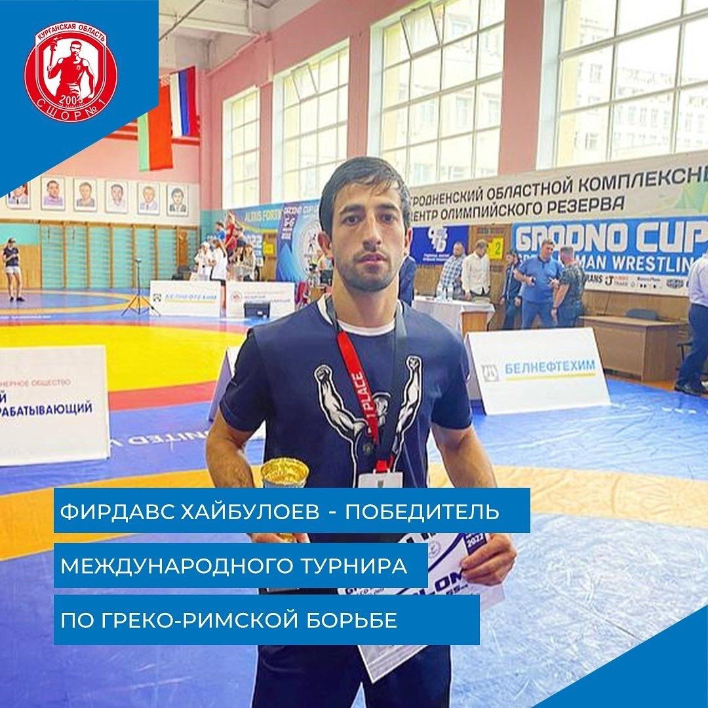

6 августа в городе Гродно прошел Международный турнир по греко-римской борьбе на кубок Гродненского областного объединения профсоюзов. 

В соревнованиях приняли участие команды из России, ближнего и дальнего зарубежья и разных регионов Беларуси. 

Первое место в весовой категории 55 кг занял борец курганской спортшколы №1 Фирдавс Хайбулоев.

Хотим поздравить его с заслуженной победой и желаем успехов в спортивной карьере!

*(по материалам информационного портала "Область 45")*
