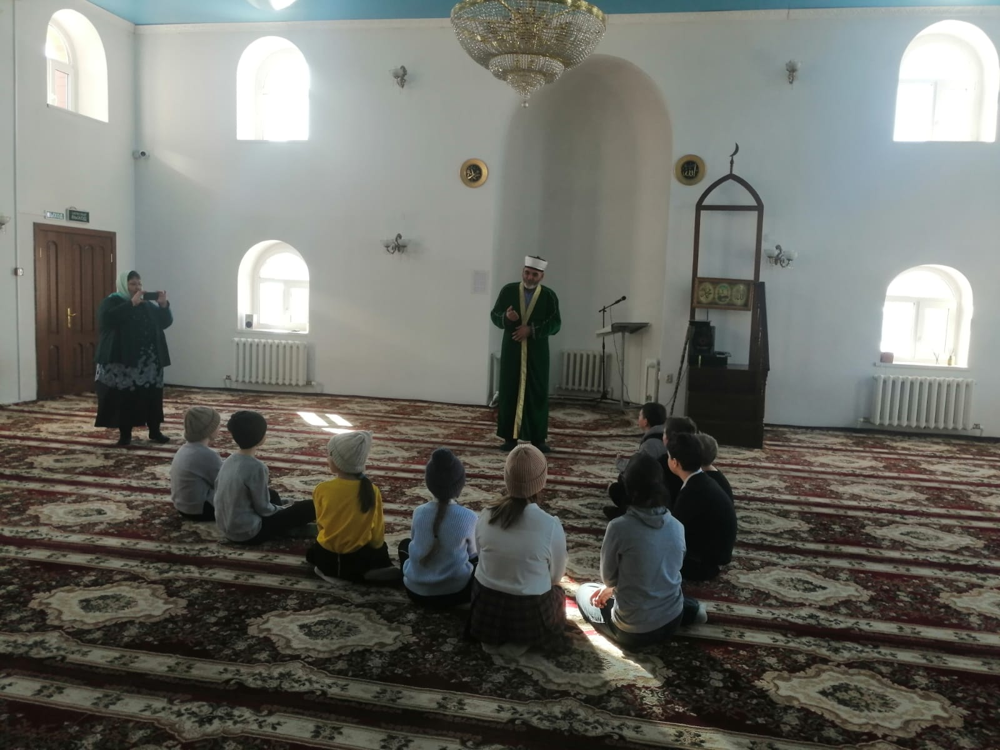
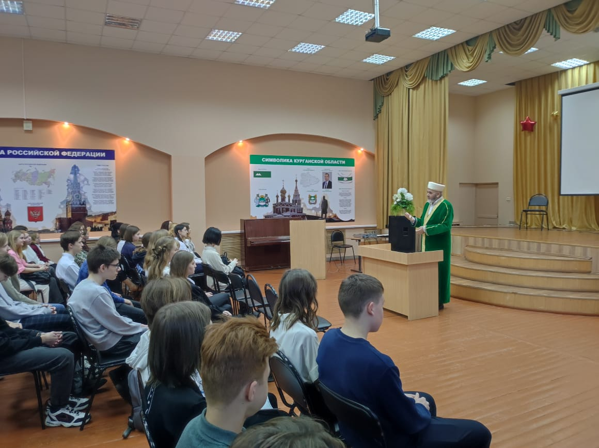

2 марта 2023 года учащиеся 5-а класса школы из села Новая Сидоровка,  под руководством классного руководителя Игнатьевой Валентины Викторовны, посетили 
Соборную мечеть города Кургана. В рамках изучения различных религиозных направлений, имам Зиедали Курбонович Мизробов прочитал учащимся школы небольшую
лекцию на тему Ислама – религии мира, добра и единства, истории его возникновения.

Также, 6 марта 2023, по приглашению администрации гимназии №31, Зиедали Курбонович выступил перед учащимися в актовом зале. Имам посвятил большую часть времени 
истории возникновения Ислама и добропорядочному отношению к родителям, братьям, сестрам, и окружающим.

