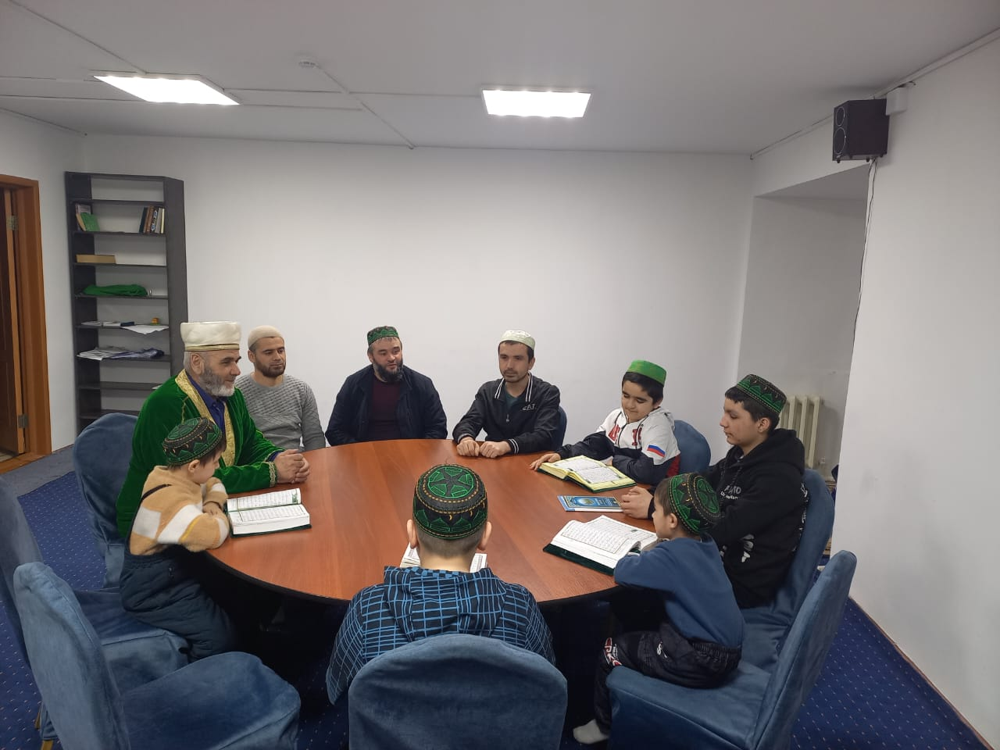
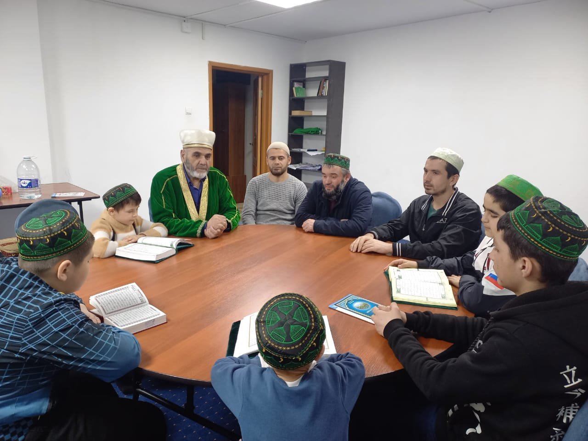

15 марта 2023 года, в городе Новосибирске, состоится конкурс чтецов Корана. Курганскую область будет представлять команда из 8 человек: Жабборов О. А., Норматов Р. Х., 
Хошимов Д. Ш., Абдугаппоров А. Э., Якубжанов М. А., Собиржонов И. Х., Хошимов К. Ш., Абдуллаев А. А. Команда заявлена в нескольких номинациях, в том числе в номинации: 
дети от 7 до 14 лет. 

Двое представителей Курганской области – это Жабборов Обиджон и Абдуллаев Абдулхамид, представят команду в соревновании на чтение 30 джуз Корана.
12 марта команда встретилась в Соборной мечети и получила напутствие от председателя КГРОМ З. К. Мизробова. В своей речи Зиедали Курбонович обратил внимание на 
важность и значимость таких мероприятий и их основу – чтение Корана, привлечение внимания к изучению Священного писания.

