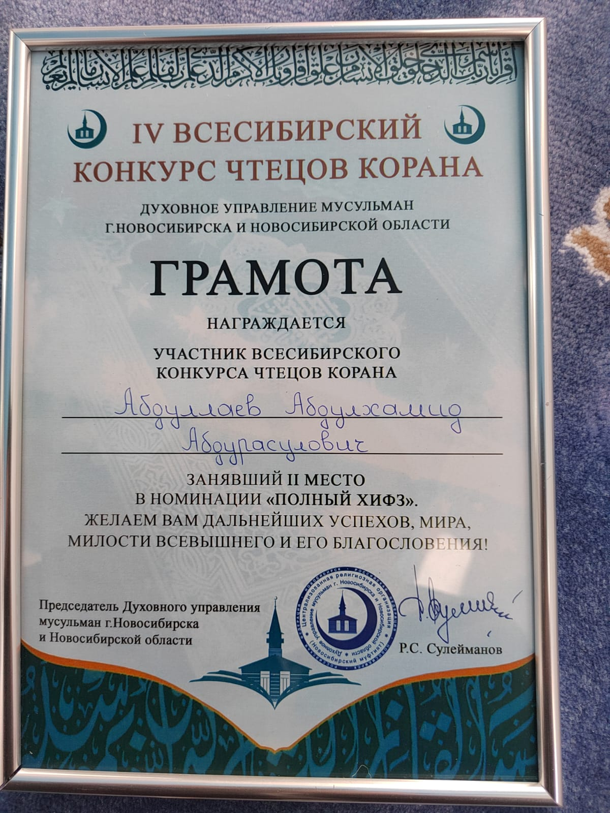
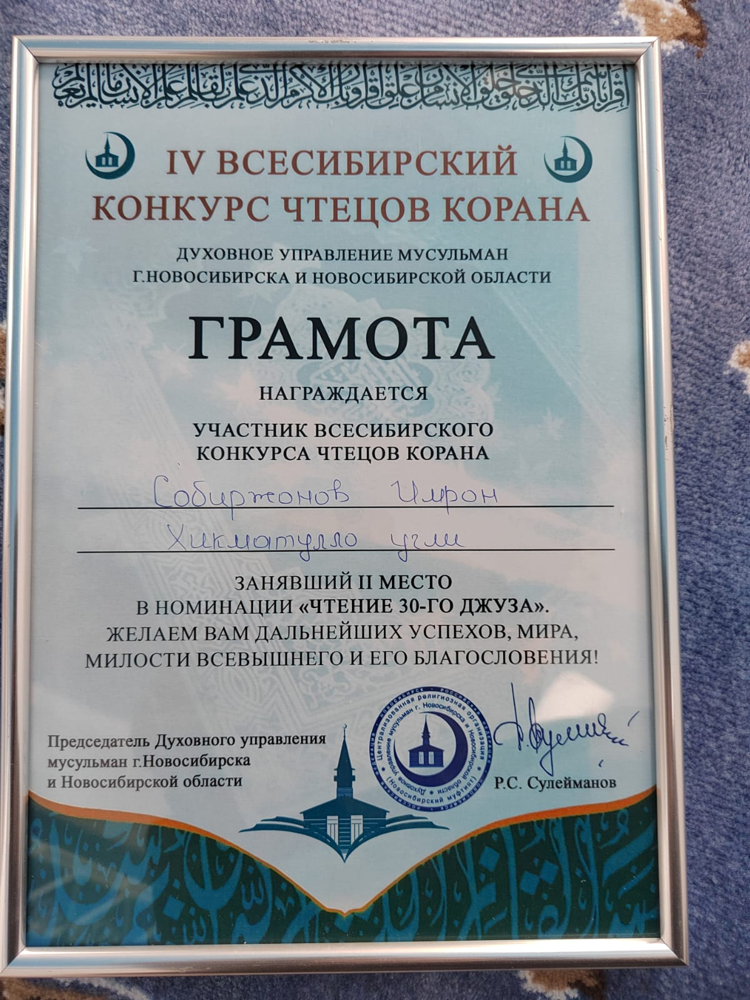

В Новосибирске прошел IV Всесибирский конкурс чтецов Корана. На соревнование съехались участники из разных уголков страны. 
Курганскую область представила команда из 8 человек: Жабборов О. А., Норматов Р. Х., Хошимов Д. Ш., Абдугаппоров А. Э., Якубжанов М. А., Собиржонов И. Х., 
Хошимов К. Ш., Абдуллаев А. А.

Конкурс проводился по четырем номинациям. Среди них ─ чтение наизусть всего Корана и отдельных его глав. Жюри оценивало мастерство по многим критериям.

«Нужно читать по правилам таджвида (правило чтения Корана), которое тоже заучивается, должна присутствовать эмоциональная сторона, 
мастерство речи, подача материала», ─ пояснил председатель духовного управления мусульман Новосибирска и Новосибирской области Рафаэль-хазрат Сулейманов.

Абдуллаев Абдулхамид представил Курганскую область в номинации "Полный хифз". В конкурсе в 2022 году он уже принимал участие в этой номинации и занял призовое место.
В конкурсе в 2023 году он заслуженно занял почетное 2 место среди участников.

Также, наш участник Собиржонов Имрон участвовал в номинации "Чтение 30 джуза", где ему присудили 2 место.

«Наша цель и задача – формирование взглядов нашей молодежи, чтобы уберечь их от всякого рода идеологического настроя, показать истинную религию», ─ 
сказал руководитель центров по изучению Корана при муфтияте Республики Дагестан Шамиль Магомедов.

Благодарим организаторов конкурса за предоставленную возможность делиться знаниями, обмениваться опытом между представителями регионов.
Пусть данный Конкурс и подобные ему, станут стимулом для подрастающего поколения в изучении ими исламской культуры и заучиванию Благородного Корана.
