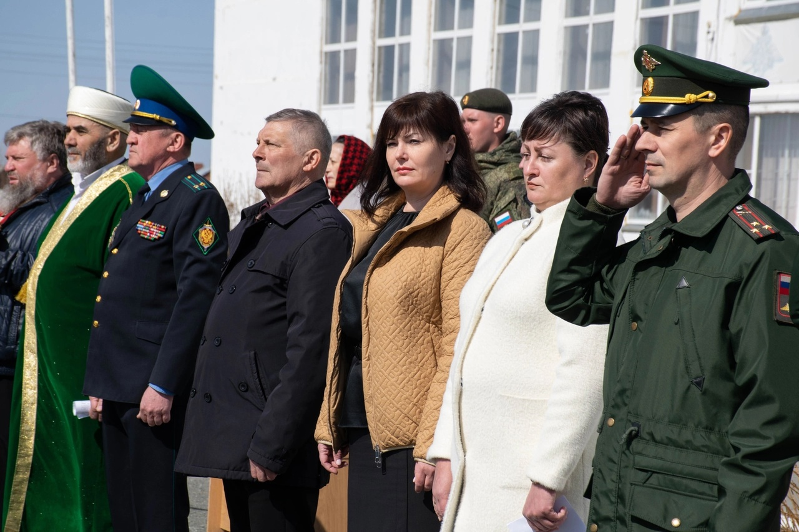

 
Ребят напутствовали военный комиссар Курганской области Айрат Зарипов, мэр Кургана Елена Ситникова, замначальника управления спецпрограмм правительства области 
Павел Клименко. Помимо официальных лиц проводить призывников пришли представители духовенства и родители будущих солдат.

На торжественном мероприятии присутствовал председатель Курганской городской организации мусульман Зиёдали Мизробов.

Главный имам обратился к будущим солдатам: ***"Служба в армии и защита Родины являются священным долгом и обязанностью гражданина Российской Федерации. Каждый 
призывник должен с честью отслужить в армии, и главное - вернуться домой живым и здоровым. Год службы в армии пролетит быстро, а запомнится на всю жизнь.***

***Всевышний Аллах говорит В Коране:***

وَتَعَاوَنُوا۟ عَلَى ٱلْبِرِّ وَٱلتَّقْوَىٰ ۖ وَلَا تَعَاوَنُوا۟ عَلَى ٱلْإِثْمِ وَٱلْعُدْوَٰنِ

***"Помогайте друг другу в благочестии и богобоязненности, но не помогайте друг другу в грехе и вражде." Сура Аль Маида, 2 аят.***

***Дорогие призывники, желаем отважно и верно служить любимой Родине, своей стране! Будьте верными патриотами своей Родины, выполняйте свой долг сполна. 
Пусть вас сопровождает удача и хорошее настроение, пусть служба будет вам в радость. Пусть только мирное небо будет над вашими головами."***

*По материалам интернет-ресурса kurgan-city.ru
