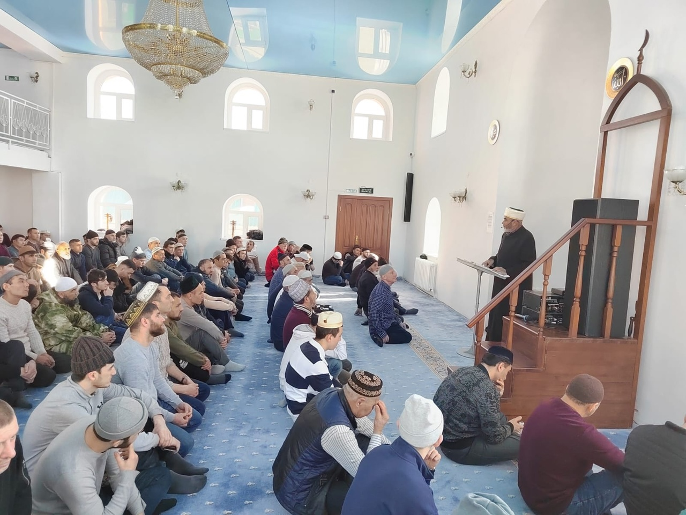

23 февраля 2024 года в Курганской Соборной мечети прошла пятничная молитва.

Зиёдали Курбонович выступил с проповедью на тему "Изменение киблы после переселения Пророка Мухаммадаﷺ"

قال الله وتعالى وَكَذَٰلِكَ جَعَلْنَٰكُمْ أُمَّةً وَسَطًا لِّتَكُونُوا۟ شُهَدَآءَ عَلَى ٱلنَّاسِ وَيَكُونَ ٱلرَّسُولُ عَلَيْكُمْ شَهِيدًا ۗ وَمَا جَعَلْنَا ٱلْقِبْلَةَ ٱلَّتِى كُنتَ عَلَيْهَآ إِلَّا
لِنَعْلَمَ مَن يَتَّبِعُ ٱلرَّسُولَ مِمَّن يَنقَلِبُ عَلَىٰ عَقِبَيْهِ ۚ وَإِن كَانَتْ لَكَبِيرَةً إِلَّا عَلَى ٱلَّذِينَ هَدَى ٱللَّهُ ۗ وَمَا كَانَ ٱللَّهُ لِيُضِيعَ إِيمَٰنَكُمْ ۚ إِنَّ ٱللَّهَ بِٱلنَّاسِ لَرَءُوفٌ رَّحِيمٌ

«Мы сделали вас общиной, придерживающейся середины, чтобы вы свидетельствовали обо всем человечестве, а 
Посланник свидетельствовал о вас самих. Мы назначили киблу, к которой ты поворачивался лицом прежде, 
только для того, чтобы отличить тех, кто последует за Посланником, от тех, кто повернется вспять. 
Это оказалось тяжело для всех, кроме тех, кого Аллах повел прямым путем. Аллах никогда не даст пропасть вашей вере. 
Воистину, Аллах сострадателен и милосерден к людям.» Сура Бакара, 143 аят.

وَمِنْ حَيْثُ خَرَجْتَ فَوَلِّ وَجْهَكَ شَطْرَ ٱلْمَسْجِدِ ٱلْحَرَامِ ۚ وَحَيْثُ مَا كُنتُمْ فَوَلُّوا۟ وُجُوهَكُمْ شَطْرَهُ ۥ لِئَلَّا يَكُونَ لِلنَّاسِ عَلَيْكُمْ حُجَّةٌ إِلَّا ٱلَّذِينَ ظَلَمُوا۟ مِنْهُمْ فَلَا تَخْشَوْهُمْ وَٱخْشَوْنِى وَلِأُتِمَّ نِعْمَتِى عَلَيْكُمْ وَلَعَلَّكُمْ تَهْتَدُونَ

«Откуда бы ты ни вышел, обращай лицо в сторону Заповедной мечети. Где бы вы ни оказались, обращайте ваши лица в ее сторону, 
чтобы у людей, если только они не беззаконники, не было довода против вас. Не бойтесь их, а бойтесь Меня, 
чтобы Я довел до конца Мою милость к вам. Быть может, вы последуете прямым путем.» Сура Бакара, 151 аят.

