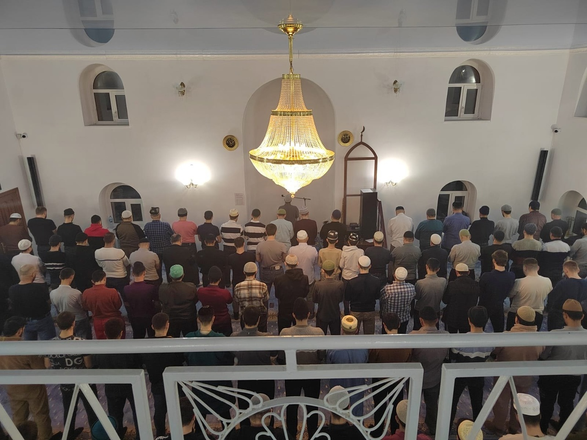

قال الله تبارك وتعالى
إِنَّمَا ٱلْمُؤْمِنُونَ ٱلَّذِينَ إِذَا ذُكِرَ ٱللَّهُ وَجِلَتْ قُلُوبُهُمْ وَإِذَا تُلِيَتْ عَلَيْهِمْ آيَٰتُهُ ۥ زَادَتْهُمْ إِيمَٰنًا وَعَلَىٰ رَبِّهِمْ يَتَوَكَّلُونَ

"Верующими являются только те, сердца которых испытывают страх при упоминании Аллаха, вера которых усиливается, когда им читают 
Его аяты, которые уповают на своего Господа,

ٱلَّذِينَ يُقِيمُونَ ٱلصَّلَوٰةَ وَمِمَّا رَزَقْنَٰهُمْ يُنفِقُونَ

которые совершают намаз и расходуют из того, чем Мы их наделили". Сура Аль-Анфаль, 2-3 аяты.

عَنْ عَبْدِ اللَّهِ بْنِ عُمَرَ -رَضِيَ اللَّهُ عَنْهُمَا-; أَنَّ رَسُولَ اللَّهِ - صلى الله عليه وسلم - قَالَ: «صَلَاةُ الْجَمَاعَةِ أَفْضَلُ مِنْ صَلَاةِ الْفَذِّ بِسَبْعٍ وَعِشْرِينَ دَرَجَةً». مُتَّفَقٌ عَلَيْهِ. وَلَهُمَا عَنْ أَبِي هُرَيْرَةَ: «بِخَمْسٍ وَعِشْرِينَ جُزْءًا». وَكَذَا لِلْبُخَارِيِّ: عَنْ أَبِي سَعِيدٍ, وَقَالَ: «دَرَجَةً».

Передают со слов ‘Абдаллаха ибн ‘Умара, да будет Аллах доволен им и его отцом, что Посланник Аллахаﷺ сказал: 
«Коллективный намаз в двадцать семь раз превосходит намаз, совершенный в одиночку». Хадис передали аль-Бухари и Муслим.
Они же передали хадис со слов Абу Хурайры, да будет доволен им Аллах, в котором говорится: «…в двадцать пять раз…»
Аль-Бухари передал похожий хадис со слов Абу Са‘ида аль-Худри.
