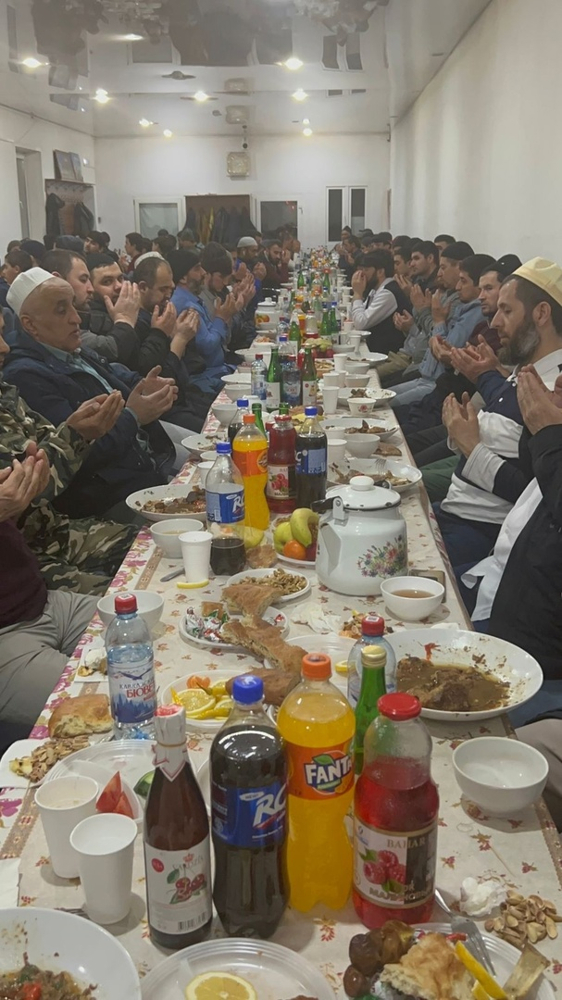

Альхамдулиллях братья накрывают столы, готовят вкусный ифтар. 

Пусть Аллах Субханаху Ва Тааля примет каждое благое деяние и наградит каждого кто принимает участие в проведении ифтаров.

В месяце Рамадан очень важно проявлять щедрость – взяв в этом пример с Пророкаﷺ, который был особенно щедрым в Рамадан, 
«как дыхание благодатного ветра»:

«Посланник Аллахаﷺ был самым щедрым из людей. Больше всего он проявлял щедрость, когда Джибриль встречался с ним в Рамадан. 
Во время этих встреч он был щедрее благодатного ветра, который не признает никаких препятствий» (Аль-Бухари, Mуслим).

«Кто накормит постящегося, тому будет награда, как за пост накормленного им, и не уменьшится награда постящегося. 
Сахабы сказали: «О Посланник Аллаха, не всякий из нас настолько богат, чтобы кормить постящегося». Пророкﷺ ответил: 
«Не обязательно кормить досыта, 
если вы не в состоянии. Аллах вознаградит даже за один финик, за глоток воды или молока» (Ахмад, Тирмизи и Ан-Насаи)
