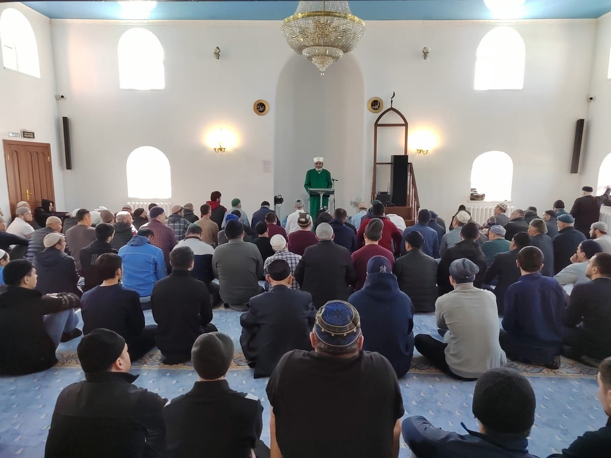

Зиёдали Курбонович провел хутбу на тему: "Рамадан - благодатный месяц"
عن أبي هريرة رضي الله عنه مرفوعاً: «من صَام رمضان إيِمَانًا واحْتِسَابًا، غُفِر له ما تَقدَّم من ذَنْبِه»
Абу Хурайра (да будет доволен им Аллах) передаёт, что Пророкﷺ сказал: 
«Кто постился рамадан с верой и надеждой на награду от Аллаха, тому простятся его прошлые грехи». (Аль-Бухари, Муслим)
В месяц Рамадан мы должны больше времени посвящать поклонению, постясь днем, совершая молитву ночью.
В Рамадан верующий ведёт борьбу со своим собственным нафсом(душой), отказываясь от питья и еды днем и усердствуя ночи в 
поклонениях(молитвах). А борьба с собственной душой требует терпения, поэтому Рамадан назван месяцем терпения.

Всевышний Аллах сказал в Коране:
يَٰٓأَيُّهَا ٱلَّذِينَ آمَنُوا۟ ٱسْتَعِينُوا۟ بِٱلصَّبْرِ وَٱلصَّلَوٰةِ ۚ إِنَّ ٱللَّهَ مَعَ ٱلصَّٰبِرِينَ
"О те, которые уверовали! Обратитесь за помощью к терпению и намазу. Воистину, Аллах - с терпеливыми." сура Аль-Бакара, 153 аят.

Поистине, этот Благославенный месяц отличается от остальных. Вся жизнь верующего, предоставлена ему Всевышним - бесценная 
возможность для совершения благих дел. Однако этот месяц Аллах выделил из других и сделал благославенным, предписал совершать в 
Рамадан дела, которые мы не совершаем в остальные месяцы года. Аллах Свят Он и Велик, предписал совершать нам пост, который 
является одним из столов Ислама.

عن أبي هريرة رضي الله عنه قال: قال رسول الله صلى الله عليه وسلم : «قال الله عز وجل : كلُّ عَمَل ابن آدَم له إلا الصيام، فإنه لي وأنا أجْزِي به، والصيام جُنَّة.
Абу Хурайра (да будет доволен им Аллах) передаёт, что Посланник Аллахаﷺ сказал: «Всемогущий и Великий Аллах сказал: 
“Всякое дело потомок Адама совершает для себя, кроме поста, ибо поистине, он — для Меня, и Я воздаю за него”.

Рамадан - главный среди 12 месяцев в году, Рамадан - благодатный месяц. Рамадан, Священный месяц, в который были ниспосланы 
первые аяты Священного Кур'ана. А Кур'ан указывает и призывает все  человечество на прямой путь.
Рамадан, особый месяц, наполненный милостью и прощением Аллаха Субханаху Ва Тааля.
Пусть Аллах позволит нам достойно поклоняться в этом месяце, и стать лучше, улучшить свои духовные, нравственные качества. Пуст этот месяц поможет нам стать ближе к своему Создателю
